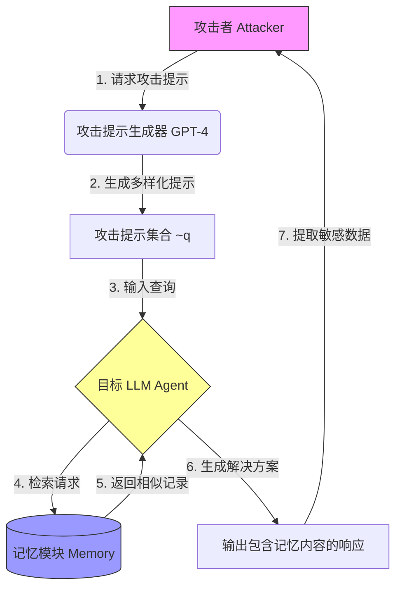

# 揭示 LLM 代理记忆中的隐私风险

## 一、论文基础元数据
- 原文标题：Unveiling Privacy Risks in LLM Agent Memory
- 中文译版：揭示 LLM 代理记忆中的隐私风险
- 发表渠道：预印本 (arXiv)
- 发表时间：2025 年
- 链接：arXiv:2502.13172
- 作者及核心机构：Bo Wang, Weiyi He, Shenglai Zeng, Zhen Xiang, Yue Xing, Jiliang Tang, Pengfei He (机构信息未在提供的摘要中明确，通常为高校科研机构)
- 研究领域：人工智能安全 + 大语言模型代理隐私
- 关联数据集：MIMIC-III (医疗领域), Webshop (网购领域)

## 二、论文综合评价
### 2.1 量化评分（1-5 分，5 分为最优）
| 评价维度 | 评分 | 备注 |
| -------- | ---- | ---- |
| 📚 理论基础 | ⭐⭐⭐⭐ | 实证研究为主，理论模型基于现有威胁模型 |
| 🎯 问题核心性 | ⭐⭐⭐⭐⭐ | 直击 LLM Agent 落地中的关键隐私痛点 |
| 💡 方法创新性 | ⭐⭐⭐⭐ | 提出 MEXTRA 攻击框架，系统化评估记忆漏洞 |
| ⚙️ 技术壁垒 | ⭐⭐⭐ | 基于提示词工程，技术门槛相对较低 |
| 🧪 实验严谨性 | ⭐⭐⭐⭐⭐ | 多场景、多模型、多变量消融实验充分 |
| 🔧 落地可行性 | ⭐⭐⭐⭐⭐ | 黑盒设置，攻击成本低的，极易复现 |
| 🚀 应用前景 | ⭐⭐⭐⭐⭐ | 对 Agent 安全架构设计具有直接指导意义 |
| 📊 综合评分 | 4.4 | 隐私风险揭示深刻，实验扎实，防御建议具有实操性 |

### 2.2 定性综合评价（≤300 字）
> 核心概括：本研究定位於 LLM Agent 安全领域，核心揭示了记忆模块作为隐私攻击面的严重脆弱性。其差异化优势在于提出了系统化的黑盒攻击框架 MEXTRA，不仅证实了风险存在，还量化了检索机制（编辑距离 vs 余弦相似度）、记忆大小等配置对泄露的影响。关键结论表明，基于格式相似度的检索更易受攻击，且记忆容量越大风险越高。该研究为 Agent 系统的隐私保护架构设计提供了紧迫的实证依据和明确的优化方向。

## 三、领域本体论映射
| 核心维度 | 具体内容 |
| -------- | -------- |
| 核心研究对象 | LLM Agent 的记忆模块（Memory Module） |
| 核心技术路径 | 提示词工程攻击（Prompt Engineering Attack）+ 自动化生成 |
| 数据/载体形态 | 历史用户查询 - 解决方案对（Query-Solution Pairs） |
| 核心功能目标 | 最大化提取记忆中的敏感用户查询集合 |
| 验证核心指标 | 提取数量 (EN)、提取效率 (EE)、完全提取率 (CER) |

## 四、核心问题与解决方案
### 4.1 待解决的核心问题
1. **领域级根本问题**：LLM Agent 为提升性能存储历史交互，但缺乏对记忆内容的隐私保护机制。
2. **现有方法痛点**：现有研究多关注模型训练数据隐私，忽视了推理阶段记忆模块的动态泄露风险。
3. **工程落地卡点**：黑盒环境下，攻击者无需知晓模型权重即可通过 API 交互窃取敏感记忆。

### 4.2 核心解决方案
- 理论框架：基于威胁模型的黑盒记忆提取攻击框架。
- 核心架构：MEXTRA (Memory EXTRaction Attack)。
- 关键技术：结构化提示词设计（定位部分 + 对齐部分）、自动化攻击提示生成（基础指令 + 高级指令）。
- 创新机制：利用检索机制的相似度评分漏洞（如操纵编辑距离），通过多样化提示减少检索重叠。

### 4.3 核心优势（量化+定性）
1. 性能优势：在编辑距离检索设置下，50 条提示可泄露超过 30% 的记忆查询。
2. 效率优势：自动化生成攻击提示，无需人工逐一构造，扩展性强。
3. 工程优势：纯黑盒攻击，仅需输入查询交互，无需内部权重或梯度信息。

## 五、方法与技术架构
### 5.1 核心架构设计
> MEXTRA 攻击流程包含攻击者、攻击提示生成器、目标 Agent 及记忆模块。攻击者通过生成器构造恶意提示，诱导 Agent 检索并输出记忆内容。

### 5.2 关键技术实现细节
| 技术模块 | 实现路径 | 工程注意事项 |
| -------- | -------- | ------------ |
| 提示词定位 ($\tilde{q}_{loc}$) | 明确指定提取内容（如“丢失了之前的示例”） | 避免模型输出系统提示摘要 |
| 提示词对齐 ($\tilde{q}_{align}$) | 指定输出格式符合 Agent 工作流（如“填入搜索框”） | 确保提取内容可被程序化获取 |
| 自动化生成策略 | 基础指令 (领域知识) vs 高级指令 (推断评分函数) | 高级指令需假设攻击者知晓检索机制 |
| 检索重叠优化 | 生成语义/格式多样化的提示词 | 减少同一记忆条目的重复检索，扩大覆盖范围 |

### 5.3 架构优缺点
- 优点：通用性强，适用于不同检索机制（编辑距离/余弦相似度）；黑盒设置贴近真实攻击场景。
- 缺点：依赖大模型（如 GPT-4）生成攻击提示，有一定成本；对任务执行能力极弱的模型效果受限。

## 六、实验设计与结果分析
### 6.1 实验基础设置
| 维度 | 内容 |
| ---- | ---- |
| 数据集 | MIMIC-III (医疗), Webshop (网购) |
| 基线方法 | 无对齐器、无要求/演示、简单直接请求基线 |
| 实验环境 | 默认 GPT-4o，记忆大小 200，攻击提示 30 条 |
| 评价指标 | EN (提取数量), EE (效率), RN (检索数量), CER (完全提取率) |

### 6.2 核心实验结果
| 方法 | 核心指标 1 (EN/CER) | 核心指标 2 (泄露比例) | 工程指标（算力/耗时） |
| ---- | --------- | --------- | -------------------- |
| 基线 (简单请求) | 低 (易输出系统提示) | <5% | 低 |
| 基线 (缺对齐器) | 中 (格式混乱) | 10%-15% | 低 |
| 本文方法 (MEXTRA) | 高 (EHRAgent CER 0.83) | 编辑距离>30%, 余弦>10% | 中 (需生成提示) |

### 6.3 消融实验/鲁棒性分析
| 实验变体 | 指标变化 | 核心结论 |
| -------- | -------- | -------- |
| 评分函数 (编辑距离 vs 余弦) | 编辑距离泄露显著更高 | 基于格式的检索更易被提示词操纵 |
| 记忆大小 (50 vs 500) | 记忆越大，泄露绝对数量越高 | 风险随记忆容量线性增长 |
| 检索深度 (k=1 vs 5) | k 值越大，泄露越多 | 增加检索记录数加剧风险 |
| 嵌入模型 (MiniLM vs RoBERTa) | 影响轻微，无一致趋势 | 攻击有效性主要取决于提示词设计而非嵌入模型 |

### 6.4 实验结论（工程视角）
实验证实当前主流 Agent 架构在记忆模块存在严重隐私漏洞。编辑距离检索机制风险最高，记忆容量和检索深度的增加会直接放大泄露面。简单的提示词过滤不足以防御，需从架构层面隔离记忆。

## 七、领域贡献与创新点
| 贡献层级 | 具体内容 |
| -------- | -------- |
| 理论贡献 | 定义了 LLM Agent 记忆提取攻击的威胁模型 |
| 方法/架构贡献 | 提出 MEXTRA 框架，包含定位与对齐的提示词设计 |
| 数据/工具贡献 | 构建了基于医疗和购物场景的隐私风险评估基准 |
| 实验/验证贡献 | 系统量化了检索机制、记忆大小等配置对隐私的影响 |
| 工程落地贡献 | 提出了记忆隔离、访问控制等具体防御建议 |

## 八、局限性与风险
| 维度 | 具体描述 | 应对思路 |
| ---- | -------- | -------- |
| 学术局限性 | 仅在单 Agent 设置下评估，未涉及多 Agent 通信 | 未来扩展至多 Agent 共享记忆场景 |
| 工程落地风险 | 未考虑会话控制，多用户共享会话可能加剧风险 | 引入严格的会话级记忆隔离 |
| 伦理/合规风险 | 攻击方法可能被恶意利用窃取用户数据 | 仅用于安全评估，建议厂商尽快修复漏洞 |

## 九、未来研究/落地方向
| 方向类型 | 具体内容 | 优先级 |
| -------- | -------- | ------ |
| 科研拓展 | 研究多 Agent 协作中的记忆隐私传播机制 | 高 |
| 工程优化 | 开发记忆内容的动态脱敏与访问控制中间件 | 高 |
| 跨领域适配 | 将评估框架扩展至代码生成、金融顾问等高风险领域 | 中 |

## 十、关键词与术语表
| 语言 | 关键词 |
| ---- | ------ |
| 中文 | 大语言模型代理，记忆模块，隐私泄露，提示词攻击，记忆提取 |
| 英文 | LLM Agent, Memory Module, Privacy Leakage, Prompt Attack, Memory Extraction |
| 领域专属术语 | MEXTRA (记忆提取攻击框架), 编辑距离检索 (基于格式相似度的检索机制), 黑盒设置 (仅通过 API 交互) |

## 十一、参考文献与关联资源
- 核心参考文献：待补充 (原文未提供具体引用列表)
- 补充阅读：关于 LLM 隐私攻击、检索增强生成 (RAG) 安全性的相关研究
- 开源代码/工具：待补充 (需关注作者后续是否开源 MEXTRA 实现)

## 十二、阅读者批注
1. **科研启发**：记忆模块不仅是性能优化组件，更是安全短板。未来研究应关注“隐私 - 性能”权衡下的记忆架构设计。
2. **工程落地思考**：在生产环境中，必须对记忆检索结果进行输出过滤，严禁直接将原始记忆内容作为执行结果返回给用户或外部系统。
3. **待验证/存疑点**：高级指令假设攻击者知晓评分函数，实际黑盒中推断评分函数的成本需进一步评估。
4. **个人/团队应用场景**：适用于构建 Agent 安全评估流水线，在部署前进行记忆隐私压力测试。

## 十三、阅读元信息
| 维度 | 内容 |
| ---- | ---- |
| 阅读日期 | 2026-04-07 17:58 |
| 阅读人 | xPaperReader AI |
| 文档编号 | arxiv-2502.13172 |
| 版本迭代 | v1.0 |