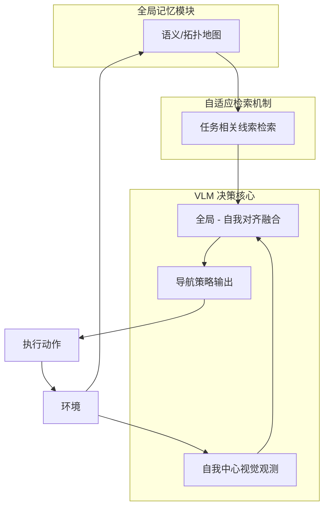

# Mem2Ego：赋予视觉语言模型全局到自我记忆以用于长程具身导航

## 一、论文基础元数据
- 原文标题：Mem2Ego: Empowering Vision-Language Models with Global-to-Ego Memory for Long-Horizon Embodied Navigation
- 中文译版：Mem2Ego：赋予视觉语言模型全局到自我记忆以用于长程具身导航
- 发表渠道：arXiv 预印本 (cs.RO)
- 发表时间：2025 年 6 月 (v2 版本)
- 链接：arXiv:2502.14254
- 作者及核心机构：Lingfeng Zhang 等；华为诺亚方舟实验室 (Huawei Noah's Ark Lab)
- 研究领域：机器人学 (一级) + 具身智能/视觉语言导航 (二级)
- 关联数据集：待补充 (摘要提及 Object Navigation 任务，通常涉及 HM3D, Habitat 等，文中未明确列出具体数据集名称)

## 二、论文综合评价
### 2.1 量化评分（1-5 分，5 分为最优）
| 评价维度 | 评分 | 备注 |
| -------- | ---- | ---- |
| 📚 理论基础 | ⭐⭐⭐⭐✨ | 结合 VLM 与记忆机制，理论基础扎实 |
| 🎯 问题核心性 | ⭐⭐⭐⭐⭐ | 解决具身导航中局部观测与全局信息丢失的核心矛盾 |
| 💡 方法创新性 | ⭐⭐⭐⭐✨ | 提出 Global-to-Ego 记忆对齐机制，具有差异化 |
| ⚙️ 技术壁垒 | ⭐⭐⭐⭐ | 依赖 VLM 推理能力，工程集成有一定复杂度 |
| 🧪 实验严谨性 | ⭐⭐⭐⭐ | 摘要声称超越 SOTA，具体细节待补充 |
| 🔧 落地可行性 | ⭐⭐⭐⭐ | 需考虑 VLM 推理延迟，但架构清晰 |
| 🚀 应用前景 | ⭐⭐⭐⭐✨ | 适用于家庭服务、物流巡检等长程任务 |
| 📊 综合评分 | 4.4 | 针对长程导航痛点提出了有效的 VLM 增强方案 |

### 2.2 定性综合评价（≤300 字）
> 核心概括：研究定位、核心价值、差异化优势、关键结论
本文针对具身导航中的长程任务，提出了一种名为 Mem2Ego 的视觉语言模型框架。核心定位是解决现有方法中“基于语言的全局记忆丢失几何信息”与“纯自我视角观测导致部分可观测性问题”之间的矛盾。核心价值在于通过自适应检索全局记忆中的任务相关线索，并将其与智能体的自我中心观测动态对齐，增强了空间推理能力。差异化优势在于 Global-to-Ego 的记忆整合机制，而非简单的语言描述转换。关键结论表明该方法在物体导航任务上超越了之前的最先进方法，提供了更具扩展性的解决方案。

## 三、领域本体论映射
| 核心维度 | 具体内容 |
| -------- | -------- |
| 核心研究对象 | 具身智能体 (Embodied Agent) 在未知环境中的导航策略 |
| 核心技术路径 | 视觉语言模型 (VLM) + 全局记忆模块 + 自适应检索对齐 |
| 数据/载体形态 | 自我中心视觉图像 (Ego-centric Visual Inputs) + 全局语义/拓扑记忆 |
| 核心功能目标 | 长程物体目标导航 (Long-Horizon Object Goal Navigation) |
| 验证核心指标 | 导航成功率 (Success Rate)、路径效率 (SPL) 等 (具体数值待补充) |

## 四、核心问题与解决方案
### 4.1 待解决的核心问题
1. **领域级根本问题**：在非结构化室内环境中，智能体如何在缺乏先验地图的情况下实现长程自主导航。
2. **现有方法痛点**：
   - LLM 基于语言的全局记忆方法：丢失几何信息，阻碍复杂环境下的空间推理。
   - 纯 VLM 基于自我视角方法：面临部分可观测决策问题 (Partially Observed Decision-Making)，易在复杂环境中做出次优决策。
3. **工程落地卡点**：如何将全局上下文信息与局部感知动态对齐，且不引入过高的计算延迟。

### 4.2 核心解决方案
- 理论框架：全局到自我记忆增强 (Global-to-Ego Memory Augmentation)。
- 核心架构：包含全局记忆模块、自适应检索机制、VLM 决策核心。
- 关键技术：任务相关线索的动态检索、全局上下文与局部感知的对齐融合。
- 创新机制：自适应检索任务相关线索并整合到智能体的自我中心观测中，弥补单一视角的局限性。

### 4.3 核心优势（量化 + 定性）
1. 性能优势：摘要声称在物体导航任务上超越之前的 SOTA 方法 (具体提升幅度待补充)。
2. 效率优势：减少冗余探索，通过全局记忆引导高效探索。
3. 工程优势：提供了更具扩展性的具身导航解决方案，适应未知环境。

## 五、方法与技术架构
### 5.1 核心架构设计
> 文字描述 + 架构图（Mermaid/图片）
架构主要由三部分组成：全局记忆模块存储环境的语义或拓扑信息；自适应检索模块根据当前任务和目标从全局记忆中提取相关线索；VLM 核心将提取的全局线索与当前的自我中心视觉观测融合，输出导航动作。

### 5.2 关键技术实现细节
| 技术模块 | 实现路径 | 工程注意事项 |
| -------- | -------- | ------------ |
| 全局记忆模块 | 存储语义或拓扑地图信息，可能采用向量数据库或图结构 | 需保证记忆更新的实时性与一致性 |
| 自适应检索 | 根据当前任务指令和观测状态检索相关记忆片段 | 检索精度直接影响导航决策质量 |
| VLM 融合 | 将检索到的文本/特征线索作为 Prompt 或 Condition 输入 VLM | 需优化 Context Length 以避免超出模型限制 |
| 依赖组件 | 预训练 VLM 模型、仿真环境 (如 Habitat) | 模型推理延迟需控制在实时导航允许范围内 |

### 5.3 架构优缺点
- 优点：结合全局规划能力与局部感知灵活性，显著提升长程任务的空间推理能力。
- 缺点：依赖 VLM 推理，计算资源消耗较大；全局记忆的构建与维护在完全未知环境中具有挑战性。

## 六、实验设计与结果分析
### 6.1 实验基础设置
| 维度 | 内容 |
| ---- | ---- |
| 数据集 | 待补充 (通常涉及 HM3D, Matterport3D 等室内导航数据集) |
| 基线方法 | 现有 LLM 基于语言记忆方法、纯 VLM 自我视角方法 |
| 实验环境 | 待补充 (仿真模拟器，如 Habitat) |
| 评价指标 | 成功率 (Success)、路径长度加权成功率 (SPL) 等 |

### 6.2 核心实验结果
| 方法 | 核心指标 1 (成功率) | 核心指标 2 (SPL) | 工程指标（算力/耗时） |
| ---- | --------- | --------- | -------------------- |
| 基线 1 (LLM+Lang) | 待补充 | 待补充 | 待补充 |
| 基线 2 (VLM+Ego) | 待补充 | 待补充 | 待补充 |
| 本文方法 (Mem2Ego) | 待补充 (声称超越 SOTA) | 待补充 (声称超越 SOTA) | 待补充 |

### 6.3 消融实验/鲁棒性分析
| 实验变体 | 指标变化 | 核心结论 |
| -------- | -------- | -------- |
| 无全局记忆 | 性能下降 | 验证全局记忆对长程任务的重要性 |
| 无自适应检索 | 性能下降 | 验证线索检索机制的有效性 |
| 不同 VLM 底座 | 待补充 | 验证方法的泛化能力 |

### 6.4 实验结论（工程视角）
该方法在仿真环境中证明了有效性，显著改善了长程导航中的迷失问题。工程落地时需重点关注 VLM 推理延迟与记忆模块的更新频率之间的平衡。

## 七、领域贡献与创新点
| 贡献层级 | 具体内容 |
| -------- | -------- |
| 理论贡献 | 提出了全局信息与自我观测动态对齐的理论框架 |
| 方法/架构贡献 | 设计了 Mem2Ego 框架，实现 Global-to-Ego 记忆检索与融合 |
| 数据/工具贡献 | 待补充 (是否开源代码或新数据集未明确) |
| 实验/验证贡献 | 在物体导航任务上验证了方法优于现有 SOTA |
| 工程落地贡献 | 为长程具身导航提供了可扩展的 VLM 集成方案 |

## 八、局限性与风险
| 维度 | 具体描述 | 应对思路 |
| ---- | -------- | -------- |
| 学术局限性 | 主要基于仿真环境验证，真实世界泛化性待验证 | 增加真实机器人实验验证 |
| 工程落地风险 | VLM 推理延迟可能导致导航动作不连贯 | 模型蒸馏或使用更小参数量的专用 VLM |
| 伦理/合规风险 | 视觉数据隐私问题 | 本地化处理敏感视觉信息 |

## 九、未来研究/落地方向
| 方向类型 | 具体内容 | 优先级 |
| -------- | -------- | ------ |
| 科研拓展 | 研究多智能体协作下的全局记忆共享机制 | 中 |
| 工程优化 | 优化记忆检索效率，降低端到端延迟 | 高 |
| 跨领域适配 | 适配到工业巡检、家庭服务机器人等具体场景 | 高 |

## 十、关键词与术语表
| 语言 | 关键词 |
| ---- | ------ |
| 中文 | 具身导航、视觉语言模型、全局记忆、自我中心观测、物体导航 |
| 英文 | Embodied Navigation, Vision-Language Models, Global Memory, Egocentric Observations, ObjectNav |
| 领域专属术语 | Global-to-Ego Memory (全局到自我记忆): 将全局环境信息转化为适配局部视角的提示信号 |

## 十一、参考文献与关联资源
- 核心参考文献：
  - Savva et al., 2019 (Habitat)
  - Batra et al., 2020 (ObjectNav)
  - Zeng et al., 2023 (LLM for Navigation)
- 补充阅读：关于 VLM 在机器人领域应用的最新综述
- 开源代码/工具：待补充 (需关注作者后续是否开源)

## 十二、阅读者批注
1. **科研启发**：全局记忆与局部观测的对齐方式是解决部分可观测问题的关键，不仅限于导航，也可应用于操作任务。
2. **工程落地思考**：在实际机器人上，全局记忆的构建本身就是一个 SLAM 问题，如何将语义 SLAM 与此框架结合是下一步关键。
3. **待验证/存疑点**：摘要未提及具体推理耗时，实际部署中 VLM 的 FPS 是否满足实时导航需求存疑。
4. **个人/团队应用场景**：可尝试应用于仓库物流机器人的异常路径规划任务。

## 十三、阅读元信息
| 维度 | 内容 |
| ---- | ---- |
| 阅读日期 | 2026-04-07 18:05 |
| 阅读人 | xPaperReader AI |
| 文档编号 | arxiv-2502.14254 |
| 版本迭代 | v1.0 |