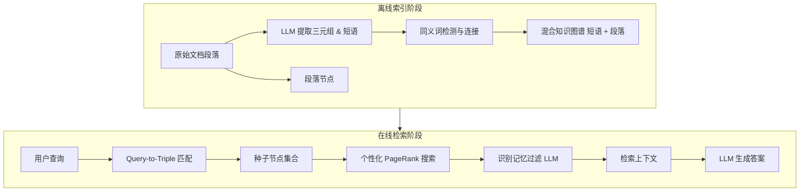

# 从 RAG 到记忆：大型语言模型的非参数化持续学习

## 一、论文基础元数据
- 原文标题：From RAG to Memory: Non-Parametric Continual Learning for Large Language Models
- 中文译版：从 RAG 到记忆：大型语言模型的非参数化持续学习
- 发表渠道：预印本（arXiv）
- 发表时间：2025 年
- 链接：arXiv:2502.14802
- 作者及核心机构：Bernal Jiménez Gutiérrez, Yiheng Shu, Weijian Qi, Sizhe Zhou, Yu Su（俄亥俄州立大学 OSU-NLP-Group）
- 研究领域：人工智能（一级）+ 自然语言处理/检索增强生成（二级）
- 关联数据集：MuSiQue（11,656 篇文档/英文/无特定标注）、2Wiki、LV-Eval

## 二、论文综合评价
### 2.1 量化评分（1-5 分，5 分为最优）
| 评价维度 | 评分 | 备注 |
| -------- | ---- | ---- |
| 📚 理论基础 | ⭐⭐⭐⭐⭐ | 神经生物学启发（海马体 - 新皮层）理论扎实 |
| 🎯 问题核心性 | ⭐⭐⭐⭐⭐ | 直击 RAG 缺乏关联性与持续学习能力的痛点 |
| 💡 方法创新性 | ⭐⭐⭐⭐⭐ | 提出 HippoRAG 2，融合段落节点与三元组检索 |
| ⚙️ 技术壁垒 | ⭐⭐⭐⭐ | 依赖高质量 LLM 进行图谱构建与过滤 |
| 🧪 实验严谨性 | ⭐⭐⭐⭐⭐ | 多数据集、多基线、多维度（性能/成本）验证 |
| 🔧 落地可行性 | ⭐⭐⭐⭐ | 成本显著低于竞品，但图谱构建仍需 LLM 调用 |
| 🚀 应用前景 | ⭐⭐⭐⭐⭐ | 适用于长文本、多跳推理及长期记忆场景 |
| 📊 综合评分 | 4.7 | 性能与成本平衡极佳，RAG 演进重要里程碑 |

### 2.2 定性综合评价（≤300 字）
> 核心概括：研究定位、核心价值、差异化优势、关键结论
本研究定位为大型语言模型的非参数化持续学习系统，核心价值在于将 RAG 升级为类人长期记忆机制。差异化优势在于提出的 HippoRAG 2 架构，通过融合段落节点与短语节点的知识图谱构建，以及 Query-to-Triple 检索策略，解决了传统 RAG 缺乏关联性及结构增强 RAG（如 GraphRAG）事实记忆退化的问题。关键结论显示，该方法在多跳推理、事实记忆及意义构建任务上全面超越 SOTA，且索引 Token 消耗仅为 GraphRAG 的 8%，具备极高的工程落地性价比。

## 三、领域本体论映射
| 核心维度 | 具体内容 |
| -------- | -------- |
| 核心研究对象 | 大型语言模型（LLM）的长期记忆与持续学习机制 |
| 核心技术路径 | 知识图谱构建 + 个性化 PageRank 检索 + 非参数化存储 |
| 数据/载体形态 | 非结构化文本段落、结构化知识图谱（三元组 + 段落节点） |
| 核心功能目标 | 实现具备关联性、事实准确性及意义构建能力的检索增强 |
| 验证核心指标 | F1 分数、Recall@5、Token 消耗量、多跳推理准确率 |

## 四、核心问题与解决方案
### 4.1 待解决的核心问题
1. **领域级根本问题**：现有 LLM 缺乏类似人类的动态、互联的长期记忆能力，难以实现非参数化持续学习。
2. **现有方法痛点**：标准 RAG 缺乏关联性（多跳推理弱）；结构增强 RAG（GraphRAG 等）引入噪声导致基础事实记忆性能下降；持续微调存在灾难性遗忘且成本高。
3. **工程落地卡点**：知识图谱构建成本高昂，检索噪声大，难以在性能与 Token 消耗间取得平衡。

### 4.2 核心解决方案
- 理论框架：受神经生物学启发（海马体 - 新皮层互补系统），采用离线索索引 + 在线检索两阶段流程。
- 核心架构：HippoRAG 2，融合短语节点与段落节点的双层知识图谱。
- 关键技术：Query-to-Triple 匹配、识别记忆（LLM 过滤）、PPR 初始化平衡（权重因子 0.05）。
- 创新机制：通过同义词检测连接不同段落知识，利用段落节点保留上下文避免信息丢失。

### 4.3 核心优势（量化 + 定性）
1. 性能优势：关联性记忆任务比 SOTA 嵌入模型（NV-Embed-v2）提升 7%；多跳 QA  Recall@5 提升 12.5%。
2. 效率优势：索引阶段输入 Token 消耗仅为 GraphRAG 的 8%（1/12.5），输出 Token 消耗约为 8.3%。
3. 工程优势：适配多种稠密检索器（即插即用），索引成本低（11k 段落<$22），具备高性价比。

## 五、方法与技术架构
### 5.1 核心架构设计
> 文字描述：系统分为离线索引与在线检索两阶段。离线阶段利用 LLM 提取三元组与段落节点构建混合知识图谱；在线阶段通过 Query-to-Triple 匹配种子节点，利用个性化 PageRank 在图谱中传播激活，经识别记忆过滤后生成上下文供 LLM 生成答案。

### 5.2 关键技术实现细节
| 技术模块 | 实现路径 | 工程注意事项 |
| -------- | -------- | ------------ |
| 图谱构建 | 提取短语节点 + 整合原始段落节点，避免上下文丢失 | 需平衡节点粒度，防止图过大 |
| 检索匹配 | Query-to-Triple 匹配替代 NER-to-Node | 需优化三元组提取质量 |
| 噪声过滤 | 引入 LLM 作为识别记忆过滤器 | 增加在线推理延迟，需优化模型大小 |
| 图搜索 | PPR 算法，段落节点权重因子设为 0.05 | 阻尼因子默认 0.5，需调优 |

### 5.3 架构优缺点
- 优点：事实记忆与多跳推理能力兼顾；Token 效率极高；检索器无关性强。
- 缺点：依赖离线图谱构建，动态实时更新能力待验证；三元组过滤仍有误差（26% 无匹配）。

## 六、实验设计与结果分析
### 6.1 实验基础设置
| 维度 | 内容 |
| ---- | ---- |
| 数据集 | MuSiQue, 2Wiki, LV-Eval |
| 基线方法 | GraphRAG, LightRAG, RAPTOR, NV-Embed-v2, HippoRAG(v1) |
| 实验环境 | Llama-3.3-70B-Instruct (提取/过滤), NV-Embed-v2 (检索) |
| 评价指标 | F1 分数，Recall@5, Token 消耗量 |

### 6.2 核心实验结果
| 方法 | 核心指标 1 (F1) | 核心指标 2 (Recall@5) | 工程指标（算力/耗时） |
| ---- | --------- | --------- | -------------------- |
| NV-Embed-v2 | 基准 | 基准 | 低 |
| GraphRAG | 较低 (事实记忆退化) | 较高 | 输入 Token 1255.4% (相对 HippoRAG 2) |
| LightRAG | 中等 | 中等 | 输入 Token 744.6% (相对 HippoRAG 2) |
| 本文方法 | 最高 (2Wiki 高 9.5%) | 最高 (MuSiQue 高 5.0%) | 输入 Token 100% (基准) |

### 6.3 消融实验/鲁棒性分析
| 实验变体 | 指标变化 | 核心结论 |
| -------- | -------- | -------- |
| NER-to-Node | Recall@5 下降 12.5% | Query-to-Triple 更能捕捉上下文意图 |
| 移除段落节点 | 多跳推理性能下降 | 段落节点对保留上下文至关重要 |
| 不同检索器 | 性能稳定增益 | 架构具备检索器无关性 (Plug-and-play) |

### 6.4 实验结论（工程视角）
HippoRAG 2 在保持极低索引成本的前提下，实现了性能的最大化。虽然 RAPTOR 成本更低，但性能不足；GraphRAG 性能尚可但成本过高。HippoRAG 2 是当前性能与成本平衡最优的开源 RAG 系统之一，适合企业级知识库构建。

## 七、领域贡献与创新点
| 贡献层级 | 具体内容 |
| -------- | -------- |
| 理论贡献 | 提出将 RAG 转化为非参数化持续学习及类人长期记忆的理论框架 |
| 方法/架构贡献 | 设计 HippoRAG 2，创新融合段落节点与短语节点的混合图谱结构 |
| 数据/工具贡献 | 开源代码与数据，提供基于 MuSiQue 的大规模索引基准 |
| 实验/验证贡献 | 全面验证了事实、关联及意义构建三类记忆任务的性能 |
| 工程落地贡献 | 显著降低结构增强 RAG 的 Token 成本（节省约 85%-92%） |

## 八、局限性与风险
| 维度 | 具体描述 | 应对思路 |
| ---- | -------- | -------- |
| 学术局限性 | 三元组过滤精度有待改进（26% 样本过滤后无匹配） | 优化过滤器模型或引入反馈机制 |
| 工程落地风险 | 离线构建仍需大量 LLM 调用，实时性受限 | 探索增量更新机制或更小模型蒸馏 |
| 伦理/合规风险 | 依赖外部 LLM API 可能存在数据隐私风险 | 支持本地部署开源模型进行图谱构建 |

## 九、未来研究/落地方向
| 方向类型 | 具体内容 | 优先级 |
| -------- | -------- | ------ |
| 科研拓展 | 增强长对话场景下的情景记忆（Episodic Memory）能力 | 高 |
| 工程优化 | 优化三元组过滤器精度及图搜索组件排序能力 | 高 |
| 跨领域适配 | 适配多模态数据（图像/音频）的记忆存储与检索 | 中 |

## 十、关键词与术语表
| 语言 | 关键词 |
| ---- | ------ |
| 中文 | 检索增强生成，持续学习，知识图谱，长期记忆，非参数化 |
| 英文 | RAG, Continual Learning, Knowledge Graph, Long-term Memory, Non-Parametric |
| 领域专属术语 | **HippoRAG 2**：基于神经生物学启发的第二代检索架构；**Query-to-Triple**：将查询映射为三元组进行匹配的检索策略；**识别记忆**：利用 LLM 过滤检索噪声的机制 |

## 十一、参考文献与关联资源
- 核心参考文献：待补充（文中未列出具体参考文献列表，仅提及对比方法）
- 补充阅读：GraphRAG, LightRAG, RAPTOR 相关论文
- 开源代码/工具：OSU-NLP-Group GitHub（即将发布）

## 十二、阅读者批注
1. **科研启发**：将神经生物学记忆机制（海马体 - 新皮层）映射到 RAG 架构是非常有效的创新路径，值得在其他模态推广。
2. **工程落地思考**：Token 成本的巨大差异（12 倍）是决定企业是否采用 GraphRAG 类技术的关键，HippoRAG 2 解决了这一核心阻碍。
3. **待验证/存疑点**：三元组过滤导致的 26% 信息丢失在极端复杂查询下的影响需进一步验证；动态更新图谱的具体实现细节未详述。
4. **个人/团队应用场景**：适用于构建企业级知识库、法律/医疗多跳推理问答系统、长期个人助理记忆模块。

## 十三、阅读元信息
| 维度 | 内容 |
| ---- | ---- |
| 阅读日期 | 2026-04-07 18:13 |
| 阅读人 | xPaperReader AI |
| 文档编号 | arxiv-2502.14802 |
| 版本迭代 | v1.0 |