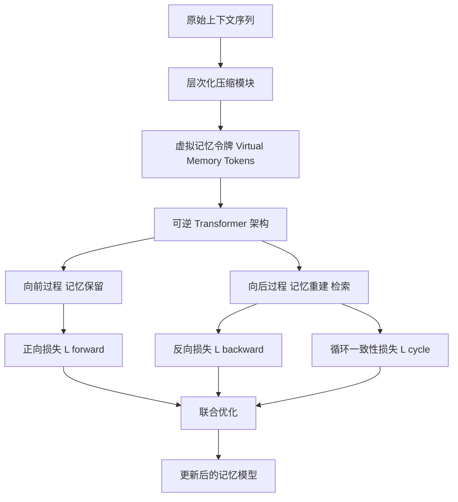

# R$^3$Mem：通过可逆压缩桥接记忆保留与检索

## 一、论文基础元数据
- 原文标题：R$^3$Mem: Bridging Memory Retention and Retrieval via Reversible Compression
- 中文译版：R$^3$Mem：通过可逆压缩桥接记忆保留与检索
- 发表渠道：预印本 (arXiv)
- 发表时间：2025 年
- 链接：arXiv:2502.15957
- 作者及核心机构：Xiaoqiang Wang, Suyuchen Wang, Yun Zhu, Bang Liu (待补充具体机构，推测包含蒙特利尔大学等)
- 研究领域：人工智能 (一级) + 自然语言处理/长上下文建模 (二级)
- 关联数据集：PG19 (书籍), arXiv (Pile 子集), C4 (4K+ tokens), UltraDomain QA, SiliconFriend (对话代理)

## 二、论文综合评价
### 2.1 量化评分（1-5 分，5 分为最优）
| 评价维度 | 评分 | 备注 |
| -------- | ---- | ---- |
| 📚 理论基础 | ⭐⭐⭐⭐⭐ | 可逆架构理论扎实，双向优化逻辑清晰 |
| 🎯 问题核心性 | ⭐⭐⭐⭐⭐ | 直击长上下文记忆保留与检索的权衡痛点 |
| 💡 方法创新性 | ⭐⭐⭐⭐⭐ | 可逆上下文压缩与虚拟令牌结合具有新颖性 |
| ⚙️ 技术壁垒 | ⭐⭐⭐⭐ | 需修改 Transformer 架构实现可逆性，有一定门槛 |
| 🧪 实验严谨性 | ⭐⭐⭐⭐⭐ | 涵盖建模、RAG、代理多任务，消融实验充分 |
| 🔧 落地可行性 | ⭐⭐⭐⭐ | 基于 LoRA 微调，但数据构建成本较高 |
| 🚀 应用前景 | ⭐⭐⭐⭐⭐ | 在对话代理和长文本处理场景具有较大潜力 |
| 📊 综合评分 | 4.7 | 架构创新显著，实验充分，兼具理论与应用价值 |

### 2.2 定性综合评价（≤300 字）
> 核心概括：研究定位、核心价值、差异化优势、关键结论
本文针对现有记忆方案中显式存储管理复杂与隐式参数检索可靠性差的权衡困境，提出了 R$^3$Mem 框架。其核心价值在于通过可逆上下文压缩技术，利用虚拟记忆令牌桥接记忆保留与检索，实现双向优化。差异化优势在于层次化压缩策略与循环一致性损失函数的结合，确保压缩信息的高保真还原。关键结论表明，该方法在长上下文语言建模及检索增强生成任务上在部分基准测试中表现领先，且在对话代理应用中优于现有显式与隐式基线，为下一代高效记忆系统提供了新范式。

## 三、领域本体论映射
| 核心维度 | 具体内容 |
| -------- | -------- |
| 核心研究对象 | 长上下文序列中的记忆信息保留与高效检索 |
| 核心技术路径 | 可逆 Transformer 架构 + 虚拟记忆令牌 + 层次化压缩 |
| 数据/载体形态 | 文本序列、虚拟令牌嵌入、分层上下文 - 查询对 |
| 核心功能目标 | 实现无损或高保真的上下文压缩与重建，优化记忆效能 |
| 验证核心指标 | 困惑度 (Perplexity)、检索准确率 (F1)、响应正确性、BARTScore |

## 四、核心问题与解决方案
### 4.1 待解决的核心问题
1. **领域级根本问题**：如何在有限上下文窗口内有效保留无限长历史记忆，同时保证检索的可靠性。
2. **现有方法痛点**：显式记忆（外部存储）管理复杂且开销大；隐式记忆（模型参数）检索可靠性差，易遗忘。
3. **工程落地卡点**：记忆构建成本高，终身学习过程中存在灾难性遗忘风险，参数效率与性能的平衡。

### 4.2 核心解决方案
- 理论框架：基于可逆神经网络理论，构建双向记忆优化框架。
- 核心架构：基于 Adapter 修改预训练 Transformer 实现双射变换，引入虚拟记忆令牌。
- 关键技术：层次化上下文压缩（文档级到实体级）、循环一致性损失函数。
- 创新机制：通过正向压缩与反向重建的联合训练，确保记忆令牌编码的信息可无损还原。

### 4.3 核心优势（量化 + 定性）
1. 性能优势：在 C4 (4K+) 上困惑度比次优基线 (MemoRAG) 降低约 13%。
2. 效率优势：基于 LoRA 微调，可无缝集成到任何 Transformer 模型，参数量增加可控。
3. 工程优势：在对话代理中全面优于显式记忆 (MemoryBank) 和隐式基线，无需复杂外部存储管理。

## 五、方法与技术架构
### 5.1 核心架构设计
> 文字描述 + 架构图（Mermaid/图片）
R$^3$Mem 架构基于可逆 Transformer，通过 Adapter 模块实现双射变换。输入上下文经过层次化压缩生成虚拟记忆令牌，这些令牌既用于向前传递以保留记忆，也用于向后重建以验证检索能力。训练过程包含正向压缩损失、反向扩展损失及循环一致性损失。

### 5.2 关键技术实现细节
| 技术模块 | 实现路径 | 工程注意事项 |
| -------- | -------- | ------------ |
| 层次化压缩 | 文档级到实体级四级压缩，自适应处理输入信息 | 需确保各层级信息不丢失，压缩比例需调整 |
| 虚拟令牌 | 默认 8 个虚拟令牌注入输入序列，可缩放至 16-128 | 注入隐藏状态会导致参数增加 32 倍，建议仅用于输入序列 |
| 可逆 Adapter | 基于 LoRA (rank=8, alpha=32) 修改预训练模型 | 需保证变换的可逆性，优化器选用 AdamW |
| 损失函数 | 双向训练 + 循环一致性 (λ=0.5) | 三者缺一不可，需平衡权重以防训练不稳定 |

### 5.3 架构优缺点
- 优点：实现了记忆保留与检索的统一优化；参数高效（LoRA）；无需外部向量数据库。
- 缺点：高质量记忆依赖复杂的上下文 - 查询对构建；微调可能干扰预训练知识（灾难性遗忘）。

## 六、实验设计与结果分析
### 6.1 实验基础设置
| 维度 | 内容 |
| ---- | ---- |
| 数据集 | PG19, arXiv, C4 (4K+), UltraDomain QA, SiliconFriend |
| 基线方法 | MemoRAG, MemoryLLM, CAMELoT, MemoryBank |
| 实验环境 | 单张 NVIDIA RTX A5000 24GB, LLaMA 3.1-8B |
| 评价指标 | 困惑度 (PPL), F1, 精确匹配，BARTScore, 模型排名 |

### 6.2 核心实验结果
| 方法 | 核心指标 1 (C4 PPL) | 核心指标 2 (检索 F1) | 工程指标（算力/耗时） |
| ---- | --------- | --------- | -------------------- |
| 基线 1 (MemoRAG) | 基准值 | 基准值 | 待补充 |
| 基线 2 (MemoryBank) | 待补充 | 低于本文 | 外部存储开销大 |
| 本文方法 (R$^3$Mem) | 降低约 13% | 优于基线 | 单卡训练 2 epoch 约 13 小时 |

### 6.3 消融实验/鲁棒性分析
| 实验变体 | 指标变化 | 核心结论 |
| -------- | -------- | -------- |
| 移除分层结构 | 性能显著下降 | 分层压缩对有效编码长上下文至关重要 |
| 移除反向优化/一致性损失 | 困惑度上升 (如 5.21->5.91) | 双向对齐是实现双向记忆框架的关键 |
| 增加训练轮次 (2->32) | 域内提升，域外下降 | 存在过拟合风险，需平衡记忆强化与通用知识 |

### 6.4 实验结论（工程视角）
实验证明 R$^3$Mem 在长上下文建模和检索任务上具有表现优势，尤其在对话代理场景中表现卓越。然而，工程落地需注意训练数据构建成本及微调对基座模型通用能力的潜在影响，建议控制在少量 Epoch 内。

## 七、领域贡献与创新点
| 贡献层级 | 具体内容 |
| -------- | -------- |
| 理论贡献 | 提出通过可逆压缩桥接记忆保留与检索的理论框架 |
| 方法/架构贡献 | 设计基于虚拟令牌与层次化压缩的可逆 Transformer 架构 |
| 数据/工具贡献 | 构建分层上下文 - 查询对数据集 (待补充开源信息) |
| 实验/验证贡献 | 在长文本建模、RAG 及对话代理多任务上验证了有效性 |
| 工程落地贡献 | 提供了基于 LoRA 的高效微调方案，无需外部存储设施 |

## 八、局限性与风险
| 维度 | 具体描述 | 应对思路 |
| ---- | -------- | -------- |
| 学术局限性 | 域外泛化能力随训练轮次增加而下降 | 引入正则化或混合训练数据以保护通用知识 |
| 工程落地风险 | 上下文 - 查询对构建成本高，依赖强模型生成 | 探索轻量化数据构建流程或自监督方法 |
| 伦理/合规风险 | 记忆内容可能包含敏感信息，重建过程需可控 | 增加记忆过滤机制与访问权限控制 |

## 九、未来研究/落地方向
| 方向类型 | 具体内容 | 优先级 |
| -------- | -------- | ------ |
| 科研拓展 | 研究更高效的可逆架构，减少计算开销 | 高 |
| 工程优化 | 优化数据构建 Pipeline，降低查询生成成本 | 高 |
| 跨领域适配 | 适配多模态记忆场景（图像、视频上下文） | 中 |

## 十、关键词与术语表
| 语言 | 关键词 |
| ---- | ------ |
| 中文 | 可逆压缩、记忆保留、记忆检索、虚拟记忆令牌、层次化压缩 |
| 英文 | Reversible Compression, Memory Retention, Memory Retrieval, Virtual Memory Tokens, Hierarchical Compression |
| 领域专属术语 | 循环一致性 (Cycle Consistency)：确保压缩与扩展过程对齐的损失机制；虚拟记忆令牌 (Virtual Memory Tokens)：用于编码上下文信息的可学习嵌入 |

## 十一、参考文献与关联资源
- 核心参考文献：待补充 (文中提及 MemoRAG, MemoryLLM, CAMELoT 等基线)
- 补充阅读：关于可逆神经网络 (RevNet)、LoRA 微调技术的相關文献
- 开源代码/工具：待补充 (通常随 arXiv 发布，需查询官方仓库)

## 十二、阅读者批注
1. **科研启发**：可逆架构在记忆网络中的应用是一个非常有前景的方向，解决了信息瓶颈问题。
2. **工程落地思考**：虽然避免了外部数据库，但训练数据的构建成本是实际落地的大门槛，需评估 ROI。
3. **待验证/存疑点**：长期终身学习下的稳定性尚未完全验证，灾难性遗忘的具体边界需进一步测试。
4. **个人/团队应用场景**：适用于需要长历史记忆的客服对话机器人、个人助理等场景。

## 十三、阅读元信息
| 维度 | 内容 |
| ---- | ---- |
| 阅读日期 | 2026-04-07 18:21 |
| 阅读人 | xPaperReader AI |
| 文档编号 | arxiv-2502.15957 |
| 版本迭代 | v1.0 |