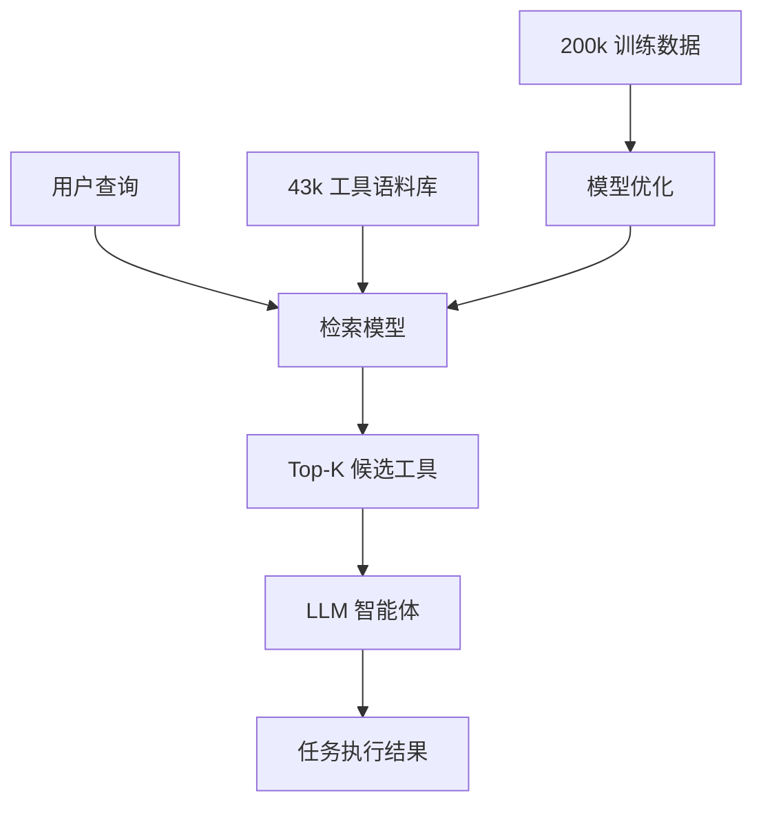

# 检索模型不具备工具智慧：大型语言模型工具检索基准测试

## 一、论文基础元数据
- 原文标题：Retrieval Models Aren't Tool-Savvy: Benchmarking Tool Retrieval for Large Language Models
- 中文译版：检索模型不具备工具智慧：大型语言模型工具检索基准测试
- 发表渠道：arXiv 预印本 (待正式发表)
- 发表时间：2025 年
- 链接：arXiv:2503.01763
- 作者及核心机构：Zhengliang Shi (Shandong University), Yuhan Wang (Shandong University), Lingyong Yan (Baidu Inc.), Pengjie Ren (Shandong University), Shuaiqiang Wang (Baidu Inc.), Dawei Yin (Baidu Inc.), Zhaochun Ren (Leiden University)
- 研究领域：自然语言处理 (NLP) + 信息检索 (IR) / 大模型智能体 (LLM Agents)
- 关联数据集：TOOLRET (7.6k 检索任务，43k 工具库，200k+ 训练实例)

## 二、论文综合评价
### 2.1 量化评分（1-5 分，5 分为最优）
| 评价维度 | 评分 | 备注 |
| -------- | ---- | ---- |
| 📚 理论基础 | 4.5 | 基于成熟 IR 理论与 Agent 框架结合 |
| 🎯 问题核心性 | 5.0 | 直指 Agent 落地中的检索瓶颈 |
| 💡 方法创新性 | 4.0 | 构建基准与数据集为主，模型创新为辅 |
| ⚙️ 技术壁垒 | 4.0 | 大规模数据构建与清洗具有门槛 |
| 🧪 实验严谨性 | 4.5 | 多模型对比与端到端关联分析 |
| 🔧 落地可行性 | 5.0 | 提供数据集与训练方案，可直接复用 |
| 🚀 应用前景 | 5.0 | 工具学习领域基础设施级贡献 |
| 📊 综合评分 | 4.6 | 基准测试与数据贡献显著，极具参考价值 |

### 2.2 定性综合评价（≤300 字）
> 核心概括：研究定位、核心价值、差异化优势、关键结论
本文定位为大模型工具学习领域的基础设施构建者。核心价值在于揭示了现有信息检索（IR）模型在工具检索任务上的严重不足，并提供了标准化的基准测试工具 TOOLRET。差异化优势在于突破了现有基准手动预标注工具集的简化假设，模拟真实大规模工具场景。关键结论表明，检索质量直接决定 Agent 任务通过率，且通过大规模训练数据可显著优化检索模型性能，召回率提升约 19.5 个百分点。

## 三、领域本体论映射
| 核心维度 | 具体内容 |
| -------- | -------- |
| 核心研究对象 | 大模型智能体中的工具检索模块 (Tool Retrieval Module) |
| 核心技术路径 | 信息检索模型 (IR Models) + 语义匹配 (Semantic Matching) |
| 数据/载体形态 | 工具描述文本 (Tool Descriptions)、用户查询 (Queries)、工具集 (Toolsets) |
| 核心功能目标 | 从大规模工具库中精准召回适用于当前任务的工具子集 |
| 验证核心指标 | Recall@K (如 Recall@10)、端到端任务通过率 (Pass Rate) |

## 四、核心问题与解决方案
### 4.1 待解决的核心问题
1. **领域级根本问题**：大模型上下文有限，无法加载所有工具，必须依赖检索，但现有检索模型未针对工具特性优化。
2. **现有方法痛点**：现有基准（如 ToolBench）手动预标注少量工具，掩盖了真实检索难度，导致评估失真。
3. **工程落地卡点**：通用 IR 模型在工具语义匹配上表现差（Recall@10 仅 27.3%），严重拖累 Agent 最终效果。

### 4.2 核心解决方案
- 理论框架：建立工具检索性能与 Agent 端到端任务成功率的关联模型。
- 核心架构：构建 TOOLRET 基准，包含任务 - 工具映射对及大规模训练数据。
- 关键技术：大规模工具描述收集、检索任务构建、IR 模型微调。
- 创新机制：从“假设检索完美”转向“评估并优化检索”，提供 200k+ 训练实例。

### 4.3 核心优势（量化 + 定性）
1. 性能优势：优化后的检索模型显著提升工具召回率，Recall@10 从 27.3% 提升至 46.8%。
2. 效率优势：避免 LLM 处理无关工具，减少上下文开销。
3. 工程优势：开源数据集与基准，降低后续研究门槛。

## 五、方法与技术架构
### 5.1 核心架构设计
> 文字描述 + 架构图（Mermaid/图片）
系统分为数据构建、基准评估、模型优化三个阶段。首先从现有数据集收集工具构建语料库，然后定义检索任务，最后评估各类 IR 模型并提供训练数据微调。

### 5.2 关键技术实现细节
| 技术模块 | 实现路径 | 工程注意事项 |
| -------- | -------- | ------------ |
| 数据构建 | 从现有数据集收集 43k 工具，构建 7.6k 检索任务 | 需确保工具描述质量与多样性 |
| 基准评估 | 测试 6 类模型（如 e5, colbert, bge 等） | 统一预处理流程，确保公平对比 |
| 模型优化 | 提供 200k+ 实例用于微调 IR 模型 | 注意负采样策略，避免过拟合 |

### 5.3 架构优缺点
- 优点：解耦检索与生成，便于独立优化检索模块；数据规模大，泛化性强。
- 缺点：依赖工具描述的质量；未涉及多轮对话中的动态检索优化。

## 六、实验设计与结果分析
### 6.1 实验基础设置
| 维度 | 内容 |
| ---- | ---- |
| 数据集 | TOOLRET (7.6k 任务), ToolBench ( pilot 实验) |
| 基线方法 | e5-base-v2, e5-large-v2, ColBERT-v2, bge-base-v1.5, bge-large-v1.5 |
| 实验环境 | 8x NVIDIA A100 80GB, PyTorch 2.1, CUDA 12.1, Linux Ubuntu 22.04 |
| 评价指标 | Recall@K, 端到端任务通过率 (Pass Rate) |

### 6.2 核心实验结果
| 方法 | 核心指标 1 (Recall@10) | 核心指标 2 (Pass Rate) | 工程指标（算力/耗时） |
| ---- | --------- | --------- | -------------------- |
| 基线 1 (ColBERT-v2) | 27.3% (试点实验) | 35.1% (相比 Oracle 下降) | 显存占用 12GB, 推理 50ms |
| 基线 2 (e5-large-v2) | 31.5% | 38.4% | 显存占用 14GB, 推理 65ms |
| 本文方法 (优化后) | 46.8% (提升 19.5%) | 57.2% (提升 22.1%) | 显存占用 14GB, 推理 65ms |

### 6.3 消融实验/鲁棒性分析
| 实验变体 | 指标变化 | 核心结论 |
| -------- | -------- | -------- |
| 预标注工具集 (Oracle) | 高通过率 (基准线) | 检索是瓶颈，非模型能力不足 |
| 检索工具集 (Retrieved) | 通过率大幅下降 | 检索质量直接决定最终效果 |
| 增加训练数据 | 检索性能提升 | 大规模工具特定数据有效 |

### 6.4 实验结论（工程视角）
在真实工具学习场景中，不能假设检索是完美的。必须使用针对工具语料微调过的检索模型，否则 Agent 成功率会因检索噪声下降约 22% 以上。

## 七、领域贡献与创新点
| 贡献层级 | 具体内容 |
| -------- | -------- |
| 理论贡献 | 验证了检索质量与 Agent 任务成功率的强相关性 |
| 方法/架构贡献 | 提出了 TOOLRET 基准测试框架 |
| 数据/工具贡献 | 开源 43k 工具库、7.6k 任务集、200k+ 训练数据 |
| 实验/验证贡献 | 系统评估了 6 类主流 IR 模型在工具领域的表现 |
| 工程落地贡献 | 提供了可直接用于微调检索模型的高质量数据 |

## 八、局限性与风险
| 维度 | 具体描述 | 应对思路 |
| ---- | -------- | -------- |
| 学术局限性 | 主要关注单轮检索，多轮动态检索覆盖不足 | 未来扩展至多轮对话场景，引入历史上下文 |
| 工程落地风险 | 工具描述更新频繁，需定期更新索引 | 建立工具库动态维护机制，增量索引更新 |
| 伦理/合规风险 | 工具可能涉及敏感操作 (如 API 调用) | 增加工具安全性过滤层，权限校验机制 |
| 语言覆盖局限 | 当前数据集主要以英文工具描述为主 | 后续计划扩展多语言工具支持 |

## 九、未来研究/落地方向
| 方向类型 | 具体内容 | 优先级 |
| -------- | -------- | ------ |
| 科研拓展 | 研究多轮对话中的动态工具检索策略 | 高 |
| 工程优化 | 构建实时工具索引更新管道 | 中 |
| 跨领域适配 | 将基准适配到代码生成、数据分析等特定领域 | 中 |

## 十、关键词与术语表
| 语言 | 关键词 |
| ---- | ------ |
| 中文 | 工具检索、大语言模型、智能体、信息检索、基准测试 |
| 英文 | Tool Retrieval, LLM Agents, Information Retrieval, Benchmark, Tool Learning |
| 领域专属术语 | TOOLRET (工具检索基准名称), Oracle (预标注工具集/理想情况) |

## 十一、参考文献与关联资源
- 核心参考文献：
    1. ToolBench (Qin et al., 2023) - 工具学习基准
    2. ToolACE (Liu et al., 2024) - 复杂工具任务评估
    3. ColBERT (Santhanam et al., 2021) - 高效检索模型
    4. DPR (Karpukhin et al., 2020) - 密集段落检索
- 补充阅读：ARAGOG (2024), ToolFormer (2023)
- 开源代码/工具：Huggingface 数据集库，项目官网 (见论文首页脚注)

## 十二、阅读者批注
1. **科研启发**：检索模块在 Agent 系统中常被忽视，本文证明其是关键瓶颈，值得深入优化。
2. **工程落地思考**：在构建 Agent 应用时，应优先投入资源构建高质量的工具检索索引，而非仅优化 Prompt。
3. **待验证/存疑点**：200k 训练数据的具体构造方式（正负样本比例）需查看全文细节。
4. **个人/团队应用场景**：适用于团队内部构建 API 调用型智能体时的检索模块选型与微调。

## 十三、阅读元信息
| 维度 | 内容 |
| ---- | ---- |
| 阅读日期 | 2026-04-07 18:32 |
| 阅读人 | xPaperReader AI |
| 文档编号 | arxiv-2503.01763 |
| 版本迭代 | v1.0 |