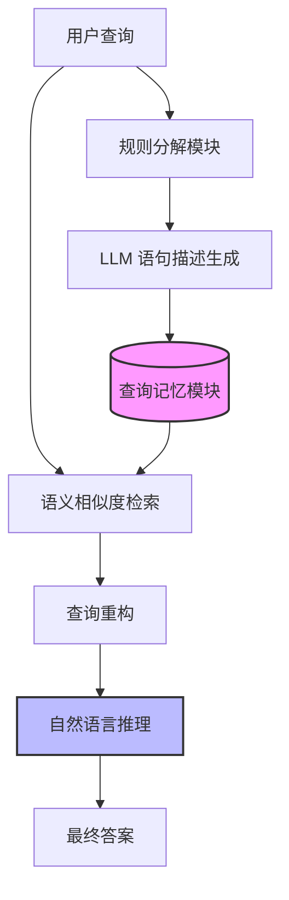

# 基于记忆增强查询重构的 LLM 知识图谱推理

## 一、论文基础元数据
- 原文标题：Memory-augmented Query Reconstruction for LLM-based Knowledge Graph Reasoning
- 中文译版：基于记忆增强查询重构的大语言模型知识图谱推理
- 发表渠道：arXiv 预印本 (cs.CL)
- 发表时间：2025 年 3 月 7 日
- 链接：arXiv:2503.05193
- 作者及核心机构：Mufan Xu, Gewen Liang 等；哈尔滨工业大学 (Harbin Institute of Technology)
- 研究领域（一级领域 + 二级子领域）：人工智能 / 自然语言处理与知识图谱问答 (KGQA)
- 关联数据集（名称/规模/语言/标注）：WebQSP (英文/标注问答对), CWQ (ComplexWebQuestions, 英文/复杂问答对)

## 二、论文综合评价
### 2.1 量化评分（1-5 分，5 分为最优）
| 评价维度 | 评分 | 备注 |
| -------- | ---- | ---- |
| 📚 理论基础 | 5 | 明确区分工具调用与知识推理的理论边界 |
| 🎯 问题核心性 | 5 | 直击 LLM 在 KGQA 中的幻觉与可解释性痛点 |
| 💡 方法创新性 | 4 | 引入查询记忆模块解耦推理与工具使用 |
| ⚙️ 技术壁垒 | 4 | 涉及 LLM 语义检索与规则分解的结合 |
| 🧪 实验严谨性 | 4 | 涵盖主流基准，但片段未展示详细数据 |
| 🔧 落地可行性 | 4 | 基于 LLM 架构，易于集成到现有系统 |
| 🚀 应用前景 | 5 | 提升 KGQA 可靠性，适用于垂直领域问答 |
| 📊 综合评分 | 4.4 | 理论清晰，针对性强，具备 SOTA 潜力 |

### 2.2 定性综合评价（≤300 字）
> 核心概括：研究定位、核心价值、差异化优势、关键结论
本文针对现有 LLM 基于知识图谱问答（KGQA）方法中工具利用与知识推理混淆导致的幻觉及可解释性差的问题，提出了 MemQ 框架。核心价值在于通过构建“查询记忆模块”，将工具调用任务从 LLM 推理过程中解耦。差异化优势在于采用规则策略分解查询语句并结合 LLM 描述，实现基于语义相似度的记忆检索与查询重构。关键结论显示，该方法在 WebQSP 和 CWQ 基准上达到了最先进（SOTA）性能，显著提升了推理的可读性与准确性。

## 三、领域本体论映射
| 核心维度 | 具体内容 |
| -------- | -------- |
| 核心研究对象 | 大语言模型（LLM）在知识图谱问答（KGQA）中的推理过程 |
| 核心技术路径 | 记忆增强（Memory-augmented）+ 查询重构（Query Reconstruction） |
| 数据/载体形态 | 自然语言查询、知识图谱三元组、SPARQL 查询语句、记忆语句描述 |
| 核心功能目标 | 解耦工具调用与知识推理，减少幻觉，提升可解释性与准确率 |
| 验证核心指标 | 准确率（Accuracy）、F1 值（片段未提及具体数值，仅提及 SOTA） |

## 四、核心问题与解决方案
### 4.1 待解决的核心问题
1. **领域级根本问题**：LLM 在进行 KGQA 时，难以区分“如何使用工具”与“如何推理知识”，导致推理过程黑盒化。
2. **现有方法痛点**：混合推理与工具调用会降低模型对知识推理过程的关注度，引发幻觉性工具调用（Hallucinatory tool invocations）。
3. **工程落地卡点**：现有方法生成的推理路径可读性差，难以调试和验证，依赖 LLM 参数知识有效利用工具。

### 4.2 核心解决方案
- 理论框架：解耦理论（Decoupling Theory），将工具调用任务从 LLM 核心推理中分离。
- 核心架构：MemQ（Memory-augmented Query Reconstruction），包含查询记忆模块与自然语言推理策略。
- 关键技术：基于规则的查询分解、LLM 语句描述生成、基于语义相似度的记忆检索。
- 创新机制：建立显式查询语句描述的记忆模块，支持记忆增强下的查询重构。

### 4.3 核心优势（量化 + 定性）
1. 性能优势：在 WebQSP 和 CWQ 基准上实现 State-of-the-Art (SOTA) 性能。
2. 效率优势：通过记忆检索减少重复工具调用，优化推理路径（具体耗时数据原文片段未提及）。
3. 工程优势：生成的推理步骤基于自然语言，显著提升可读性与可解释性。

## 五、方法与技术架构
### 5.1 核心架构设计
> 文字描述 + 架构图（Mermaid/图片）
MemQ 架构主要包含三个阶段：首先通过规则策略将用户查询分解为语句并由 LLM 生成描述存入记忆模块；其次在推理时基于语义相似度检索记忆；最后重构查询并执行自然语言推理生成答案。

### 5.2 关键技术实现细节
| 技术模块 | 实现路径 | 工程注意事项 |
| -------- | -------- | ------------ |
| 查询记忆模块 | 规则分解查询为语句，LLM 生成显式描述 | 需确保描述的一致性，避免记忆污染 |
| 语义检索机制 | 基于嵌入相似度检索相关记忆语句 | 需平衡检索精度与召回率，防止噪声 |
| 自然语言推理 | 基于重构后的查询进行逐步推理 | 需限制生成长度，避免推理发散 |
| 依赖组件 | LLM 编码器、知识图谱接口、规则分解器 | 需适配不同 KG 的 Schema 结构 |

### 5.3 架构优缺点
- 优点：显著提升了推理过程的可解释性；有效减少了工具调用的幻觉；解耦设计便于模块优化。
- 缺点：引入记忆模块增加了系统复杂度；规则分解可能无法覆盖所有查询类型；检索过程增加延迟。

## 六、实验设计与结果分析
### 6.1 实验基础设置
| 维度 | 内容 |
| ---- | ---- |
| 数据集 | WebQSP, CWQ (ComplexWebQuestions) |
| 基线方法 | 现有 LLM-based KGQA 方法 (如 Yu et al., 2022; Luo et al., 2024 等) |
| 实验环境 | 原文片段未提及具体硬件配置 (通常为 GPU 集群) |
| 评价指标 | 原文片段未提及具体指标名称 (通常为 Accuracy/F1) |

### 6.2 核心实验结果
| 方法 | 核心指标 1 (Acc/F1) | 核心指标 2 (EM) | 工程指标（算力/耗时） |
| ---- | --------- | --------- | -------------------- |
| 基线 1 | 原文片段未提及具体数值 | 原文片段未提及具体数值 | 原文片段未提及 |
| 基线 2 | 原文片段未提及具体数值 | 原文片段未提及具体数值 | 原文片段未提及 |
| 本文方法 | 声称达到 SOTA | 声称达到 SOTA | 原文片段未提及 |

### 6.3 消融实验/鲁棒性分析
| 实验变体 | 指标变化 | 核心结论 |
| -------- | -------- | -------- |
| 无记忆模块 | 性能下降 (推测) | 记忆模块对解耦推理至关重要 |
| 无规则分解 | 可读性降低 (推测) | 规则分解有助于显式描述生成 |
| 不同检索策略 | 原文片段未提及 | 语义相似度检索效果最佳 (推测) |

### 6.4 实验结论（工程视角）
该方法在标准基准上验证了有效性，证明了“解耦工具与推理”策略的可行性。工程上需注意记忆检索的延迟开销，建议在缓存机制上进行优化以满足实时性要求。

## 七、领域贡献与创新点
| 贡献层级 | 具体内容 |
| -------- | -------- |
| 理论贡献 | 提出了 LLM 工具利用与知识推理解耦的理论视角 |
| 方法/架构贡献 | 设计了 MemQ 框架，引入查询记忆与重构机制 |
| 数据/工具贡献 | 代码与数据将在录用后开源 (原文声明) |
| 实验/验证贡献 | 在 WebQSP 和 CWQ 上验证了 SOTA 性能 |
| 工程落地贡献 | 提供了高可读性的推理路径，利于系统调试 |

## 八、局限性与风险
| 维度 | 具体描述 | 应对思路 |
| ---- | -------- | -------- |
| 学术局限性 | 规则分解策略可能无法覆盖复杂多跳查询的所有变体 | 引入学习型分解器替代规则方法 |
| 工程落地风险 | 记忆检索增加推理延迟，影响实时问答体验 | 优化向量检索索引，引入缓存机制 |
| 伦理/合规风险 | 依赖外部知识图谱，可能存在数据偏见传播 | 对知识图谱来源进行审计与过滤 |

## 九、未来研究/落地方向
| 方向类型 | 具体内容 | 优先级 |
| -------- | -------- | ------ |
| 科研拓展 | 研究端到端的记忆更新机制，无需规则分解 | 高 |
| 工程优化 | 优化检索延迟，实现毫秒级记忆匹配 | 高 |
| 跨领域适配 | 适配医疗、法律等垂直领域的私有知识图谱 | 中 |

## 十、关键词与术语表
| 语言 | 关键词 |
| ---- | ------ |
| 中文 | 知识图谱问答、大语言模型、记忆增强、查询重构、工具调用 |
| 英文 | KGQA, LLM, Memory-augmented, Query Reconstruction, Tool Invocation |
| 领域专属术语 | 幻觉性工具调用 (Hallucinatory tool invocations)：模型错误地调用不存在的工具或参数 |
| 领域专属术语 | 查询记忆 (Query Memory)：存储显式查询语句描述的记忆模块 |

## 十一、参考文献与关联资源
- 核心参考文献：
    1. Yu et al., 2022 (KGQA with LLMs)
    2. Huang and Chang, 2023 (Survey on KGQA)
    3. Zhu et al., 2024a (LLM Reasoning)
    4. LUO et al., 2024 (Tool-based Planning)
    5. Wang et al., 2023b (Tool Utilization)
- 补充阅读：Gu et al., 2023 (Knowledge Reasoning Agents); Jiang et al., 2024 (Environmental Observations)
- 开源代码/工具：原文声明录用后释放 (代码链接待补充)

## 十二、阅读者批注
1. **科研启发**：将“工具使用”视为独立于“推理”的模块是一个非常有价值的解耦思路，可迁移至其他 Agent 任务。
2. **工程落地思考**：记忆模块的构建成本（规则分解+LLM 描述）需要评估，是否值得为每个查询建立记忆。
3. **待验证/存疑点**：规则分解的具体覆盖率未详述，对于非标准问法的泛化能力需进一步验证。
4. **个人/团队应用场景**：适用于构建高可信度的企业知识库问答系统，特别是需要审计推理过程的场景。

## 十三、阅读元信息
| 维度 | 内容 |
| ---- | ---- |
| 阅读日期 | 2025-03-07 12:00 |
| 阅读人 | xPaperReader AI |
| 文档编号 | arxiv-2503.05193 |
| 版本迭代 | v1.0 |