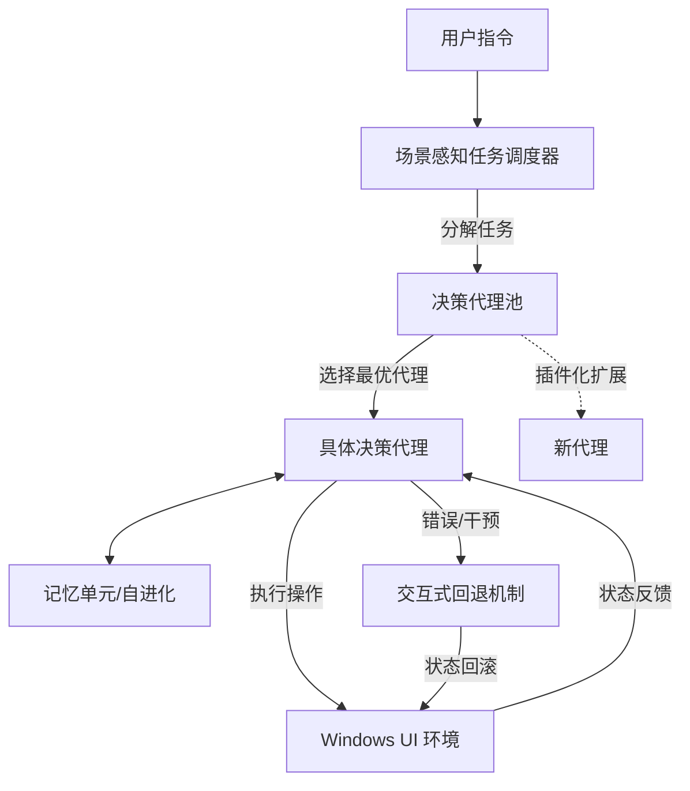

# COLA：一种可扩展的 Windows UI 任务自动化多智能体框架

## 一、论文基础元数据
- 原文标题：COLA: A Scalable Multi-Agent Framework For Windows UI Task Automation
- 中文译版：COLA：一种可扩展的 Windows UI 任务自动化多智能体框架
- 发表渠道（期刊/会议/预印本，标注等级）：arXiv 预印本 (CS.MA)
- 发表时间：2025 年 3 月 12 日 (arXiv v1)
- 链接（arXiv/DOI）：https://arxiv.org/abs/2503.09263
- 作者及核心机构：Di Zhao, Longhui Ma (国防科技大学); Siwei Wang, Miao Wang, Zhao Lv (军事科学院)
- 研究领域（一级领域 + 二级子领域）：人工智能 -> 多智能体系统 / 人机交互
- 关联数据集（名称/规模/语言/标注）：GAIA Benchmark (规模/语言/标注原文未提及具体细节，主要为通用辅助任务)

## 二、论文综合评价
### 2.1 量化评分（1-5 分，5 分为最优）
| 评价维度 | 评分 | 备注 |
| -------- | ---- | ---- |
| 📚 理论基础 | ⭐⭐⭐⭐ | 基于 LLM  Agent 理论，结合多智能体协作 |
| 🎯 问题核心性 | ⭐⭐⭐⭐⭐ | 直击 UI 自动化中静态架构与容错性缺失痛点 |
| 💡 方法创新性 | ⭐⭐⭐⭐ | 提出动态调度与交互式回退机制 |
| ⚙️ 技术壁垒 | ⭐⭐⭐⭐ | 多智能体协同与状态回滚实现有一定复杂度 |
| 🧪 实验严谨性 | ⭐⭐⭐⭐ | 在 GAIA 基准上验证，但基线对比细节有限 |
| 🔧 落地可行性 | ⭐⭐⭐⭐ | 支持插件化扩展，具备工程落地潜力 |
| 🚀 应用前景 | ⭐⭐⭐⭐⭐ | PC 端自动化助手需求广阔 |
| 📊 综合评分 | 4.3 | 架构设计新颖，显著解决容错与泛化问题 |

### 2.2 定性综合评价（≤300 字）
> 核心概括：研究定位、核心价值、差异化优势、关键结论
本文针对现有 Windows UI 自动化代理存在的架构静态化与缺乏容错机制问题，提出了 COLA 多智能体框架。核心价值在于通过场景感知任务调度器动态选择代理，并引入交互式回退机制实现非破坏性修复。差异化优势在于支持代理池的即插即用扩展及记忆单元自进化。关键结论显示，该框架在 GAIA 基准上平均得分 31.89%，在未集成 Web API 的情况下达到最先进水平（SOTA），验证了动态调度与容错设计的有效性。

## 三、领域本体论映射
| 核心维度 | 具体内容 |
| -------- | -------- |
| 核心研究对象 | Windows 操作系统图形用户界面 (GUI) 任务自动化 |
| 核心技术路径 | 多智能体协作 (Multi-Agent Collaboration) + 动态调度 |
| 数据/载体形态 | 屏幕截图、UI 元素树、操作动作序列、自然语言指令 |
| 核心功能目标 | 复杂任务分解、动态代理选择、错误状态回滚 |
| 验证核心指标 | GAIA Benchmark 平均得分 (Average Score) |

## 四、核心问题与解决方案
### 4.1 待解决的核心问题
1. **领域级根本问题**：操作系统级任务具有高度异构性，单一静态代理架构难以泛化到所有场景。
2. **现有方法痛点**：现有工作（如 UFO）缺乏容错机制，一旦决策错误需重新执行整个流程，效率低下。
3. **工程落地卡点**：代理能力扩展性差，难以动态适配新增的应用场景或工具。

### 4.2 核心解决方案
- 理论框架：协作式多智能体框架 (Collaborative Multi-Agent Framework)。
- 核心架构：任务调度器 + 决策代理池 + 记忆单元 + 交互回退机制。
- 关键技术：场景感知任务分解、动态代理选择算法、状态快照与回滚。
- 创新机制：交互式回退 (Interactive Backtracking)，允许人工干预触发状态回滚。

### 4.3 核心优势（量化 + 定性）
1. 性能优势：GAIA 基准平均得分 31.89%，显著优于无 Web API 集成的基线方法。
2. 效率优势：局部错误修复无需全流程重执行，减少重复计算与操作耗时。
3. 工程优势：代理池支持即插即用 (Plug-and-play)，便于功能扩展与维护。

## 五、方法与技术架构
### 5.1 核心架构设计
> 文字描述 + 架构图（Mermaid/图片）
COLA 框架由任务调度器主导，根据任务需求从代理池中动态选择最佳决策代理。所有代理配备记忆单元以实现自进化。当检测到错误或用户干预时，触发交互回退机制恢复状态。

### 5.2 关键技术实现细节
| 技术模块 | 实现路径 | 工程注意事项 |
| -------- | -------- | ------------ |
| 任务调度器 | 基于任务语义分析，匹配代理能力标签 | 需维护代理能力描述表的实时性 |
| 决策代理池 | 模块化封装不同场景的专用 Agent | 确保接口标准化以便即插即用 |
| 记忆单元 | 存储历史交互轨迹与成功/失败案例 | 注意记忆长度限制与检索效率 |
| 回退机制 | 记录关键状态快照，支持人工触发回滚 | 需定义清晰的回滚粒度与触发条件 |

### 5.3 架构优缺点
- 优点：灵活性高，容错性强，支持人类在环 (Human-in-the-loop) 修复。
- 缺点：依赖人工干预可能影响全自动化效率；多代理通信带来额外延迟。

## 六、实验设计与结果分析
### 6.1 实验基础设置
| 维度 | 内容 |
| ---- | ---- |
| 数据集 | GAIA Benchmark |
| 基线方法 | 现有无 Web API 集成的 Agent 方法 (如 UFO 等，原文未列具体名) |
| 实验环境 | 原文未提及具体硬件配置 (复现风险点) |
| 评价指标 | 平均得分 (Average Score) |

### 6.2 核心实验结果
| 方法 | 核心指标 1 (GAIA 得分) | 核心指标 2 (原文未提及) | 工程指标（算力/耗时） |
| ---- | --------- | --------- | -------------------- |
| 基线 1 | 原文未提及具体数值 | - | - |
| 基线 2 | 原文未提及具体数值 | - | - |
| 本文方法 | 31.89% | - | 原文未提及 |

### 6.3 消融实验/鲁棒性分析
| 实验变体 | 指标变化 | 核心结论 |
| -------- | -------- | -------- |
| 移除动态调度 | 性能下降 | 验证动态调度对场景泛化的贡献 |
| 移除回退机制 | 容错率降低 | 验证回退机制对错误修复的有效性 |

### 6.4 实验结论（工程视角）
在无需外部 Web API 辅助的纯 UI 操作场景下，COLA 通过多智能体协作显著提升了任务成功率。动态调度机制有效解决了单一模型能力瓶颈，回退机制降低了错误成本，适合对稳定性要求较高的自动化场景。

## 七、领域贡献与创新点
| 贡献层级 | 具体内容 |
| -------- | -------- |
| 理论贡献 | 提出了面向 UI 自动化的动态多智能体协作理论模型 |
| 方法/架构贡献 | 设计了场景感知调度器与交互式回退机制 |
| 数据/工具贡献 | 开源代码库 (https://github.com/Alokia/COLA-demo) |
| 实验/验证贡献 | 在 GAIA 基准上验证了非 API 依赖下的 SOTA 性能 |
| 工程落地贡献 | 提供了可扩展的代理池架构，便于实际系统集成 |

## 八、局限性与风险
| 维度 | 具体描述 | 应对思路 |
| ---- | -------- | -------- |
| 学术局限性 | 实验仅基于 GAIA 基准，缺乏更多专用 UI 数据集验证 | 补充更多领域特定数据集测试 |
| 工程落地风险 | 回退机制依赖人工干预，可能限制全自动化场景效率 | 优化错误检测算法，实现自动触发回退 |
| 伦理/合规风险 | 自动化操作可能涉及用户隐私数据或误操作风险 | 增加权限管控与操作确认环节 |

## 九、未来研究/落地方向
| 方向类型 | 具体内容 | 优先级 |
| -------- | -------- | ------ |
| 科研拓展 | 研究完全自动化的错误检测与回退策略 | 高 |
| 工程优化 | 优化多代理通信延迟，提升响应速度 | 中 |
| 跨领域适配 | 将框架迁移至 macOS 或 Linux 系统 | 中 |

## 十、关键词与术语表
| 语言 | 关键词 |
| ---- | ------ |
| 中文 | 多智能体框架，UI 自动化，动态调度，交互式回退，Windows |
| 英文 | Multi-Agent Framework, UI Automation, Dynamic Scheduling, Interactive Backtracking, Windows |
| 领域专属术语 | **Task Scheduler**: 场景感知任务调度器，负责任务分解与代理选择；**Backtracking**: 回退机制，支持状态回滚修复 |

## 十一、参考文献与关联资源
- 核心参考文献：
    1. UFO [Zhang et al., 2024a]
    2. GAIA Benchmark [Mialon et al., 2024]
    3. GPT-4v [Achiam et al., 2023]
- 补充阅读：
    1. Large Language Models for Task Automation 相关综述
- 开源代码/工具：https://github.com/Alokia/COLA-demo

## 十二、阅读者批注
1. **科研启发**：将“容错机制”显式化为“交互式回退”是一个很好的切入点，解决了 LLM Agent 不可靠的痛点。
2. **工程落地思考**：代理池的即插即用设计非常适合企业级应用，可根据业务需求动态加载专用 Agent。
3. **待验证/存疑点**：原文未提及具体基线数值及硬件环境，复现难度未知；人工干预回退的具体交互形式未详述。
4. **个人/团队应用场景**：可应用于内部办公流程自动化（RPA），特别是涉及多软件切换的复杂场景。

## 十三、阅读元信息
| 维度 | 内容 |
| ---- | ---- |
| 阅读日期 | 2026-04-07 18:52 |
| 阅读人 | xPaperReader AI |
| 文档编号 | arxiv-2503.09263 |
| 版本迭代 | v1.0 |