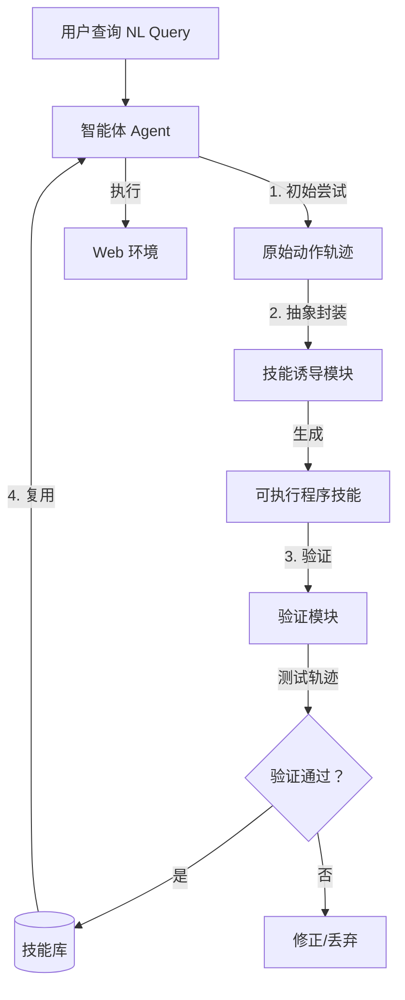

# 代理任务中的程序化技能诱导

## 一、论文基础元数据
- 原文标题：Inducing Programmatic Skills for Agentic Tasks
- 中文译版：代理任务中的程序化技能诱导
- 发表渠道：COLM 2025 (Conference on Language Modeling, 顶级会议)
- 发表时间：2025 年
- 链接：arXiv:2504.06821 / https://github.com/zorazrw/agent-skill-induction
- 作者及核心机构：Zora Zhiruo Wang, Apurva Gandhi, Graham Neubig, Daniel Fried (Carnegie Mellon University)
- 研究领域：人工智能 (一级) / 智能体与程序合成 (二级)
- 关联数据集：WebArena (Web 导航基准测试)

## 二、论文综合评价
### 2.1 量化评分（1-5 分，5 分为最优）
| 评价维度 | 评分 | 备注 |
| -------- | ---- | ---- |
| 📚 理论基础 | ⭐⭐⭐⭐⭐ | 程序作为技能表示的理论依据充分 |
| 🎯 问题核心性 | ⭐⭐⭐⭐⭐ | 解决智能体在线学习与泛化核心痛点 |
| 💡 方法创新性 | ⭐⭐⭐⭐⭐ | 提出 ASI 框架，程序化技能诱导新颖 |
| ⚙️ 技术壁垒 | ⭐⭐⭐⭐ | 涉及程序合成与验证，有一定门槛 |
| 🧪 实验严谨性 | ⭐⭐⭐⭐⭐ | WebArena 基准测试，数据详实 |
| 🔧 落地可行性 | ⭐⭐⭐⭐ | 需在线交互环境，部署有一定成本 |
| 🚀 应用前景 | ⭐⭐⭐⭐⭐ | 适用于各类数字任务自动化 |
| 📊 综合评分 | 4.7 | 理论与实验均表现卓越，创新显著 |

### 2.2 定性综合评价（≤300 字）
> 核心概括：研究定位、核心价值、差异化优势、关键结论
本文针对智能体在数字任务（如网页导航）中面临的离线学习分布不匹配及文本技能缺乏验证的问题，提出了代理技能诱导（ASI）框架。核心价值在于论证了“可执行程序”优于“文本”作为技能表示形式，具备可验证性和可组合性。差异化优势在于在线诱导机制，允许智能体在交互中动态生成、验证并利用技能。关键结论显示，ASI 在 WebArena 基准上成功率较静态基线提升 23.5%，较文本技能基线提升 11.3%，同时显著减少操作步骤，证明了程序化技能在效率与准确性上的双重优势。

## 三、领域本体论映射
| 核心维度 | 具体内容 |
| -------- | -------- |
| 核心研究对象 | 网页导航智能体 (Web Navigation Agents) |
| 核心技术路径 | 在线技能诱导 (Online Skill Induction) + 程序合成 (Program Synthesis) |
| 数据/载体形态 | 自然语言查询、执行轨迹、可执行程序代码 |
| 核心功能目标 | 提升任务成功率、减少操作步骤、实现技能跨网站复用 |
| 验证核心指标 | 成功率 (Success Rate)、步骤效率 (Step Efficiency) |

## 四、核心问题与解决方案
### 4.1 待解决的核心问题
1. **领域级根本问题**：智能体如何适应广泛且动态变化的数字任务环境，避免离线训练数据的分布偏差。
2. **现有方法痛点**：基于文本的技能表示缺乏执行保证，难以验证正确性；离线学习难以覆盖推理时的任务分布。
3. **工程落地卡点**：在线学习的安全性风险及诱导过程的计算开销。

### 4.2 核心解决方案
- 理论框架：代理技能诱导 (Agent Skill Induction, ASI)。
- 核心架构：轨迹生成 -> 技能诱导 (程序化) -> 验证 -> 技能库复用。
- 关键技术：将原始动作 (如 click) 封装为高阶可执行技能 (如 search_product)。
- 创新机制：利用程序的可验证性 (Verification Guarantee) 确保诱导技能的质量。

### 4.3 核心优势（量化 + 定性）
1. 性能优势：成功率较静态基线提升 23.5%，较文本技能基线提升 11.3%。
2. 效率优势：操作步骤减少 10.7–15.3%。
3. 工程优势：技能可跨网站复用，并能适应网站结构变化进行更新。

## 五、方法与技术架构
### 5.1 核心架构设计
> 文字描述 + 架构图（Mermaid/图片）
ASI 框架首先接收自然语言查询，生成初始动作轨迹。随后，系统从轨迹中诱导出生成高阶技能（程序），并通过测试轨迹进行验证。验证通过的技能存入库中供后续任务复用。

### 5.2 关键技术实现细节
| 技术模块 | 实现路径 | 工程注意事项 |
| -------- | -------- | ------------ |
| 轨迹生成 | 基于内置原始动作 (click, scroll) 执行 | 需处理网页 DOM 结构变化 |
| 技能诱导 | 将动作序列抽象为函数/程序 | 确保程序语法正确且可执行 |
| 验证模块 | 生成测试轨迹运行程序 | 防止死循环或副作用，需沙箱环境 |
| 依赖组件 | 大语言模型 (用于代码生成)、浏览器自动化工具 | 模型调用成本与延迟控制 |

### 5.3 架构优缺点
- 优点：技能可验证、可组合，适应性强，效率提升明显。
- 缺点：在线诱导需要额外交互步骤，初期冷启动成本较高。

## 六、实验设计与结果分析
### 6.1 实验基础设置
| 维度 | 内容 |
| ---- | ---- |
| 数据集 | WebArena (网页导航基准) |
| 基线方法 | 静态基线代理 (Static Baseline)、文本技能代理 (Text-skill Counterpart) |
| 实验环境 | 原文未提及具体硬件配置 (复现风险点) |
| 评价指标 | 成功率 (Success Rate)、步骤数 (Steps) |

### 6.2 核心实验结果
| 方法 | 核心指标 1 (成功率提升) | 核心指标 2 (效率提升) | 工程指标（算力/耗时） |
| ---- | --------- | --------- | -------------------- |
| 静态基线 | 基准 (0%) | 基准 | 原文未提及 |
| 文本技能基线 | 低于本文 11.3% | 原文未提及 | 原文未提及 |
| 本文方法 (ASI) | +23.5% (vs 静态) | 步骤减少 10.7–15.3% | 原文未提及 |

### 6.3 消融实验/鲁棒性分析
| 实验变体 | 指标变化 | 核心结论 |
| -------- | -------- | -------- |
| 程序化技能 vs 文本技能 | 成功率 +11.3% | 程序化表示提供验证保证，质量更高 |
| 技能复用测试 | 跨网站有效 | 通用技能可迁移，不兼容技能可更新 |

### 6.4 实验结论（工程视角）
ASI 方法在实际网页导航任务中显著降低了交互成本（步骤减少），同时提高了任务完成的可靠性。程序化验证机制是性能提升的关键贡献者，建议在工程落地中优先保证技能执行的可验证性。

## 七、领域贡献与创新点
| 贡献层级 | 具体内容 |
| -------- | -------- |
| 理论贡献 | 论证了程序作为智能体技能表示优于文本的理论依据 |
| 方法/架构贡献 | 提出 ASI 框架，实现在线技能诱导、验证与利用闭环 |
| 数据/工具贡献 | 开源代码库 (GitHub)，提供 WebArena 实验实现 |
| 实验/验证贡献 | 在 WebArena 上验证了程序化技能的有效性与泛化能力 |
| 工程落地贡献 | 提供了减少智能体操作步骤、提升效率的具体路径 |

## 八、局限性与风险
| 维度 | 具体描述 | 应对思路 |
| ---- | -------- | -------- |
| 学术局限性 | 原文未明确提及理论边界，主要依赖实验结果 | 需进一步探索理论收敛性证明 |
| 工程落地风险 | 在线诱导可能产生不安全操作或无限循环 | 引入沙箱机制与执行超时限制 |
| 伦理/合规风险 | 自动化操作可能违反网站服务条款 | 增加用户授权确认与合规检查层 |

## 九、未来研究/落地方向
| 方向类型 | 具体内容 | 优先级 |
| -------- | -------- | ------ |
| 科研拓展 | 探索多模态输入下的技能诱导 (如图文混合) | 中 |
| 工程优化 | 优化诱导过程的延迟，减少在线交互次数 | 高 |
| 跨领域适配 | 将 ASI 迁移至桌面操作、移动端自动化场景 | 高 |

## 十、关键词与术语表
| 语言 | 关键词 |
| ---- | ------ |
| 中文 | 代理技能诱导、程序化技能、网页导航、在线学习 |
| 英文 | Agent Skill Induction, Programmatic Skills, Web Navigation, Online Learning |
| 领域专属术语 | ASI (Agent Skill Induction): 代理技能诱导框架；WebArena: 网页智能体基准测试环境 |

## 十一、参考文献与关联资源
- 核心参考文献：
    1. Yao et al., 2022 (Web Navigation Tasks)
    2. Deng et al., 2024 (Human Demonstrations)
    3. Setlur et al., 2025 (Program Verifiability)
    4. Zhou et al., 2024b (Distribution Mismatch)
- 补充阅读：COLM 2025 相关 Agent 论文
- 开源代码/工具：https://github.com/zorazrw/agent-skill-induction

## 十二、阅读者批注
1. **科研启发**：将“代码/程序”作为中间表示层可能是解决 LLM 幻觉与执行不可靠的关键路径，值得在 RAG 系统中借鉴。
2. **工程落地思考**：在线诱导的成本（时间/Token）需与技能复用带来的收益做平衡，适合长周期任务。
3. **待验证/存疑点**：复杂网页结构下的程序合成成功率未详细披露，需查看完整论文实验细节。
4. **个人/团队应用场景**：适用于内部自动化运维脚本生成、RPA 流程优化场景。

## 十三、阅读元信息
| 维度 | 内容 |
| ---- | ---- |
| 阅读日期 | 2026-04-07 18:58 |
| 阅读人 | xPaperReader AI |
| 文档编号 | arxiv-2504.06821 |
| 版本迭代 | v1.0 |