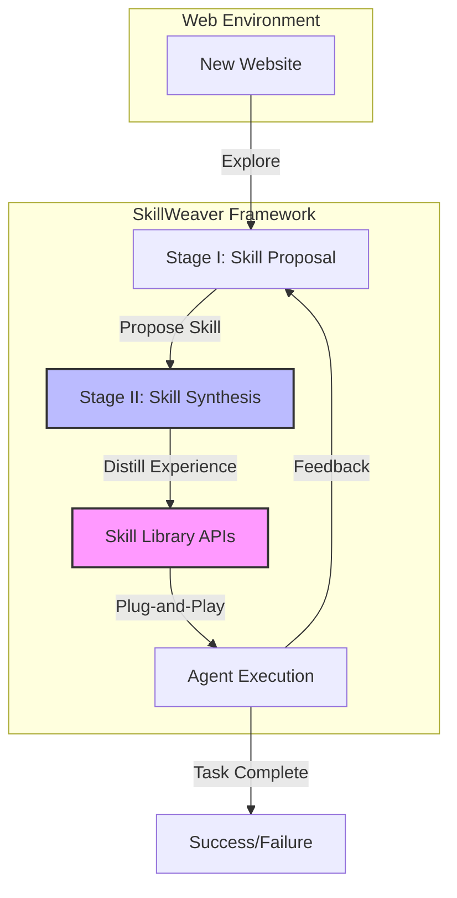

# SkillWeaver：Web 智能体可通过发现与打磨技能实现自我提升

## 一、论文基础元数据
- 原文标题：SkillWeaver: Web Agents can Self-Improve by Discovering and Honing Skills
- 中文译版：SkillWeaver：Web 智能体可通过发现与打磨技能实现自我提升
- 发表渠道：arXiv 预印本 (CS.AI)
- 发表时间：2025 年 4 月
- 链接：arXiv:2504.07079
- 作者及核心机构：Boyuan Zheng (OSU), Michael Y. Fatemi (UVA), Xiaolong Jin (Purdue), Zora Zhiruo Wang (CMU), Yu Su (OSU) 等
- 研究领域（一级领域 + 二级子领域）：人工智能 / 智能体与自动化（Web Agents & Self-Improvement）
- 关联数据集（名称/规模/语言/标注）：WebArena（基准测试集）、真实世界网站（未指定规模，英文环境）

## 二、论文综合评价
### 2.1 量化评分（1-5 分，5 分为最优）
| 评价维度 | 评分 | 备注 |
| -------- | ---- | ---- |
| 📚 理论基础 | ⭐⭐⭐⭐⭐ | 基于人类技能习得机制，理论扎实 |
| 🎯 问题核心性 | ⭐⭐⭐⭐⭐ | 解决 Web 智能体泛化与自我进化核心痛点 |
| 💡 方法创新性 | ⭐⭐⭐⭐⭐ | 提出技能即 API 的自主合成机制 |
| ⚙️ 技术壁垒 | ⭐⭐⭐⭐ | 涉及代码生成与执行验证，有一定门槛 |
| 🧪 实验严谨性 | ⭐⭐⭐⭐ | 包含基准与真实场景，但硬件细节未详述 |
| 🔧 落地可行性 | ⭐⭐⭐⭐ | API 化技能易于集成，但探索成本需考量 |
| 🚀 应用前景 | ⭐⭐⭐⭐⭐ | 通用智能体基础设施，潜力巨大 |
| 📊 综合评分 | 4.6 | 方法创新显著，实验数据支撑有力，具备落地潜力 |

### 2.2 定性综合评价（≤300 字）
> 核心概括：研究定位、核心价值、差异化优势、关键结论
本文针对 Web 智能体难以适应新环境和缺乏自我改进能力的问题，提出了 SkillWeaver 框架。其核心价值在于将智能体的经验抽象为可复用的 API 技能，实现了“探索 - 合成 - 优化”的闭环。差异化优势在于技能以代码 API 形式存储，而非简单的文本记忆，增强了鲁棒性与可组合性。关键结论显示，该方法在 WebArena 上相对成功率提升 31.8%，在真实网站提升 39.8%，且强代理合成的技能可使弱代理性能提升高达 54.3%，证明了技能迁移的有效性。

## 三、领域本体论映射
| 核心维度 | 具体内容 |
| -------- | -------- |
| 核心研究对象 | 自主 Web 智能体（Autonomous Web Agents） |
| 核心技术路径 | 技能发现 -> 技能合成 (API) -> 技能库构建 -> 自我迭代 |
| 数据/载体形态 | 网页交互轨迹、可执行代码片段 (Python/Async)、技能库 |
| 核心功能目标 | 实现智能体在未知网站环境下的自我进化与泛化 |
| 验证核心指标 | 任务成功率 (Success Rate)、相对提升百分比 (Relative Improvement) |

## 四、核心问题与解决方案
### 4.1 待解决的核心问题
1. **领域级根本问题**：现有 Web 智能体过度拟合特定网站结构，缺乏面对未知环境（Out-of-Distribution）的泛化与自我进化能力。
2. **现有方法痛点**：依赖大规模轨迹训练，难以抽象过程性知识（Procedural Knowledge），技能难以复用和组合。
3. **工程落地卡点**：智能体每次面对新网站需从头学习，效率低；缺乏标准化的技能共享机制。

### 4.2 核心解决方案
- 理论框架：模仿人类技能习得机制（探索、抽象、协作构建）。
- 核心架构：双阶段技能合成（Stage I: Skill Proposal, Stage II: Skill Synthesis）。
- 关键技术：自主技能发现、执行练习、经验蒸馏为鲁棒 API。
- 创新机制：将技能封装为轻量级、即插即用的 API 库，支持跨智能体迁移。

### 4.3 核心优势（量化 + 定性）
1. 性能优势：WebArena 成功率相对提升 31.8%，真实网站提升 39.8%。
2. 效率优势：技能库可复用，避免重复探索；弱代理通过技能迁移性能提升高达 54.3%。
3. 工程优势：技能以 API 形式存在，易于调试、版本管理及跨代理共享。

## 五、方法与技术架构
### 5.1 核心架构设计
> 文字描述 + 架构图（Mermaid/图片）
SkillWeaver 架构包含两个主要阶段：技能提案与技能合成。智能体首先在新环境中探索并提案潜在技能，随后通过执行练习将经验蒸馏为代码 API，存入技能库。后续任务可直接调用技能库中的 API，实现自我增强。

### 5.2 关键技术实现细节
| 技术模块 | 实现路径 | 工程注意事项 |
| -------- | -------- | ------------ |
| 技能提案 (Proposal) | 基于环境观察生成技能描述与初步代码框架 | 需防止幻觉，确保技能语义与网页元素匹配 |
| 技能合成 (Synthesis) | 执行初步代码，捕获错误日志，迭代修复代码 (如颜色验证错误) | 需处理异步执行 (async/await)，确保异常捕获机制健全 |
| 技能库管理 (Library) | 存储为可导入的 Python 模块或 API 端点 | 需版本控制，避免技能冲突或过时 |
| 依赖组件 | LLM (代码生成)、Playwright/Selenium (浏览器自动化) | 浏览器环境稳定性直接影响技能执行成功率 |

### 5.3 架构优缺点
- 优点：技能显式化（代码），可解释性强；支持跨代理迁移；持续进化能力。
- 缺点：初期探索成本高；依赖 LLM 代码生成能力；网站结构剧烈变动可能导致 API 失效。

## 六、实验设计与结果分析
### 6.1 实验基础设置
| 维度 | 内容 |
| ---- | ---- |
| 数据集 | WebArena 基准测试集、真实世界网站（如 Drugs.com 等） |
| 基线方法 | 现有 SOTA Web Agents (未具体命名，指代通用训练方法) |
| 实验环境 | 原文未提及具体 GPU 型号，基于异步 Python 环境 |
| 评价指标 | 任务成功率 (Success Rate)、相对提升率 (Relative Improvement) |

### 6.2 核心实验结果
| 方法 | 核心指标 1 (WebArena SR) | 核心指标 2 (Real-world SR) | 工程指标（算力/耗时） |
| ---- | --------- | --------- | -------------------- |
| 基线方法 | 基准值 (未提供绝对值) | 基准值 (未提供绝对值) | 原文未提及 |
| 本文方法 | 相对提升 31.8% | 相对提升 39.8% | 原文未提及 |
| 技能迁移 (弱代理) | 相对提升高达 54.3% | 原文未提及 | 原文未提及 |

### 6.3 消融实验/鲁棒性分析
| 实验变体 | 指标变化 | 核心结论 |
| -------- | -------- | -------- |
| 无技能库 | 性能显著下降 | 证明技能库是性能提升的关键来源 |
| 技能迁移 | 弱代理提升 54.3% | 证明技能具有跨模型泛化性与可转移性 |
| 迭代优化 | 成功率随迭代增加 | 证明自我打磨机制有效 |

### 6.4 实验结论（工程视角）
实验数据表明，将交互经验转化为 API 技能能显著降低任务执行难度。特别是在跨代理场景下，技能作为中间件解耦了模型能力与任务执行，使得弱模型也能通过调用高质量技能完成复杂任务，具有极高的工程部署价值。

## 七、领域贡献与创新点
| 贡献层级 | 具体内容 |
| -------- | -------- |
| 理论贡献 | 确立了 Web 智能体“技能即 API"的自我进化理论框架 |
| 方法/架构贡献 | 提出了双阶段技能合成架构（提案 + 合成） |
| 数据/工具贡献 | 开源了 SkillWeaver 代码库及合成的技能 API 集合 |
| 实验/验证贡献 | 在 WebArena 及真实网站上验证了自我改进的有效性 |
| 工程落地贡献 | 提供了可迁移的技能共享机制，降低部署门槛 |

## 八、局限性与风险
| 维度 | 具体描述 | 应对思路 |
| ---- | -------- | -------- |
| 学术局限性 | 依赖 LLM 生成代码的正确性，可能存在语法或逻辑错误 | 引入更严格的代码验证与测试用例生成机制 |
| 工程落地风险 | 网站 DOM 结构变化会导致硬编码的 API 失效 | 增加技能健康检查机制，定期自动重校准技能 |
| 伦理/合规风险 | 自动操作可能违反网站服务条款 (ToS) | 增加合规性检查层，限制访问频率与敏感操作 |

## 九、未来研究/落地方向
| 方向类型 | 具体内容 | 优先级 |
| -------- | -------- | ------ |
| 科研拓展 | 研究多智能体协作下的技能共享与冲突解决机制 | 高 |
| 工程优化 | 优化技能检索效率，降低大规模技能库的调用延迟 | 高 |
| 跨领域适配 | 将技能抽象机制迁移至桌面操作 (OS) 或移动端环境 | 中 |

## 十、关键词与术语表
| 语言 | 关键词 |
| ---- | ------ |
| 中文 | 智能体自我改进、技能发现、API 合成、Web 自动化、技能迁移 |
| 英文 | Self-Improvement, Skill Discovery, API Synthesis, Web Automation, Skill Transfer |
| 领域专属术语 | **Skill API**: 将网页交互过程封装为可调用的代码函数；**Skill Library**: 存储可复用技能的集合 |

## 十一、参考文献与关联资源
- 核心参考文献：
    1. Deng et al., 2023 (Web Agents)
    2. Zhou et al., 2024a (Web Navigation)
    3. Zheng et al., 2024 (Web Agent Challenges)
    4. Li et al., 2024 (Trajectory Datasets)
    5. Xie et al., 2024 (Computer Use Agents)
- 补充阅读：WebArena Benchmark 相关论文
- 开源代码/工具：https://github.com/OSU-NLP-Group/SkillWeaver

## 十二、阅读者批注
1. **科研启发**：将“记忆”转化为“可执行代码”是智能体长期记忆的一个极佳方向，比向量检索更可靠。
2. **工程落地思考**：在企业内部自动化场景中，可预先构建常用系统（如 OA、CRM）的技能库，大幅降低新员工（或新代理）的上手成本。
3. **待验证/存疑点**：技能库规模增大后，检索匹配的正确率如何保证？原文未详细说明技能检索机制。
4. **个人/团队应用场景**：适用于测试自动化、数据采集机器人及内部流程自动化 (RPA) 的智能化升级。

## 十三、阅读元信息
| 维度 | 内容 |
| ---- | ---- |
| 阅读日期 | 2026-04-07 19:05 |
| 阅读人 | xPaperReader AI |
| 文档编号 | arxiv-2504.07079 |
| 版本迭代 | v1.0 |