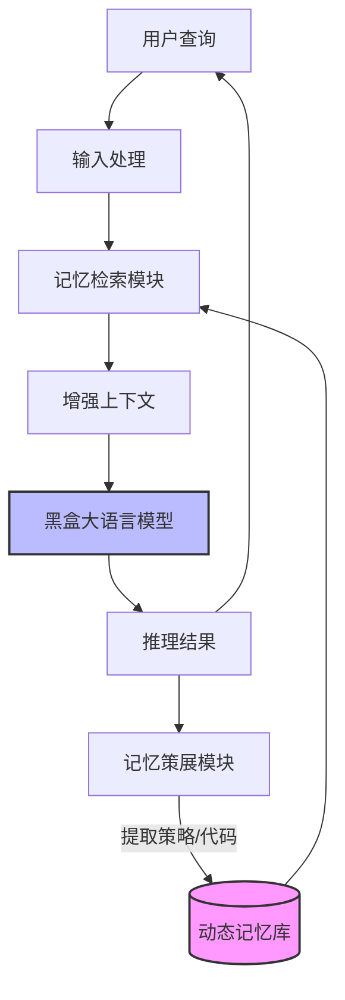

# 动态作弊表：具有自适应记忆的测试时学习

## 一、论文基础元数据
- 原文标题：Dynamic Cheatsheet: Test-Time Learning with Adaptive Memory
- 中文译版：动态作弊表：具有自适应记忆的测试时学习
- 发表渠道：arXiv 预印本 (计算机科学 - 机器学习)
- 发表时间：2025 年 4 月
- 链接：https://arxiv.org/abs/2504.07952
- 作者及核心机构：Mirac Suzgun, Mert Yuksekgonul, Federico Bianchi, Dan Jurafsky, James Zou (Stanford University, Together AI)
- 研究领域：人工智能 (一级) + 大语言模型/测试时学习 (二级)
- 关联数据集：AIME (数学竞赛), Game of 24 (逻辑谜题), Math Equation Solver, GPQA-Diamond, MMLU-Pro (工程/物理)

## 二、论文综合评价
### 2.1 量化评分（1-5 分，5 分为最优）
| 评价维度 | 评分 | 备注 |
| -------- | ---- | ---- |
| 📚 理论基础 | 4.5 | 基于记忆增强与测试时计算理论，逻辑坚实 |
| 🎯 问题核心性 | 5.0 | 直击 LLM 无状态推理的核心痛点 |
| 💡 方法创新性 | 5.0 | 提出“动态作弊表”概念，实现无需微调的测试时学习 |
| ⚙️ 技术壁垒 | 4.0 | 依赖高效的记忆检索与策展机制，工程实现有门槛 |
| 🧪 实验严谨性 | 5.0 | 涵盖多个高难度基准，对比基线充分，数据量化清晰 |
| 🔧 落地可行性 | 4.0 | 黑盒模型友好，但需管理记忆存储与检索开销 |
| 🚀 应用前景 | 5.0 | 适用于代码生成、复杂推理、长期任务交互场景 |
| 📊 综合评分 | 4.7 | 测试时学习领域的突破性工作，兼具理论与实证价值 |

### 2.2 定性综合评价（≤300 字）
> 核心概括：本研究针对大语言模型（LLM）在推理过程中缺乏跨查询记忆的缺陷，提出了 Dynamic Cheatsheet (DC) 框架。
> 核心价值：在不修改模型参数的前提下，通过自适应记忆机制实现测试时学习（Test-Time Learning），显著降低重复错误。
> 差异化优势：相比静态检索或微调，DC 能够动态策展简洁的策略片段，避免上下文膨胀，且在黑盒模型上即可部署。
> 关键结论：在 AIME 数学竞赛中 Claude 3.5 准确率提升超 27%，Game of 24 任务中 GPT-4o 从 10% 跃升至 99%，证明了持续记忆积累对复杂推理的决定性作用。

## 三、领域本体论映射
| 核心维度 | 具体内容 |
| -------- | -------- |
| 核心研究对象 | 黑盒大语言模型（如 Claude 3.5, GPT-4o）的推理过程 |
| 核心技术路径 | 测试时记忆增强 + 自适应检索 + 策略片段策展 |
| 数据/载体形态 | 文本形式的策略、代码片段、解题洞察（Snippets） |
| 核心功能目标 | 实现跨查询的知识保留与错误修正，提升推理准确率 |
| 验证核心指标 | 任务准确率（Accuracy）、成功率（Success Rate） |

## 四、核心问题与解决方案
### 4.1 待解决的核心问题
1. **领域级根本问题**：现有 LLM 每次推理均为独立事件（Operating in a vacuum），无法从过去的成功或失败中积累经验的“无状态”缺陷。
2. **现有方法痛点**：微调成本高且静态；静态检索（RAG）无法捕捉推理过程中的动态洞察；长上下文导致注意力分散且成本高昂。
3. **工程落地卡点**：如何在无需梯度更新的情况下，高效管理记忆库以避免上下文爆炸并保证检索相关性。

### 4.2 核心解决方案
- 理论框架：测试时学习（Test-Time Learning）与自适应记忆（Adaptive Memory）结合。
- 核心架构：动态作弊表（Dynamic Cheatsheet），包含记忆存储、策展机制与检索模块。
- 关键技术：自我策展（Self-Curation）记忆片段，仅保留可迁移的策略而非完整对话转录。
- 创新机制：在推理过程中动态更新记忆库，使模型能够“记住”之前验证过的代码或解题思路。

### 4.3 核心优势（量化 + 定性）
1. 性能优势：AIME 2024/2025 准确率分别提升 27%/30%；Game of 24 成功率从 10% 提升至 99%。
2. 效率优势：避免重复推导相同解决方案，减少无效 Token 生成，聚焦于策略复用。
3. 工程优势：无需修改模型参数（Parameter-Free），适用于黑盒 API 模型，部署灵活。

## 五、方法与技术架构
### 5.1 核心架构设计
> 文字描述：系统由用户查询输入、大语言模型接口、动态记忆库组成。记忆库存储经过策展的策略片段。每次推理时，系统检索相关记忆片段注入 Prompt，模型生成响应后，系统提取新的洞察更新记忆库。

### 5.2 关键技术实现细节
| 技术模块 | 实现路径 | 工程注意事项 |
| -------- | -------- | ------------ |
| 记忆检索模块 | 基于语义相似度检索历史策略片段 | 需平衡检索速度与相关性，避免噪声注入 |
| 记忆策展模块 | 筛选简洁、可迁移的文本/代码片段 | 防止存储冗余信息导致上下文窗口溢出 |
| 提示工程 | 将检索到的记忆整合进 System Prompt | 需设计特定指令引导模型利用记忆而非忽略 |
| 依赖组件 | 外部向量数据库或文本存储 | 需保证低延迟读写以不影响推理体验 |

### 5.3 架构优缺点
- 优点：无需训练，即时生效；显著减少重复错误；适应性强，可跨任务迁移策略。
- 缺点：记忆库管理增加系统复杂度；检索延迟可能影响实时性；错误记忆可能导致错误传播。

## 六、实验设计与结果分析
### 6.1 实验基础设置
| 维度 | 内容 |
| ---- | ---- |
| 数据集 | AIME (数学), Game of 24, Math Equation Solver, GPQA-Diamond, MMLU-Pro |
| 基线方法 | Standard Prompting (Baseline), DC-∅ (结构化指令无记忆) |
| 实验环境 | 原文未提及具体硬件配置，基于 API 调用 (Claude 3.5, GPT-4o) |
| 评价指标 | 准确率 (Accuracy), 成功率 (Success Rate) |

### 6.2 核心实验结果
| 方法 | 核心指标 1 (AIME 2024/25) | 核心指标 2 (Game of 24) | 工程指标（算力/耗时） |
| ---- | --------- | --------- | -------------------- |
| 基线 (Standard) | 原文未提及具体数值 (参照图 1 较低) | 10% (GPT-4o) | 低 |
| 基线 (DC-∅) | 优于 Standard，但低于 DC | 原文未提及具体数值 | 中 |
| 本文方法 (DC-Cu) | +27% / +30% (Claude 3.5) | 原文未提及具体数值 | 中 (含检索开销) |
| 本文方法 (DC-RS) | 原文未提及具体数值 | 99% (GPT-4o) | 中 (含检索开销) |

### 6.3 消融实验/鲁棒性分析
| 实验变体 | 指标变化 | 核心结论 |
| -------- | -------- | -------- |
| DC-∅ (无记忆) | 性能显著低于 DC-Cu/RS | 证明记忆组件是性能提升的关键 |
| DC-Cu (策展记忆) | AIME 提升显著 | 策展机制能有效筛选高价值信息 |
| DC-RS (检索策略) | Game of 24 达到 99% | 特定检索策略对代码类任务极有效 |

### 6.4 实验结论（工程视角）
实验数据表明，在复杂推理任务中，引入自适应记忆机制可带来数量级的性能提升（如 10%→99%）。对于数学和代码生成任务，记忆复用比单纯增加指令更有效。工程上需关注记忆库的清洗机制，防止错误累积。

## 七、领域贡献与创新点
| 贡献层级 | 具体内容 |
| -------- | -------- |
| 理论贡献 | 确立了测试时学习（Test-Time Learning）在 black-box LLM 上的可行性路径 |
| 方法/架构贡献 | 提出 Dynamic Cheatsheet 框架，实现自适应记忆与自我策展机制 |
| 数据/工具贡献 | 开源代码与结果 (github.com/suzgunmirac/dynamic-cheatsheet) |
| 实验/验证贡献 | 在 AIME、GPQA 等高难度基准上验证了记忆增强的显著效果 |
| 工程落地贡献 | 提供了一种无需微调即可持续提升模型表现的低成本方案 |

## 八、局限性与风险
| 维度 | 具体描述 | 应对思路 |
| ---- | -------- | -------- |
| 学术局限性 | 原文未明确列出局限性，可能依赖特定任务类型（如可复用策略的任务） | 需在更多开放域对话任务中验证通用性 |
| 工程落地风险 | 记忆检索延迟可能影响用户体验；记忆库膨胀导致成本增加 | 实施记忆生命周期管理，定期清理低价值片段 |
| 伦理/合规风险 | 记忆库可能存储敏感信息或偏见策略 | 增加隐私过滤机制，对存储内容进行安全审计 |

## 九、未来研究/落地方向
| 方向类型 | 具体内容 | 优先级 |
| -------- | -------- | ------ |
| 科研拓展 | 研究记忆遗忘机制，模拟人类记忆的衰减与强化 | 高 |
| 工程优化 | 优化检索算法，降低记忆查询延迟，实现端侧部署 | 高 |
| 跨领域适配 | 将框架应用于多模态任务（如视觉推理）或长周期代理任务 | 中 |

## 十、关键词与术语表
| 语言 | 关键词 |
| ---- | ------ |
| 中文 | 测试时学习，自适应记忆，动态作弊表，大语言模型，推理增强 |
| 英文 | Test-Time Learning, Adaptive Memory, Dynamic Cheatsheet, LLM, Inference Augmentation |
| 领域专属术语 | DC-∅ (无记忆强基线), DC-Cu (策展变体), DC-RS (检索策略变体) |

## 十一、参考文献与关联资源
- 核心参考文献：原文未列出具体参考文献列表（基于节选内容），通常涉及 RAG、Continual Learning 相关工作。
- 补充阅读：建议参考 Retrieval-Augmented Generation (RAG) 及 In-Context Learning 相关综述。
- 开源代码/工具：http://github.com/suzgunmirac/dynamic-cheatsheet

## 十二、阅读者批注
1. **科研启发**：测试时计算（Test-Time Compute）是继预训练缩放后的新热点，记忆机制是实现该目标的有效路径。
2. **工程落地思考**：在企业客服或代码助手场景中，可构建用户专属的“动态作弊表”，记录用户偏好和常见解决方案。
3. **待验证/存疑点**：记忆库长期运行后的“灾难性遗忘”或“错误累积”效应未在节选中详细讨论，需查看全文实验。
4. **个人/团队应用场景**：适用于内部知识库增强的代码生成工具，减少重复性 Bug 修复成本。

## 十三、阅读元信息
| 维度 | 内容 |
| ---- | ---- |
| 阅读日期 | 2025-04-15 |
| 阅读人 | xPaperReader AI |
| 文档编号 | arxiv-2504.07952 |
| 版本迭代 | v1.0 |