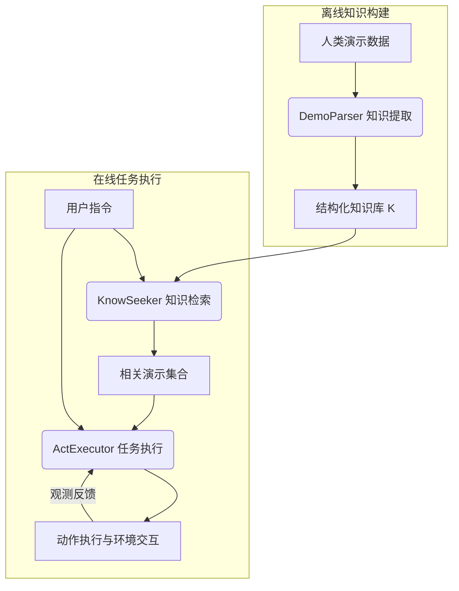

# LearnAct：具有统一演示基准的少样本移动 GUI 代理

## 一、论文基础元数据
- 原文标题：LearnAct: Few-Shot Mobile GUI Agent with a Unified Demonstration Benchmark
- 中文译版：LearnAct：具有统一演示基准的少样本移动 GUI 代理
- 发表渠道：arXiv 预印本（计算机科学/人工智能领域）
- 发表时间：2025 年
- 链接：arXiv:2504.13805
- 作者及核心机构：Guangyi Liu, Pengxiang Zhao, Liang Liu 等；机构：待补充（原文元数据未明确列出具体机构名称）
- 研究领域：人工智能 + 移动智能体（Mobile AI Agent）/ 人机交互（HCI）
- 关联数据集：LearnGUI（Offline: 2,252 任务/44 应用；Online: 101 任务/20 应用；含人类演示标注）

## 二、论文综合评价
### 2.1 量化评分（1-5 分，5 分为最优）
| 评价维度 | 评分 | 备注 |
| -------- | ---- | ---- |
| 📚 理论基础 | ⭐⭐⭐⭐ | 基于少样本学习与 POMDP 框架，理论扎实 |
| 🎯 问题核心性 | ⭐⭐⭐⭐⭐ | 直击移动代理泛化能力不足的核心痛点 |
| 💡 方法创新性 | ⭐⭐⭐⭐⭐ | 提出演示学习范式及统一基准，创新显著 |
| ⚙️ 技术壁垒 | ⭐⭐⭐⭐ | 多代理协作与语义知识提取具有工程门槛 |
| 🧪 实验严谨性 | ⭐⭐⭐⭐⭐ | 离线/在线双重评估，消融实验充分 |
| 🔧 落地可行性 | ⭐⭐⭐⭐⭐ | 无需大规模微调，适合个性化定制场景 |
| 🚀 应用前景 | ⭐⭐⭐⭐⭐ | 适用于个人助理、自动化测试等多种场景 |
| 📊 综合评分 | 4.7 | 兼具理论创新与极高实用价值的研究 |

### 2.2 定性综合评价（≤300 字）
> 核心概括：研究定位、核心价值、差异化优势、关键结论
本研究定位为解决移动 GUI 代理在多样化真实场景中泛化能力不足的问题。核心价值在于提出了基于人类演示的少样本学习范式（LearnAct），而非依赖昂贵的大规模预训练。差异化优势在于构建了首个专为演示学习设计的综合基准数据集（LearnGUI），并实现了多代理协作框架。关键结论表明，仅需少量高质量演示，即可使 7B 参数模型性能接近 GPT-4o 水平（在线成功率 32.8% vs 34.5%），验证了演示知识迁移的有效性。

## 三、领域本体论映射
| 核心维度 | 具体内容 |
| -------- | -------- |
| 核心研究对象 | 移动图形用户界面（Mobile GUI）智能代理 |
| 核心技术路径 | 少样本学习（Few-Shot Learning）+ 检索增强生成（RAG） |
| 数据/载体形态 | 屏幕截图序列、动作轨迹、自然语言指令、结构化语义知识 |
| 核心功能目标 | 在未见过的应用或场景中，利用历史演示完成用户指令 |
| 验证核心指标 | 任务成功率（Task Success Rate）、步骤准确率（Step Accuracy） |

## 四、核心问题与解决方案
### 4.1 待解决的核心问题
1. **领域级根本问题**：移动应用生态碎片化，代理难以泛化到未见过的应用或界面。
2. **现有方法痛点**：依赖大规模预训练成本高，零样本（Zero-shot）方法在复杂任务中成功率低。
3. **工程落地卡点**：缺乏统一的演示数据基准，难以评估和利用人类操作知识。

### 4.2 核心解决方案
- 理论框架：基于演示的学习（Demonstration-based Learning），将人类操作转化为可检索的语义知识。
- 核心架构：LearnAct 多代理框架（DemoParser + KnowSeeker + ActExecutor）。
- 关键技术：语义动作描述生成、基于嵌入的相似度检索、POMDP 决策执行。
- 创新机制：引入记忆机制捕获跨步骤关键信息，执行态自我反思生成动作描述。

### 4.3 核心优势（量化 + 定性）
1. 性能优势：离线准确率提升 198.9%（19.3%→51.7%），在线成功率提升 14.7%（18.1%→32.8%）。
2. 效率优势：无需全量微调，通过检索机制实现快速适配，降低算力消耗。
3. 工程优势：提供统一数据集与框架代码，支持跨应用知识迁移，便于部署。

## 五、方法与技术架构
### 5.1 核心架构设计
> LearnAct 框架通过离线知识提取与在线检索执行相结合，实现少样本任务完成。

### 5.2 关键技术实现细节
| 技术模块 | 实现路径 | 工程注意事项 |
| -------- | -------- | ------------ |
| DemoParser | 利用 VLM 将坐标/截图转化为自然语言描述（含屏幕上下文、动作意图） | 需保证描述格式标准化，便于后续检索匹配 |
| KnowSeeker | 基于 Instruction Embedding + Cosine Similarity 进行 Top-k 检索 | 需平衡检索速度与相关性，避免噪声干扰 |
| ActExecutor | 基于 POMDP 框架，整合指令、观测、历史及检索演示生成 Prompt | 需控制 Context 长度，防止超出模型窗口限制 |
| 依赖组件 | VLM（如 Gemini/Qwen）、Embedding 模型、向量数据库 | 模型版本需一致，确保语义空间对齐 |

### 5.3 架构优缺点
- 优点：泛化能力强，支持个性化定制，无需重新训练模型即可适配新任务。
- 缺点：依赖高质量演示数据，检索延迟可能影响实时交互体验，知识库维护成本。

## 六、实验设计与结果分析
### 6.1 实验基础设置
| 维度 | 内容 |
| ---- | ---- |
| 数据集 | LearnGUI-Offline (2,252 任务), LearnGUI-Online (101 任务) |
| 基线方法 | Zero-shot, SPHINX-GUI, GPT-4o, Claude Computer-Use, Aguvis |
| 实验环境 | 8 张 NVIDIA L40S GPU（微调部分），AndroidWorld 环境（在线评估） |
| 评价指标 | 离线：步骤准确率；在线：任务成功率（SR） |

### 6.2 核心实验结果
| 方法 | 核心指标 1 (离线准确率) | 核心指标 2 (在线成功率) | 工程指标（算力/耗时） |
| ---- | --------- | --------- | -------------------- |
| 基线 (Zero-shot) | 19.3% (Gemini) | 18.1% (UI-TARS-7B) | 低 |
| 基线 (GPT-4o) | 待补充 | 34.5% | 高 (API 调用) |
| 本文方法 (LearnAct) | 51.7% (Gemini) | 32.8% (UI-TARS-7B) | 中 (检索 + 推理) |

### 6.3 消融实验/鲁棒性分析
| 实验变体 | 指标变化 | 核心结论 |
| -------- | -------- | -------- |
| 移除 DemoParser | 性能下降 11.1% | 结构化语义知识描述对理解至关重要 |
| 移除 KnowSeeker | 性能下降 10.1% | 检索相关演示能显著增强上下文理解 |
| 完整框架 | 基准 19.3% → 51.7% | 两者互补，缺一不可，组合效果最佳 |

### 6.4 实验结论（工程视角）
少样本演示机制能显著缩小中小模型（7B）与超大模型（GPT-4o）的性能差距。在实际部署中，构建高质量知识库比单纯扩大模型规模更具性价比。检索模块的延迟需优化以满足实时交互需求。

## 七、领域贡献与创新点
| 贡献层级 | 具体内容 |
| -------- | -------- |
| 理论贡献 | 确立了基于演示的学习作为移动 GUI 代理泛化的新范式 |
| 方法/架构贡献 | 提出 LearnAct 框架，实现知识提取、检索与执行的自动化闭环 |
| 数据/工具贡献 | 发布 LearnGUI 基准数据集，填补了演示学习领域的数据空白 |
| 实验/验证贡献 | 系统分析了 UI 相似性与动作相似性对学习效果的影响 |
| 工程落地贡献 | 提供了无需大规模微调即可适配特定应用的可行路径 |

## 八、局限性与风险
| 维度 | 具体描述 | 应对思路 |
| ---- | -------- | -------- |
| 学术局限性 | 数据集规模有限（仅覆盖部分应用），K-shot 分析仅测试 k=1,2,3 | 未来扩展数据集，探索最优演示数量配置 |
| 工程落地风险 | 检索延迟可能影响用户体验，知识库更新维护成本高 | 优化索引结构，引入增量更新机制 |
| 伦理/合规风险 | 演示数据可能包含用户隐私信息（如账号细节） | 数据脱敏处理，本地化部署知识库 |

## 九、未来研究/落地方向
| 方向类型 | 具体内容 | 优先级 |
| -------- | -------- | ------ |
| 科研拓展 | 探索 Agent 自学习，利用自身成功执行经验优化能力 | 高 |
| 工程优化 | 优化检索延迟，实现端侧轻量化部署 | 高 |
| 跨领域适配 | 将演示学习范式迁移至桌面端或 Web 端 GUI 任务 | 中 |

## 十、关键词与术语表
| 语言 | 关键词 |
| ---- | ------ |
| 中文 | 移动 GUI 代理、少样本学习、演示学习、知识检索、任务成功率 |
| 英文 | Mobile GUI Agent, Few-Shot Learning, Demonstration Learning, Knowledge Retrieval, Task Success Rate |
| 领域专属术语 | **LearnGUI**：专为移动 GUI 代理演示学习设计的基准数据集；**DemoParser**：将原始演示转化为结构化语义知识的模块 |

## 十一、参考文献与关联资源
- 核心参考文献：AMEX 数据集，AndroidWorld 环境，UI-TARS 模型相关论文
- 补充阅读：SPHINX-GUI, GPT-4o Technical Report, Claude Computer-Use
- 开源代码/工具：待补充（论文提及代码已公开，具体链接需查阅原文）

## 十二、阅读者批注
1. **科研启发**：从“通用泛化”转向“个性化适配”是解决长尾场景的有效思路，演示数据价值被低估。
2. **工程落地思考**：知识库的构建成本是关键瓶颈，需探索自动化收集用户操作轨迹的技术。
3. **待验证/存疑点**：检索模块在大规模知识库（万级任务）下的延迟表现未在文中详细披露。
4. **个人/团队应用场景**：适用于企业内部自动化测试脚本生成、个人手机助手任务自动化。

## 十三、阅读元信息
| 维度 | 内容 |
| ---- | ---- |
| 阅读日期 | 2026-04-07 19:20 |
| 阅读人 | xPaperReader AI |
| 文档编号 | arxiv-2504.13805 |
| 版本迭代 | v1.0 |