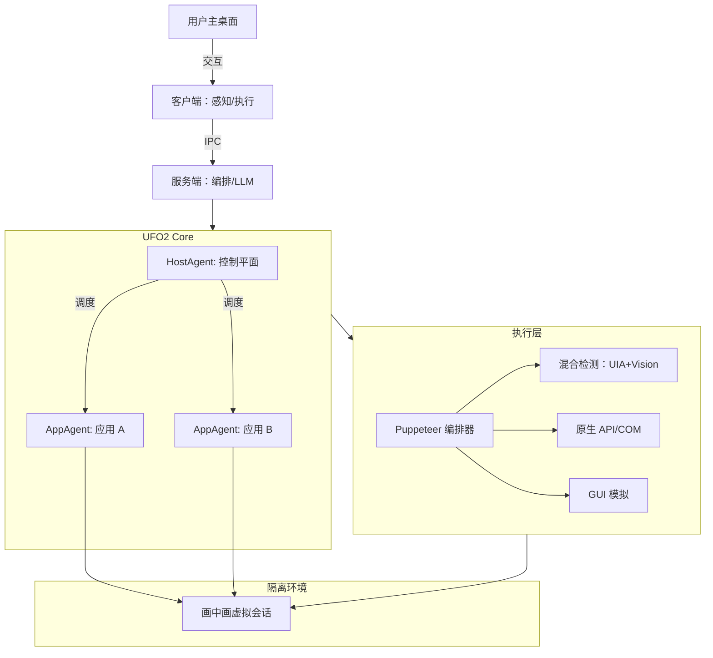

# UFO2：桌面智能体操作系统

## 一、论文基础元数据
- 原文标题：UFO2: The Desktop AgentOS
- 中文译版：UFO2：桌面智能体操作系统
- 发表渠道：预印本（arXiv）
- 发表时间：2025 年
- 链接：https://arxiv.org/abs/2504.14603
- 作者及核心机构：Chaoyun Zhang 等（Microsoft Research）
- 研究领域（一级领域 + 二级子领域）：人工智能 / 智能体系统与 HCI
- 关联数据集（名称/规模/语言/标注）：Windows Agent Arena (WAA, 154 任务)/OSWorld-W (49 任务)/Windows 原生 API

## 二、论文综合评价
### 2.1 量化评分（1-5 分，5 分为最优）

| 评价维度 | 评分 | 备注 |
| -------- | ---- | ---- |
| 📚 理论基础 | ⭐⭐⭐⭐ | 提出 AgentOS 概念，系统级抽象扎实 |
| 🎯 问题核心性 | ⭐⭐⭐⭐⭐ | 直击 CUA 独占输入与脆弱性痛点 |
| 💡 方法创新性 | ⭐⭐⭐⭐⭐ | 画中画隔离与 GUI+API 混合编排创新 |
| ⚙️ 技术壁垒 | ⭐⭐⭐⭐ | 深度集成 Windows 底层 API 与 UIA |
| 🧪 实验严谨性 | ⭐⭐⭐⭐ | 双基准测试，消融实验充分 |
| 🔧 落地可行性 | ⭐⭐⭐⭐⭐ | 基于原生系统接口，工程化路径清晰 |
| 🚀 应用前景 | ⭐⭐⭐⭐⭐ | 桌面自动化需求广泛，商业化潜力大 |
| 📊 综合评分 | 4.6 | 系统级创新显著，解决落地核心瓶颈 |

### 2.2 定性综合评价（≤300 字）
> 核心概括：研究定位、核心价值、差异化优势、关键结论
UFO2 定位为面向 Windows 桌面的多智能体操作系统（AgentOS），旨在将桌面自动化提升为系统级原语。其核心价值在于解决了现有计算机使用智能体（CUA）独占用户输入、缺乏语义理解及易受界面变化影响的问题。差异化优势体现在“画中画（PiP）”隔离执行环境、混合控件检测（UIA+ 视觉）及 GUI 与 API 统一编排机制。关键结论表明，该系统在 WAA 和 OSWorld-W 基准上成功率显著优于基线，任务步骤减少最高达 58.5%，实现了非干扰、高鲁棒性的通用桌面自动化，为 LLM 与操作系统深度融合提供了实践范式。

## 三、领域本体论映射
| 核心维度 | 具体内容 |
| -------- | -------- |
| 核心研究对象 | Windows 桌面环境下的自动化任务执行 |
| 核心技术路径 | 多智能体协作 + 系统级 API 集成 + 视觉语义融合 |
| 数据/载体形态 | 屏幕截图、UIA 语义树、原生 API 调用、执行日志 |
| 核心功能目标 | 非干扰、高鲁棒性、可扩展的通用桌面自动化 |
| 验证核心指标 | 成功率（SR）、平均完成步数（ACS）、延迟 |

## 四、核心问题与解决方案
### 4.1 待解决的核心问题
1. **领域级根本问题**：传统 RPA 缺乏语义理解，现有 CUA 缺乏 OS 级集成，难以应对复杂动态界面。
2. **现有方法痛点**：独占用户输入导致干扰大、依赖截图效率低、缺乏应用内省能力、长任务阻塞系统。
3. **工程落地卡点**：非标准控件识别难、高风险操作缺乏安全机制、跨应用任务调度复杂。

### 4.2 核心解决方案
- 理论框架：AgentOS 运行时子系统（Runtime Substrate），将自动化能力抽象为系统服务。
- 核心架构：HostAgent（控制平面）+ AppAgent（执行平面）的双层多智能体架构。
- 关键技术：画中画（PiP）隔离执行、混合控件检测（UIA+OmniParser）、GUI+API 统一编排（Puppeteer）。
- 创新机制：推测性多动作执行减少 LLM 调用，基于 RAG 的持续知识集成实现自我进化。

### 4.3 核心优势（量化 + 定性）
1. 性能优势：WAA 和 OSWorld-W 上成功率优于基线（如 Web 任务 SR 达 40.0%）。
2. 效率优势：GUI+API 模式相比纯 GUI 步骤减少 58.5%，推测执行进一步减少步骤最高 51.5%。
3. 工程优势：后台隔离运行不干扰用户，支持第三方 AppAgent 扩展，具备高风险操作安全确认机制。

## 五、方法与技术架构
### 5.1 核心架构设计
> 文字描述 + 架构图（Mermaid/图片）
系统采用 Client-Server 架构，客户端负责感知与执行，服务端负责编排与推理。核心包含 HostAgent 进行任务分解与调度，AppAgent 封装特定应用知识。执行层通过 Puppeteer 统一调度 GUI 事件与 API 调用，利用 Windows RDP loopback 创建虚拟桌面会话实现隔离。

### 5.2 关键技术实现细节
| 技术模块 | 实现路径 | 工程注意事项 |
| -------- | -------- | ------------ |
| 混合控件检测 | 融合 UIA 语义元数据与 OmniParser-v2 视觉标注 | 需处理冗余检测，合并重复元素 |
| 隔离执行环境 | 利用 Windows RDP loopback 创建虚拟会话 | 确保主机与虚拟会话间状态同步 |
| 统一编排器 | 优先调用原生 API，失败回退到 GUI 模拟 | 需维护 API 映射表，处理权限问题 |
| 通信层 | 基于 Windows Named Pipes 的安全跨会话 IPC | 保证数据传输低延迟与安全性 |

### 5.3 架构优缺点
- 优点：非干扰式执行、语义理解强、支持模块化扩展、安全性高。
- 缺点：依赖 Windows 特定 API（跨平台难）、LLM 推理延迟仍存在、复杂任务规划偶有错误。

## 六、实验设计与结果分析
### 6.1 实验基础设置
| 维度 | 内容 |
| ---- | ---- |
| 数据集 | Windows Agent Arena (WAA), OSWorld-W |
| 基线方法 | UFO, NAVI, OmniAgent, Agent S, Operator (基于 GPT-4o) |
| 实验环境 | 隔离 VM (8 核 AMD Ryzen 7, 8GB 内存), NVIDIA A100 GPU |
| 评价指标 | 成功率 (SR), 平均完成步数 (ACS), 延迟 |

### 6.2 核心实验结果
| 方法 | 核心指标 1 (SR) | 核心指标 2 (步骤) | 工程指标（算力/耗时） |
| ---- | --------- | --------- | -------------------- |
| 基线 (Operator) | 约 20.8% (参考) | 较多 | 单步~10 秒 |
| 基线 (UFO) | 低于 UFO2 | 较多 | 单步~10 秒 |
| 本文方法 (UFO2) | Web 任务 40.0% | 减少 58.5% (vs 纯 GUI) | 单任务~1 分钟 |

### 6.3 消融实验/鲁棒性分析
| 实验变体 | 指标变化 | 核心结论 |
| -------- | -------- | -------- |
| 纯 GUI 模式 | 步骤较多 | 混合 API 调用显著减少操作步骤 |
| 无知识集成 | 成功率下降 | 文档与经验总结解决 17.7% 计划错误 |
| 单一检测 (UIA) | 失败率 +9.9% | 混合检测解决非标准控件识别问题 |

### 6.4 实验结论（工程视角）
系统级集成（混合检测+API 交互）与高级 LLM 推理（如 o1）互补，显著降低执行开销。尽管单步推理存在延迟，但通过大幅减少交互步数，实现了实用的桌面自动化效率。知识集成模块证明了无需重训即可自适应改进的可行性。

## 七、领域贡献与创新点
| 贡献层级 | 具体内容 |
| -------- | -------- |
| 理论贡献 | 提出桌面 AgentOS 概念，定义自动化系统级原语 |
| 方法/架构贡献 | 设计 Host+App 多智能体架构与 PiP 隔离执行机制 |
| 数据/工具贡献 | 提供 SDK 支持第三方 AppAgent 注册与扩展 |
| 实验/验证贡献 | 在 WAA 和 OSWorld-W 上验证了鲁棒性与效率提升 |
| 工程落地贡献 | 实现 GUI+API 统一编排与高风险操作安全守护 |

## 八、局限性与风险
| 维度 | 具体描述 | 应对思路 |
| ---- | -------- | -------- |
| 学术局限性 | 主要验证于 Windows 环境，跨平台泛化未充分验证 | 未来拓展至 Linux (AT-SPI) 和 macOS |
| 工程落地风险 | LLM 推理延迟较高（~10 秒/步），复杂任务耗时久 | 部署轻量化大动作模型 (LAMs) 降延迟 |
| 伦理/合规风险 | 自动化操作可能涉及用户隐私与数据安全 | 强化沙箱隔离，增加用户确认机制 |

## 九、未来研究/落地方向
| 方向类型 | 具体内容 | 优先级 |
| -------- | -------- | ------ |
| 科研拓展 | 基于多样 GUI 数据集微调 VLM，深化 OS API 集成 | 高 |
| 工程优化 | 部署针对任务优化的轻量化大动作模型 (LAMs) | 高 |
| 跨领域适配 | 利用模块化设计拓展至 Linux 和 macOS 平台 | 中 |

## 十、关键词与术语表
| 语言 | 关键词 |
| ---- | ------ |
| 中文 | 智能体操作系统、桌面自动化、混合控件检测、画中画隔离 |
| 英文 | AgentOS, Desktop Automation, Hybrid Control Detection, Picture-in-Picture |
| 领域专属术语 | CUA（计算机使用智能体）：能操作计算机界面的智能体；UIA（无障碍 API）：Windows 用于获取 UI 元素信息的接口 |

## 十一、参考文献与关联资源
- 核心参考文献：UFO (Previous Version), OSWorld, OmniParser
- 补充阅读：Windows Agent Arena Benchmark, RPA 技术文档
- 开源代码/工具：待补充（论文提及提供 SDK，未明确代码开源状态）

## 十二、阅读者批注
1. **科研启发**：将 Agent 能力下沉为 OS 服务而非应用层脚本，是提升鲁棒性的关键路径。
2. **工程落地思考**：混合检测（UIA+Vision）是解决长尾 UI 问题的实用方案，值得在内部工具中借鉴。
3. **待验证/存疑点**：在非标准企业软件中的实际表现，以及多用户并发下的资源隔离效果。
4. **个人/团队应用场景**：可应用于内部 IT 运维自动化、测试流程自动化及员工助手场景。

## 十三、阅读元信息
| 维度 | 内容 |
| ---- | ---- |
| 阅读日期 | 2026-04-08 06:58 |
| 阅读人 | xPaperReader AI |
| 文档编号 | arxiv-2504.14603 |
| 版本迭代 | v1.0 |