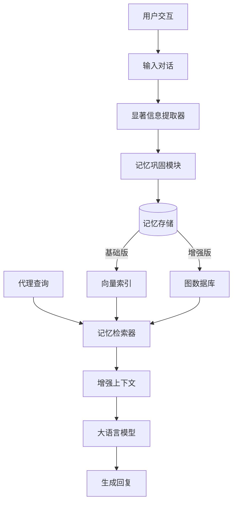

# Mem0：构建具备可扩展长期记忆的生产级 AI 代理

## 一、论文基础元数据
- 原文标题：Mem0: Building Production-Ready AI Agents with Scalable Long-Term Memory
- 中文译版：Mem0：构建具备可扩展长期记忆的生产级 AI 代理
- 发表渠道：arXiv 预印本 (计算机科学 - 计算语言学)
- 发表时间：2025 年 4 月 28 日
- 链接：arXiv:2504.19413
- 作者及核心机构：Prateek Chhikara 等 (Mem0 AI 研究团队)
- 研究领域（一级领域 + 二级子领域）：人工智能 / 大语言模型代理与记忆系统
- 关联数据集（名称/规模/语言/标注）：LOCOMO 基准测试 (规模待补充/英语/问答标注)

## 二、论文综合评价
### 2.1 量化评分（1-5 分，5 分为最优）

| 评价维度 | 评分 | 备注 |
| -------- | ---- | ---- |
| 📚 理论基础 | ⭐⭐⭐⭐ | 基于现有记忆增强系统，理论扎实 |
| 🎯 问题核心性 | ⭐⭐⭐⭐⭐ | 直击 LLM 上下文窗口限制痛点 |
| 💡 方法创新性 | ⭐⭐⭐⭐ | 引入图结构记忆，增强关系捕捉 |
| ⚙️ 技术壁垒 | ⭐⭐⭐⭐ | 涉及动态提取与 консолидация 工程复杂 |
| 🧪 实验严谨性 | ⭐⭐⭐⭐ | 对比 6 类基线，覆盖多问题类别 |
| 🔧 落地可行性 | ⭐⭐⭐⭐⭐ | 明确标榜生产级，成本降低显著 |
| 🚀 应用前景 | ⭐⭐⭐⭐⭐ | 智能代理长期交互刚需，前景广阔 |
| 📊 综合评分 | 4.4 | 解决关键落地瓶颈，性能与成本平衡佳 |

### 2.2 定性综合评价（≤300 字）
> 核心概括：研究定位、核心价值、差异化优势、关键结论
本文定位为生产级 AI 代理的长期记忆解决方案。核心价值在于突破 LLM 固定上下文窗口限制，实现跨会话的一致性记忆。差异化优势在于结合了动态信息提取/巩固机制与图基于记忆表示，不仅提升准确性，还显著降低延迟与 Token 成本。关键结论显示，Mem0 在 LOCOMO 基准上优于现有记忆系统及 RAG 方案，相比全上下文方法降低 91% 延迟及 90% 成本，证明了结构化持久记忆对长程对话连贯性的关键作用。

## 三、领域本体论映射
| 核心维度 | 具体内容 |
| -------- | -------- |
| 核心研究对象 | 长程多会话对话中的 AI 代理记忆系统 |
| 核心技术路径 | 动态提取、巩固、检索 + 图结构记忆表示 |
| 数据/载体形态 | 对话历史、用户偏好、关系图谱节点 |
| 核心功能目标 | 维持跨会话一致性，降低计算开销 |
| 验证核心指标 | LLM-as-a-Judge 准确率、p95 延迟、Token 成本 |

## 四、核心问题与解决方案
### 4.1 待解决的核心问题
1. **领域级根本问题**：
   LLM 固定上下文窗口无法维持长周期多会话对话的一致性，导致代理无法像人类一样积累经验和身份认知。
2. **现有方法痛点**：
   传统 RAG 检索精度不足，全上下文处理成本过高且受窗口限制，现有记忆系统缺乏结构化关系捕捉能力。
3. **工程落地卡点**：
   高延迟和高 Token 成本阻碍了长记忆功能在生产环境中的大规模部署。

### 4.2 核心解决方案
- 理论框架：
  记忆中心型架构（Memory-Centric Architecture），模拟人类记忆的提取与巩固机制。
- 核心架构：
  基础版 Mem0（动态提取/巩固/检索）+ 增强版 Mem0（图基于记忆表示）。
- 关键技术：
  显著信息动态提取、记忆巩固策略、图结构关系建模。
- 创新机制：
  引入图记忆捕捉对话元素间的复杂关系，平衡准确性与计算开销。

### 4.3 核心优势（量化 + 定性）
1. 性能优势：
   相比 OpenAI  proprietary 系统，LLM-as-a-Judge 指标提升 26%；图记忆比基础版再提升 2%。
2. 效率优势：
   相比全上下文方法，p95 延迟降低 91%，Token 成本节省超过 90%。
3. 工程优势：
   专为生产环境设计，可扩展性强，支持跨会话持久化。

## 五、方法与技术架构
### 5.1 核心架构设计
> 文字描述 + 架构图（Mermaid/图片）
架构分为记忆写入与读取两个主流程。写入时动态提取对话中的显著信息并进行巩固（合并/更新）；读取时根据查询检索相关记忆。增强版引入图结构存储实体间关系。

### 5.2 关键技术实现细节
| 技术模块 | 实现路径 | 工程注意事项 |
| -------- | -------- | ------------ |
| 信息提取 | 动态识别对话中的关键实体与偏好 | 需平衡提取粒度，避免信息过载 |
| 记忆巩固 | 合并相似记忆，更新过时信息 | 防止记忆冲突，确保时间一致性 |
| 图记忆表示 | 构建对话元素间的关系图谱 | 图遍历复杂度控制，索引优化 |
| 依赖组件 | 向量数据库、图数据库、LLM API | 需确保低延迟连接与高可用性 |

### 5.3 架构优缺点
- 优点：
  显著降低 Token 消耗，支持无限期记忆持久化，图结构增强推理能力。
- 缺点：
  引入额外存储组件增加系统复杂度，图构建与维护需要额外计算资源。

## 六、实验设计与结果分析
### 6.1 实验基础设置
| 维度 | 内容 |
| ---- | ---- |
| 数据集 | LOCOMO 基准测试 |
| 基线方法 | 6 类：记忆增强系统、RAG、全上下文、开源记忆、专有模型、记忆管理平台 |
| 实验环境 | 待补充（基于云端 API 与本地部署混合） |
| 评价指标 | 准确率 (LLM-as-a-Judge)、p95 延迟、Token 成本 |

### 6.2 核心实验结果
| 方法 | 核心指标 1 (准确率) | 核心指标 2 (相对提升) | 工程指标（算力/耗时） |
| ---- | --------- | --------- | -------------------- |
| 全上下文方法 | 基准 | - | 高延迟，高成本 |
| OpenAI 专有系统 | 基准 | - | 待补充 |
| 本文方法 (Mem0) | 优于基线 | +26% (vs OpenAI) | 延迟 -91%, 成本 -90% |
| 本文方法 (Graph) | 最优 | +2% (vs Base Mem0) | 略高于基础版 |

### 6.3 消融实验/鲁棒性分析
| 实验变体 | 指标变化 | 核心结论 |
| -------- | -------- | -------- |
| 基础版 vs 图增强版 | 整体得分 +2% | 图结构能有效捕捉复杂关系 |
| 不同问题类别 | 单跳/多跳/时间/开放域均优 | 通用性强，非特定任务优化 |

### 6.4 实验结论（工程视角）
Mem0 在保持高准确率的同时，解决了全上下文方法无法落地的成本与延迟问题，具备大规模部署潜力。

## 七、领域贡献与创新点
| 贡献层级 | 具体内容 |
| -------- | -------- |
| 理论贡献 | 验证了结构化持久记忆对长程对话连贯性的关键作用 |
| 方法/架构贡献 | 提出可扩展的记忆中心架构及图基于记忆变体 |
| 数据/工具贡献 | 在 LOCOMO 基准上提供了新的性能标杆 |
| 实验/验证贡献 | 系统对比 6 类基线，覆盖多维度评价指标 |
| 工程落地贡献 | 实现了 90% 成本节约，推动生产级代理发展 |

## 八、局限性与风险
| 维度 | 具体描述 | 应对思路 |
| ---- | -------- | -------- |
| 学术局限性 | 仅基于 LOCOMO 基准，泛化性需更多数据集验证 | 扩展至多领域对话数据集测试 |
| 工程落地风险 | 图数据库维护成本及一致性挑战 | 优化图更新策略，引入异步处理 |
| 伦理/合规风险 | 长期记忆涉及用户隐私数据存储 | 实施数据加密与用户删除权机制 |

## 九、未来研究/落地方向
| 方向类型 | 具体内容 | 优先级 |
| -------- | -------- | ------ |
| 科研拓展 | 探索多模态记忆（图像/音频）的融合 | 中 |
| 工程优化 | 进一步降低图记忆构建的延迟 | 高 |
| 跨领域适配 | 适配客服、个人助理、教育等不同场景 | 高 |

## 十、关键词与术语表
| 语言 | 关键词 |
| ---- | ------ |
| 中文 | 长期记忆、AI 代理、图结构、检索增强生成、上下文窗口 |
| 英文 | Long-Term Memory, AI Agents, Graph-based, RAG, Context Window |
| 领域专属术语 | 记忆巩固 (Memory Consolidation)：将短期信息转化为长期稳定存储的过程 |

## 十一、参考文献与关联资源
- 核心参考文献：待补充（原文未列出完整参考文献列表）
- 补充阅读：LOCOMO Benchmark 相关论文
- 开源代码/工具：https://mem0.ai/research (代码链接)

## 十二、阅读者批注
1. **科研启发**：
   记忆不仅仅是存储，更是提取与巩固的动态过程，图结构是提升记忆推理能力的关键方向。
2. **工程落地思考**：
   90% 的成本节省是落地关键，实际部署需关注向量与图数据库的混合检索延迟。
3. **待验证/存疑点**：
   图记忆带来的 2% 提升是否在不同领域稳定？提取错误的累积效应如何？
4. **个人/团队应用场景**：
   可应用于构建具备用户画像持久化的智能客服或个人生活助理 Agent。

## 十三、阅读元信息
| 维度 | 内容 |
| ---- | ---- |
| 阅读日期 | 2026-04-08 07:06 |
| 阅读人 | xPaperReader AI |
| 文档编号 | arxiv-2504.19413 |
| 版本迭代 | v1.0 |