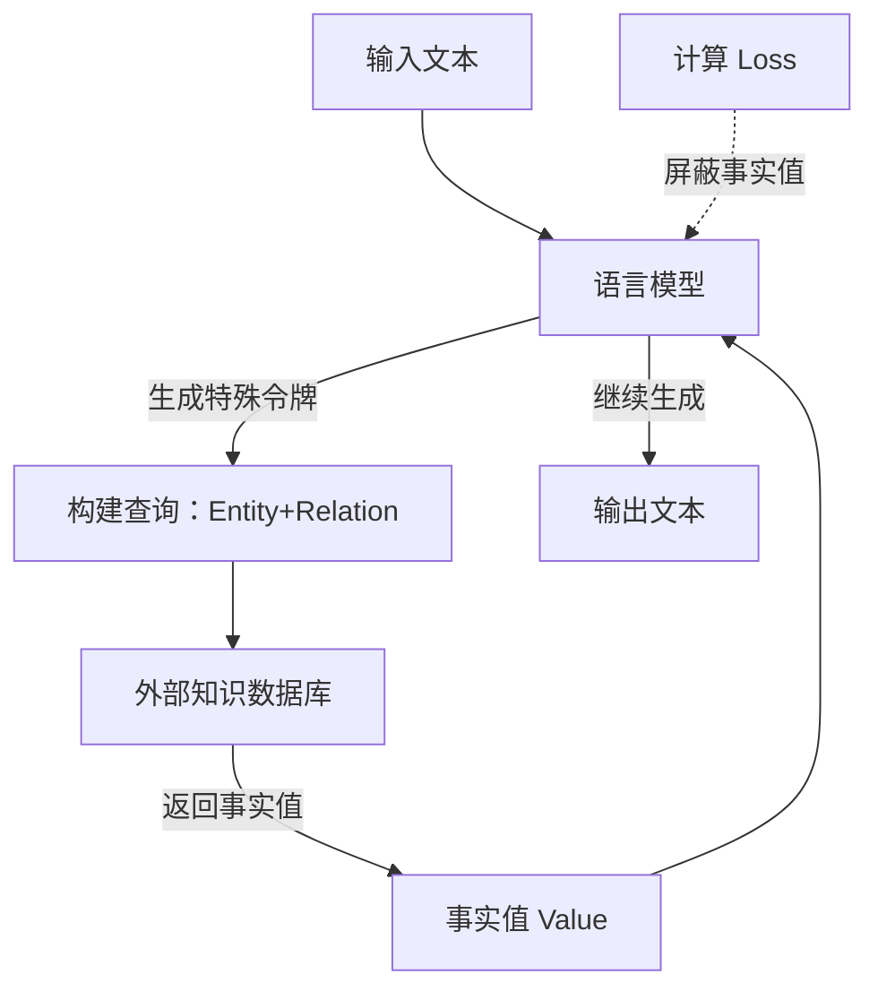

# 预训练具有内部和外部知识的有限记忆语言模型

## 一、论文基础元数据
- 原文标题：Pre-training Limited Memory Language Models with Internal and External Knowledge
- 中文译版：预训练具有内部和外部知识的有限记忆语言模型
- 发表渠道：预印本（arXiv）
- 发表时间：2025 年 5 月
- 链接：arXiv:2505.15962
- 作者及核心机构：Linxi Zhao 等（机构信息待补充）
- 研究领域：人工智能 + 自然语言处理（大语言模型/知识解耦）
- 关联数据集：Wikipedia（预训练语料）、SQuAD-v2（种子数据）、OLMo2 项目数据、自建知识三元组库（54.6M 三元组）

## 二、论文综合评价
### 2.1 量化评分（1-5 分，5 分为最优）

| 评价维度 | 评分 | 备注 |
| -------- | ---- | ---- |
| 📚 理论基础 | ⭐⭐⭐⭐ | 理论基础扎实，解耦记忆与语言 |
| 🎯 问题核心性 | ⭐⭐⭐⭐⭐ | 直击知识耦合与遗忘难题 |
| 💡 方法创新性 | ⭐⭐⭐⭐⭐ | 预训练屏蔽损失机制新颖 |
| ⚙️ 技术壁垒 | ⭐⭐⭐ | 需构建外部数据库基础设施 |
| 🧪 实验严谨性 | ⭐⭐⭐⭐ | 基准测试全面但模型规模小 |
| 🔧 落地可行性 | ⭐⭐⭐⭐ | 架构兼容性强，易于集成 |
| 🚀 应用前景 | ⭐⭐⭐⭐⭐ | 合规与更新场景应用潜力大 |
| 📊 综合评分 | 4.3 | 开创性解耦范式，参数效率高，具重要落地价值 |

### 2.2 定性综合评价（≤300 字）
> 核心概括：研究定位、核心价值、差异化优势、关键结论

本研究定位为重构大模型知识存储范式，提出有限记忆语言模型（LmLm）。核心价值在于将事实知识从模型权重解耦至外部数据库，实现知识的模块化管控。差异化优势在于预训练阶段通过损失屏蔽机制，迫使模型学习“查询”而非“记忆”，从而在参数量大幅减少（382M）的情况下，事实准确性媲美 7B 模型。关键结论表明，该方法能实现无损机器遗忘（仅删除数据库条目），且未损害通用语言能力，为高合规性场景提供了新路径。

## 三、领域本体论映射
| 核心维度 | 具体内容 |
| -------- | -------- |
| 核心研究对象 | 有限记忆语言模型（LmLm） |
| 核心技术路径 | 预训练损失屏蔽 + 外部数据库检索 |
| 数据/载体形态 | 文本序列 + 结构化知识三元组 |
| 核心功能目标 | 事实知识外部化、可控更新与遗忘 |
| 验证核心指标 | FactScore、T-REx EM、PopQA Acc、TOFU 遗忘率 |

## 四、核心问题与解决方案
### 4.1 待解决的核心问题
1. **领域级根本问题**：传统 LLM 将事实知识与语言能力耦合在权重中，导致知识难以控制、更新或删除。
2. **现有方法痛点**：机器遗忘方法通常需梯度更新，易损害模型通用能力且难以彻底清除知识；内部记忆易产生幻觉。
3. **工程落地卡点**：知识更新需重新训练或微调，成本高且响应慢，难以满足实时合规需求。

### 4.2 核心解决方案
- 理论框架：知识卸载（Knowledge Offloading）理论，区分语言能力与事实记忆。
- 核心架构：Decoder-only 架构 + 特殊查询令牌 + 外部知识数据库。
- 关键技术：预训练时屏蔽检索返回事实值的 Loss 计算；特殊令牌触发数据库查找。
- 创新机制：模型学习生成查询调用而非记忆事实值，实现事实存储的外部化。

### 4.3 核心优势（量化+定性）
1. 性能优势：382M 参数 LmLm 事实精度媲美 LLaMA2-7B（FactScore +17.9%）。
2. 效率优势：学习查询比记忆事实更容易，验证困惑度更低，训练效率更高。
3. 工程优势：支持即时更新/删除数据库条目实现遗忘，无需微调模型，无通用能力损失。

## 五、方法与技术架构
### 5.1 核心架构设计
模型基于 GPT-2 或 LLaMA2 风格 Decoder-only 架构，扩展词表增加 4 个特殊令牌用于数据库交互。预训练时，模型生成查询令牌，检索外部数据库，获取事实值后继续生成，但计算 Loss 时屏蔽事实值部分。

### 5.2 关键技术实现细节
| 技术模块 | 实现路径 | 工程注意事项 |
| -------- | -------- | ------------ |
| 数据标注 | 使用 GPT-4o/LLaMA-3.1-8B 生成结构化三元组 | 需保证标注准确性，避免噪声入库 |
| 损失屏蔽 | 计算 Next-token Loss 时屏蔽检索值及结束 token | 确保模型不通过上下文泄露记忆事实 |
| 检索匹配 | 模糊匹配或前缀树约束解码，相似度阈值 0.6 | 需平衡检索精度与召回率，防止错误注入 |
| 词表扩展 | 增加<|db_start|>等 4 个特殊令牌 | 需重新初始化嵌入层或扩展原有词表 |

### 5.3 架构优缺点
- 优点：知识更新无需重训，事实可验证，参数效率高，支持完美机器遗忘。
- 缺点：依赖外部数据库质量，推理延迟增加（检索开销），仅支持实体级事实。

## 六、实验设计与结果分析
### 6.1 实验基础设置
| 维度 | 内容 |
| ---- | ---- |
| 数据集 | Wikipedia, SQuAD-v2, OLMo2 (约 3B tokens) |
| 基线方法 | Standard LLM (同架构无外部知识), LLaMA2-7B |
| 实验环境 | 8 H100-days, bf16 混合精度，上下文 1024 |
| 评价指标 | Perplexity, FactScore, T-REx, PopQA, TOFU |

### 6.2 核心实验结果
| 方法 | 核心指标 1 (FactScore) | 核心指标 2 (T-REx EM) | 工程指标（算力/耗时） |
| ---- | --------- | --------- | -------------------- |
| 基线 1 (Standard 382M) | 基准 | 基准 | 基准 |
| 基线 2 (LLaMA2-7B) | 高 | 高 | 高算力需求 |
| 本文方法 (LmLm 382M) | +17.9% (优于 Standard) | +6.1% (媲美 7B) | 训练 8 H100-days |

### 6.3 消融实验/鲁棒性分析
| 实验变体 | 指标变化 | 核心结论 |
| -------- | -------- | -------- |
| 禁用检索 | 事实精度显著下降 | 证明模型依赖外部库而非内部记忆 |
| 知识外部化比例 0%-100% | 外部化比例越高，困惑度越低 | 学习查询比记忆事实更高效 |
| TOFU 遗忘测试 | 删除数据库条目即实现完美遗忘 | 验证了知识解耦的有效性 |

### 6.4 实验结论（工程视角）
LmLm 在中小规模模型上验证了知识外部化的可行性，显著提升了事实准确性并降低了遗忘成本。虽然引入了检索开销，但在对事实合规性敏感的场景中，该权衡是可接受的。

## 七、领域贡献与创新点
| 贡献层级 | 具体内容 |
| -------- | -------- |
| 理论贡献 | 提出事实记忆与语言能力可解耦的理论验证 |
| 方法/架构贡献 | 设计预训练损失屏蔽机制与查询令牌架构 |
| 数据/工具贡献 | 构建包含 54.6M 三元组的知识数据库及标注流水线 |
| 实验/验证贡献 | 在 TOFU 基准上验证了无需微调的机器遗忘能力 |
| 工程落地贡献 | 提供了一种低成本的模型知识更新与合规方案 |

## 八、局限性与风险
| 维度 | 具体描述 | 应对思路 |
| ---- | -------- | -------- |
| 学术局限性 | 目前仅限实体级原子事实，未覆盖抽象知识 | 未来探索非实体级知识的分离格式 |
| 工程落地风险 | 检索延迟增加，依赖数据库可用性 | 优化检索引擎，建立高可用数据库集群 |
| 伦理/合规风险 | 外部数据库可能被污染或篡改 | 建立数据库访问权限控制与完整性校验 |

## 九、未来研究/落地方向
| 方向类型 | 具体内容 | 优先级 |
| -------- | -------- | ------ |
| 科研拓展 | 探索抽象知识、推理能力的外部化表示 | 高 |
| 工程优化 | 优化检索延迟，减少特殊令牌开销 | 高 |
| 跨领域适配 | 应用于医疗、法律等高合规性敏感领域 | 中 |

## 十、关键词与术语表
| 语言 | 关键词 |
| ---- | ------ |
| 中文 | 有限记忆模型、知识解耦、机器遗忘、外部知识库 |
| 英文 | Limited Memory Language Models, Knowledge Offloading, Machine Unlearning, External Database |
| 领域专属术语 | **损失屏蔽 (Loss Masking)**：训练时不计算特定 token 的损失；**知识三元组 (Knowledge Triplets)**：实体 - 关系 - 值结构 |

## 十一、参考文献与关联资源
- 核心参考文献：LLaMA2, GPT-4o, TOFU Benchmark, OLMo2
- 补充阅读：检索增强生成 (RAG) 相关文献，机器遗忘 (Machine Unlearning) 综述
- 开源代码/工具：待补充（论文未明确提及开源地址）

## 十二、阅读者批注
1. **科研启发**：预训练目标的修改（屏蔽 Loss）能从根本上改变模型的行为模式，值得在其他任务中尝试。
2. **工程落地思考**：适合构建企业私有知识库模型，确保敏感数据可随时物理删除而不影响模型主体。
3. **待验证/存疑点**：大规模模型（如 70B+）上的效果是否一致？检索延迟在高频并发下的表现如何？
4. **个人/团队应用场景**：适用于需要频繁更新事实知识的客服机器人或合规文档生成系统。

## 十三、阅读元信息
| 维度 | 内容 |
| ---- | ---- |
| 阅读日期 | 2026-04-08 07:16 |
| 阅读人 | xPaperReader AI |
| 文档编号 | arxiv-2505.15962 |
| 版本迭代 | v1.0 |