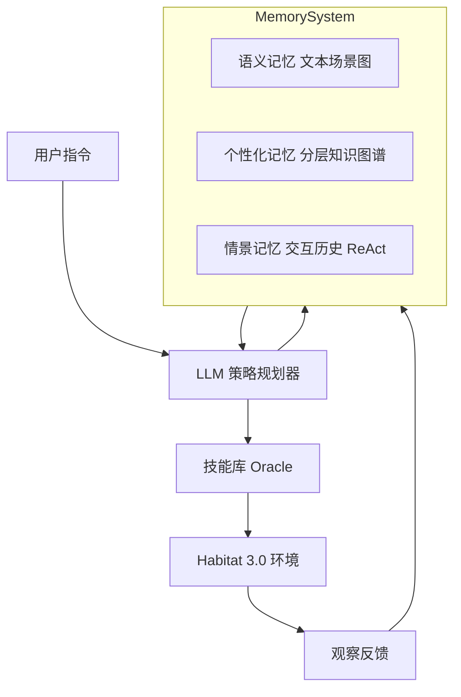

# 具身智能体遇见个性化：通过记忆利用视角探究挑战与解决方案

## 一、论文基础元数据
- 原文标题：Embodied Agents Meet Personalization: Investigating Challenges and Solutions Through the Lens of Memory Utilization
- 中文译版：具身智能体遇见个性化：通过记忆利用视角探究挑战与解决方案
- 发表渠道：预印本（arXiv，待同行评审）
- 发表时间：2025 年
- 链接：arXiv:2505.16348
- 作者及核心机构：Taeyoon Kwon 等（具体机构待补充，通常为高校或研究院）
- 研究领域：人工智能（一级）+ 具身智能/记忆系统（二级）
- 关联数据集：PartNR Benchmark（基于 Habitat 3.0 构建，12 个场景，438 个 episode，英语指令）

## 二、论文综合评价
### 2.1 量化评分（1-5 分，5 分为最优）

| 评价维度 | 评分 | 备注 |
| -------- | ---- | ---- |
| 📚 理论基础 | 4.0 | 记忆分类理论清晰，结合认知科学概念 |
| 🎯 问题核心性 | 5.0 | 直击具身智能个性化落地的核心瓶颈 |
| 💡 方法创新性 | 4.0 | 分层知识图谱记忆架构设计新颖有效 |
| ⚙️ 技术壁垒 | 3.0 | 基于现有 LLM 与图谱技术整合，门槛中等 |
| 🧪 实验严谨性 | 5.0 | Memento 框架设计严谨，覆盖多模型对比 |
| 🔧 落地可行性 | 3.0 | 模拟器验证充分，但现实部署仍有差距 |
| 🚀 应用前景 | 4.0 | 家庭服务机器人个性化需求市场广阔 |
| 📊 综合评分 | 4.0 | 系统揭示记忆利用瓶颈，解决方案具指导意义 |

### 2.2 定性综合评价（≤300 字）
> 核心概括：研究定位、核心价值、差异化优势、关键结论

本研究定位於具身智能体个性化服务的关键痛点——记忆利用。核心价值在于提出了**Memento 评估框架**，系统性隔离并量化了智能体在“记忆获取”与“记忆利用”阶段的能力差异。差异化优势在于不仅揭示了**用户模式理解困难**与**多记忆协调失败**等深层问题，还提出了**分层知识图谱用户档案记忆**作为解决方案。关键结论表明，在特定测试集中，单纯增加上下文长度无法解决个性化问题，需通过结构化记忆架构来提升多源记忆整合能力，为未来构建用户对齐的具身智能体奠定了理论与工程基础。

## 三、领域本体论映射
| 核心维度 | 具体内容 |
| -------- | -------- |
| 核心研究对象 | LLM 驱动的具身智能体（Embodied Agents） |
| 核心技术路径 | 分层控制（LLM 规划 + 技能库）+ 结构化记忆系统 |
| 数据/载体形态 | 情景记忆（交互历史）、语义记忆（场景图）、知识图谱 |
| 核心功能目标 | 基于用户个性化历史记忆完成复杂指令任务 |
| 验证核心指标 | 成功率 (SR, 在 PartNR 测试集中)、完成率 (PC)、规划周期、模拟步数 |

## 四、核心问题与解决方案
### 4.1 待解决的核心问题
1. **领域级根本问题**：具身智能体难以像人类一样利用过往经验（记忆）来提供个性化服务。
2. **现有方法痛点**：依赖非结构化情景记忆，存在信息过载、常识偏好（忽视个人记忆）、多记忆协调失败。
3. **工程落地卡点**：无法有效理解用户行为模式（序列信息），检索记忆增多反而导致性能下降。

### 4.2 核心解决方案
- **理论框架**：Memento 端到端两阶段评估框架（获取阶段 vs 利用阶段）。
- **核心架构**：基于分层知识图谱的用户档案记忆（Hierarchical Knowledge Graph-based User Profile Memory）。
- **关键技术**：三层结构（用户->知识类型->元素），层级边与时间边连接，动态更新机制。
- **创新机制**：独立管理个性化知识，分离语义噪声，支持多记忆源协同与动态偏好更新。

### 4.3 核心优势（量化 + 定性）
1. **性能优势**：引入用户档案记忆后，在 PartNR 测试集中，单记忆与联合记忆任务成功率相比基线显著提升（此前表现最差的用户模式任务改善明显）。
2. **效率优势**：减少无关记忆干扰，降低规划周期与模拟步数，缓解信息过载。
3. **工程优势**：对自然语言噪声（同义词、不同指代）具有较好鲁棒性（在知识更新噪声测试中准确率 100%）。

## 五、方法与技术架构
### 5.1 核心架构设计
系统采用两层分层控制，核心创新在于记忆模块的结构化改造。高层 LLM 负责策略规划，底层调用 Oracle 技能执行，记忆系统分为语义记忆（场景图）与个性化记忆（分层图谱）。

### 5.2 关键技术实现细节
| 技术模块 | 实现路径 | 工程注意事项 |
| -------- | -------- | ------------ |
| 记忆获取 | 任务执行中积累 ReAct 三元组，实时更新场景图 | 需确保存储格式标准化，便于后续检索 |
| 记忆检索 | 使用 `all-mpnet-base-v2` 编码，基于指令查询同一场景历史 | 需控制 Top-k 值，避免信息过载导致性能下降 |
| 知识图谱 | 三层结构（用户->类型->元素），含层级与时间边 | 需设计动态更新逻辑，处理节点引用噪声 |
| 技能执行 | 预定义运动与感知技能（Navigate, Pick 等） | 使用 Oracle 技能排除低层执行误差干扰 |

### 5.3 架构优缺点
- **优点**：结构化存储便于检索与推理，有效隔离个性化知识与常识，支持多记忆协同。
- **缺点**：依赖模拟器真值更新语义记忆，现实世界中视觉感知误差未完全考虑；缺乏对话澄清机制。

## 六、实验设计与结果分析
### 6.1 实验基础设置
| 维度 | 内容 |
| ---- | ---- |
| 数据集 | PartNR Benchmark (12 场景，438 episodes) |
| 基线方法 | 纯情景记忆、记忆摘要、不同检索策略 (Reranker/Query Expansion) |
| 实验环境 | Habitat 3.0 模拟器 + Spot 机器人模型 |
| 评价指标 | 成功率 (SR)、完成率 (PC)、规划周期、模拟步数 |

### 6.2 核心实验结果
| 方法 | 核心指标 1 (单记忆 SR) | 核心指标 2 (联合记忆 SR) | 工程指标（算力/耗时） |
| ---- | --------- | --------- | -------------------- |
| 基线 (GPT-4o) | 85.1% (Utilization, 在特定测试集中) | 54.6% (相比单记忆下降 30.5%) | 规划周期较多 |
| 基线 (Llama-70b) | [原文未提及具体数值] | 8.3% (联合任务，在特定测试集中) | 耗时较高 |
| 本文方法 (KG 记忆) | 相比基线显著提升 (具体数值原文未详述) | 相比基线显著提升 (具体数值原文未详述) | 规划效率优化 |

### 6.3 消融实验/鲁棒性分析
| 实验变体 | 指标变化 | 核心结论 |
| -------- | -------- | -------- |
| 检索记忆数量增加 (Top-k 增大) | 性能一致下降 | 证实信息过载瓶颈，非越多越好 |
| 知识更新噪声 (同义词) | 在噪声测试中准确率 100% | 对自然语言变异鲁棒性强 |
| 节点引用噪声 (对象别名) | 在噪声测试中准确率 75% | 易导致节点重复，需优化实体对齐 |

### 6.4 实验结论（工程视角）
当前大模型虽具备长上下文能力，但在规划任务中难以有效应用。单纯优化检索算法不足以解决问题，必须改进记忆架构设计（结构化、去噪、协同）。人类基线 100% 完成率证明任务可解，瓶颈确实在智能体记忆利用机制。

## 七、领域贡献与创新点
| 贡献层级 | 具体内容 |
| -------- | -------- |
| 理论贡献 | 明确区分物体语义与用户模式两类个性化知识，定义记忆利用瓶颈 |
| 方法/架构贡献 | 提出 Memento 评估框架与分层知识图谱用户档案记忆模块 |
| 数据/工具贡献 | 基于 PartNR 构建个性化记忆评估基准，覆盖多模型对比 |
| 实验/验证贡献 | 系统验证了信息过载、常识偏好、多记忆协调失败等关键假设 |
| 工程落地贡献 | 提供了可动态更新、抗噪声的记忆管理方案，指导实际系统开发 |

## 八、局限性与风险
| 维度 | 具体描述 | 应对思路 |
| ---- | -------- | -------- |
| 学术局限性 | 仅在受控模拟器中进行，未捕捉现实世界复杂性与变异性 | 未来需引入真实机器人实验与视觉感知误差 |
| 工程落地风险 | 使用 Oracle 感知技能，未涉及 VLA 模型失败模式；缺乏对话组件 | 集成端到端视觉语言动作模型，增加澄清对话机制 |
| 伦理/合规风险 | 个性化记忆涉及用户隐私（行为习惯、物品位置） | 需实施加密存储、访问控制及数据最小化策略 |

## 九、未来研究/落地方向
| 方向类型 | 具体内容 | 优先级 |
| -------- | -------- | ------ |
| 科研拓展 | 研究记忆遗忘机制与隐私保护的平衡，探索多模态记忆融合 | 高 |
| 工程优化 | 将分层图谱记忆集成至真实机器人系统，优化检索延迟 | 高 |
| 跨领域适配 | 适配至虚拟助手、智能家居控制等非具身个性化场景 | 中 |

## 十、关键词与术语表
| 语言 | 关键词 |
| ---- | ------ |
| 中文 | 具身智能体、个性化、记忆利用、知识图谱、情景记忆 |
| 英文 | Embodied Agents, Personalization, Memory Utilization, Knowledge Graph, Episodic Memory |
| 领域专属术语 | **Memento 框架**：端到端两阶段记忆评估框架；**用户模式**：基于行为习惯序列的个性化知识 |

## 十一、参考文献与关联资源
- 核心参考文献：待补充（论文中应引用了 PartNR、Habitat 及相关 Memory 工作）
- 补充阅读：Habitat 3.0 文档，PartNR Benchmark 论文
- 开源代码/工具：待补充（通常 arXiv 论文会后续公开代码库）

## 十二、阅读者批注
1. **科研启发**：记忆不仅仅是存储，更是结构化推理的基础。将非结构化历史转化为图谱是提升 LLM 规划能力的关键路径。
2. **工程落地思考**：在真实场景中，如何低成本构建和维护这个分层图谱？是否需要用户主动反馈来校正图谱错误？
3. **待验证/存疑点**：在真实视觉感知存在误差的情况下，图谱更新的准确性如何保证？噪声累积是否会导致图谱污染？
4. **个人/团队应用场景**：可应用于家庭服务机器人的“习惯学习”功能，如自动调整灯光、整理物品等个性化任务。

## 十三、阅读元信息
| 维度 | 内容 |
| ---- | ---- |
| 阅读日期 | 2026-04-08 09:31 |
| 阅读人 | xPaperReader AI |
| 文档编号 | arxiv-2505.16348 |
| 版本迭代 | v1.0 |