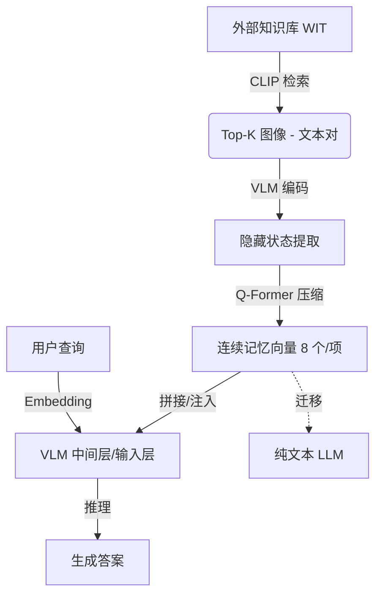

# 迈向视觉语言模型的通用连续记忆

## 一、论文基础元数据
- 原文标题：Towards General Continuous Memory for Vision-Language Models
- 中文译版：迈向视觉语言模型的通用连续记忆
- 发表渠道：预印本（arXiv）
- 发表时间：2025 年
- 链接：arXiv:2505.17670
- 作者及核心机构：Wenyi Wu, Zixuan Song, Kun Zhou, Yifei Shao, Zhiting Hu, Biwei Huang（待补充具体机构）
- 研究领域：人工智能 + 多模态学习/视觉语言模型
- 关联数据集：InfoSeek, OK-VQA, A-OKVQA, ViQuAE, CVQA, WIT 知识库（规模/标注待补充）

## 二、论文综合评价
### 2.1 量化评分（1-5 分，5 分为最优）

| 评价维度 | 评分 | 备注 |
| -------- | ---- | ---- |
| 📚 理论基础 | ⭐⭐⭐⭐ | 连续记忆理论扎实，对齐机制清晰 |
| 🎯 问题核心性 | ⭐⭐⭐⭐⭐ | 直击 VLM 上下文限制与知识利用痛点 |
| 💡 方法创新性 | ⭐⭐⭐⭐⭐ | 提出 VLM 自编码连续记忆，范式新颖 |
| ⚙️ 技术壁垒 | ⭐⭐⭐⭐ | 压缩与注入机制实现有一定技术门槛 |
| 🧪 实验严谨性 | ⭐⭐⭐⭐⭐ | 8 个基准测试，涵盖多模态与多语言 |
| 🔧 落地可行性 | ⭐⭐⭐⭐⭐ | 即插即用，参数微调少，工程友好 |
| 🚀 应用前景 | ⭐⭐⭐⭐⭐ | 适用于长上下文、跨模态知识增强场景 |
| 📊 综合评分 | 4.7 | 创新性与实用性兼备，多模态记忆新范式 |

### 2.2 定性综合评价（≤300 字）
> 核心概括：研究定位、核心价值、差异化优势、关键结论

本研究定位为视觉语言模型（VLM）的外部知识增强方案。核心价值在于提出通用连续记忆（CoMEM）机制，利用 VLM 自身作为编码器，将多模态知识压缩为稠密向量。差异化优势体现在极高的压缩率（8 个向量/知识项）、即插即用特性及跨模态迁移能力（VLM 至 LLM）。关键结论表明，该方法在 8 个基准上优于传统 RAG，且仅需微调 1.2% 参数，证明了连续记忆在处理高密度信息时的效率与鲁棒性，为构建具有长期记忆的模型提供了新路径。

## 三、领域本体论映射
| 核心维度 | 具体内容 |
| -------- | -------- |
| 核心研究对象 | 视觉语言模型（VLM）的外部知识记忆机制 |
| 核心技术路径 | 连续嵌入编码、注意力压缩、中间层注入 |
| 数据/载体形态 | 多模态知识项（图像 - 文本对）压缩为连续向量 |
| 核心功能目标 | 突破上下文窗口限制，提升复杂推理与知识检索能力 |
| 验证核心指标 | 准确率（Accuracy）、压缩率、训练参数比例、推理稳定性 |

## 四、核心问题与解决方案
### 4.1 待解决的核心问题
1. **领域级根本问题**：VLM 在处理需要大量外部多模态知识的复杂推理任务时，受限于上下文窗口长度。
2. **现有方法痛点**：传统 RAG 基于离散 Token 拼接，导致上下文过长、效率低且性能随知识量增加而下降。
3. **工程落地卡点**：现有记忆机制微调成本高，难以兼顾压缩率与知识保留，且缺乏跨模态迁移能力。

### 4.2 核心解决方案
- 理论框架：VLM-as-Memory（VLM 即记忆编码器），利用内部隐藏状态作为记忆载体。
- 核心架构：检索 -> 编码（VLM）-> 压缩（Q-Former）-> 注入（中间层拼接）。
- 关键技术：连续嵌入压缩（8 个向量/项）、参数高效微调（LoRA + Q-Former）。
- 创新机制：即插即用式记忆注入，支持跨模型（VLM 到 LLM）知识迁移。

### 4.3 核心优势（量化+定性）
1. 性能优势：在 8 个基准上优于基线，OK-VQA 等任务提升超 15%，长上下文下性能稳定。
2. 效率优势：知识压缩率超 80 倍，仅需微调 1.2% 参数，单卡训练 20 小时收敛。
3. 工程优势：无需修改模型架构，推理时参数冻结，支持跨模态赋能纯文本 LLM。

## 五、方法与技术架构
### 5.1 核心架构设计
> 文字描述 + 架构图（Mermaid/图片）

CoMEM 架构分为记忆编码与记忆注入两阶段。首先基于 CLIP 检索相关多模态知识项，利用 VLM 提取隐藏状态并通过 Q-Former 压缩为连续向量。推理时，将压缩后的向量序列直接拼接到输入嵌入前或注入特定中间层，无需更新 VLM 主体参数。

### 5.2 关键技术实现细节
| 技术模块 | 实现路径 | 工程注意事项 |
| -------- | -------- | ------------ |
| 记忆编码 | VLM 提取多层隐藏状态，Q-Former 压缩 | 确保压缩向量与 VLM 内部表示对齐 |
| 记忆注入 | 向量序列 Prepend 到输入嵌入或注入 17-19 层 | 注意维度匹配，避免破坏原有注意力分布 |
| 参数微调 | 仅微调 Q-Former 和 VLM 中 LoRA 层 | 冻结主体参数，降低显存占用 |
| 依赖组件 | CLIP 检索器，Qwen2-VL/2.5-VL  backbone | 需预训练好的 VLM 作为基座 |

### 5.3 架构优缺点
- 优点：高压缩率保留关键信息，即插即用无需重训，支持跨模态迁移。
- 缺点：依赖检索质量，动态实时数据（如视频）下的表现尚未验证。

## 六、实验设计与结果分析
### 6.1 实验基础设置
| 维度 | 内容 |
| ---- | ---- |
| 数据集 | InfoSeek, OK-VQA, A-OKVQA, CVQA 等 8 个基准 |
| 基线方法 | 原生 VLM, Vanilla RAG, Wiki-LLaVA, ReflectiVA 等 |
| 实验环境 | NVIDIA H100 GPU, Qwen2-VL-7B/2.5-VL-7B |
| 评价指标 | 准确率（Accuracy），上下文长度，训练参数量 |

### 6.2 核心实验结果
| 方法 | 核心指标 1 (OK-VQA) | 核心指标 2 (LLM 迁移) | 工程指标（算力/耗时） |
| ---- | --------- | --------- | -------------------- |
| 基线 1 (Vanilla RAG) | 性能随上下文增加下降 | 7.0% (LLM+RAG) | 高上下文消耗 |
| 基线 2 (ReflectiVA) | 28.4 (平均得分) | 待补充 | 待补充 |
| 本文方法 (CoMEM) | 提升超 15% (相对基线) | 17.8% (LLM+CoMEM) | 单卡 20 小时，1.2% 参数 |

### 6.3 消融实验/鲁棒性分析
| 实验变体 | 指标变化 | 核心结论 |
| -------- | -------- | -------- |
| 压缩率变化 (5%-100%) | 高压缩下性能仍优 | 连续嵌入封装核心信息能力强 |
| 检索对数增加 (3-50 对) | 性能保持稳定 | 优于传统 RAG 的长上下文衰退 |
| 跨模型迁移 (VLM->LLM) | 准确率 3.1%->17.8% | 记忆向量具备跨模态语义通用性 |

### 6.4 实验结论（工程视角）
CoMEM 在工程上极具价值，以极低的训练成本（1.2% 参数）实现了显著的性能增益。特别是在长上下文场景下，其稳定性优于传统 RAG，适合部署在资源受限但需知识增强的边缘或云端场景。跨模型迁移能力进一步降低了纯文本 LLM 获取视觉知识的门槛。

## 七、领域贡献与创新点
| 贡献层级 | 具体内容 |
| -------- | -------- |
| 理论贡献 | 验证了 VLM 内部隐藏状态作为通用记忆载体的可行性 |
| 方法/架构贡献 | 提出 CoMEM 连续记忆机制，实现高压缩率知识注入 |
| 数据/工具贡献 | 自合成 15.6K 高质量多模态训练样本（含多语言） |
| 实验/验证贡献 | 在 8 个多模态/多语言基准上验证了方法的有效性与泛化性 |
| 工程落地贡献 | 提供了即插即用、低参数微调的记忆增强解决方案 |

## 八、局限性与风险
| 维度 | 具体描述 | 应对思路 |
| ---- | -------- | -------- |
| 学术局限性 | 评估基准多为静态合成数据，缺乏动态噪声验证 | 未来引入实时视频流或 Web 动态数据测试 |
| 工程落地风险 | 检索模块依赖外部知识库质量，可能引入噪声 | 优化检索排序算法，增加噪声过滤机制 |
| 伦理/合规风险 | 知识库可能包含偏见信息，通过记忆注入传播 | 建立知识库审核机制，增加对齐过滤层 |

## 九、未来研究/落地方向
| 方向类型 | 具体内容 | 优先级 |
| -------- | -------- | ------ |
| 科研拓展 | 探索多智能体协作下的跨模型知识共享与传递 | 中 |
| 工程优化 | 适配动态实时数据流（如视频监控、直播流） | 高 |
| 跨领域适配 | 迁移至医疗、法律等垂直领域的专业知识库增强 | 高 |

## 十、关键词与术语表
| 语言 | 关键词 |
| ---- | ------ |
| 中文 | 连续记忆，视觉语言模型，检索增强生成，参数高效微调，跨模态迁移 |
| 英文 | Continuous Memory, VLM, RAG, PEFT, Cross-modal Transfer |
| 领域专属术语 | CoMEM：通用连续记忆机制；VLM-as-Memory：利用 VLM 自身编码记忆 |

## 十一、参考文献与关联资源
- 核心参考文献：Wiki-LLaVA, RORA-VLM, ReflectiVA, EchoSight, FastV
- 补充阅读：CLIP, Q-Former, LoRA 相关原始论文
- 开源代码/工具：待补充（通常随 arXiv 版本更新发布）

## 十二、阅读者批注
1. **科研启发**：连续向量作为记忆载体可能成为替代 Token 序列的新标准，尤其在多模态领域。
2. **工程落地思考**：即插即用特性非常适合现有大模型服务的快速升级，无需重新训练大模型。
3. **待验证/存疑点**：在极端长上下文（如数百个知识项）下的显存占用与推理延迟具体表现。
4. **个人/团队应用场景**：可应用于构建企业级多模态知识库助手，降低推理成本。

## 十三、阅读元信息
| 维度 | 内容 |
| ---- | ---- |
| 阅读日期 | 2026-04-08 09:49 |
| 阅读人 | xPaperReader AI |
| 文档编号 | arxiv-2505.17670 |
| 版本迭代 | v1.0 |