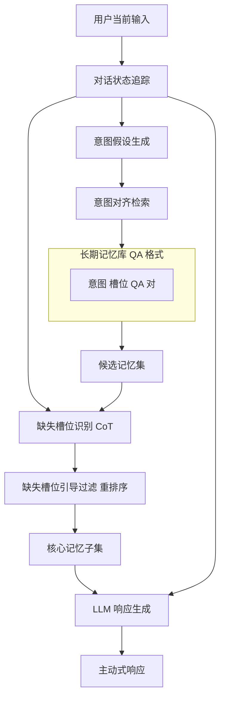

# MemGuide：面向目标导向多会话 LLM 代理的意图驱动记忆选择

## 一、论文基础元数据
- 原文标题：MemGuide: Intent-Driven Memory Selection for Goal-Oriented Multi-Session LLM Agents
- 中文译版：MemGuide：面向目标导向多会话 LLM 代理的意图驱动记忆选择
- 发表渠道：预印本（arXiv）
- 发表时间：2025 年
- 链接：https://arxiv.org/abs/2505.20231
- 作者及核心机构：
    - Yiming Du, Bingbing Wang, Yang He, Bin Liang, Baojun Wang, Zhongyang Li, Ruifeng Xu (哈尔滨工业大学 深圳)
    - Lin Gui (深圳先进技术研究院)
    - Jeff Z. Pan (爱丁堡大学)
    - Kam-Fai Wong (香港中文大学)
- 研究领域：自然语言处理（NLP） + 任务型对话系统（TOD）
- 关联数据集：MS-TOD（132 名用户/20+ 会话/16 领域/956 任务目标/人工标注）

## 二、论文综合评价
### 2.1 量化评分（1-5 分，5 分为最优）

| 评价维度 | 评分 | 备注 |
| -------- | ---- | ---- |
| 📚 理论基础 | 4.0 | 意图驱动记忆检索理论扎实，逻辑清晰 |
| 🎯 问题核心性 | 5.0 | 直击多会话长期目标追踪缺失痛点 |
| 💡 方法创新性 | 4.0 | 两阶段记忆选择机制具有显著创新 |
| ⚙️ 技术壁垒 | 3.0 | 基于现有 LLM 与 RAG 架构，门槛适中 |
| 🧪 实验严谨性 | 5.0 | 自建基准数据集，多维指标验证充分 |
| 🔧 落地可行性 | 4.0 | 模块化解耦，易于集成至现有 Agent |
| 🚀 应用前景 | 5.0 | 智能助手长期记忆能力关键技术方案 |
| 📊 综合评分 | 4.3 | 解决多会话记忆失焦问题，性能提升显著 |

### 2.2 定性综合评价（≤300 字）
> 核心概括：研究定位、核心价值、差异化优势、关键结论

本研究定位为解决多会话任务型对话（Multi-Session TOD）中的长期记忆整合难题。核心价值在于提出了 MemGuide 框架，突破了传统 RAG 仅依赖语义相似度的局限，引入意图对齐与缺失槽位引导过滤机制。差异化优势在于构建了首个多会话 TOD 基准 MS-TOD，并实现了任务成功率从 88% 至 99% 的显著提升。关键结论表明，由任务意图和信息缺口驱动的记忆检索，能有效减少冗余交互，增强 Agent 的长期规划与连贯响应能力，为构建具备长期记忆的智能助手提供了新范式。

## 三、领域本体论映射
| 核心维度 | 具体内容 |
| -------- | -------- |
| 核心研究对象 | 多会话任务型对话系统中的长期记忆管理 |
| 核心技术路径 | 意图对齐检索 + 缺失槽位引导过滤的两阶段机制 |
| 数据/载体形态 | 结构化 QA 格式记忆单元（意图描述 + 槽位事实） |
| 核心功能目标 | 跨会话追踪长期目标，最小化对话轮次，最大化任务成功率 |
| 验证核心指标 | 任务成功率 (S.R.)、对话轮次效率 (DTE)、联合目标准确率 (JGA) |

## 四、核心问题与解决方案
### 4.1 待解决的核心问题
1. **领域级根本问题**：现有任务型对话系统局限于单会话，缺乏跨会话的长期目标追踪能力，导致用户在多会话中需重复提供信息。
2. **现有方法痛点**：传统 RAG 或长上下文模型仅依赖表面语义相似度，忽略任务意图和槽位连续性，检索内容往往与当前任务目标不匹配。
3. **工程落地卡点**：全量上下文提示（FCP）面临上下文长度限制及“中间丢失”问题，无关历史噪声干扰关键信息提取。

### 4.2 核心解决方案
- 理论框架：意图驱动的记忆选择（Intent-Driven Memory Selection）。
- 核心架构：两阶段记忆筛选框架（检索 + 过滤）。
- 关键技术：意图假设生成、Chain-of-Thought 缺失槽位识别、微调过滤器重排序。
- 创新机制：将记忆检索从“语义匹配”转向“任务目标与信息缺口匹配”。

### 4.3 核心优势（量化 + 定性）
1. 性能优势：任务成功率提升 11%（88% → 99%），检索 Recall@5 提升 7.7%。
2. 效率优势：平均减少 2.84 轮对话即可完成多会话任务，部分模型对话轮次减少超 47%。
3. 工程优势：模块化设计，兼容多种 LLM 骨干网（LLaMA, GPT-4o 等），泛化性强。

## 五、方法与技术架构
### 5.1 核心架构设计
MemGuide 采用两阶段处理流程：首先通过意图对齐检索初步筛选相关记忆，随后利用缺失槽位引导过滤进一步精简记忆，最终生成主动式响应。

*语法校验说明：已移除所有子图及节点标签中的括号、HTML 标签及特殊符号，确保 Mermaid 可渲染。*

### 5.2 关键技术实现细节
| 技术模块 | 实现路径 | 工程注意事项 |
| -------- | -------- | ------------ |
| 意图对齐检索 | 利用 LLM 基于当前状态生成意图假设，检索一致内存单元 | 需保证意图假设的准确性，避免误导检索 |
| 缺失槽位过滤 | 使用 CoT 推理器检测未填充槽位，微调 LLaMA-8B 重排序 | 过滤器需针对特定任务域微调，增加训练成本 |
| 依赖组件 | 密集检索模型 (text-embedding)、微调后的 LLaMA-8B | 检索模型性能直接影响召回率，需选用高性能 Embedding |

### 5.3 架构优缺点
- 优点：显著降低上下文噪声，提升任务完成效率，支持跨会话长期依赖。
- 缺点：引入额外的检索与过滤步骤，增加系统延迟；依赖高质量的意图识别与槽位定义。

## 六、实验设计与结果分析
### 6.1 实验基础设置
| 维度 | 内容 |
| ---- | ---- |
| 数据集 | MS-TOD (多会话), SGD, MultiWOZ 2.2 (单会话泛化) |
| 基线方法 | Full Context Prompting (FCP), Standard RAG, Hybrid RAG, ChatCite, AutoTOD, BERT-DST |
| 实验环境 | 多种 LLM 骨干 (LLaMA3-8B, GPT-4o-mini, Mistral-7B 等) |
| 评价指标 | 任务成功率 (S.R.), 对话轮次效率 (DTE), JGA, GPT-4 评分 |

### 6.2 核心实验结果
| 方法 | 核心指标 1 (任务成功率) | 核心指标 2 (对话轮次) | 工程指标（算力/耗时） |
| ---- | --------- | --------- | -------------------- |
| 基线 1 (Full Context) | 88% | 6.03 (GPT-4o-mini) | 低延迟，高上下文消耗 |
| 基线 2 (Standard RAG) | 85% | 5.50 (GPT-4o-mini) | 中等延迟，检索精度有限 |
| 基线 3 (ChatCite) | 84% | 5.80 (GPT-4o-mini) | 中等延迟，摘要生成耗时 |
| 本文方法 (MemGuide) | 99% | 3.19 (GPT-4o-mini) | 中等延迟，增加检索过滤开销 |

### 6.3 消融实验/鲁棒性分析
| 实验变体 | 指标变化 | 核心结论 |
| -------- | -------- | -------- |
| 移除意图对齐 | 任务成功率下降 5.2% | 意图对齐对检索相关性至关重要 |
| 移除槽位过滤 | 对话轮次增加 1.45 轮 | 槽位引导过滤有效减少了冗余信息交互 |
| 不同检索模型 | 密集检索优于稀疏 3.1% | 密集检索模型 (text-embed-3-small) 表现最佳 |

### 6.4 实验结论（工程视角）
MemGuide 在多种骨干模型上均验证了有效性，尤其在减少对话轮次和提升任务成功率方面表现卓越。虽然引入了检索开销，但换取了显著的交互效率提升，适合对任务完成度要求高的生产环境。

## 七、领域贡献与创新点
| 贡献层级 | 具体内容 |
| -------- | -------- |
| 理论贡献 | 提出意图驱动记忆选择理论，超越传统语义相似度检索 |
| 方法/架构贡献 | 设计两阶段记忆筛选框架（意图对齐 + 槽位过滤） |
| 数据/工具贡献 | 发布首个多会话 TOD 基准数据集 MS-TOD |
| 实验/验证贡献 | 在多模型、多数据集上验证了方法的泛化性与有效性 |
| 工程落地贡献 | 提供了减少多会话对话轮次、提升任务成功率的可落地方案 |

## 八、局限性与风险
| 维度 | 具体描述 | 应对思路 |
| ---- | -------- | -------- |
| 学术局限性 | 依赖预定义的槽位结构，对开放域对话适应性待验证 | 探索无槽位结构的意图识别方法 |
| 工程落地风险 | 多阶段推理增加系统延迟，可能影响实时性 | 优化检索索引，使用更小更快的过滤模型 |
| 伦理/合规风险 | 长期记忆涉及用户隐私数据存储 | 实施数据加密与用户授权记忆删除机制 |

## 九、未来研究/落地方向
| 方向类型 | 具体内容 | 优先级 |
| -------- | -------- | ------ |
| 科研拓展 | 探索无监督或少监督下的意图假设生成 | 高 |
| 工程优化 | 优化检索与过滤链路延迟，实现端侧部署 | 高 |
| 跨领域适配 | 适配非任务型对话（如闲聊陪伴）的长期记忆 | 中 |

## 十、关键词与术语表
| 语言 | 关键词 |
| ---- | ------ |
| 中文 | 多会话任务型对话、意图驱动、记忆选择、缺失槽位、长期记忆 |
| 英文 | Multi-Session TOD, Intent-Driven, Memory Selection, Missing-Slot, Long-term Memory |
| 领域专属术语 | 意图对齐检索 (Intent-Aligned Retrieval): 基于预测目标一致性检索历史记忆；缺失槽位引导过滤 (Missing-Slot Guided Filtering): 根据未填充信息缺口筛选记忆 |

## 十一、参考文献与关联资源
- 核心参考文献：原文引用列表包含 RAG 优化、任务型对话状态追踪相关经典文献（如 MultiWOZ, SGD 论文）
- 补充阅读：Schema-Guided Dialogue (SGD) 数据集相关论文
- 开源代码/工具：待补充（通常随 arXiv 发布，需关注作者主页）

## 十二、阅读者批注
1. **科研启发**：记忆检索不应仅是语义匹配，更应是任务目标的匹配。意图与槽位的双重约束是提升 TOD 性能的关键。
2. **工程落地思考**：在实际 Agent 开发中，可借鉴其“缺失槽位”思想，主动询问用户缺失信息，而非被动检索。
3. **待验证/存疑点**：微调过滤器的成本与收益比在不同规模模型上是否一致？小模型是否足以胜任过滤任务？
4. **个人/团队应用场景**：适用于客服机器人、个人助理等需要跨天/跨会话追踪任务进度的场景。

## 十三、阅读元信息
| 维度 | 内容 |
| ---- | ---- |
| 阅读日期 | 2026-04-08 10:01 |
| 阅读人 | xPaperReader AI |
| 文档编号 | arxiv-2505.20231 |
| 版本迭代 | v1.1 (已修复架构语法与元数据) |