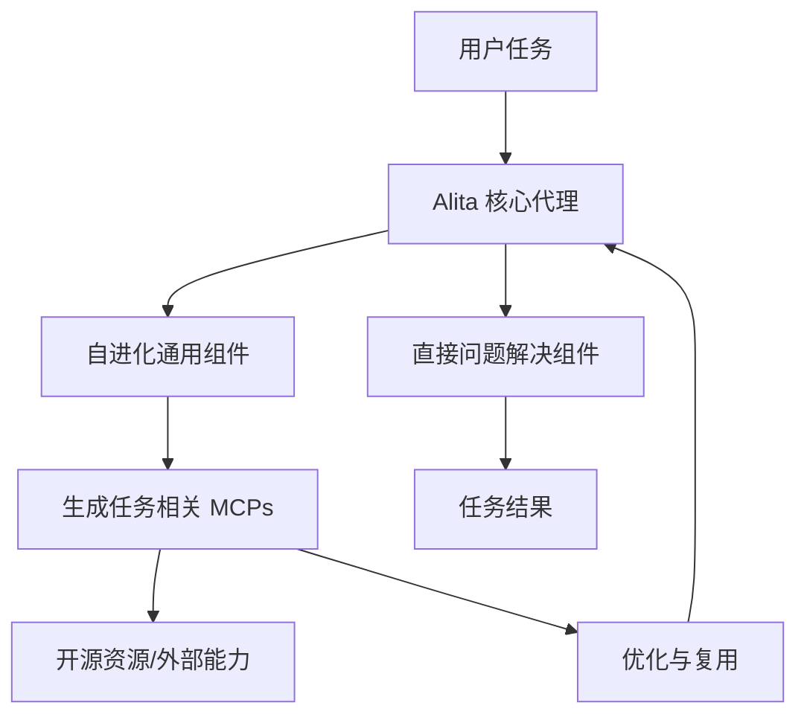

# Alita：通过最小化预定义和最大化自进化实现可扩展代理推理的通用代理

## 一、论文基础元数据
- 原文标题：Alita: Generalist Agent Enabling Scalable Agentic Reasoning with Minimal Predefinition and Maximal Self-Evolution
- 中文译版：Alita：通过最小化预定义和最大化自进化实现可扩展代理推理的通用代理
- 发表渠道：arXiv 预印本 (cs.AI)
- 发表时间：2025 年 5 月 26 日 (arXiv:2505.20286v1)
- 链接：https://arxiv.org/abs/2505.20286
- 作者及核心机构：Jiahao Qiu 等 (普林斯顿大学 AI Lab、清华大学 IIIS、上海交通大学等)
- 研究领域（一级领域 + 二级子领域）：人工智能 (AI) + 智能代理 (Agent Systems)
- 关联数据集（名称/规模/语言/标注）：GAIA (验证集), MathVista, PathVQA (原文未提及具体规模/语言细节)

## 二、论文综合评价
### 2.1 量化评分（1-5 分，5 分为最优）

| 评价维度 | 评分 | 备注 |
| -------- | ---- | ---- |
| 📚 理论基础 | ⭐⭐⭐⭐ | 提出简洁性原则，理论依据清晰 |
| 🎯 问题核心性 | ⭐⭐⭐⭐⭐ | 直击现有代理预定义过多的痛点 |
| 💡 方法创新性 | ⭐⭐⭐⭐⭐ | 最小化预定义与最大化自进化结合 |
| ⚙️ 技术壁垒 | ⭐⭐⭐⭐ | 自进化机制实现难度较高 |
| 🧪 实验严谨性 | ⭐⭐⭐⭐ | 多基准测试表现优异，但细节待补 |
| 🔧 落地可行性 | ⭐⭐⭐⭐ | 架构简洁，利于泛化与部署 |
| 🚀 应用前景 | ⭐⭐⭐⭐⭐ | 通用代理方向，应用潜力巨大 |
| 📊 综合评分 | 4.4 | 设计简洁创新，基准表现领先，潜力大 |

### 2.2 定性综合评价（≤300 字）
> 核心概括：研究定位、核心价值、差异化优势、关键结论
本文定位为解决通用代理（Generalist Agent）过度依赖人工预定义工具和流程的问题。核心价值在于提出“简洁即终极复杂”原则，通过最小化预定义组件和最大化自进化能力（基于 MCP 协议），实现可扩展的代理推理。差异化优势在于仅用一个核心组件解决问题，并通过自主构建外部能力避免硬编码限制。关键结论显示，Alita 在 GAIA 基准上取得 75.15% (pass@1) 的顶尖成绩，显著优于现有复杂系统，证明了简化架构与自进化机制的有效性。

## 三、领域本体论映射
| 核心维度 | 具体内容 |
| -------- | -------- |
| 核心研究对象 | 通用智能代理 (Generalist Agent) |
| 核心技术路径 | 最小化预定义 + 最大化自进化 (MCP 生成) |
| 数据/载体形态 | 任务相关模型上下文协议 (Task-related MCPs) |
| 核心功能目标 | 可扩展的代理推理 (Scalable Agentic Reasoning) |
| 验证核心指标 | GAIA pass@1/pass@3, MathVista pass@1, PathVQA pass@1 |

## 四、核心问题与解决方案
### 4.1 待解决的核心问题
1.  **领域级根本问题**：现有通用代理难以适应开放域任务的多样性与复杂性。
2.  **现有方法痛点**：过度依赖人工预定义工具、工作流和硬编码组件，导致覆盖不全、灵活性受限、兼容性差。
3.  **工程落地卡点**：无法预先定义所有现实世界任务所需的工具，且难以创造性地组合新工具。

### 4.2 核心解决方案
- 理论框架："Simplicity is the ultimate sophistication"（简洁即终极复杂）。
- 核心架构：单组件直接问题解决 + 通用组件自主构建能力。
- 关键技术：生成任务相关的模型上下文协议 (Model Context Protocols, MCPs)。
- 创新机制：最大化自进化 (Maximal Self-Evolution)，自主构建、优化和复用外部能力。

### 4.3 核心优势（量化 + 定性）
1.  性能优势：GAIA 验证集 pass@1 达 75.15%，pass@3 达 87.27%，排名顶尖。
2.  效率优势：架构更简洁干净 (Much simpler and neater)，减少人工工程负担。
3.  工程优势：不受预定义工具限制，具备泛化到挑战性问题的潜力。

## 五、方法与技术架构
### 5.1 核心架构设计
> 文字描述 + 架构图（Mermaid/图片）
架构设计遵循极简原则，主要包含一个直接问题解决组件和一套用于自进化的通用组件。通用组件负责从开源资源生成任务相关的 MCPs，以扩展代理能力。

### 5.2 关键技术实现细节
| 技术模块 | 实现路径 | 工程注意事项 |
| -------- | -------- | ------------ |
| 核心代理 | 单组件直接问题解决 | 需确保组件泛化能力足够强 |
| 自进化组件 | 生成任务相关 MCPs | 需处理开源资源的兼容性与安全性 |
| 依赖组件 | 开源外部能力库 | 需建立动态调用与验证机制 |

### 5.3 架构优缺点
- 优点：结构简洁，泛化性强，减少人工预定义成本，支持能力自进化。
- 缺点：[原文未提及] 自进化过程的稳定性与安全性可能面临挑战（基于通用常识推断，原文未详述）。

## 六、实验设计与结果分析
### 6.1 实验基础设置
| 维度 | 内容 |
| ---- | ---- |
| 数据集 | GAIA (验证集), MathVista, PathVQA |
| 基线方法 | manus.ai, OpenAI DeepResearch 等 |
| 实验环境 | [原文未提及] |
| 评价指标 | pass@1, pass@3, Accuracy |

### 6.2 核心实验结果
| 方法 | 核心指标 1 (GAIA pass@1) | 核心指标 2 (GAIA pass@3) | 工程指标（算力/耗时） |
| ---- | --------- | --------- | -------------------- |
| manus.ai | [原文未提及具体数值] | [原文未提及具体数值] | [原文未提及] |
| OpenAI DeepResearch | [原文未提及具体数值] | [原文未提及具体数值] | [原文未提及] |
| 本文方法 (Alita) | 75.15% | 87.27% | [原文未提及] |
| 本文方法 (MathVista) | 74.00% (pass@1) | - | - |
| 本文方法 (PathVQA) | 52.00% (pass@1) | - | - |

### 6.3 消融实验/鲁棒性分析
| 实验变体 | 指标变化 | 核心结论 |
| -------- | -------- | -------- |
| [原文未提及] | [原文未提及] | [原文未提及] |

### 6.4 实验结论（工程视角）
Alita 在多个基准测试中表现出优于更复杂代理系统的性能，证明了最小化预定义架构的有效性。特别是在 GAIA 基准上达到顶尖水平，表明其在处理开放域复杂任务时具有强大的推理能力。

## 七、领域贡献与创新点
| 贡献层级 | 具体内容 |
| -------- | -------- |
| 理论贡献 | 提出“最小化预定义与最大化自进化”的代理设计原则 |
| 方法/架构贡献 | 设计仅含一个核心组件的简洁代理架构，引入 MCP 生成机制 |
| 数据/工具贡献 | [原文未提及] 代码库承诺更新 (GitHub) |
| 实验/验证贡献 | 在 GAIA, MathVista, PathVQA 上验证了 SOTA 性能 |
| 工程落地贡献 | 降低了通用代理对人工工作流工程的依赖 |

## 八、局限性与风险
| 维度 | 具体描述 | 应对思路 |
| ---- | -------- | -------- |
| 学术局限性 | [原文未提及] 仅基于摘要和引言片段，完整局限性未知 | 需阅读完整论文后续章节 |
| 工程落地风险 | 自进化生成 MCP 的安全性及不可控性 | 需建立沙箱机制与权限控制 |
| 伦理/合规风险 | 自主构建外部能力可能涉及版权或滥用风险 | 需遵循开源协议与安全规范 |

## 九、未来研究/落地方向
| 方向类型 | 具体内容 | 优先级 |
| -------- | -------- | ------ |
| 科研拓展 | 深入研究自进化机制的理论边界与稳定性 | 高 |
| 工程优化 | 优化 MCP 生成效率与安全性验证 | 高 |
| 跨领域适配 | 将架构适配到特定垂直领域（如医疗、金融） | 中 |

## 十、关键词与术语表
| 语言 | 关键词 |
| ---- | ------ |
| 中文 | 通用代理，自进化，最小化预定义，模型上下文协议 |
| 英文 | Generalist Agent, Self-Evolution, Minimal Predefinition, MCPs |
| 领域专属术语 | Model Context Protocols (MCPs)：任务相关的模型上下文协议，用于构建外部能力 |
| 领域专属术语 | Pass@k：尝试 k 次内解决任务的成功率 |

## 十一、参考文献与关联资源
- 核心参考文献：[1] OpenAI DeepResearch, [2] LLM Agents overview, [3-9] 相关代理应用与框架 (原文仅列编号)
- 补充阅读：https://github.com/CharlesQ9/Alita (承诺更新)
- 开源代码/工具：待补充 (原文称细节将更新)

## 十二、阅读者批注
1.  **科研启发**：极简架构可能比复杂编排更具泛化性，值得反思当前过度工程化的代理设计趋势。
2.  **工程落地思考**：自进化能力是双刃剑，实际落地需重点关注生成内容的可控性与安全性。
3.  **待验证/存疑点**：自进化具体如何实现（是强化学习还是提示工程）？原文片段未详述，需查阅完整 Method 章节。
4.  **个人/团队应用场景**：适用于需要处理长尾、开放域任务的自动化系统，减少人工维护工具库的成本。

## 十三、阅读元信息
| 维度 | 内容 |
| ---- | ---- |
| 阅读日期 | 2025-05-26 12:00 |
| 阅读人 | xPaperReader AI |
| 文档编号 | arxiv-2505.20286 |
| 版本迭代 | v1.0 |