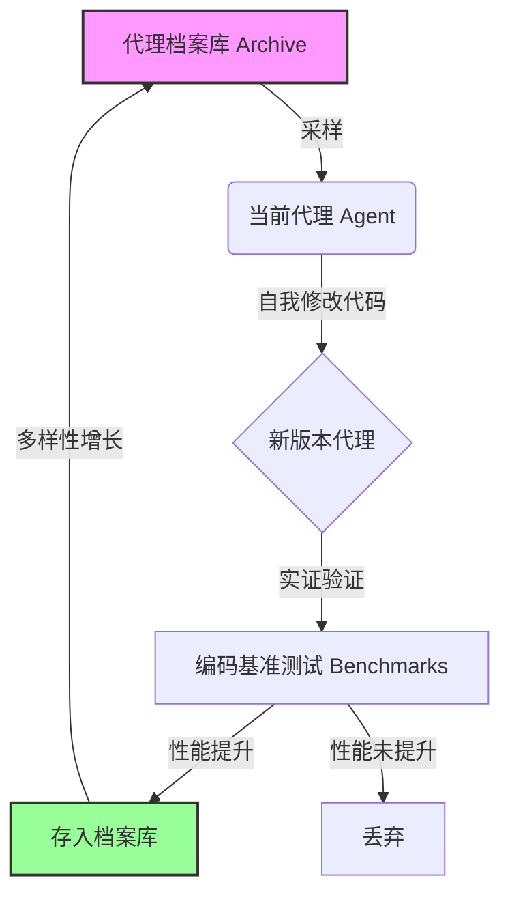

# 达尔文哥德尔机：自我改进代理的开放式进化

## 一、论文基础元数据
- 原文标题：Darwin Gödel Machine: Open-Ended Evolution of Self-Improving Agents
- 中文译版：达尔文哥德尔机：自我改进代理的开放式进化
- 发表渠道：ICLR 2026 (Conference Paper)
- 发表时间：2026 年 3 月 (arXiv v3 显示)
- 链接：arXiv:2505.22954
- 作者及核心机构：Jenny Zhang, Shengran Hu, Cong Lu (UBC, Vector Institute); Robert Lange (Sakana AI); Jeff Clune (UBC, CIFAR AI Chair)
- 研究领域：人工智能 (一级) + 自我改进系统/元学习 (二级)
- 关联数据集：SWE-bench, Polyglot (原文提及，具体规模待补充)

## 二、论文综合评价
### 2.1 量化评分（1-5 分，5 分为最优）

| 评价维度 | 评分 | 备注 |
| -------- | ---- | ---- |
| 📚 理论基础 | ⭐⭐⭐⭐⭐ | 结合哥德尔机理论与达尔文进化论，理论根基深厚 |
| 🎯 问题核心性 | ⭐⭐⭐⭐⭐ | 直击 AI 无法自主持续改进的根本痛点，核心性强 |
| 💡 方法创新性 | ⭐⭐⭐⭐⭐ | 提出开放式进化档案库机制，突破传统元学习限制 |
| ⚙️ 技术壁垒 | ⭐⭐⭐⭐ | 涉及代码自修改与安全沙箱，工程实现难度较高 |
| 🧪 实验严谨性 | ⭐⭐⭐ | 基于片段仅见摘要数据，全文实验细节原文未提及 |
| 🔧 落地可行性 | ⭐⭐⭐⭐ | 已开源代码且有安全预防措施，具备落地潜力 |
| 🚀 应用前景 | ⭐⭐⭐⭐⭐ | 自动化 AI 研发前景广阔，有望加速科学发现 |
| 📊 综合评分 | 4.3 | 理论创新极强，但基于片段无法完全验证实验细节 |

### 2.2 定性综合评价（≤300 字）
> 核心概括：研究定位、核心价值、差异化优势、关键结论

本研究定位为解决 AI 系统受限于固定架构、无法自主持续改进的根本问题。核心价值在于提出了“达尔文哥德尔机”（DGM），结合了哥德尔机的自我修改理论与达尔文进化论的开放式探索机制。差异化优势在于通过维护一个不断增长的代理档案库，并行探索多种改进路径，而非单一优化。关键结论显示，DGM 能自动提升编码能力（如代码编辑工具、上下文管理），在 SWE-bench 上性能从 20.0% 提升至 50.0%，显著优于无自我改进的基线。研究强调了安全预防措施（沙箱、人工监督），为自我改进 AI 的安全发展提供了实证步骤。

## 三、领域本体论映射
| 核心维度 | 具体内容 |
| -------- | -------- |
| 核心研究对象 | 自我改进的代码代理（Self-Improving Coding Agents） |
| 核心技术路径 | 开放式进化（Open-Ended Evolution）+ 代码自修改（Self-Modification） |
| 数据/载体形态 | 代码库、编程基准测试数据（SWE-bench, Polyglot） |
| 核心功能目标 | 自主修改源代码以持续提升解决问题的能力 |
| 验证核心指标 | 基准测试通过率（SWE-bench, Polyglot Performance） |

## 四、核心问题与解决方案
### 4.1 待解决的核心问题
1. **领域级根本问题**：当前 AI 系统受限于人类设计的固定架构，无法自主连续改进，阻碍了 AI 发展的累积性。
2. **现有方法痛点**：元学习（Meta-learning）受限于一阶改进和人类设计的搜索空间；传统哥德尔机难以在实践中证明修改的有益性。
3. **工程落地卡点**：如何在保证安全的前提下，实现代码的自动修改与验证，避免无限递归或有害修改。

### 4.2 核心解决方案
- 理论框架：结合达尔文进化论（开放式探索）与哥德尔机（自我修改理论）。
- 核心架构：维护一个生成的编码代理档案库（Archive），从中采样代理进行自我修改。
- 关键技术：实证验证每个更改（使用编码基准测试），并行探索搜索空间中的不同路径。
- 创新机制：开放式探索形成多样化的高质量代理树，代理不仅能解决问题，还能改进自身修改代码的能力。

### 4.3 核心优势（量化 + 定性）
1. 性能优势：SWE-bench 性能从 20.0% 提升至 50.0%；Polyglot 从 14.2% 提升至 30.7%。
2. 效率优势：允许并行探索多条搜索路径，避免陷入局部最优。
3. 工程优势：包含安全预防措施（沙箱、人工监督），代码已开源，具备可复现性。

## 五、方法与技术架构
### 5.1 核心架构设计
> 文字描述 + 架构图（Mermaid/图片）

DGM 核心流程为一个循环进化系统：从档案库采样代理 -> 代理自我修改代码 -> 在基准测试上验证修改 -> 若有效则存入档案库。此过程不断迭代，形成代理进化树。

### 5.2 关键技术实现细节
| 技术模块 | 实现路径 | 工程注意事项 |
| -------- | -------- | ------------ |
| 档案库管理 | 存储多样化的高质量代理版本，支持采样 | 需防止档案库冗余，保持多样性 |
| 自我修改机制 | 代理编写代码修改自身代码库 | 需确保语法正确性及逻辑一致性 |
| 验证沙箱 | 在隔离环境中运行基准测试 | 必须严格限制权限，防止恶意代码执行 |
| 安全监督 | 人工 oversight 与自动沙箱结合 | 需定义明确的停止条件与安全边界 |

### 5.3 架构优缺点
- 优点：支持开放式进化，不局限于预定义搜索空间；并行探索能力强；实证验证确保改进有效性。
- 缺点：计算资源消耗可能较大（需运行大量基准测试）；自我修改代码存在潜在安全风险（需严格沙箱）。

## 六、实验设计与结果分析
### 6.1 实验基础设置
| 维度 | 内容 |
| ---- | ---- |
| 数据集 | SWE-bench, Polyglot (原文提及，具体划分待补充) |
| 基线方法 | 无自我改进的代理、无开放式探索的代理 |
| 实验环境 | 沙箱环境 (Sandboxing) |
| 评价指标 | 基准测试通过率 (Performance %) |

### 6.2 核心实验结果
| 方法 | 核心指标 1 (SWE-bench) | 核心指标 2 (Polyglot) | 工程指标（算力/耗时） |
| ---- | --------- | --------- | -------------------- |
| 初始代理 | 20.0% | 14.2% | 待补充 |
| 基线 (无自改进) | 待补充 | 待补充 | 待补充 |
| 本文方法 (DGM) | 50.0% | 30.7% | 待补充 |

### 6.3 消融实验/鲁棒性分析
| 实验变体 | 指标变化 | 核心结论 |
| -------- | -------- | -------- |
| 无开放式探索 | 性能显著低于 DGM | 开放式探索对避免局部最优至关重要 |
| 无自我修改 | 性能停滞 | 自我修改是性能提升的核心驱动力 |
| 注 | 原文片段未提供详细消融数据 | 基于摘要结论推断 |

### 6.4 实验结论（工程视角）
DGM 在编码任务上展示了显著的性能提升，证明了自我改进系统的可行性。工程上需重点关注沙箱安全性与验证效率，确保自动化过程不会导致系统失控或资源耗尽。

## 七、领域贡献与创新点
| 贡献层级 | 具体内容 |
| -------- | -------- |
| 理论贡献 | 将哥德尔机理论从“可证明有益”调整为“实证验证有益”，解决了实践不可行性问题 |
| 方法/架构贡献 | 提出基于档案库的开放式进化架构，支持代理树的并行生长 |
| 数据/工具贡献 | 开源了 DGM 代码库 (GitHub: jennyzzt/dgm) |
| 实验/验证贡献 | 在 SWE-bench 和 Polyglot 上验证了自我改进的有效性 |
| 工程落地贡献 | 展示了包含安全措施（沙箱、监督）的自我改进系统实现路径 |

## 八、局限性与风险
| 维度 | 具体描述 | 应对思路 |
| ---- | -------- | -------- |
| 学术局限性 | 实证验证无法像理论证明那样保证全局最优，仅保证局部有益 | 结合形式化验证方法辅助 |
| 工程落地风险 | 自我修改代码可能引入安全漏洞或无限循环 | 严格沙箱隔离、资源限制、人工监督 |
| 伦理/合规风险 | 自主改进的 AI 可能超出人类控制范围 | 建立停止机制（Kill Switch），遵循 AI 安全准则 |

## 九、未来研究/落地方向
| 方向类型 | 具体内容 | 优先级 |
| -------- | -------- | ------ |
| 科研拓展 | 探索更复杂的任务领域（如科学发现、数学证明） | 高 |
| 工程优化 | 优化验证效率，减少基准测试带来的计算开销 | 高 |
| 跨领域适配 | 将自我改进机制应用于非代码领域（如模型架构搜索） | 中 |

## 十、关键词与术语表
| 语言 | 关键词 |
| ---- | ------ |
| 中文 | 达尔文哥德尔机、自我改进、开放式进化、元学习、沙箱安全 |
| 英文 | Darwin Gödel Machine, Self-Improving Agents, Open-Ended Evolution, Meta-learning, Sandboxing |
| 领域专属术语 | 哥德尔机（一种理论上可自我修改且保证有益的智能体）、开放式进化（无固定目标函数的持续创新过程） |

## 十一、参考文献与关联资源
- 核心参考文献：Schmidhuber, 2007 (Gödel machine); Vaswani et al., 2017 (Transformers); Brown et al., 2020 (LLMs)
- 补充阅读：关于元学习限制的相关研究 (原文提及但未列全)
- 开源代码/工具：https://github.com/jennyzzt/dgm

## 十二、阅读者批注
1. **科研启发**：将“证明有益”转变为“实证有益”是解决哥德尔机落地难的关键思路，值得在其他自我改进场景中借鉴。
2. **工程落地思考**：沙箱机制是自我改进系统的生命线，必须确保验证环境与生产环境严格隔离，防止自我修改代码破坏基础设施。
3. **待验证/存疑点**：基于提供的片段，具体的代理采样策略、档案库去重机制、计算成本详细数据原文未提及，需查阅全文确认。
4. **个人/团队应用场景**：可尝试在内部自动化运维脚本生成、测试用例自动生成等封闭场景中应用 DGM 理念，降低风险。

## 十三、阅读元信息
| 维度 | 内容 |
| ---- | ---- |
| 阅读日期 | 2026-04-08 10:31 |
| 阅读人 | xPaperReader AI |
| 文档编号 | arxiv-2505.22954 |
| 版本迭代 | v1.0 |