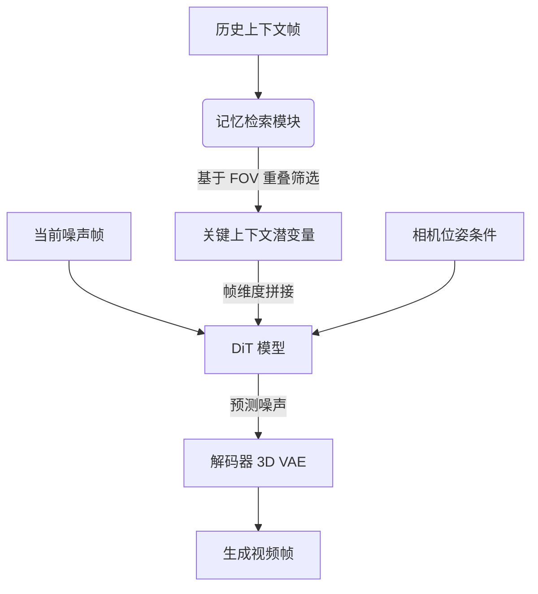

# 上下文即记忆：基于记忆检索的场景一致性交互式长视频生成

## 一、论文基础元数据
- 原文标题：Context as Memory: Scene-Consistent Interactive Long Video Generation with Memory Retrieval
- 中文译版：上下文即记忆：基于记忆检索的场景一致性交互式长视频生成
- 发表渠道：预印本（arXiv）
- 发表时间：2025 年
- 链接：https://arxiv.org/abs/2506.03141
- 作者及核心机构：Jiwen Yu, Jianhong Bai, Yiran Qin, Quande Liu, Xintao Wang, Pengfei Wan, Di Zhang, Xihui Liu（机构信息待补充）
- 研究领域：计算机视觉 / 视频生成
- 关联数据集：自建仿真数据集（100 个长视频，每个 7,601 帧，30 fps，12 种 3D 场景风格，Unreal Engine 5 构建，含相机内外参及多模态 caption）

## 二、论文综合评价
### 2.1 量化评分（1-5 分，5 分为最优）

| 评价维度 | 评分 | 备注 |
| -------- | ---- | ---- |
| 📚 理论基础 | ⭐⭐⭐⭐ | 基于扩散模型，理论基础扎实 |
| 🎯 问题核心性 | ⭐⭐⭐⭐⭐ | 解决长视频一致性核心痛点 |
| 💡 方法创新性 | ⭐⭐⭐⭐⭐ | 提出上下文即记忆新范式 |
| ⚙️ 技术壁垒 | ⭐⭐⭐⭐ | 几何检索机制具有技术壁垒 |
| 🧪 实验严谨性 | ⭐⭐⭐⭐ | 实验设计严谨，指标多维 |
| 🔧 落地可行性 | ⭐⭐⭐ | 计算开销随上下文增加 |
| 🚀 应用前景 | ⭐⭐⭐⭐ | 交互视频生成前景广阔 |
| 📊 综合评分 | 4.1 | 创新性强，解决关键问题，但模型容量受限 |

### 2.2 定性综合评价（≤300 字）
> 核心概括：本研究定位为交互式长视频生成领域，核心价值在于提出“上下文即记忆”范式，通过相机几何检索机制筛选关键历史帧，解决了长视频生成中的场景漂移与一致性问题。差异化优势在于避免了复杂的 3D 重建或信息压缩损失，直接利用上下文潜变量拼接。关键结论表明，20 帧上下文配合 FOV 重叠检索能在性能与速度间取得最佳平衡，显著优于现有基线方法。

## 三、领域本体论映射
| 核心维度 | 具体内容 |
| -------- | -------- |
| 核心研究对象 | 交互式长视频生成中的场景一致性记忆 |
| 核心技术路径 | 上下文注入 + 基于相机轨迹的记忆检索 |
| 数据/载体形态 | 视频潜变量（Video Latents）、相机位姿、文本描述 |
| 核心功能目标 | 实现基于历史上下文的长期一致生成，支持用户交互探索 |
| 验证核心指标 | PSNR, LPIPS（记忆能力）, FID, FVD（生成质量） |

## 四、核心问题与解决方案
### 4.1 待解决的核心问题
1. **领域级根本问题**：长视频生成中缺乏长期记忆，导致场景随时间推移发生漂移或不一致变化。
2. **现有方法痛点**：3D 重建方法误差累积大且速度慢；现有上下文方法压缩过多导致远距离帧信息丢失。
3. **工程落地卡点**：上下文过大时计算开销显著上升，且无法识别高价值帧。

### 4.2 核心解决方案
- 理论框架：Context-as-Memory（上下文即记忆）。
- 核心架构：基于 Transformer 的潜在视频扩散模型 (DiT) + 记忆检索模块。
- 关键技术：上下文潜变量帧维度拼接、基于相机视场角 (FOV) 重叠的搜索算法。
- 创新机制：将历史上下文视为记忆，通过检索机制筛选关键帧用于条件生成，无需额外模块。

### 4.3 核心优势（量化+定性）
1. 性能优势：在 PSNR 和 LPIPS 指标上优于 SOTA 方法，且在未见过的开放域场景中具有泛化能力。
2. 效率优势：20 帧上下文为性能与速度的最佳平衡点，检索机制大幅减少候选帧数量。
3. 工程优势：无需额外姿态估计器，直接利用生成模型已知的条件相机姿态。

## 五、方法与技术架构
### 5.1 核心架构设计
> 文字描述：模型接收历史上下文帧和当前噪声帧，通过记忆检索模块基于相机 FOV 重叠筛选关键上下文潜变量。筛选后的上下文与当前噪声帧在帧维度拼接，连同相机位姿条件一起输入 DiT 模型预测噪声，最后经 3D VAE 解码生成视频帧。

### 5.2 关键技术实现细节
| 技术模块 | 实现路径 | 工程注意事项 |
| -------- | -------- | ------------ |
| 上下文注入 | 直接将上下文潜变量与预测帧沿帧维度拼接，参与 DiT 块注意力计算 | 需处理潜变量维度对齐，避免信息混淆 |
| 记忆检索 | 基于相机视场角 (FOV) 重叠搜索，简化为 XY 平面相机射线相交判断 | 需过滤距离过近或过远的交点，防止冗余 |
| 依赖组件 | 因果 3D VAE（时空压缩）、Diffusion Transformer (DiT) | 需确保 3D 自注意力机制有效处理时空 token |

### 5.3 架构优缺点
- 优点：简单高效，避免复杂 3D 重建；检索机制有效平衡信息冗余与历史保留。
- 缺点：计算开销仍随上下文增加而上升；复杂遮挡场景下 FOV 重叠识别可能失效。

## 六、实验设计与结果分析
### 6.1 实验基础设置
| 维度 | 内容 |
| ---- | ---- |
| 数据集 | 自建仿真数据集（100 个长视频，UE5 构建，含相机参数） |
| 基线方法 | 单帧上下文、多帧随机上下文、DFoT（固定窗口）、FramePack（层级压缩） |
| 实验环境 | 8× NVIDIA A100，Batch Size 64，10,000+ 迭代 |
| 评价指标 | 视频质量（FID, FVD）、记忆能力（PSNR, LPIPS） |

### 6.2 核心实验结果
| 方法 | 核心指标 1 (PSNR) | 核心指标 2 (LPIPS) | 工程指标（算力/耗时） |
| ---- | --------- | --------- | -------------------- |
| 单帧上下文 | 较低 | 较高 | 低 |
| FramePack | 中等 | 中等 | 中 |
| 本文方法 | 优于 SOTA | 优于 SOTA | 中（20 帧上下文） |

### 6.3 消融实验/鲁棒性分析
| 实验变体 | 指标变化 | 核心结论 |
| -------- | -------- | -------- |
| 上下文大小 (30 帧) | 速度显著下降 | 20 帧为性能与速度最佳平衡点 |
| 检索策略 (FOV + 非相邻) | 效果最佳 | 能有效过滤冗余信息，显著提升记忆能力 |

### 6.4 实验结论（工程视角）
只有访问全局上下文并提取相关信息，才能实现具备记忆感知的新视频生成。在“旋转离开并旋转回来”轨迹测试中，本文方法能保持较高的场景一致性，证明记忆检索机制有效。

## 七、领域贡献与创新点
| 贡献层级 | 具体内容 |
| -------- | -------- |
| 理论贡献 | 提出"Context-as-Memory"框架，确立历史生成帧作为记忆的关键性 |
| 方法/架构贡献 | 设计基于相机几何关系的上下文检索机制，避免信息压缩损失 |
| 数据/工具贡献 | 构建包含精确相机参数及多模态 caption 的仿真长视频数据集 |
| 实验/验证贡献 | 提出基于像素级差异（PSNR/LPIPS）量化记忆能力的评估方式 |
| 工程落地贡献 | 实现了高质量的交互式长视频生成，支持虚拟世界自由探索 |

## 八、局限性与风险
| 维度 | 具体描述 | 应对思路 |
| ---- | -------- | -------- |
| 学术局限性 | 仅适用于静态场景，动态场景记忆检索更具挑战性 | 未来研究动态场景下的记忆更新机制 |
| 工程落地风险 | 计算开销随上下文增加而上升，复杂轨迹下误差累积 | 优化上下文压缩技术，使用更大规模基座模型 |
| 伦理/合规风险 | 生成内容可能涉及版权或虚假信息风险 | 建立内容审核机制，标注生成来源 |

## 九、未来研究/落地方向
| 方向类型 | 具体内容 | 优先级 |
| -------- | -------- | ------ |
| 科研拓展 | 基于更大规模基座模型开发记忆能力，支持开放域长视频生成 | 高 |
| 工程优化 | 优化上下文压缩技术，降低计算开销，支持更复杂运动轨迹 | 高 |
| 跨领域适配 | 适配游戏引擎、虚拟现实等交互式应用场景 | 中 |

## 十、关键词与术语表
| 语言 | 关键词 |
| ---- | ------ |
| 中文 | 上下文即记忆、场景一致性、记忆检索、交互式长视频生成、相机轨迹 |
| 英文 | Context-as-Memory, Scene-Consistent, Memory Retrieval, Interactive Long Video Generation, Camera Trajectory |
| 领域专属术语 | （FOV 重叠：视场角重叠度，用于评估相机视图相关性） |

## 十一、参考文献与关联资源
- 核心参考文献：待补充
- 补充阅读：待补充
- 开源代码/工具：待补充

## 十二、阅读者批注
1. **科研启发**：将历史上下文视为记忆并通过几何关系检索的思路，可迁移至其他长序列生成任务（如长文本、长音频）。
2. **工程落地思考**：20 帧上下文的平衡点具有参考意义，实际部署时需根据硬件算力动态调整上下文窗口大小。
3. **待验证/存疑点**：复杂遮挡场景下 FOV 重叠检索的有效性需进一步验证；1B 参数模型在开放域下的泛化能力上限待测。
4. **个人/团队应用场景**：适用于虚拟数字人、游戏场景生成、沉浸式视频体验等需要长期一致性的交互场景。

## 十三、阅读元信息
| 维度 | 内容 |
| ---- | ---- |
| 阅读日期 | 2026-04-08 10:42 |
| 阅读人 | xPaperReader AI |
| 文档编号 | arxiv-2506.03141 |
| 版本迭代 | v1.0 |