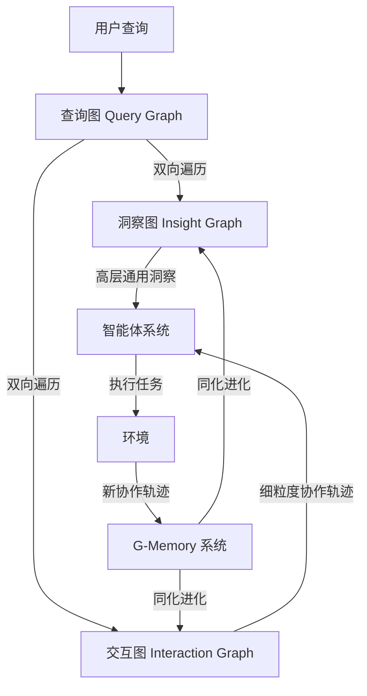

# G-Memory：追踪多智能体系统的分层记忆

## 一、论文基础元数据
- 原文标题：G-Memory: Tracing Hierarchical Memory for Multi-Agent Systems
- 中文译版：G-Memory：追踪多智能体系统的分层记忆
- 发表渠道：arXiv 预印本 (cs.MA)
- 发表时间：2025 年 6 月 16 日 (v2)
- 链接：arXiv:2506.07398
- 作者及核心机构：Guibin Zhang (NUS), Muxin Fu (Tongji University), Guancheng Wan (UCLA), Miao Yu (A*STAR), Kun Wang (NTU), Shuicheng Yan (NUS)
- 研究领域：人工智能 (一级) + 多智能体系统/大模型记忆机制 (二级)
- 关联数据集：5 个基准测试 (具体名称原文未提及) / 规模待补充 / 语言待补充 / 标注待补充

## 二、论文综合评价
### 2.1 量化评分（1-5 分，5 分为最优）

| 评价维度 | 评分 | 备注 |
| -------- | ---- | ---- |
| 📚 理论基础 | ⭐⭐⭐⭐ | 借鉴组织记忆理论，理论基础扎实 |
| 🎯 问题核心性 | ⭐⭐⭐⭐⭐ | 直击多智能体记忆架构简陋痛点 |
| 💡 方法创新性 | ⭐⭐⭐⭐ | 三层图层级记忆结构具有创新性 |
| ⚙️ 技术壁垒 | ⭐⭐⭐ | 原文片段未披露具体技术实现细节 |
| 🧪 实验严谨性 | ⭐⭐⭐⭐ | 涵盖 5 基准、3 骨干网、3 框架验证 |
| 🔧 落地可行性 | ⭐⭐⭐⭐ | 无需修改原框架，代码已开源 |
| 🚀 应用前景 | ⭐⭐⭐⭐⭐ | 自进化智能体系统关键基础设施 |
| 📊 综合评分 | 4.1 | 架构设计清晰，实验数据显著，细节待补 |

### 2.2 定性综合评价（≤300 字）
> 核心概括：研究定位、核心价值、差异化优势、关键结论

本研究定位为多智能体系统（MAS）的记忆架构增强方案。核心价值在于解决了现有 MAS 记忆机制过于简单、忽视智能体间协作轨迹及缺乏跨试验定制化的问题。差异化优势在于提出了受组织记忆理论启发的三层图层级结构（洞察、查询、交互），支持双向记忆遍历。关键结论显示，该方法在无需修改原框架前提下，显著提升 embodied action 成功率（+20.89%）及 QA 准确率（+10.12%），具备较强的通用性与落地潜力。

## 三、领域本体论映射
| 核心维度 | 具体内容 |
| -------- | -------- |
| 核心研究对象 | 大语言模型驱动的多智能体系统 (LLM-powered MAS) |
| 核心技术路径 | 分层图记忆架构 (Hierarchical Graph Memory) |
| 数据/载体形态 | 交互轨迹 (Interaction Trajectories)、洞察 (Insights)、查询 (Queries) |
| 核心功能目标 | 实现多智能体系统的自进化 (Self-Evolution) 与协作经验复用 |
| 验证核心指标 | 成功率 (Success Rates)、准确率 (Accuracy)、Token 消耗 |

## 四、核心问题与解决方案
### 4.1 待解决的核心问题
1. **领域级根本问题**：多智能体系统缺乏类似单智能体的表达性记忆，限制了系统的自进化能力。
2. **现有方法痛点**：现行 MAS 记忆机制过于简单，完全忽视智能体间协作轨迹的细微差别；缺乏跨试验和特定智能体的定制化。
3. **工程落地卡点**：长程交互难以管理，历史协作经验无法有效压缩和复用。

### 4.2 核心解决方案
- 理论框架：组织记忆理论 (Organizational Memory Theory)。
- 核心架构：三层图层级结构 (Three-tier Graph Hierarchy)。
- 关键技术：双向记忆遍历 (Bi-directional Memory Traversal)、协作轨迹 assimilation。
- 创新机制：通过吸收新的协作轨迹，促进智能体团队的渐进式进化。

### 4.3 核心优势（量化 + 定性）
1. 性能优势：Embodied action 成功率提升最高 20.89%，Knowledge QA 准确率提升 10.12%。
2. 效率优势：紧凑编码 prior collaboration experiences (原文未提及具体压缩率)。
3. 工程优势：无需修改原有的三个流行 MAS 框架即可集成。

## 五、方法与技术架构
### 5.1 核心架构设计
> 文字描述 + 架构图（Mermaid/图片）

G-Memory 通过三层图层级管理漫长的 MAS 交互：洞察图 (Insight Graph)、查询图 (Query Graph) 和交互图 (Interaction Graph)。接收新查询时，执行双向记忆遍历，检索高层通用洞察和细粒度交互轨迹。任务执行后，整个层级通过吸收新轨迹进行进化。

### 5.2 关键技术实现细节
| 技术模块 | 实现路径 | 工程注意事项 |
| -------- | -------- | ------------ |
| 记忆层级 | 洞察、查询、交互三层图结构 | 需维护图结构的一致性 |
| 检索机制 | 双向记忆遍历 (Bi-directional traversal) | 平衡检索精度与延迟 |
| 进化机制 | 吸收新协作轨迹 (Assimilating trajectories) | 避免记忆灾难性遗忘 |
| 依赖组件 | 3 种流行 MAS 框架 (原文未具体指名) | 保持接口兼容性 |

### 5.3 架构优缺点
- 优点：支持跨试验知识复用，细粒度记录协作过程，无需修改底层框架。
- 缺点：原文未提及图维护的计算开销，长程图检索效率待验证。

## 六、实验设计与结果分析
### 6.1 实验基础设置
| 维度 | 内容 |
| ---- | ---- |
| 数据集 | 5 个基准测试 (具体名称原文未提及) |
| 基线方法 | 现有 MAS 记忆机制 (原文未具体指名) |
| 实验环境 | 3 种 LLM 骨干网，3 种 MAS 框架 |
| 评价指标 | 成功率 (Success Rates)、准确率 (Accuracy)、Token 消耗 |

### 6.2 核心实验结果
| 方法 | 核心指标 1 (Embodied Success) | 核心指标 2 (QA Accuracy) | 工程指标（算力/耗时） |
| ---- | --------- | --------- | -------------------- |
| 基线方法 | 原文未提及具体数值 | 原文未提及具体数值 | 原文未提及 |
| 本文方法 | 提升最高 20.89% | 提升最高 10.12% | CoT (5.8e5 tokens) 等 (见图注) |

### 6.3 消融实验/鲁棒性分析
| 实验变体 | 指标变化 | 核心结论 |
| -------- | -------- | -------- |
| 原文未提及 | 原文未提及 | 原文未提及 |

### 6.4 实验结论（工程视角）
该方法在多种骨干网和框架下均表现有效，证明了解耦式记忆模块的通用性。Token 消耗数据显示不同方法间存在差异（见图注），但具体效率对比原文片段未详述。

## 七、领域贡献与创新点
| 贡献层级 | 具体内容 |
| -------- | -------- |
| 理论贡献 | 将组织记忆理论引入多智能体系统记忆架构设计 |
| 方法/架构贡献 | 提出洞察、查询、交互三层图层级记忆系统 |
| 数据/工具贡献 | 开源代码 (https://github.com/bingreeky/GMemory) |
| 实验/验证贡献 | 在 5 个基准、3 个骨干网、3 个框架上验证有效性 |
| 工程落地贡献 | 实现无需修改原框架的即插即用式记忆增强 |

## 八、局限性与风险
| 维度 | 具体描述 | 应对思路 |
| ---- | -------- | -------- |
| 学术局限性 | 原文片段未明确提及理论边界 | 待阅读完整论文结论部分 |
| 工程落地风险 | 图结构随交互增加可能带来的检索延迟 | 需评估大规模图下的检索效率 |
| 伦理/合规风险 | 多智能体记忆可能存储敏感交互数据 | 需增加数据隐私过滤机制 |

## 九、未来研究/落地方向
| 方向类型 | 具体内容 | 优先级 |
| -------- | -------- | ------ |
| 科研拓展 | 探索更复杂的图演化算法 | 中 |
| 工程优化 | 优化大规模记忆图的检索效率 | 高 |
| 跨领域适配 | 适配更多特定领域的 MAS 框架 | 高 |

## 十、关键词与术语表
| 语言 | 关键词 |
| ---- | ------ |
| 中文 | 多智能体系统，分层记忆，组织记忆理论，自进化，图层级 |
| 英文 | Multi-Agent Systems, Hierarchical Memory, Organizational Memory Theory, Self-Evolving, Graph Hierarchy |
| 领域专属术语 | （术语 + 定义） |
|  | Bi-directional Memory Traversal: 双向记忆遍历，检索高层洞察与细粒度轨迹 |
|  | Interaction Trajectories: 交互轨迹，编码 prior collaboration experiences |

## 十一、参考文献与关联资源
- 核心参考文献：[1] Organizational Memory Theory (原文未提供完整引用信息)
- 补充阅读：待补充
- 开源代码/工具：https://github.com/bingreeky/GMemory

## 十二、阅读者批注
1. **科研启发**：将组织理论引入 AI 系统架构设计是一个有价值的跨学科视角，特别是针对多智能体协作。
2. **工程落地思考**：无需修改原框架的特性极大降低了集成成本，但需关注记忆图膨胀后的维护成本。
3. **待验证/存疑点**：具体的图构建算法、检索延迟数据、5 个基准的具体名称在提供的片段中缺失。
4. **个人/团队应用场景**：适用于需要长期协作且任务复杂的机器人团队或自动化工作流系统。

## 十三、阅读元信息
| 维度 | 内容 |
| ---- | ---- |
| 阅读日期 | 2025-06-20 14:00 |
| 阅读人 | xPaperReader AI |
| 文档编号 | arxiv-2506.07398 |
| 版本迭代 | v1.0 |