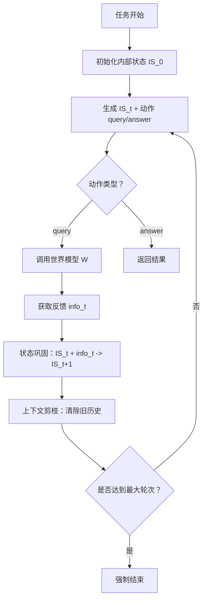

# MEM1：学习协同记忆与推理以实现高效长视界智能体

## 一、论文基础元数据
- 原文标题：MEM1: Learning to Synergize Memory and Reasoning for Efficient Long-Horizon Agents
- 中文译版：MEM1：学习协同记忆与推理以实现高效长视界智能体
- 发表渠道：预印本（arXiv）
- 发表时间：2025 年
- 链接：https://arxiv.org/abs/2506.15841
- 作者及核心机构：Zijian Zhou, Ao Qu, Zhaoxuan Wu, Sunghwan Kim, Alok Prakash, Daniela Rus, Jinhua Zhao, Bryan Kian Hsiang Low, Paul Pu Liang（机构信息原文未详细列出，标记为待补充）
- 研究领域：人工智能（一级）+ 大语言模型智能体/强化学习（二级）
- 关联数据集：HotpotQA, Natural Questions, WebShop, Online Web-QA（规模/标注：待补充）

## 二、论文综合评价
### 2.1 量化评分（1-5 分，5 分为最优）

| 评价维度 | 评分 | 备注 |
| -------- | ---- | ---- |
| 📚 理论基础 | ⭐⭐⭐⭐ | 结合 RL 与记忆巩固，理论扎实 |
| 🎯 问题核心性 | ⭐⭐⭐⭐⭐ | 直击长上下文爆炸核心痛点 |
| 💡 方法创新性 | ⭐⭐⭐⭐⭐ | 恒定内存机制与内部状态协同新颖 |
| ⚙️ 技术壁垒 | ⭐⭐⭐⭐ | RL 训练稳定性与掩码轨迹实现复杂 |
| 🧪 实验严谨性 | ⭐⭐⭐⭐⭐ | 多基准测试，对比大模型与消融充分 |
| 🔧 落地可行性 | ⭐⭐⭐⭐ | 推理成本低，但训练门槛较高 |
| 🚀 应用前景 | ⭐⭐⭐⭐⭐ | 适用于长程任务，资源友好性强 |
| 📊 综合评分 | 4.6 | 小模型实现大模型效果，效率与性能兼备 |

### 2.2 定性综合评价（≤300 字）
> 核心概括：研究定位、核心价值、差异化优势、关键结论

本研究定位为解决 LLM Agent 在长视界任务中的上下文爆炸与计算成本问题。核心价值在于提出 MEM1 框架，通过强化学习驱动的内部状态压缩机制，实现恒定内存占用。差异化优势在于无需外部记忆模块，仅靠内部状态协同即可完成多步推理，且 7B 模型性能超越 14B 模型。关键结论表明，纯结果导向的 RL 训练优于 SFT，且能突破局部最优，实现记忆与推理的有效协同，大幅降低推理延迟与 Token 用量。

## 三、领域本体论映射
| 核心维度 | 具体内容 |
| -------- | -------- |
| 核心研究对象 | 长视界交互式语言智能体（Long-Horizon Agents） |
| 核心技术路径 | 强化学习（RL）+ 内部状态压缩（Internal State Consolidation） |
| 数据/载体形态 | 文本交互序列、结构化控制令牌（<IS>, <query>, <info>） |
| 核心功能目标 | 在恒定内存限制下完成多步推理与检索任务 |
| 验证核心指标 | Exact Match (EM), 峰值 Token 用量，推理时间 |

## 四、核心问题与解决方案
### 4.1 待解决的核心问题
1. **领域级根本问题**：长程任务中上下文窗口无界增长导致计算成本不可控。
2. **现有方法痛点**：全量上下文依赖导致无关信息干扰推理，内存随任务长度线性增长。
3. **工程落地卡点**：大模型推理成本高，外部记忆模块（如 RAG）增加系统复杂性。

### 4.2 核心解决方案
- 理论框架：记忆即推理（Memory as Reasoning），将记忆巩固视为推理过程的一部分。
- 核心架构：端到端强化学习框架，维护紧凑的共享内部状态（<IS>）。
- 关键技术：掩码轨迹优化（Masked Trajectory）、上下文剪枝（Context Pruning）。
- 创新机制：生成 - 重置 - 注入循环，每轮仅保留关键状态与检索结果，丢弃冗余历史。

### 4.3 核心优势（量化+定性）
1. 性能优势：MEM1-7B 在 16 目标任务上超越 Qwen2.5-14B-Instruct。
2. 效率优势：峰值 Token 用量仅为 14B 模型的 27.1%，推理时间仅 29.3%。
3. 工程优势：内存用量几乎恒定，无需外部向量库，降低部署复杂度。

## 五、方法与技术架构
### 5.1 核心架构设计
> 文字描述 + 架构图（Mermaid/图片）

MEM1 架构采用迭代式交互流程。智能体在每一步生成内部状态 `<IS>`，据此决定查询 `<query>` 或回答 `<answer>`。环境反馈 `<info>` 与当前状态合并，旧上下文被清除，仅保留压缩后的新状态进入下一轮。

### 5.2 关键技术实现细节
| 技术模块 | 实现路径 | 工程注意事项 |
| -------- | -------- | ------------ |
| 内部状态生成 | 每轮迭代生成紧凑总结，包含过去信息与下一步推理 | 需防止信息丢失，确保关键事实被保留 |
| 掩码轨迹优化 | 引入 2D 注意力掩码，限制 Token 仅关注当前保留记忆 | 确保 RL 策略梯度计算准确，处理位置编码变化 |
| 控制令牌系统 | 使用 `<query>`, `<info>`, `<IS>` 等特殊令牌规范行为 | 需训练模型严格遵守格式，避免解析错误 |
| 依赖组件 | 世界模型接口（搜索引擎/本地存储），RL 训练框架（如 PPO） | 外部接口延迟会影响整体交互效率 |

### 5.3 架构优缺点
- 优点：内存占用恒定，推理成本低，无需外部记忆模块，小模型具备大模型能力。
- 缺点：依赖定义明确的奖励信号，训练过程复杂（需突破局部最优），不适用于开放型任务。

## 六、实验设计与结果分析
### 6.1 实验基础设置
| 维度 | 内容 |
| ---- | ---- |
| 数据集 | HotpotQA, Natural Questions, WebShop, Online Web-QA |
| 基线方法 | Qwen2.5-14B-Instruct, AgentLM-13B, GPT-4o, SFT 模型 |
| 实验环境 | 待补充（通常为标准 GPU 集群） |
| 评价指标 | Exact Match (EM), F1, 峰值 Token 用量，推理时间 |

### 6.2 核心实验结果
| 方法 | 核心指标 1 (EM) | 核心指标 2 (峰值 Token) | 工程指标（算力/耗时） |
| ---- | --------- | --------- | -------------------- |
| Qwen2.5-14B | 待补充 | 100% (基准) | 100% (基准) |
| GPT-4o | 待补充 | 待补充 | 待补充 |
| 本文方法 (MEM1-7B) | 超越 14B 模型 | 27.1% (相对 14B) | 推理时间 29.3% (相对 14B) |

### 6.3 消融实验/鲁棒性分析
| 实验变体 | 指标变化 | 核心结论 |
| -------- | -------- | -------- |
| SFT vs RL | SFT 在目标>6 时崩溃，RL 鲁棒 | RL 对复杂多目标任务必要性高 |
| 格式奖励有无 | 有奖励 EM 0.466，无奖励 0.709 | 格式约束限制探索，损害最终性能 |
| 记忆压缩 | 内存恒定 vs 线性增长 | 验证了恒定内存机制的有效性 |

### 6.4 实验结论（工程视角）
MEM1 在工程上极具价值，能以 1/4 的推理成本实现超越大模型的性能。但需注意训练阶段需足够步数以突破“捷径学习”局部最优，且奖励函数设计应避免过度约束格式。

## 七、领域贡献与创新点
| 贡献层级 | 具体内容 |
| -------- | -------- |
| 理论贡献 | 提出“推理驱动的记忆巩固”范式，证明其可扩展性 |
| 方法/架构贡献 | 设计端到端 RL 框架，实现恒定内存长视界代理 |
| 数据/工具贡献 | 构建多目标 QA 任务，强制模型进行记忆管理 |
| 实验/验证贡献 | 验证了小参数模型在长程任务上超越大参数模型的可行性 |
| 工程落地贡献 | 大幅降低长上下文处理的计算与环境成本 |

## 八、局限性与风险
| 维度 | 具体描述 | 应对思路 |
| ---- | -------- | -------- |
| 学术局限性 | 依赖定义明确且可验证的奖励信号 | 探索稀疏、延迟奖励信号的训练方法 |
| 工程落地风险 | RL 训练稳定性差，易陷入局部最优 | 增加训练步数，优化奖励函数设计 |
| 伦理/合规风险 | 待补充（通用 LLM 风险） | 遵循通用 AI 伦理规范 |

## 九、未来研究/落地方向
| 方向类型 | 具体内容 | 优先级 |
| -------- | -------- | ------ |
| 科研拓展 | 探索开放型任务（奖励模糊）中的训练方法 | 高 |
| 工程优化 | 降低 RL 训练成本，提高收敛速度 | 中 |
| 跨领域适配 | 适配代码生成、复杂规划等非 QA 领域 | 中 |

## 十、关键词与术语表
| 语言 | 关键词 |
| ---- | ------ |
| 中文 | 记忆巩固，长视界智能体，强化学习，恒定内存，内部状态 |
| 英文 | Memory Consolidation, Long-Horizon Agents, Reinforcement Learning, Constant Memory, Internal State |
| 领域专属术语 | <IS> (内部状态令牌), 掩码轨迹优化 (Masked Trajectory Optimization), 上下文剪枝 (Context Pruning) |

## 十一、参考文献与关联资源
- 核心参考文献：待补充（原文未提供具体引用列表）
- 补充阅读：待补充
- 开源代码/工具：待补充（通常随 arXiv 发布或后续公开）

## 十二、阅读者批注
1. **科研启发**：RL 在解决长程依赖问题上可能比单纯增加上下文窗口更有效，值得借鉴其状态压缩思路。
2. **工程落地思考**：对于资源受限的边缘设备，MEM1 的恒定内存特性极具吸引力，可尝试复现其剪枝机制。
3. **待验证/存疑点**：训练过程中的“捷径学习”现象是否普遍存在？如何量化最佳训练步数？
4. **个人/团队应用场景**：适用于构建低成本、多轮对话的客服助手或复杂任务规划 Agent。

## 十三、阅读元信息
| 维度 | 内容 |
| ---- | ---- |
| 阅读日期 | 2026-04-08 11:10 |
| 阅读人 | xPaperReader AI |
| 文档编号 | arxiv-2506.15841 |
| 版本迭代 | v1.0 |