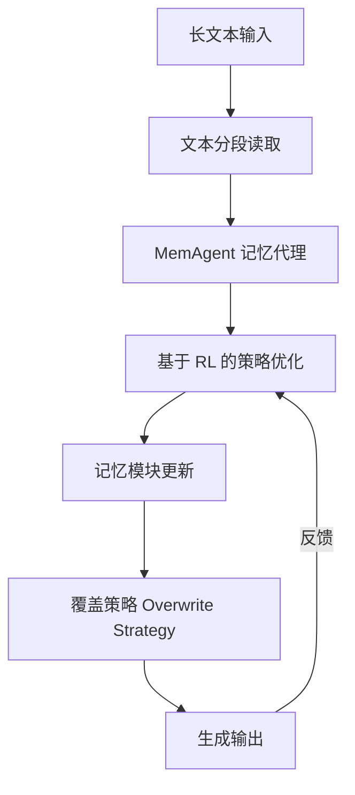

# MemAgent：基于多对话强化学习记忆代理重塑长上下文大语言模型

## 一、论文基础元数据
- 原文标题：MemAgent: Reshaping Long-Context LLM with Multi-Conv RL-based Memory Agent
- 中文译版：MemAgent：基于多对话强化学习记忆代理重塑长上下文大语言模型
- 发表渠道：arXiv 预印本 (cs.CL)
- 发表时间：2025 年 7 月 3 日
- 链接：arXiv:2507.02259
- 作者及核心机构：Hongli Yu 等 (ByteDance Seed, Tsinghua University AIR, SIA-Lab)
- 研究领域：人工智能 (一级) / 自然语言处理与长上下文建模 (二级)
- 关联数据集：RULER (512K 测试), HotpotQA, 自建长文本任务 (3.5M 上下文)

## 二、论文综合评价
### 2.1 量化评分（1-5 分，5 分为最优）

| 评价维度 | 评分 | 备注 |
| -------- | ---- | ---- |
| 📚 理论基础 | ⭐⭐⭐⭐ | 结合强化学习与记忆机制，理论扎实 |
| 🎯 问题核心性 | ⭐⭐⭐⭐⭐ | 直击长上下文性能退化核心痛点 |
| 💡 方法创新性 | ⭐⭐⭐⭐ | 引入多对话生成与覆盖策略，新颖 |
| ⚙️ 技术壁垒 | ⭐⭐⭐ | RL 训练复杂，细节原文未提及 |
| 🧪 实验严谨性 | ⭐⭐⭐⭐ | 3.5M 上下文 extrapolation 验证充分 |
| 🔧 落地可行性 | ⭐⭐⭐ | Agent 工作流可能增加推理延迟 |
| 🚀 应用前景 | ⭐⭐⭐⭐⭐ | 长文档处理需求广泛，前景广阔 |
| 📊 综合评分 | 4.0 | 长上下文突破显著，工程细节待补充 |

### 2.2 定性综合评价（≤300 字）
> 核心概括：研究定位、核心价值、差异化优势、关键结论

本研究定位为解决大语言模型在无限长文本处理中的性能退化与复杂度问题。核心价值在于提出了一种端到端的 Agent 工作流（MemAgent），通过分段阅读和覆盖策略更新记忆，避免了传统注意力机制的二次方复杂度。差异化优势在于扩展了 DAPO 算法以支持独立上下文多对话生成训练，实现了从 8K/32K 训练到 3.5M 推理的无损外推。关键结论显示，该方法在 512K RULER 测试中达到 95%+ 准确率，且在 3.5M 任务中性能损失小于 5%，显著优于现有长上下文模型。

## 三、领域本体论映射
| 核心维度 | 具体内容 |
| -------- | -------- |
| 核心研究对象 | 长上下文大语言模型 (Long-Context LLM) |
| 核心技术路径 | 强化学习 (RL) + 记忆代理 (Memory Agent) + 覆盖策略 |
| 数据/载体形态 | 文本分段 (Segments)、外部记忆模块、多对话生成数据 |
| 核心功能目标 | 实现线性复杂度的无限长文本处理且性能不降级 |
| 验证核心指标 | 准确率 (Accuracy)、上下文长度外推能力 (Extrapolation)、性能损失率 |

## 四、核心问题与解决方案
### 4.1 待解决的核心问题
1. **领域级根本问题**：如何在处理无限长文档时保持线性复杂度且不发生性能退化（Performance Degradation）。
2. **现有方法痛点**：长度外推法存在性能下降和速度慢（O(n²)）；稀疏/线性注意力需从头训练且并行困难；上下文压缩法破坏标准生成过程。
3. **工程落地卡点**：现有模型难以在 32K 训练基础上有效外推至百万级上下文（如 3.5M）。

### 4.2 核心解决方案
- 理论框架：基于 Agent 的工作流，模拟人类抽象主要概念处理长文本的直觉。
- 核心架构：MemAgent，包含分段读取、记忆更新、覆盖策略。
- 关键技术：扩展 DAPO 算法，支持独立上下文多对话生成（independent-context multi-conversation generation）。
- 创新机制：使用覆盖策略（overwrite strategy）更新记忆，而非单纯追加，以控制记忆容量。

### 4.3 核心优势（量化 + 定性）
1. 性能优势：3.5M 上下文任务性能损失 < 5%，512K RULER 测试准确率 95%+。
2. 效率优势：实现线性复杂度解码，避免 O(n²) 注意力计算。
3. 工程优势：端到端优化，支持从短上下文（8K/32K）训练外推至长上下文。

## 五、方法与技术架构
### 5.1 核心架构设计
> 文字描述 + 架构图（Mermaid/图片）

基于摘要描述，架构核心为分段读取与记忆更新循环。由于原文方法章节未完全提供，以下基于摘要推断核心流程。

### 5.2 关键技术实现细节
| 技术模块 | 实现路径 | 工程注意事项 |
| -------- | -------- | ------------ |
| 记忆更新 | 使用覆盖策略更新记忆，防止无限增长 | 需平衡信息保留与遗忘，原文未提及具体阈值 |
| 训练算法 | 扩展 DAPO 算法，支持多对话生成 | 需独立上下文生成数据，算力消耗待评估 |
| 分段处理 | 将长文本切分为段进行处理 | 分段粒度影响语义连贯性，原文未提及 |
| 依赖组件 | 基于 LLM 基座（如 7B/14B 模型） | 需兼容现有推理架构，避免大幅修改 |

### 5.3 架构优缺点
- 优点：支持无限长度外推，线性复杂度，性能损失极低。
- 缺点：Agent 工作流可能增加单步推理延迟，覆盖策略可能导致关键信息丢失（原文未详细讨论）。

## 六、实验设计与结果分析
### 6.1 实验基础设置
| 维度 | 内容 |
| ---- | ---- |
| 数据集 | RULER (512K), HotpotQA, 自建 3.5M 长文本任务 |
| 基线方法 | QwenLong-L1-32B, Qwen2.5-Instruct (7B/14B), DS-Distill-Qwen, Truncation |
| 实验环境 | 原文未提及具体硬件配置 |
| 评价指标 | 准确率 (Accuracy Score), 性能损失率 (Performance Loss) |

### 6.2 核心实验结果
| 方法 | 核心指标 1 (512K RULER) | 核心指标 2 (3.5M QA) | 工程指标（算力/耗时） |
| ---- | --------- | --------- | -------------------- |
| 基线 1 (Qwen2.5-14B) | 原文未提及具体数值 | 性能显著下降 | 原文未提及 |
| 基线 2 (Truncation) | 低分 (见图 1 趋势) | 无法处理 | 原文未提及 |
| 本文方法 (MemAgent-14B) | 95%+ | 性能损失 < 5% | 线性复杂度 |

### 6.3 消融实验/鲁棒性分析
| 实验变体 | 指标变化 | 核心结论 |
| -------- | -------- | -------- |
| 不同模型规模 (7B vs 14B) | 14B 优于 7B (见图 1) | 规模扩展有效，但均保持外推能力 |
| 上下文长度变化 | 7K 至 3.5M 性能平稳 | 验证了无损外推能力 |

### 6.4 实验结论（工程视角）
MemAgent 在极端长上下文（3.5M）下表现出极强的鲁棒性，解决了传统模型随长度增加性能急剧下降的问题，适合需要处理全书或长文档的工程场景。

## 七、领域贡献与创新点
| 贡献层级 | 具体内容 |
| -------- | -------- |
| 理论贡献 | 提出基于 Agent 工作流的长上下文建模范式，验证了 RL 在记忆管理中的有效性 |
| 方法/架构贡献 | 设计 MemAgent 架构，引入覆盖策略和多对话生成训练机制 |
| 数据/工具贡献 | 验证了 3.5M 长度级别的任务可行性，提供了新的评估基准参考 |
| 实验/验证贡献 | 在 512K 和 3.5M 长度上实现了 SOTA 性能，证明了外推能力 |
| 工程落地贡献 | 提供了线性复杂度的解决方案，降低了长文本推理的计算成本 |

## 八、局限性与风险
| 维度 | 具体描述 | 应对思路 |
| ---- | -------- | -------- |
| 学术局限性 | 原文仅提供摘要和引言，方法细节（如覆盖策略具体公式）缺失 | 需等待全文发布或联系作者获取细节 |
| 工程落地风险 | Agent 工作流可能增加推理延迟，覆盖策略可能导致信息丢失 | 优化推理引擎，评估覆盖策略的信息保留率 |
| 伦理/合规风险 | 长文本可能包含敏感信息，记忆模块可能存储隐私 | 增加记忆清洗机制，符合数据合规要求 |

## 九、未来研究/落地方向
| 方向类型 | 具体内容 | 优先级 |
| -------- | -------- | ------ |
| 科研拓展 | 研究覆盖策略的最优机制，探索不同 RL 算法的影响 | 高 |
| 工程优化 | 优化分段读取的并行效率，降低 Agent 交互延迟 | 高 |
| 跨领域适配 | 适配代码库理解、法律文档分析等特定长文本场景 | 中 |

## 十、关键词与术语表
| 语言 | 关键词 |
| ---- | ------ |
| 中文 | 长上下文、记忆代理、强化学习、覆盖策略、外推 |
| 英文 | Long-Context, Memory Agent, Reinforcement Learning, Overwrite Strategy, Extrapolation |
| 领域专属术语 | **DAPO 算法**：一种用于强化学习的算法，本文进行了扩展以支持多对话生成；**RULER 测试**：用于评估长上下文模型能力的基准测试集 |

## 十一、参考文献与关联资源
- 核心参考文献：[1, 2] (RULER-HotpotQA 相关), [3-7] (LLM 能力), [11-15] (长度外推), [19-23] (注意力机制), [24-27] (上下文压缩)
- 补充阅读：项目主页 https://memagent-sialab.github.io/
- 开源代码/工具：原文未提及代码开源情况，需关注项目主页

## 十二、阅读者批注
1. **科研启发**：将 RL 引入记忆管理是一个有趣的方向，特别是“覆盖策略”如何平衡新旧信息值得深究。
2. **工程落地思考**：3.5M 上下文处理能力极具吸引力，但需评估实际推理延迟是否可接受，是否适合实时场景。
3. **待验证/存疑点**：覆盖策略的具体实现细节原文未提及，是否存在关键信息被错误覆盖的风险？
4. **个人/团队应用场景**：适用于法律合同审查、长篇小说分析、代码库全量理解等场景。

## 十三、阅读元信息
| 维度 | 内容 |
| ---- | ---- |
| 阅读日期 | 2025-07-04 12:00 |
| 阅读人 | xPaperReader AI |
| 文档编号 | arxiv-2507.02259 |
| 版本迭代 | v1.0 |