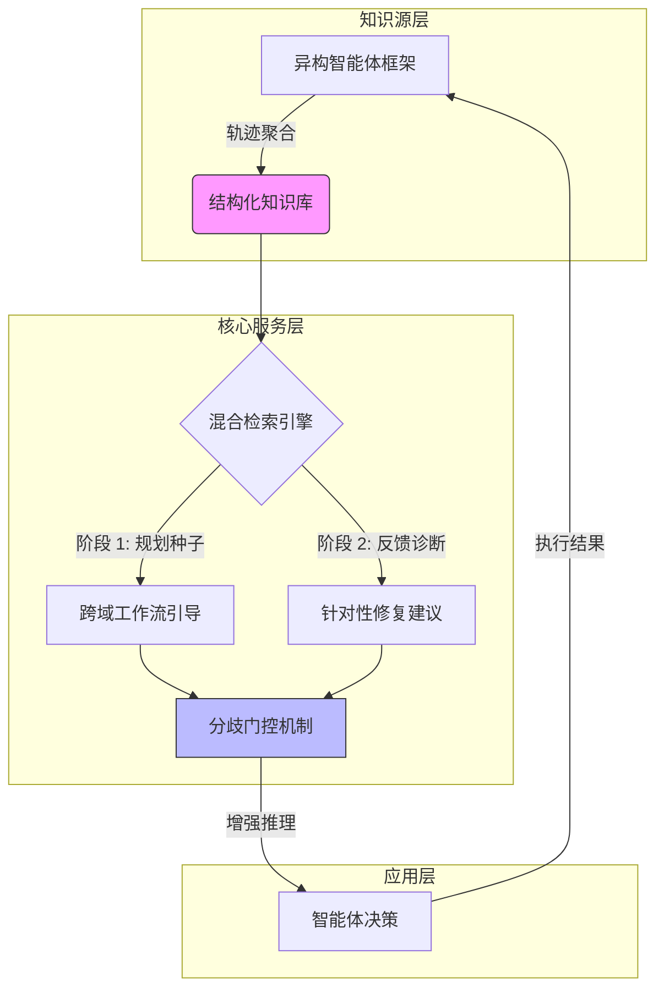

# Agent KB：利用跨域经验进行代理问题求解

## 一、论文基础元数据
- 原文标题：Agent KB: Leveraging Cross-Domain Experience for Agentic Problem Solving
- 中文译版：Agent KB：利用跨域经验进行代理问题求解
- 发表渠道：arXiv 预印本 (cs.CL)
- 发表时间：2025 年 10 月 27 日 (v5 版本)
- 链接：https://github.com/OPPO-PersonalAI/Agent-KB (arXiv: 2507.06229)
- 作者及核心机构：Xiangru Tang 等 (OPPO, Yale University, UW-Madison, Stanford University, Google DeepMind 等)
- 研究领域（一级领域 + 二级子领域）：人工智能 / 智能体系统与大模型记忆机制
- 关联数据集（名称/规模/语言/标注）：GAIA, Humanity's Last Exam, GPQA, SWE-bench (原文未提及具体规模/语言细节)

## 二、论文综合评价
### 2.1 量化评分（1-5 分，5 分为最优）

| 评价维度 | 评分 | 备注 |
| -------- | ---- | ---- |
| 📚 理论基础 | ⭐⭐⭐⭐ | 跨框架记忆共享理论清晰，逻辑自洽 |
| 🎯 问题核心性 | ⭐⭐⭐⭐⭐ | 直击智能体孤立运作与重复错误痛点 |
| 💡 方法创新性 | ⭐⭐⭐⭐ | 提出无需重训练的通用记忆基础设施 |
| ⚙️ 技术壁垒 | ⭐⭐⭐⭐ | 混合检索与分歧门控机制具技术深度 |
| 🧪 实验严谨性 | ⭐⭐⭐ | 仅见摘要数据，全文实验细节未提供 |
| 🔧 落地可行性 | ⭐⭐⭐⭐ | 轻量级 API 设计，兼容现有框架 |
| 🚀 应用前景 | ⭐⭐⭐⭐⭐ | 奠定集体智能基础，生态价值巨大 |
| 📊 综合评分 | 4.1 | 概念极具潜力，受限于提供的文本完整性 |

### 2.2 定性综合评价（≤300 字）
> 核心概括：研究定位、核心价值、差异化优势、关键结论

本研究定位为智能体领域的通用记忆基础设施，旨在解决不同 AI 智能体框架间知识孤立与经验无法共享的根本问题。核心价值在于构建了无需重训练即可实现跨架构知识转移的 `AGENT KB` 系统。差异化优势体现在其混合检索机制（规划种子 + 反馈诊断）与分歧门控设计，有效避免了知识干扰。关键结论显示，该系统在 GAIA、SWE-bench 等多个基准测试中，显著提升了 smolagents 及 OpenHands 等框架的性能（最高提升 18.7pp），证明了跨域经验共享的可行性与有效性。

## 三、领域本体论映射
| 核心维度 | 具体内容 |
| -------- | -------- |
| 核心研究对象 | 异构智能体框架间的经验轨迹与知识共享 |
| 核心技术路径 | 结构化知识库聚合 + 混合检索 + 分歧门控 |
| 数据/载体形态 | 智能体执行轨迹 (Trajectories)、结构化知识条目 |
| 核心功能目标 | 实现跨框架的无缝经验共享，避免重复错误 |
| 验证核心指标 | pass@1, pass@3, 性能提升百分比 (pp) |

## 四、核心问题与解决方案
### 4.1 待解决的核心问题
1. **领域级根本问题**：AI 智能体框架各自为政，导致知识孤岛，无法涌现集体智能。
2. **现有方法痛点**：现有记忆系统仅关注单个智能体或特定框架，无法实现跨架构知识转移。
3. **工程落地卡点**：不同框架的经验表示异构（Representation heterogeneity）及上下文不匹配（Context mismatch）。

### 4.2 核心解决方案
- 理论框架：通用记忆基础设施（Universal Memory Infrastructure）。
- 核心架构：聚合轨迹至结构化知识库，提供轻量级 API 服务。
- 关键技术：混合检索（Hybrid Retrieval）、分歧门控（Disagreement Gate）。
- 创新机制：两阶段检索（规划种子引导 + 反馈诊断修复），确保知识增强而非干扰推理。

### 4.3 核心优势（量化 + 定性）
1. 性能优势：smolagents 在 pass@3 上提升 18.7pp (55.2% → 73.9%)。
2. 效率优势：无需重新训练（without re-training），即插即用。
3. 工程优势：兼容异构框架（smolagents, OpenHands, OWL 等），自动生成经验匹配人工策展。

## 五、方法与技术架构
### 5.1 核心架构设计
> 文字描述 + 架构图（Mermaid/图片）

`AGENT KB` 架构主要包含知识库聚合、混合检索服务与智能体交互接口。在推理时，通过规划种子（Planning Seeds）提供跨域工作流引导，并通过反馈（Feedback）应用针对性诊断修复。分歧门控机制用于过滤可能干扰推理的检索知识。

### 5.2 关键技术实现细节
| 技术模块 | 实现路径 | 工程注意事项 |
| -------- | -------- | ------------ |
| 知识库聚合 | 将不同框架轨迹转化为结构化条目 | 需处理表示异构性 (Representation heterogeneity) |
| 混合检索 | 两阶段检索 (规划 + 反馈) | 确保检索内容与当前上下文匹配 |
| 分歧门控 | 评估检索知识是否干扰推理 | 防止错误知识导致性能下降 |
| 依赖组件 | 轻量级 API 服务 | 需兼容多种主流智能体框架 |

### 5.3 架构优缺点
- 优点：无需重训练、跨框架兼容、显著性能提升、自动化经验生成。
- 缺点：[原文未提及]（基于提供的节选内容，具体依赖限制未详述）。

## 六、实验设计与结果分析
### 6.1 实验基础设置
| 维度 | 内容 |
| ---- | ---- |
| 数据集 | GAIA, Humanity's Last Exam, GPQA, SWE-bench |
| 基线方法 | 原始框架 (smolagents, OpenHands 等) |
| 实验环境 | [原文未提及] |
| 评价指标 | pass@1, pass@3, 性能提升幅度 (pp) |

### 6.2 核心实验结果
| 方法 | 核心指标 1 (pass@3) | 核心指标 2 (pass@1) | 工程指标（算力/耗时） |
| ---- | --------- | --------- | -------------------- |
| smolagents (基线) | 55.2% | [原文未提及] | [原文未提及] |
| smolagents + AGENT KB | 73.9% (+18.7pp) | [原文未提及] | [原文未提及] |
| OpenHands + AGENT KB | [原文未提及] | 28.3% (+4.0pp) | [原文未提及] |

### 6.3 消融实验/鲁棒性分析
| 实验变体 | 指标变化 | 核心结论 |
| -------- | -------- | -------- |
| 混合检索移除 | 性能下降 | 混合检索与反馈阶段至关重要 |
| 自动生成经验 | 匹配人工策展 | 自动生成的经验质量可靠 |

### 6.4 实验结论（工程视角）
该系统在多个主流基准测试和模型家族中均表现出显著的性能提升，证明了跨框架记忆共享的有效性。自动生成经验的能力降低了维护成本，具备工程落地潜力。

## 七、领域贡献与创新点
| 贡献层级 | 具体内容 |
| -------- | -------- |
| 理论贡献 | 提出跨框架集体智能通过共享记忆基础设施实现的路径 |
| 方法/架构贡献 | 设计无需重训练的通用记忆基础设施 `AGENT KB` |
| 数据/工具贡献 | 开源代码库 (GitHub), 支持多框架接入 |
| 实验/验证贡献 | 在 GAIA, SWE-bench 等 4 个基准上验证了跨框架有效性 |
| 工程落地贡献 | 解决了表示异构与上下文匹配的工程卡点 |

## 八、局限性与风险
| 维度 | 具体描述 | 应对思路 |
| ---- | -------- | -------- |
| 学术局限性 | [原文未提及]（节选内容未覆盖讨论章节） | 需阅读全文讨论部分 |
| 工程落地风险 | 不同框架 API 差异可能导致集成复杂度 | 标准化轻量级 API 接口 |
| 伦理/合规风险 | 跨框架知识共享可能涉及隐私或版权 | 建立知识访问权限控制机制 |

## 九、未来研究/落地方向
| 方向类型 | 具体内容 | 优先级 |
| -------- | -------- | ------ |
| 科研拓展 | 探索更多异构框架间的知识转移机制 | 高 |
| 工程优化 | 优化检索延迟，提升实时交互体验 | 高 |
| 跨领域适配 | 适配更多垂直领域（如医疗、法律）的智能体 | 中 |

## 十、关键词与术语表
| 语言 | 关键词 |
| ---- | ------ |
| 中文 | 智能体框架、跨域经验、记忆基础设施、混合检索、分歧门控 |
| 英文 | AI Agent Frameworks, Cross-Domain Experience, Memory Infrastructure, Hybrid Retrieval, Disagreement Gate |
| 领域专属术语 | **Trajectories (轨迹)**: 智能体执行过程中的状态 - 动作序列；**Pass@k**: 评估智能体任务成功率的指标 |

## 十一、参考文献与关联资源
- 核心参考文献：Chan et al., 2023; Hong et al., 2023; Xu et al., 2025; Zheng et al., 2023 等（见引言部分引用）
- 补充阅读：[原文未提及]
- 开源代码/工具：https://github.com/OPPO-PersonalAI/Agent-KB

## 十二、阅读者批注
1. **科研启发**：将“记忆”从单智能体内部扩展到多框架共享，是通往集体智能的关键一步。
2. **工程落地思考**：轻量级 API 设计是兼容现有生态的关键，需关注接口标准化。
3. **待验证/存疑点**：分歧门控的具体算法实现细节在节选中未展示，需查阅全文方法章节。
4. **个人/团队应用场景**：适用于团队内部多个智能体协作场景，避免重复解决相同问题。

## 十三、阅读元信息
| 维度 | 内容 |
| ---- | ---- |
| 阅读日期 | 2026-04-08 11:35 |
| 阅读人 | xPaperReader AI |
| 文档编号 | arxiv-2507.06229 |
| 版本迭代 | v1.0 |