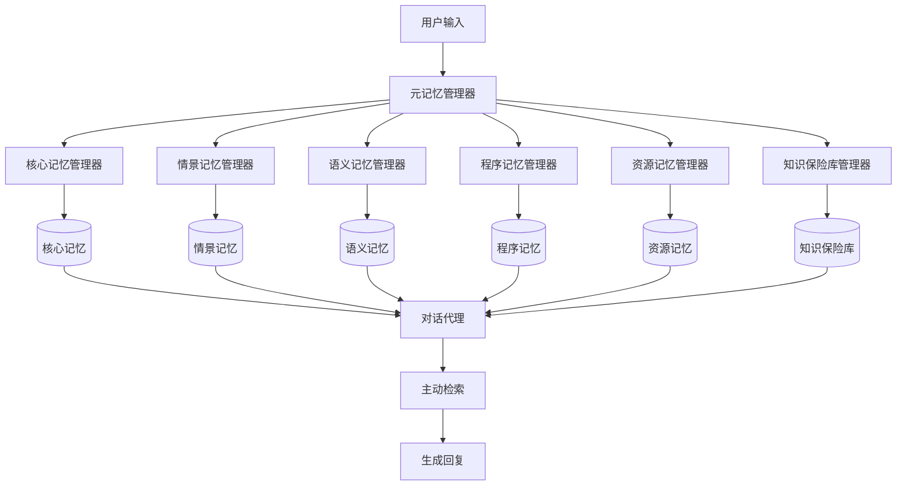

# MIRIX：面向 LLM 代理的多智能体记忆系统

## 一、论文基础元数据
- 原文标题：MIRIX: Multi-Agent Memory System for LLM-Based Agents
- 中文译版：MIRIX：面向 LLM 代理的多智能体记忆系统
- 发表渠道：预印本（arXiv）
- 发表时间：2025 年
- 链接（arXiv/DOI）：arXiv: 2507.07957
- 作者及核心机构：Yu Wang, Xi Chen（机构待补充）
- 研究领域：人工智能 + 大语言模型/智能体系统
- 关联数据集：
  - ScreenshotVQA（自建，约 2 万张截图，87 个问答，多模态标注）
  - LOCOMO（公开，10 段长对话，每段约 26k tokens，2000 个问题）

## 二、论文综合评价
### 2.1 量化评分（1-5 分，5 分为最优）

| 评价维度 | 评分 | 备注 |
| -------- | ---- | ---- |
| 📚 理论基础 | ⭐⭐⭐⭐ | 认知科学记忆分类理论支撑充分 |
| 🎯 问题核心性 | ⭐⭐⭐⭐⭐ | 直击 LLM 记忆系统核心痛点 |
| 💡 方法创新性 | ⭐⭐⭐⭐⭐ | 六模块记忆 + 多代理协同创新 |
| ⚙️ 技术壁垒 | ⭐⭐⭐⭐ | 模块化架构实现复杂度较高 |
| 🧪 实验严谨性 | ⭐⭐⭐⭐ | 双基准测试，对比基线充分 |
| 🔧 落地可行性 | ⭐⭐⭐⭐⭐ | 已发布桌面应用，兼容闭源模型 |
| 🚀 应用前景 | ⭐⭐⭐⭐⭐ | 个人助手 + 记忆资产化生态 |
| 📊 综合评分 | 4.6 | 架构创新且实验充分，落地性强 |

### 2.2 定性综合评价（≤300 字）
> 核心概括：研究定位、核心价值、差异化优势、关键结论

本研究定位为 LLM 智能体记忆系统架构创新，核心价值在于解决现有记忆系统扁平化、检索被动、兼容性差的问题。差异化优势体现在六大模块化记忆组件设计、多代理协同工作流、主动检索机制及多模态支持能力。关键结论：MIRIX 在 LOCOMO 基准上达到 85.38% 准确率（SOTA），在自建 ScreenshotVQA 基准上准确率提升 35%、存储需求减少 99.9%，且无需重训练模型即可兼容闭源 LLM，已实现跨平台桌面应用落地，并提出记忆资产化生态愿景。

## 三、领域本体论映射
| 核心维度 | 具体内容 |
| -------- | -------- |
| 核心研究对象 | LLM 智能体的长期记忆系统架构 |
| 核心技术路径 | 模块化记忆组件 + 多代理协同管理 + 主动检索 |
| 数据/载体形态 | 文本对话、屏幕截图、文档文件、敏感凭证 |
| 核心功能目标 | 实现长期个性化记忆、多模态信息存储、高效检索推理 |
| 验证核心指标 | 问答准确率、存储效率、多跳推理能力、时间推理能力 |

## 四、核心问题与解决方案
### 4.1 待解决的核心问题
1. **领域级根本问题**：
   - LLM 如何真正"记住"用户信息并支持长期个性化交互
   - 记忆系统如何支持抽象推理而非仅长上下文存储

2. **现有方法痛点**：
   - 记忆系统多为扁平化、单一模态（仅文本）
   - 缺乏模块化路由，检索效率低
   - 部分方法需重训模型，不兼容闭源模型
   - 被动检索，依赖用户显式指令

3. **工程落地卡点**：
   - 多模态数据处理延迟高（原始方案 50 秒）
   - 存储成本过高（原始图片存储达 15GB+）
   - 敏感信息安全管理困难

### 4.2 核心解决方案
- 理论框架：基于认知科学的人类记忆分类理论（核心、情景、语义、程序记忆）
- 核心架构：六大记忆组件 + 三层代理工作流（元管理器 + 专用管理器 + 对话代理）
- 关键技术：主动检索机制、多模态流式处理、混合存储策略（端云结合）
- 创新机制：记忆自动路由、并行更新、敏感信息分级访问控制

### 4.3 核心优势（量化 + 定性）
1. 性能优势：
   - LOCOMO 准确率 85.38%（超最强开源基线 6.29 分）
   - ScreenshotVQA 准确率 59.50%（比 RAG 基线提升 35%）
   - 多跳推理优势最大（超基线 24 分）

2. 效率优势：
   - 存储需求减少 99.9%（15.89MB vs 15.07GB）
   - 端到端延迟从 50 秒降至 5 秒以内
   - 每 20 张独特截图触发记忆更新，避免冗余

3. 工程优势：
   - 无需重训练模型，兼容闭源 LLM（GPT-4、Gemini 等）
   - 已发布跨平台桌面应用（React-Electron + Uvicorn）
   - 支持记忆可视化（树状/列表视图）及安全本地存储

## 五、方法与技术架构
### 5.1 核心架构设计

MIRIX 采用三层代理架构协同管理六大记忆组件。用户输入首先由元记忆管理器分析并路由至相应的专用记忆管理器，各管理器并行更新各自负责的记忆组件。对话代理负责自然语言交互，执行主动检索并综合生成回复。记忆组件包括核心记忆（人设与基本事实）、情景记忆（时间戳事件日志）、语义记忆（抽象知识与关系）、程序记忆（目标导向流程）、资源记忆（多模态文件）、知识保险库（敏感信息）。

### 5.2 关键技术实现细节

| 技术模块 | 实现路径 | 工程注意事项 |
| -------- | -------- | ------------ |
| 元记忆管理器 | 分析输入内容类型，路由至相应记忆管理器 | 需确保路由准确性，避免错误分类 |
| 专用记忆管理器 | 并行更新各自负责的记忆组件 | 需处理并发写入冲突，保证数据一致性 |
| 主动检索机制 | 根据当前上下文自动生成主题，从六组件检索 | 检索主题生成需精准，避免无关信息注入 |
| 多模态处理 | 每 1.5 秒截屏，过滤相似图，20 张独特图触发更新 | 需平衡采集频率与存储成本 |
| 混合存储策略 | 敏感信息本地存储，大规模资源云端检索 | 需确保端云同步与加密传输安全 |
| 依赖组件 | SQLite（本地存储）、Gemini API（多模态）、GPT-4（函数调用） | API 调用需处理速率限制与错误重试 |

### 5.3 架构优缺点
- 优点：
  - 模块化设计便于扩展与维护
  - 多代理并行处理提升效率
  - 兼容闭源模型，无需重训练
  - 存储效率极高，适合长期运行
  - 敏感信息分级保护，安全性高

- 缺点：
  - 记忆合并可能丢失"计划"与"事实"的区别
  - 开放域问题仍受限于检索机制
  - 多代理系统复杂度较高，调试困难
  - 依赖外部 API，存在服务稳定性风险

## 六、实验设计与结果分析
### 6.1 实验基础设置

| 维度 | 内容 |
| ---- | ---- |
| 数据集 | ScreenshotVQA（自建，87 问）、LOCOMO（公开，2000 问） |
| 基线方法 | Mem0、Zep、LangMem、RAG-500、SigLIP、Full-Context |
| 实验环境 | ScreenshotVQA 用 gemini-2.5-flash，LOCOMO 用 gpt-4.1-mini |
| 评价指标 | 准确率（LLM-as-a-Judge）、存储空间、多跳/单跳/时间/开放域分类得分 |

### 6.2 核心实验结果

| 方法 | 核心指标 1（准确率） | 核心指标 2（存储） | 工程指标（算力/耗时） |
| ---- | --------- | --------- | -------------------- |
| Full-Context（上限） | 87.52%（LOCOMO） | 236.70MB | 高算力，长上下文处理 |
| Zep（最强开源基线） | 79.09%（LOCOMO） | 待补充 | 待补充 |
| SigLIP（RAG 基线） | 44.10%（ScreenshotVQA） | 15.07GB | 待补充 |
| 本文方法（MIRIX） | 85.38%（LOCOMO）/59.50%（ScreenshotVQA） | 15.89MB | 延迟<5 秒 |

### 6.3 消融实验/鲁棒性分析

| 实验变体 | 指标变化 | 核心结论 |
| -------- | -------- | -------- |
| 多跳推理 | 超基线 24 分 | 记忆巩固显著降低推理负担 |
| 单跳推理 | 略低于 Full-Context | 记忆合并导致计划/事实歧义 |
| 开放域 | 优势较小 | 仍依赖检索，缺乏全局理解 |
| 时间推理 | 表现优异 | 分层记忆存储有效 |
| 存储效率 | 减少 99.9% | 提取信息存储优于原始数据 |

### 6.4 实验结论（工程视角）
1. 记忆压缩与巩固是核心优势，显式存储巩固后事件解决多跳推理信息分散问题
2. 存储效率数量级优化，适合长期运行与可穿戴设备场景
3. 模型选择影响显著，gpt-4.1-mini 函数调用能力优于 gpt-4o-mini
4. 局限性在于歧义处理与全局理解，开放域问题仍有提升空间
5. 整体性能接近全上下文上限，但资源消耗大幅降低

## 七、领域贡献与创新点
| 贡献层级 | 具体内容 |
| -------- | -------- |
| 理论贡献 | 将认知科学记忆分类理论应用于 LLM 智能体系统设计 |
| 方法/架构贡献 | 六大模块化记忆组件 + 三层多代理协同工作流架构 |
| 数据/工具贡献 | 自建 ScreenshotVQA 多模态基准数据集（2 万截图，87 问答） |
| 实验/验证贡献 | 双基准测试验证，LOCOMO 达到 SOTA，存储效率提升 99.9% |
| 工程落地贡献 | 发布跨平台桌面应用，兼容闭源模型，提出记忆资产化生态愿景 |

## 八、局限性与风险
| 维度 | 具体描述 | 应对思路 |
| ---- | -------- | -------- |
| 学术局限性 | 开放域问题仍受限于检索机制，无法完全达到全上下文全局理解能力 | 探索混合架构，结合检索与全局编码 |
| 工程落地风险 | 多代理系统复杂度高，调试困难；依赖外部 API 存在服务稳定性风险 | 增加监控与降级机制，本地缓存关键功能 |
| 伦理/合规风险 | 屏幕监控涉及隐私问题；记忆资产化可能引发数据所有权争议 | 明确用户授权机制，加密存储，去中心化方案 |

## 九、未来研究/落地方向
| 方向类型 | 具体内容 | 优先级 |
| -------- | -------- | ------ |
| 科研拓展 | 构建更具挑战性的现实世界基准；探索记忆合并歧义消除方法 | 高 |
| 工程优化 | 降低多代理系统复杂度；优化端云同步机制；提升开放域理解能力 | 高 |
| 跨领域适配 | 适配可穿戴设备；扩展至企业知识库场景；探索记忆交易市场生态 | 中 |

## 十、关键词与术语表
| 语言 | 关键词 |
| ---- | ------ |
| 中文 | 多智能体、记忆系统、主动检索、模块化架构、多模态、长期记忆、记忆巩固 |
| 英文 | Multi-Agent、Memory System、Active Retrieval、Modular Architecture、Multimodal、Long-term Memory、Memory Consolidation |
| 领域专属术语 | 核心记忆（高优先级持久信息）、情景记忆（时间戳事件日志）、语义记忆（抽象知识与事实）、程序记忆（目标导向流程）、知识保险库（敏感信息存储）、主动检索（无需用户指令的自动检索） |

## 十一、参考文献与关联资源
- 核心参考文献：待补充（原文未提供完整参考文献列表）
- 补充阅读：
  - LOCOMO 长对话基准测试相关论文
  - 认知科学记忆分类理论相关研究
  - RAG 与长上下文技术对比研究
- 开源代码/工具：GitHub: Mirix-AI/MIRIX（完整代码及评估结果已公开）

## 十二、阅读者批注
1. **科研启发**：
   - 模块化记忆设计可迁移至其他智能体系统
   - 主动检索机制值得深入研究，如何精准生成检索主题
   - 记忆资产化生态构想具有前瞻性，可探索去中心化存储方案

2. **工程落地思考**：
   - 已发布桌面应用，可快速验证与迭代
   - 兼容闭源模型是重要优势，降低部署门槛
   - 存储效率优化对长期运行场景至关重要

3. **待验证/存疑点**：
   - 记忆合并导致的计划/事实歧义问题如何量化影响
   - 开放域问题的瓶颈是否可通过架构优化突破
   - 多代理系统的实际资源消耗与可扩展性

4. **个人/团队应用场景**：
   - 个人知识管理与长期记忆增强
   - 企业智能助手与知识库系统
   - 可穿戴设备上的轻量级记忆代理

## 十三、阅读元信息
| 维度 | 内容 |
| ---- | ---- |
| 阅读日期 | 2026-04-08 11:56 |
| 阅读人 | xPaperReader AI |
| 文档编号 | arxiv-2507.07957 |
| 版本迭代 | v1.0 |