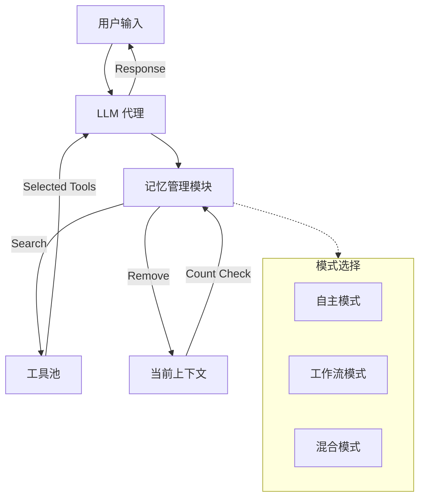

# MemTool：优化 LLM 代理多轮对话中动态工具调用的短期记忆管理

## 一、论文基础元数据
- 原文标题：MemTool: Optimizing Short-Term Memory Management for Dynamic Tool Calling in LLM Agent Multi-Turn Conversations
- 中文译版：MemTool：优化 LLM 代理多轮对话中动态工具调用的短期记忆管理
- 发表渠道：预印本（arXiv）
- 发表时间：2025 年
- 链接：https://arxiv.org/abs/2507.21428
- 作者及核心机构：Elias Lumer, Anmol Gulati 等；机构待补充
- 研究领域：人工智能（一级）+ 大语言模型代理/工具学习（二级）
- 关联数据集：ScaleMCP 基准（5000 个 MCP 服务器工具/英文/自动化标注）

## 二、论文综合评价
### 2.1 量化评分（1-5 分，5 分为最优）

| 评价维度 | 评分 | 备注 |
| -------- | ---- | ---- |
| 📚 理论基础 | ⭐⭐⭐⭐ | 聚焦短期记忆管理，理论扎实 |
| 🎯 问题核心性 | ⭐⭐⭐⭐⭐ | 直击多轮对话上下文溢出痛点 |
| 💡 方法创新性 | ⭐⭐⭐⭐ | 提出动态移除机制与三种模式 |
| ⚙️ 技术壁垒 | ⭐⭐⭐ | 依赖提示工程与架构设计 |
| 🧪 实验严谨性 | ⭐⭐⭐⭐⭐ | 涵盖 13+ 模型，对比充分 |
| 🔧 落地可行性 | ⭐⭐⭐⭐⭐ | 架构清晰，易于工程集成 |
| 🚀 应用前景 | ⭐⭐⭐⭐⭐ | 适用于所有长会话 Agent 场景 |
| 📊 综合评分 | 4.4 | 实验充分且工程指导意义显著 |

### 2.2 定性综合评价（≤300 字）
> 核心概括：研究定位、核心价值、差异化优势、关键结论

本研究定位为大语言模型代理的短期记忆管理框架，核心解决多轮对话中工具上下文积累导致超出 API 限制的问题。其差异化优势在于首次将“工具移除”纳入短期记忆管理范畴，并提出了自主、工作流、混合三种架构模式以适应不同模型能力。关键结论表明，中小模型无法自主可靠管理工具上下文，需采用混合或工作流模式；而推理模型在自主模式下表现优异。该研究为构建长会话、多工具 LLM 代理提供了具体的架构指导和评估基准，具有极高的工程落地价值。

## 三、领域本体论映射
| 核心维度 | 具体内容 |
| -------- | -------- |
| 核心研究对象 | LLM 代理在多轮对话中的短期工具记忆 |
| 核心技术路径 | 动态工具添加（Search）与移除（Remove）机制 |
| 数据/载体形态 | MCP 服务器工具列表、对话历史上下文 |
| 核心功能目标 | 防止工具数量超出 API 限制，保持任务完成率 |
| 验证核心指标 | 工具移除率、平均残留工具数、任务完成度 |

## 四、核心问题与解决方案
### 4.1 待解决的核心问题
1. **领域级根本问题**：LLM 代理在多轮对话中受限于上下文窗口，工具数量积累会导致超出 API 限制（如 128 个）。
2. **现有方法痛点**：现有研究多关注工具检索（RAG），缺乏对会话内动态工具移除的管理，导致无关工具干扰推理。
3. **工程落地卡点**：缺乏针对会话级动态工具上下文的短期记忆管理框架，中小模型无法自主清理上下文。

### 4.2 核心解决方案
- 理论框架：短期记忆管理框架（Short-Term Memory Management Framework）。
- 核心架构：赋予代理动态添加和移除工具的能力，防止上下文溢出。
- 关键技术：三种架构模式（自主、工作流、混合）适配不同模型能力。
- 创新机制：将“工具移除”操作显式化为代理或工作流的核心职能。

### 4.3 核心优势（量化+定性）
1. 性能优势：混合模式下，推理模型（如 o3）工具移除率达 100%，任务完成度 87%。
2. 效率优势：工作流模式在所有模型上均保持一致的高工具移除率（>90%），无超限风险。
3. 工程优势：提供了明确的模式选择建议，可根据模型能力平衡灵活性与稳定性。

## 五、方法与技术架构
### 5.1 核心架构设计
MemTool 框架核心在于引入记忆管理模块，控制工具上下文的增减。根据控制权不同，分为三种模式：自主模式由代理全权负责；工作流模式由系统确定性流程控制；混合模式由系统负责移除，代理负责搜索。

### 5.2 关键技术实现细节
| 技术模块 | 实现路径 | 工程注意事项 |
| -------- | -------- | ------------ |
| 工具搜索 | 代理自主调用 Search 工具或工作流触发 | 需防止过度搜索导致溢出 |
| 工具移除 | 代理自主调用 Remove 或专用 LLM 剪枝 | 系统提示词需包含当前工具计数 |
| 上下文监控 | 实时统计当前工具数量 | 阈值建议标准化为 128 以内 |
| 依赖组件 | ScaleMCP 基准、13+ SOTA LLM 模型 | 需适配不同模型的 API 限制 |

### 5.3 架构优缺点
- 优点：有效防止上下文溢出，适配不同能力模型，混合模式平衡性好。
- 缺点：自主模式依赖强推理模型，工作流模式限制了代理的回溯探索能力。

## 六、实验设计与结果分析
### 6.1 实验基础设置
| 维度 | 内容 |
| ---- | ---- |
| 数据集 | 100 个连续多轮对话，基于 ScaleMCP 基准 |
| 基线方法 | 传统无管理代理、自主管理模式 |
| 实验环境 | 13+ 种 SOTA 模型（OpenAI, Claude, Gemini, LLaMA 等） |
| 评价指标 | 移除率、平均残留工具数、任务完成度、工具正确率 |

### 6.2 核心实验结果
| 方法 | 核心指标 1(移除率) | 核心指标 2(任务完成) | 工程指标（算力/耗时） |
| ---- | --------- | --------- | -------------------- |
| 自主模式 (中小模型) | 0%-6% | 60% (GPT-4.1 Nano) | 低，但易报错超限 |
| 自主模式 (推理模型) | 90%-94% | 高 (o3/Gemini 2.5 Pro) | 高，推理成本高 |
| 本文方法 (混合模式) | >90% (o3 达 100%) | 87%-88% (o3/Claude 3.7) | 中等，稳定性高 |

### 6.3 消融实验/鲁棒性分析
| 实验变体 | 指标变化 | 核心结论 |
| -------- | -------- | -------- |
| 系统提示词无计数 | 移除率极差 | 必须动态传入当前工具计数变量 |
| 工具上限设为 256+ | 移除率下降 | 建议标准化限制在 128 以内测试鲁棒性 |
| 混合模式变体 | 任务完成度波动 | 需配合剪枝策略防止代理搜索过多 |

### 6.4 实验结论（工程视角）
中小模型在自主模式下极易导致上下文爆炸，生产环境推荐工作流模式以保证可靠性；若追求高性能且使用推理模型，混合模式为最佳选择。系统提示词中必须包含当前工具数量变量以提升移除意识。

## 七、领域贡献与创新点
| 贡献层级 | 具体内容 |
| -------- | -------- |
| 理论贡献 | 定义了 LLM 代理会话级短期工具记忆管理问题 |
| 方法/架构贡献 | 提出了自主、工作流、混合三种管理架构模式 |
| 数据/工具贡献 | 基于 ScaleMCP 基准构建了多轮对话评估场景 |
| 实验/验证贡献 | 在 13+ 模型上验证了不同模式的有效性与差异 |
| 工程落地贡献 | 提供了模型选择、提示工程及模式演进的具体建议 |

## 八、局限性与风险
| 维度 | 具体描述 | 应对思路 |
| ---- | -------- | -------- |
| 学术局限性 | 自主模式依赖强推理模型，中小模型表现差 | 采用混合或工作流模式规避模型能力短板 |
| 工程落地风险 | 混合模式若代理搜索过多仍可能突破限制 | 增加额外剪枝 LLM 介入或硬限制截断 |
| 伦理/合规风险 | 工具移除可能导致关键信息丢失 | 建立工具重要性评分机制，优先移除低权工具 |

## 九、未来研究/落地方向
| 方向类型 | 具体内容 | 优先级 |
| -------- | -------- | ------ |
| 科研拓展 | 结合长期记忆技术进步，优化跨会话工具管理 | 中 |
| 工程优化 | 开发自动化工具计数与剪枝中间件 | 高 |
| 跨领域适配 | 适配不同 API 提供商的工具数量限制策略 | 高 |

## 十、关键词与术语表
| 语言 | 关键词 |
| ---- | ------ |
| 中文 | 短期记忆管理、工具调用、多轮对话、上下文限制、代理架构 |
| 英文 | Short-Term Memory, Tool Calling, Multi-Turn Conversations, Context Window, Agent Architecture |
| 领域专属术语 | ScaleMCP：包含 5000 个 MCP 服务器工具的评估基准；移除率：衡量记忆管理效率的指标 |

## 十一、参考文献与关联资源
- 核心参考文献：待补充（原文未列出具体引用文献列表）
- 补充阅读：ScaleMCP Benchmark 相关文档
- 开源代码/工具：待补充（原文未提及代码开源链接）

## 十二、阅读者批注
1. **科研启发**：记忆管理不应仅限于文本上下文，工具上下文的动态维护同样关键，尤其是“移除”机制的研究较少。
2. **工程落地思考**：在生产环境中，不应盲目信任模型的自主管理能力，对于非推理模型，必须引入确定性工作流进行内存管控。
3. **待验证/存疑点**：混合模式中“额外剪枝策略”的具体实现细节原文未深入展开，需工程实践验证。
4. **个人/团队应用场景**：适用于构建需要长期交互且工具库庞大的企业级 Agent 系统，防止会话中途因上下文超限崩溃。

## 十三、阅读元信息
| 维度 | 内容 |
| ---- | ---- |
| 阅读日期 | 2026-04-08 12:10 |
| 阅读人 | xPaperReader AI |
| 文档编号 | arxiv-2507.21428 |
| 版本迭代 | v1.0 |