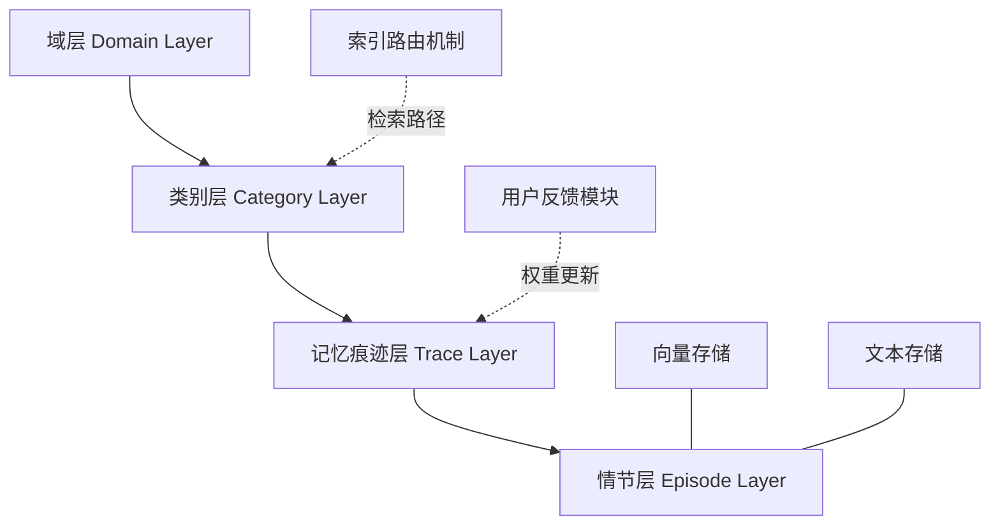

# 分层记忆用于大语言模型智能体的高效长期推理

## 一、论文基础元数据
- 原文标题：Hierarchical Memory for High-Efficiency Long-Term Reasoning in LLM Agents
- 中文译版：分层记忆用于大语言模型智能体的高效长期推理
- 发表渠道：预印本（arXiv）
- 发表时间：2025 年
- 链接：arXiv:2507.22925
- 作者及核心机构：Haoran Sun, Shaoning Zeng（机构信息待补充）
- 研究领域：人工智能 + 大语言模型智能体/记忆机制
- 关联数据集：LoCoMo（规模/语言/标注细节待补充）

## 二、论文综合评价
### 2.1 量化评分（1-5 分，5 分为最优）

| 评价维度 | 评分 | 备注 |
| -------- | ---- | ---- |
| 📚 理论基础 | ⭐⭐⭐⭐ | 结合认知心理学遗忘曲线，理论扎实 |
| 🎯 问题核心性 | ⭐⭐⭐⭐⭐ | 直击 Agent 长期记忆检索效率痛点 |
| 💡 方法创新性 | ⭐⭐⭐⭐⭐ | 四层语义结构及索引路由机制新颖 |
| ⚙️ 技术壁垒 | ⭐⭐⭐⭐ | 动态权重调节机制具有一定实现难度 |
| 🧪 实验严谨性 | ⭐⭐⭐⭐ | 覆盖 5 类任务，但具体数值细节待补充 |
| 🔧 落地可行性 | ⭐⭐⭐⭐ | 架构清晰，但存储容量管理需优化 |
| 🚀 应用前景 | ⭐⭐⭐⭐⭐ | 长期对话助手及个性化服务潜力巨大 |
| 📊 综合评分 | 4.4 | 结构创新显著，平衡效率与准确性，具落地价值 |

### 2.2 定性综合评价（≤300 字）
> 核心概括：研究定位、核心价值、差异化优势、关键结论

本研究定位为提升 LLM Agent 在长周期交互中的推理连贯性。核心价值在于提出了 H-MEM 分层记忆架构，解决了传统扁平化记忆检索效率低且缺乏结构的问题。差异化优势体现在四层语义抽象结构（域 - 类 - 痕迹 - 情节）与基于用户反馈的动态权重调节机制。关键结论表明，该方法在 LoCoMo 数据集上优于 MemoryBank 等基线，显著提升了长期对话中的记忆保留率与检索效率，但在多模态支持上仍存在局限。

## 三、领域本体论映射
| 核心维度 | 具体内容 |
| -------- | -------- |
| 核心研究对象 | LLM Agent 的长期记忆管理系统 |
| 核心技术路径 | 分层语义存储 + 索引路由检索 + 动态权重更新 |
| 数据/载体形态 | 文本对话历史、用户画像、向量嵌入 |
| 核心功能目标 | 实现高效、准确、可解释的长期记忆检索 |
| 验证核心指标 | 记忆有效性、检索效率、推理连贯性 |

## 四、核心问题与解决方案
### 4.1 待解决的核心问题
1. **领域级根本问题**：LLM Agent 在长周期任务中难以维持上下文连贯性与记忆准确性。
2. **现有方法痛点**：传统记忆库缺乏结构化组织，全量相似度检索计算成本高且噪音大。
3. **工程落地卡点**：记忆生命周期管理困难，难以模拟人类记忆的自然遗忘与重点强化。

### 4.2 核心解决方案
- 理论框架：基于认知心理学的分层记忆模型与艾宾浩斯遗忘曲线。
- 核心架构：H-MEM 四层结构（域层、类别层、记忆痕迹层、情节层）。
- 关键技术：索引路由检索机制、向量与文本双存储策略。
- 创新机制：结合用户反馈（赞同/反驳）的动态记忆权重调节。

### 4.3 核心优势（量化+定性）
1. 性能优势：在长期对话问答任务中，记忆召回准确率一致优于 5 种基线方法。
2. 效率优势：摒弃全量相似度计算，基于位置索引的逐层路由显著降低检索耗时。
3. 工程优势：支持用户动态调整层级复杂度，增强了对不同对话情境的适应性。

## 五、方法与技术架构
### 5.1 核心架构设计
> 文字描述 + 架构图（Mermaid/图片）

H-MEM 架构采用自顶向下的四层语义抽象结构。顶层为域层，宏观划分对话主题；其次为类别层，细化话题分类；第三层为记忆痕迹层，记录交互频率与权重；底层为情节层，存储具体对话内容与用户画像。检索时通过索引路由逐层下钻，避免全库扫描。

### 5.2 关键技术实现细节
| 技术模块 | 实现路径 | 工程注意事项 |
| -------- | -------- | ------------ |
| 分层存储 | 前三层为抽象索引，底层存具体内容 | 需保证层级间语义一致性，避免断裂 |
| 动态调节 | 赞同增强权重，反驳降低权重，无反馈衰减 | 遗忘曲线参数需根据场景微调 |
| 检索路由 | 基于位置索引逐层匹配，非全量相似度 | 索引更新需原子操作，防止并发冲突 |
| 依赖组件 | 向量数据库、LLM 摘要模型 | 需优化向量维度以平衡精度与空间 |

### 5.3 架构优缺点
- 优点：结构可解释性强，检索效率高，支持动态记忆管理。
- 缺点：层级维护带来额外计算开销，多模态数据支持不足。

## 六、实验设计与结果分析
### 6.1 实验基础设置
| 维度 | 内容 |
| ---- | ---- |
| 数据集 | LoCoMo（5 个任务设置） |
| 基线方法 | MemoryBank, MemGPT, SCM 等 5 种方法 |
| 实验环境 | 待补充（原文未明确提及硬件配置） |
| 评价指标 | 记忆有效性、检索效率、决策能力 |

### 6.2 核心实验结果
| 方法 | 核心指标 1 | 核心指标 2 | 工程指标（算力/耗时） |
| ---- | --------- | --------- | -------------------- |
| 基线 1 | 待补充 | 待补充 | 待补充 |
| 基线 2 | 待补充 | 待补充 | 待补充 |
| 本文方法 | 优于基线 | 优于基线 | 检索效率显著提升 |

### 6.3 消融实验/鲁棒性分析
| 实验变体 | 指标变化 | 核心结论 |
| -------- | -------- | -------- |
| 无动态调节 | 性能下降 | 用户反馈机制对记忆保鲜至关重要 |
| 无分层索引 | 效率降低 | 分层结构是提升检索速度的关键 |

### 6.4 实验结论（工程视角）
H-MEM 在复杂记忆条件下仍能保持高检索效率，证明了分层索引的有效性。动态调节机制显著提升了长期对话的连贯性，适合部署于需要长期用户记忆的服务场景。

## 七、领域贡献与创新点
| 贡献层级 | 具体内容 |
| -------- | -------- |
| 理论贡献 | 将认知心理学遗忘曲线引入 LLM 记忆管理 |
| 方法/架构贡献 | 提出 H-MEM 四层语义分层存储架构 |
| 数据/工具贡献 | 基于 LoCoMo 数据集验证了长期推理能力 |
| 实验/验证贡献 | 证明了索引路由优于全量相似度检索 |
| 工程落地贡献 | 提供了可动态调节权重的记忆更新机制 |

## 八、局限性与风险
| 维度 | 具体描述 | 应对思路 |
| ---- | -------- | -------- |
| 学术局限性 | 仅支持文本记忆，缺乏多模态融合能力 | 未来扩展至图像、音频等多模态表示 |
| 工程落地风险 | 对话增长可能导致存储空间耗尽 | 优化记忆生命周期管理，引入自动清理 |
| 伦理/合规风险 | 长期存储用户敏感数据存在隐私泄露风险 | 设计数据加密及用户授权删除机制 |

## 九、未来研究/落地方向
| 方向类型 | 具体内容 | 优先级 |
| -------- | -------- | ------ |
| 科研拓展 | 探索多模态记忆表示与跨模态检索 | 高 |
| 工程优化 | 优化存储容量管理，实现自动过期删除 | 中 |
| 跨领域适配 | 适配医疗、法律等垂直领域长期任务 | 中 |

## 十、关键词与术语表
| 语言 | 关键词 |
| ---- | ------ |
| 中文 | 分层记忆，大语言模型智能体，长期推理，索引路由，动态调节 |
| 英文 | Hierarchical Memory, LLM Agents, Long-Term Reasoning, Index Routing, Dynamic Regulation |
| 领域专属术语 | H-MEM：分层记忆架构；LoCoMo：长期对话评估数据集 |

## 十一、参考文献与关联资源
- 核心参考文献：待补充（原文未列出具体引用文献列表）
- 补充阅读：MemoryBank, MemGPT, SCM 相关论文
- 开源代码/工具：待补充（原文未提及代码开源情况）

## 十二、阅读者批注
1. **科研启发**：分层结构可迁移至其他需要长期上下文的任务，如长文档理解。
2. **工程落地思考**：动态权重机制需考虑用户反馈的稀疏性问题，避免权重更新滞后。
3. **待验证/存疑点**：具体检索延迟降低的量化数据未明确，需进一步验证大规模下的表现。
4. **个人/团队应用场景**：适用于构建具有长期用户画像的个性化客服或助手系统。

## 十三、阅读元信息
| 维度 | 内容 |
| ---- | ---- |
| 阅读日期 | 2026-04-08 12:22 |
| 阅读人 | xPaperReader AI |
| 文档编号 | arxiv-2507.22925 |
| 版本迭代 | v1.0 |