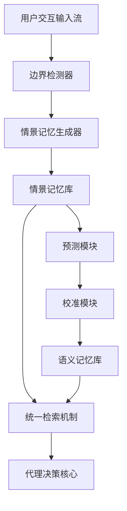

# Nemori：受认知科学启发的自组织代理记忆

## 一、论文基础元数据
- 原文标题：Nemori: Self-Organizing Agent Memory Inspired by Cognitive Science
- 中文译版：Nemori：受认知科学启发的自组织代理记忆
- 发表渠道（期刊/会议/预印本，标注等级）：预印本（arXiv）
- 发表时间：2025 年
- 链接（arXiv/DOI）：arXiv:2508.03341
- 作者及核心机构：Jiayan Nan, Wenquan Ma, Wenlong Wu, Yize Chen（机构待补充）
- 研究领域（一级领域 + 二级子领域）：人工智能 / 大模型代理与记忆系统
- 关联数据集（名称/规模/语言/标注）：LoCoMo（24K tokens/英文）、LongMemEvalS（105K tokens/英文）

## 二、论文综合评价
### 2.1 量化评分（1-5 分，5 分为最优）

| 评价维度 | 评分 | 备注 |
| -------- | ---- | ---- |
| 📚 理论基础 | ⭐⭐⭐⭐⭐ | 认知科学事件分割与自由能原理结合扎实 |
| 🎯 问题核心性 | ⭐⭐⭐⭐⭐ | 直击长程交互中代理失忆与记忆粒度痛点 |
| 💡 方法创新性 | ⭐⭐⭐⭐⭐ | 双步对齐与预测校准原则具有显著创新性 |
| ⚙️ 技术壁垒 | ⭐⭐⭐⭐ | 依赖多次 LLM 调用，架构复杂度中等偏高 |
| 🧪 实验严谨性 | ⭐⭐⭐⭐ | 基准测试全面，但单会话场景表现略受限 |
| 🔧 落地可行性 | ⭐⭐⭐⭐ | 显著降低 Token 消耗，适合资源受限场景 |
| 🚀 应用前景 | ⭐⭐⭐⭐⭐ | 为长程自主代理提供核心记忆演化路径 |
| 📊 综合评分 | 4.6 | 理论与实验兼备，长上下文效率优势显著 |

### 2.2 定性综合评价（≤300 字）
> 核心概括：研究定位、核心价值、差异化优势、关键结论

本研究定位为解决大模型代理在长程交互中的“失忆”与记忆结构混乱问题。核心价值在于将记忆构建从被动存储重构为主动学习过程，引入认知科学机制实现自组织。差异化优势体现在“双步对齐”解决语义粒度问题，“预测 - 校准”实现知识主动进化。关键结论表明，该方法在长上下文场景下准确率优于全量上下文基线，且 Token 用量减少约 96%，证明了结构化记忆机制在复杂任务中的高效性与必要性。

## 三、领域本体论映射
| 核心维度 | 具体内容 |
| -------- | -------- |
| 核心研究对象 | 大语言模型代理的长程记忆系统 |
| 核心技术路径 | 认知科学启发的自组织架构（情景 + 语义双记忆） |
| 数据/载体形态 | 结构化叙事元组、蒸馏知识语句、向量嵌入 |
| 核心功能目标 | 实现记忆的持久化、结构化存储与主动进化 |
| 验证核心指标 | 准确率（LLM-judge）、Token 消耗量、检索效率 |

## 四、核心问题与解决方案
### 4.1 待解决的核心问题
1. **领域级根本问题**：
   代理在长程交互中缺乏持久记忆，导致上下文窗口溢出或关键信息丢失（代理失忆）。
2. **现有方法痛点**：
   记忆单元粒度任意（固定大小或单消息），破坏语义完整性；知识提取被动，缺乏主动学习进化能力。
3. **工程落地卡点**：
   全量上下文成本高昂，传统 RAG 检索缺乏语义连贯性，难以支持复杂推理。

### 4.2 核心解决方案
- 理论框架：基于事件分割理论（边界检测）与自由能原理（预测误差最小化）。
- 核心架构：双重记忆架构（情景记忆存储细节，语义记忆存储蒸馏知识）。
- 关键技术：双步对齐原则（边界 + 表示）、预测 - 校准原则（主动知识蒸馏）。
- 创新机制：通过预测差距识别新颖信息，实现知识库的主动更新而非被动堆叠。

### 4.3 核心优势（量化 + 定性）
1. 性能优势：在 LongMemEvalS 数据集上，准确率比全量上下文基线提升约 9%。
2. 效率优势：相比全量上下文，Token 用量减少 95-96%，显著降低推理成本。
3. 工程优势：结构化记忆避免了信息稀释，支持更长的交互历史与复杂推理任务。

## 五、方法与技术架构
### 5.1 核心架构设计
> 文字描述 + 架构图（Mermaid/图片）

Nemori 架构包含输入处理、记忆生成、记忆进化与检索四个模块。输入流经过边界检测生成情景记忆，随后通过预测 - 校准循环蒸馏语义记忆，最终通过统一检索机制支持代理决策。

### 5.2 关键技术实现细节
| 技术模块 | 实现路径 | 工程注意事项 |
| -------- | -------- | ------------ |
| 边界检测 | 使用 LLM 作为检测器，识别语义转移或缓冲区满 | 需调整置信度阈值，避免过度分割 |
| 情景生成 | 将原始片段转化为第三人称叙事元组 | 保持叙事连贯性，保留关键上下文细节 |
| 预测校准 | 基于新标题检索旧记忆，对比预测与原始片段 | 需保留原始片段用于对比，防止信息丢失 |
| 依赖组件 | 嵌入模型（text-embedding-3-small）、LLM 接口 | 注意 API 调用延迟与成本平衡 |

### 5.3 架构优缺点
- 优点：
  1. 语义完整性高，避免碎片化存储。
  2. 支持知识主动进化，减少冗余信息。
  3. 大幅降低上下文窗口压力。
- 缺点：
  1. 架构复杂度较高，涉及多次 LLM 调用。
  2. 单会话细粒度细节可能因蒸馏而丢失。

## 六、实验设计与结果分析
### 6.1 实验基础设置
| 维度 | 内容 |
| ---- | ---- |
| 数据集 | LoCoMo（24K tokens）、LongMemEvalS（105K tokens） |
| 基线方法 | Full Context, RAG-4096, LangMem, Zep, Mem0 |
| 实验环境 | 使用 gpt-4o-mini, gpt-4.1-mini 等模型 |
| 评价指标 | LLM-judge score, F1, BLEU-1, Token 消耗量 |

### 6.2 核心实验结果
| 方法 | 核心指标 1（准确率） | 核心指标 2（准确率） | 工程指标（算力/耗时） |
| ---- | --------- | --------- | -------------------- |
| Full-Context (gpt-4o-mini) | 55.0% | - | ~101K tokens |
| Full-Context (gpt-4.1-mini) | 65.6% | - | ~101K tokens |
| 本文方法 (gpt-4o-mini) | 64.2% | - | 3.7-4.8K tokens |
| 本文方法 (gpt-4.1-mini) | 74.6% | - | 3.7-4.8K tokens |

### 6.3 消融实验/鲁棒性分析
| 实验变体 | 指标变化 | 核心结论 |
| -------- | -------- | -------- |
| 移除框架 | 性能归零 | 框架整体有效性得到验证 |
| 无预测校准 | 性能下降 | 预测校准原则优于直接提取 |
| 移除情景记忆 | 性能下降 | 情景与语义记忆互补，情景影响更大 |
| 检索窗口 k>10 | 边际效益递减 | 小而精准的检索窗口即可达近优性能 |

### 6.4 实验结论（工程视角）
在资源受限或高复杂度场景下，智能记忆系统比单纯依赖模型上下文窗口更具优势。最佳配置为情景记忆检索量 k=10，语义记忆检索量 m=20。

## 七、领域贡献与创新点
| 贡献层级 | 具体内容 |
| -------- | -------- |
| 理论贡献 | 将事件分割理论与自由能原理引入代理记忆构建 |
| 方法/架构贡献 | 提出双步对齐与预测 - 校准原则，实现记忆自组织 |
| 数据/工具贡献 | 在长上下文基准上验证了结构化记忆的有效性 |
| 实验/验证贡献 | 证明了记忆系统在长场景下优于全量上下文基线 |
| 工程落地贡献 | 提供了一套降低 96% 上下文成本的高效记忆方案 |

## 八、局限性与风险
| 维度 | 具体描述 | 应对思路 |
| ---- | -------- | -------- |
| 学术局限性 | 单会话助手任务上可能丢失部分细粒度细节 | 结合原始日志备份或调整蒸馏粒度 |
| 工程落地风险 | 多次 LLM 调用增加延迟与初始成本 | 优化边界检测频率，使用小模型检测 |
| 伦理/合规风险 | 记忆存储可能涉及用户隐私数据 | 实施数据加密与访问控制机制 |

## 九、未来研究/落地方向
| 方向类型 | 具体内容 | 优先级 |
| -------- | -------- | ------ |
| 科研拓展 | 探索更多认知科学原理（如遗忘曲线）的应用 | 中 |
| 工程优化 | 优化边界检测算法，减少 LLM 调用次数 | 高 |
| 跨领域适配 | 适配多模态交互场景（语音、视频记忆） | 中 |

## 十、关键词与术语表
| 语言 | 关键词 |
| ---- | ------ |
| 中文 | 自组织记忆、代理失忆、双步对齐、预测校准、情景记忆 |
| 英文 | Self-Organizing Memory, Agent Amnesia, Two-Step Alignment, Predict-Calibrate, Episodic Memory |
| 领域专属术语 | 双步对齐原则：基于事件分割的边界与表示对齐机制；预测 - 校准原则：基于预测差距的知识蒸馏机制 |

## 十一、参考文献与关联资源
- 核心参考文献：待补充（原文未提供具体引用列表）
- 补充阅读：认知科学中的事件分割理论、自由能原理相关文献
- 开源代码/工具：待补充（原文未提供代码链接）

## 十二、阅读者批注
1. **科研启发**：
   将认知科学原理（如事件分割）转化为具体的算法模块是提升代理智能的有效路径，值得在其他模块（如规划）中借鉴。
2. **工程落地思考**：
   虽然 Token 节省显著，但需权衡边界检测带来的额外延迟，适合对成本敏感但延迟容忍度较高的长程任务。
3. **待验证/存疑点**：
   在极长周期（如数月）的交互中，语义记忆库的检索效率是否会随数据量增加而下降，需进一步验证。
4. **个人/团队应用场景**：
   适用于个人助理、长期陪伴型机器人、复杂任务自动化流程等需要长期记忆的场景。

## 十三、阅读元信息
| 维度 | 内容 |
| ---- | ---- |
| 阅读日期 | 2026-04-08 12:47 |
| 阅读人 | xPaperReader AI |
| 文档编号 | arxiv-2508.03341 |
| 版本迭代 | v1.0 |