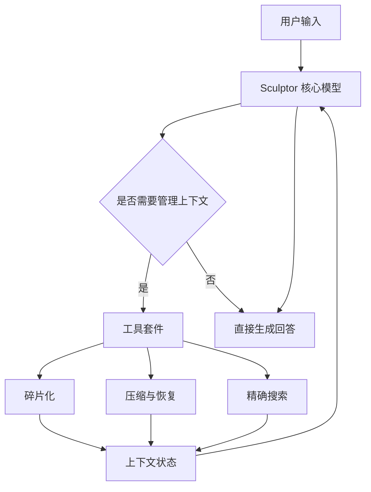

# Sculptor：通过主动上下文管理赋予大语言模型认知代理能力

## 一、论文基础元数据
- 原文标题：Sculptor: Empowering LLMs with Cognitive Agency via Active Context Management
- 中文译版：Sculptor：通过主动上下文管理赋予大语言模型认知代理能力
- 发表渠道：预印本（arXiv）
- 发表时间：2025 年
- 链接：https://arxiv.org/abs/2508.04664
- 作者及核心机构：Mo Li, L.H. Xu, Qitai Tan, Long Ma, Ting Cao, Yunxin Liu（机构待补充）
- 研究领域：人工智能（大语言模型/长上下文处理）
- 关联数据集：PI-LLM, NeedleBench, MRCR, LongBenchV2, FRAMES（多语言/多任务标注）

## 二、论文综合评价
### 2.1 量化评分（1-5 分，5 分为最优）

| 评价维度 | 评分 | 备注 |
| -------- | ---- | ---- |
| 📚 理论基础 | ⭐⭐⭐⭐ | 认知代理理论结合上下文管理，基础扎实 |
| 🎯 问题核心性 | ⭐⭐⭐⭐⭐ | 直击长上下文主动干扰核心痛点，极具价值 |
| 💡 方法创新性 | ⭐⭐⭐⭐⭐ | 提出主动上下文管理 ACM，理念差异显著 |
| ⚙️ 技术壁垒 | ⭐⭐⭐⭐ | 动态上下文感知 RL 训练具有较高技术门槛 |
| 🧪 实验严谨性 | ⭐⭐⭐⭐⭐ | 多基准测试对比充分，数据详实可信 |
| 🔧 落地可行性 | ⭐⭐⭐⭐ | 基于 13B 模型，工具调用确定性强，易部署 |
| 🚀 应用前景 | ⭐⭐⭐⭐ | 适用于长文档处理，复杂推理场景待验证 |
| 📊 综合评分 | 4.4 | 长上下文处理新范式，性能提升显著但复杂推理待优化 |

### 2.2 定性综合评价（≤300 字）
> 核心概括：研究定位、核心价值、差异化优势、关键结论

本研究定位为长上下文大模型优化，核心价值在于提出主动上下文管理（ACM）范式。差异化优势在于赋予模型内部认知代理能力，通过可逆工具管理记忆而非依赖外部检索。关键结论表明，显式移除干扰内容能有效缓解注意力稀释，在信息稀疏任务中准确率提升显著，但在复杂推理基准上仍有优化空间，证明了内部上下文优化的有效性。

## 三、领域本体论映射
| 核心维度 | 具体内容 |
| -------- | -------- |
| 核心研究对象 | 大语言模型长上下文工作记忆 |
| 核心技术路径 | 主动上下文管理（ACM）+ 强化学习 |
| 数据/载体形态 | 文本序列、上下文片段、工具调用轨迹 |
| 核心功能目标 | 消除主动干扰，提升关键信息注意力聚焦 |
| 验证核心指标 | 任务准确率、上下文压缩率、注意力提升比例 |

## 四、核心问题与解决方案
### 4.1 待解决的核心问题
1. **领域级根本问题**：大模型在处理长上下文时，早期无关信息干扰推理（主动干扰），导致性能下降。
2. **现有方法痛点**：依赖外部记忆或单纯扩大窗口，无法解决内部注意力稀释，且存在信息不可逆丢失风险。
3. **工程落地卡点**：长上下文推理计算成本高，传统注意力机制难以动态过滤冗余信息。

### 4.2 核心解决方案
- 理论框架：认知代理（Cognitive Agency）理论，模拟人类主动管理工作记忆。
- 核心架构：Sculptor 框架，包含 6 种可逆上下文管理工具。
- 关键技术：动态上下文感知 GSPO 强化学习，增量损失设计。
- 创新机制：显式上下文控制策略，支持折叠、摘要、恢复等操作。

### 4.3 核心优势（量化+定性）
1. 性能优势：PI-LLM 准确率从 22.5% 提升至 99.4%，NeedleBench 从 30.0% 提升至 84.8%。
2. 效率优势：上下文压缩率最高达 89.0%，降低注意力计算复杂度。
3. 工程优势：工具操作确定性且可逆，保证信息不丢失，支持优雅降级。

## 五、方法与技术架构
### 5.1 核心架构设计
> 文字描述 + 架构图（Mermaid/图片）

Sculptor 架构由基座模型与工具套件组成。模型接收用户输入后，可调用工具对上下文进行分段、摘要、折叠或搜索。操作后的上下文状态反馈给模型，形成闭环管理。强化学习阶段采用动态信用分配确保训练稳定。

### 5.2 关键技术实现细节
| 技术模块 | 实现路径 | 工程注意事项 |
| -------- | -------- | ------------ |
| 工具套件 | 6 种基础工具，支持单轮多步调用 | 确保工具输出确定性，避免随机性干扰 |
| 强化学习 | 动态上下文感知 GSPO，增量损失设计 | 防止模型学习虚假工具触发模式 |
| 基座模型 | M3（13B 参数稠密模型） | 需具备强工具使用能力，从头预训练 |
| 依赖组件 | 无外部嵌入模型，自包含 | 保证部署稳定性，减少外部依赖 |

### 5.3 架构优缺点
- 优点：信息无损可逆，显著降低注意力干扰，计算效率随上下文压缩提升。
- 缺点：复杂推理任务增益有限，依赖基座模型固有的工具使用能力。

## 六、实验设计与结果分析
### 6.1 实验基础设置
| 维度 | 内容 |
| ---- | ---- |
| 数据集 | PI-LLM, NeedleBench, MRCR, LongBenchV2, FRAMES |
| 基线方法 | RAG (BM25), MemAgent, 原生 M3, SOTA 模型 (Claude/GPT) |
| 实验环境 | 待补充（通常为标准 GPU 集群） |
| 评价指标 | 准确率、上下文压缩率、注意力权重变化 |

### 6.2 核心实验结果
| 方法 | 核心指标 1 (PI-LLM) | 核心指标 2 (NeedleBench) | 工程指标（算力/耗时） |
| ---- | --------- | --------- | -------------------- |
| 基线 1 (M3) | 22.5% | 30.0% | 基准耗时 |
| 基线 2 (RAG) | 19.3% (综合) | 待补充 | 检索额外开销 |
| 本文方法 | 99.4% | 84.8% | 处理 20K token 快于 85K |

### 6.3 消融实验/鲁棒性分析
| 实验变体 | 指标变化 | 核心结论 |
| -------- | -------- | -------- |
| 折叠冗余内容 | 注意力提升 9.87% | 显式管理优于隐式学习 |
| 通用模型 + 提示 | 性能显著提升 | 工具泛化性强，但依赖模型能力 |
| 复杂推理任务 | 增益有限 | 选择性注意力对复杂推理帮助较小 |

### 6.4 实验结论（工程视角）
在信息稀疏的长上下文任务中，显式上下文管理能极大提升准确率并降低计算成本。但在复杂多跳推理场景中，需结合更细粒度的策略优化，避免过度过滤关键信息。

## 七、领域贡献与创新点
| 贡献层级 | 具体内容 |
| -------- | -------- |
| 理论贡献 | 提出主动上下文管理（ACM）范式，验证认知代理有效性 |
| 方法/架构贡献 | 设计 6 种可逆上下文管理工具，构建 Sculptor 框架 |
| 数据/工具贡献 | 生成优质工具使用轨迹数据，开源工具套件（待确认） |
| 实验/验证贡献 | 在多个长上下文基准上验证了注意力优化效果 |
| 工程落地贡献 | 证明了 13B 模型配合内部优化可超越更大模型配合外部检索 |

## 八、局限性与风险
| 维度 | 具体描述 | 应对思路 |
| ---- | -------- | -------- |
| 学术局限性 | 复杂长上下文基准（LongBenchV2）表现一般 | 探索更丰富的训练策略和奖励设计 |
| 工程落地风险 | 依赖基座模型工具能力，泛化性受限 | 加强基座模型的工具使用预训练 |
| 伦理/合规风险 | 上下文管理可能误删敏感信息 | 确保工具操作可逆，保留原始数据备份 |

## 九、未来研究/落地方向
| 方向类型 | 具体内容 | 优先级 |
| -------- | -------- | ------ |
| 科研拓展 | 应用于数学推理和代码生成，解决前缀锁定错误 | 高 |
| 工程优化 | 学习更细粒度的工具使用策略，提升复杂任务性能 | 高 |
| 跨领域适配 | 适配非长上下文领域，如多轮对话记忆管理 | 中 |

## 十、关键词与术语表
| 语言 | 关键词 |
| ---- | ------ |
| 中文 | 主动上下文管理，认知代理，长上下文，注意力干扰，强化学习 |
| 英文 | Active Context Management, Cognitive Agency, Long Context, Proactive Interference, RL |
| 领域专属术语 | 主动干扰（早期无关信息干扰推理）；增量损失设计（针对上下文非单调变化的损失分配） |

## 十一、参考文献与关联资源
- 核心参考文献：待补充（原文未列出具体引用列表）
- 补充阅读：关于长上下文注意力机制、RAG 技术、强化学习对齐相关研究
- 开源代码/工具：待补充（需关注作者后续开源情况）

## 十二、阅读者批注
1. **科研启发**：显式管理上下文比单纯扩大窗口更有效，可借鉴到多模态记忆管理中。
2. **工程落地思考**：工具调用的确定性设计非常关键，避免了传统 Agent 的不稳定性。
3. **待验证/存疑点**：在极度复杂的多跳推理任务中，折叠操作是否会导致隐含关联丢失需进一步验证。
4. **个人/团队应用场景**：适用于长文档问答系统、法律合同审查、代码库理解等场景。

## 十三、阅读元信息
| 维度 | 内容 |
| ---- | ---- |
| 阅读日期 | 2026-04-08 13:01 |
| 阅读人 | xPaperReader AI |
| 文档编号 | arxiv-2508.04664 |
| 版本迭代 | v1.0 |