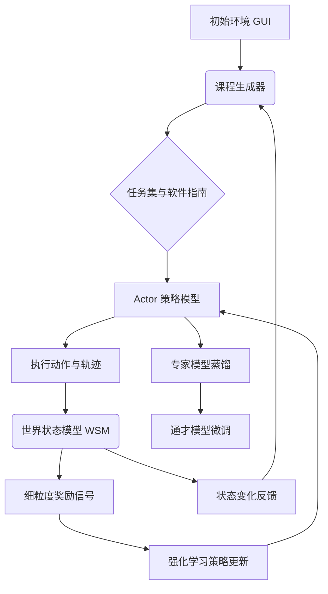

# SEAgent：基于经验自主学习的自进化计算机使用代理

## 一、论文基础元数据
- 原文标题：SEAgent: Self-Evolving Computer Use Agent with Autonomous Learning from Experience
- 中文译版：SEAgent：基于经验自主学习的自进化计算机使用代理
- 发表渠道：预印本（arXiv）
- 发表时间：2025 年
- 链接：arXiv:2508.04700
- 作者及核心机构：Zeyi Sun, Ziyu Liu, Yuhang Zang, Yuhang Cao, Xiaoyi Dong, Tong Wu, Dahua Lin, Jiaqi Wang（待补充具体机构，通常关联商汤/港中文等）
- 研究领域：人工智能 + 计算机使用代理/强化学习
- 关联数据集：OSWorld（5 款软件/未标注）、ScienceBoard（OOD 科学软件）、自构建轨迹数据（860 条标注 +1000 条状态描述）

## 二、论文综合评价
### 2.1 量化评分（1-5 分，5 分为最优）

| 评价维度 | 评分 | 备注 |
| -------- | ---- | ---- |
| 📚 理论基础 | ⭐⭐⭐⭐ | 强化学习与课程学习结合扎实 |
| 🎯 问题核心性 | ⭐⭐⭐⭐⭐ | 解决 CUA 依赖人工标注痛点 |
| 💡 方法创新性 | ⭐⭐⭐⭐⭐ | 自进化闭环与专家到通才策略 |
| ⚙️ 技术壁垒 | ⭐⭐⭐⭐ | 世界状态模型微调与奖励设计 |
| 🧪 实验严谨性 | ⭐⭐⭐⭐ | 多软件基准测试与消融实验充分 |
| 🔧 落地可行性 | ⭐⭐⭐ | 依赖高性能算力与复杂环境交互 |
| 🚀 应用前景 | ⭐⭐⭐⭐⭐ | 自动化办公与无障碍访问潜力大 |
| 📊 综合评分 | 4.3 | 自主进化框架显著突破，落地需优化 |

### 2.2 定性综合评价（≤300 字）
> 核心概括：研究定位、核心价值、差异化优势、关键结论

本研究定位为无需人工监督的计算机使用代理自进化框架。核心价值在于通过自主探索和经验学习，使代理能在无标注的新软件环境中从零掌握技能。差异化优势在于提出了高精度的世界状态模型（WSM）提供细粒度奖励，以及“专家到通才”的训练策略，解决了直接训练通才模型性能不佳的问题。关键结论显示，在 OSWorld 基准上，该方法将基线成功率从 11.3% 提升至 34.5%，证明了自主经验学习的有效性，为构建通用型自主代理提供了新路径。

## 三、领域本体论映射
| 核心维度 | 具体内容 |
| -------- | -------- |
| 核心研究对象 | 计算机使用代理（CUA）及其自进化能力 |
| 核心技术路径 | 强化学习（GRPO）+ 课程学习 + 世界状态模型 |
| 数据/载体形态 | 屏幕截图序列、动作轨迹、软件指南书 |
| 核心功能目标 | 在无人类标注下自主掌握陌生软件操作 |
| 验证核心指标 | 任务成功率（Success Rate）、奖励信号精度 |

## 四、核心问题与解决方案
### 4.1 待解决的核心问题
1. **领域级根本问题**：现有计算机使用代理依赖昂贵的人工标注数据，难以在无标注的新软件环境中自主进化。
2. **现有方法痛点**：传统强化学习面临奖励稀疏问题，直接训练通才模型性能不佳，难以系统性探索未知功能。
3. **工程落地卡点**：复杂环境下的状态评估困难，任务难度难以动态调整，导致训练效率低或陷入局部最优。

### 4.2 核心解决方案
- 理论框架：自主课程学习与强化学习闭环。
- 核心架构：包含世界状态模型、课程生成器、强化学习策略、专家到通才策略。
- 关键技术：基于 Qwen2.5-VL 微调的 WSM、GRPO 优化、对抗模仿学习。
- 创新机制：专家到通才（Specialist-to-Generalist）训练策略，先在单软件训练再蒸馏泛化。

### 4.3 核心优势（量化 + 定性）
1. 性能优势：OSWorld 基准测试成功率从 11.3% 提升至 34.5%。
2. 效率优势：无需人工标注，通过自主探索生成训练数据，降低数据成本。
3. 工程优势：自动生成软件使用手册，支持域外（OOD）软件泛化，如 ScienceBoard。

## 五、方法与技术架构
### 5.1 核心架构设计
> 文字描述 + 架构图（Mermaid/图片）

SEAgent 采用闭环自进化流程。世界状态模型（WSM）负责环境状态描述和步骤级轨迹评估，提供细粒度奖励信号。课程生成器动态生成难度递增的任务，维护软件指南记忆。强化学习策略利用 GRPO 优化成功步骤，结合对抗模仿学习惩罚失败动作。最终通过专家到通才策略，将单软件专家模型蒸馏到基座模型，实现多软件泛化。

### 5.2 关键技术实现细节
| 技术模块 | 实现路径 | 工程注意事项 |
| -------- | -------- | ------------ |
| 世界状态模型 | 基于 Qwen2.5-VL 微调，输入轨迹截图 | 需高质量轨迹数据过滤，防止噪声累积 |
| 课程生成器 | 基于 Qwen2.5-72B，维护软件指南记忆 | 控制任务多样性，避免上下文过长 |
| 强化学习策略 | GRPO 优化成功步骤，对抗模仿惩罚失败 | 损失平衡参数 gamma=0.2 效果最佳 |
| 依赖组件 | UI-TARS-7B-DPO 作为基座 Actor | 需 8x A100 显卡支持训练 |

### 5.3 架构优缺点
- 优点：无需人工标注，细粒度奖励解决稀疏性问题，专家到通才策略提升泛化能力。
- 缺点：依赖 WSM 的评估准确性，复杂长流程任务适配尚需验证，算力需求较高。

## 六、实验设计与结果分析
### 6.1 实验基础设置
| 维度 | 内容 |
| ---- | ---- |
| 数据集 | OSWorld（5 款软件）、ScienceBoard（OOD 科学软件） |
| 基线方法 | UI-TARS、WebRL、NNetNav、DigiRL |
| 实验环境 | 8x NVIDIA A100 (80G) |
| 评价指标 | 任务成功率（Success Rate）、奖励模型精度 |

### 6.2 核心实验结果
| 方法 | 核心指标 1 (OSWorld SR) | 核心指标 2 (OOD SR) | 工程指标（算力/耗时） |
| ---- | --------- | --------- | -------------------- |
| UI-TARS (基线) | 11.3% | 待补充 | 待补充 |
| WebRL | 待补充 | 3.03% (Celestia) | 待补充 |
| 本文方法 (SEAgent) | 34.5% | 12.12% (Celestia) | 8x A100, 3 阶段训练 |

### 6.3 消融实验/鲁棒性分析
| 实验变体 | 指标变化 | 核心结论 |
| -------- | -------- | -------- |
| 无 WSM 奖励 | 性能显著下降 | 细粒度步骤奖励是关键增益来源 |
| 仅专家 RL | 32.2% | 低于专家到通才策略 (34.5%) |
| 直接通才 RL | 30.6% | 证明分阶段训练必要性 |

### 6.4 实验结论（工程视角）
实验证明，结合世界状态模型的细粒度奖励与专家到通才的训练范式，能显著提升代理在未知软件环境中的成功率。生成任务数在 100 个左右达到性能平台期，变更描述数控制在 50-100 个最佳，过多会导致上下文质量下降。

## 七、领域贡献与创新点
| 贡献层级 | 具体内容 |
| -------- | -------- |
| 理论贡献 | 证明了自主经验学习可替代人工标注实现代理进化 |
| 方法/架构贡献 | 提出世界状态模型与专家到通才训练策略 |
| 数据/工具贡献 | 自动生成软件使用手册，构建高质量轨迹数据 |
| 实验/验证贡献 | 在 OSWorld 及 OOD 科学软件上验证了泛化能力 |
| 工程落地贡献 | 提供了无需人工干预的自动化任务解决框架 |

## 八、局限性与风险
| 维度 | 具体描述 | 应对思路 |
| ---- | -------- | -------- |
| 学术局限性 | 奖励信号依赖 GUI-Judge 而非环境真实信号，任务复杂度有限 | 引入环境真实反馈，拓展长流程任务测试 |
| 工程落地风险 | 算力需求高，复杂环境交互稳定性待验证 | 优化模型效率，增加异常处理机制 |
| 伦理/合规风险 | 可能被滥用于自动化攻击或未经授权操作 | 模型受控发布，部署行为过滤器与检测机制 |

## 九、未来研究/落地方向
| 方向类型 | 具体内容 | 优先级 |
| -------- | -------- | ------ |
| 科研拓展 | 适应数小时完成的复杂工作流，结合逆向指令生成策略 | 高 |
| 工程优化 | 降低算力需求，提升实时交互响应速度 | 中 |
| 跨领域适配 | 拓展至游戏及现实世界具身智能环境 | 中 |

## 十、关键词与术语表
| 语言 | 关键词 |
| ---- | ------ |
| 中文 | 自进化代理、计算机使用、强化学习、课程学习、世界状态模型 |
| 英文 | Self-Evolving Agent, Computer Use, Reinforcement Learning, Curriculum Learning, World State Model |
| 领域专属术语 | 专家到通才（Specialist-to-Generalist）：先在单任务优化再泛化的策略 |
| 领域专属术语 | 世界状态模型（WSM）：负责环境状态描述和步骤级轨迹评估的模型 |

## 十一、参考文献与关联资源
- 核心参考文献：UI-TARS, Qwen2.5-VL, OSWorld Benchmark, AgentRewardBench
- 补充阅读：WebRL, NNetNav, DigiRL 相关论文
- 开源代码/工具：待补充（论文发布后通常会在 arXiv 页面更新）

## 十二、阅读者批注
1. **科研启发**：自主构建知识体系（软件指南书）结合细粒度奖励反馈，是解决稀疏奖励环境的有效思路。
2. **工程落地思考**：自动生成软件手册功能具有极高商业价值，可降低用户学习成本，但需确保生成内容的准确性。
3. **待验证/存疑点**：在真实复杂企业软件（如 SAP、Oracle）中的表现未验证，长流程任务成功率待测。
4. **个人/团队应用场景**：适用于自动化测试、RPA 流程优化、无障碍辅助工具开发。

## 十三、阅读元信息
| 维度 | 内容 |
| ---- | ---- |
| 阅读日期 | 2026-04-08 13:14 |
| 阅读人 | xPaperReader AI |
| 文档编号 | arxiv-2508.04700 |
| 版本迭代 | v1.0 |