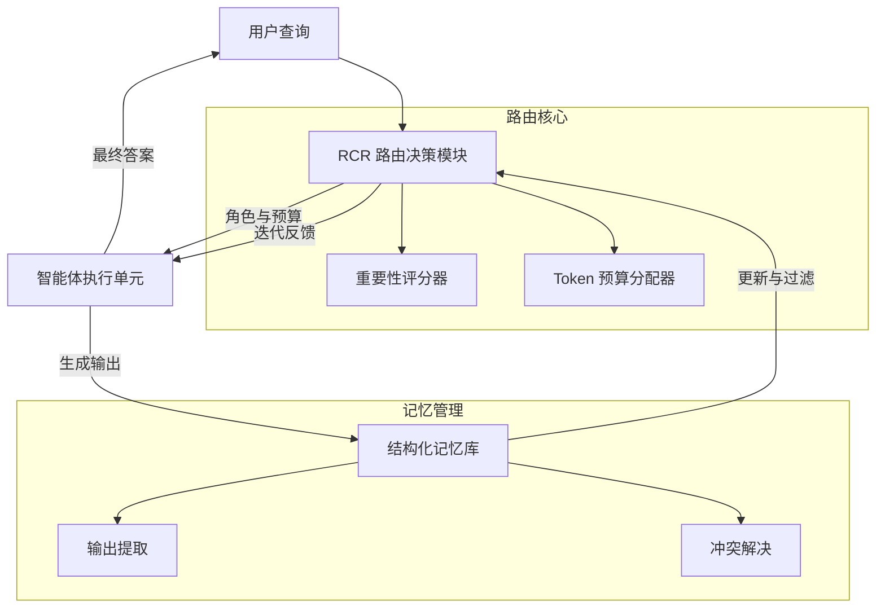

# RCR-Router：面向多智能体 LLM 系统的高效角色感知上下文路由与结构化记忆

## 一、论文基础元数据
- 原文标题：RCR-Router: Efficient Role-Aware Context Routing for Multi-Agent LLM Systems with Structured Memory
- 中文译版：RCR-Router：面向多智能体 LLM 系统的高效角色感知上下文路由与结构化记忆
- 发表渠道：预印本（arXiv）
- 发表时间：2025 年
- 链接（arXiv/DOI）：arXiv:2508.04903
- 作者及核心机构：Jun Liu, Zhenglun Kong 等 15 位作者；机构待补充（原文未明确列出）
- 研究领域（一级领域 + 二级子领域）：人工智能 / 多智能体系统与大语言模型
- 关联数据集（名称/规模/语言/标注）：HotPotQA, MuSiQue, 2wikimultihop（QA 任务）；ALFWorld, WebShop（交互任务）；英文/自动标注

## 二、论文综合评价
### 2.1 量化评分（1-5 分，5 分为最优）

| 评价维度 | 评分 | 备注 |
| -------- | ---- | ---- |
| 📚 理论基础 | ⭐⭐⭐⭐ | 证明路由问题为 NP-hard 及贪心最优性 |
| 🎯 问题核心性 | ⭐⭐⭐⭐⭐ | 直击多智能体上下文爆炸与冗余痛点 |
| 💡 方法创新性 | ⭐⭐⭐⭐ | 角色感知与结构化记忆结合动态路由 |
| ⚙️ 技术壁垒 | ⭐⭐⭐ | 基于启发式贪心算法，工程集成度高 |
| 🧪 实验严谨性 | ⭐⭐⭐⭐⭐ | 多基准测试，含消融与理论收敛证明 |
| 🔧 落地可行性 | ⭐⭐⭐⭐ | 模块化设计，支持主流 LLM 后端 |
| 🚀 应用前景 | ⭐⭐⭐⭐⭐ | 适用于复杂任务规划与多智能体协作 |
| 📊 综合评分 | 4.3 | 理论实验扎实，显著降低成本提升性能 |

### 2.2 定性综合评价（≤300 字）
> 核心概括：研究定位、核心价值、差异化优势、关键结论

本研究定位于解决多智能体 LLM 系统中的上下文管理瓶颈。核心价值在于提出了一种轻量级、角色感知且预算受限的动态路由机制（RCR-Router）。差异化优势在于将路由问题形式化为 0/1 背包问题，并结合结构化记忆与迭代反馈，实现了语义感知的上下文细化。关键结论表明，该方法在减少 25-47% Token 消耗的同时，显著提升了任务成功率与推理质量，证明了高效上下文管理对系统扩展的重要性。

## 三、领域本体论映射
| 核心维度 | 具体内容 |
| -------- | -------- |
| 核心研究对象 | 多智能体 LLM 系统中的上下文路由机制 |
| 核心技术路径 | 动态路由策略 + 重要性评分 + 结构化记忆更新 |
| 数据/载体形态 | 结构化记忆（YAML/图表）、自然语言文本 |
| 核心功能目标 | 降低 Token 消耗，提升任务成功率与推理质量 |
| 验证核心指标 | Token 用量、运行时间、F1 分数、答案质量评分 |

## 四、核心问题与解决方案
### 4.1 待解决的核心问题
1. **领域级根本问题**：多智能体系统规模化过程中的上下文管理瓶颈，导致信息冗余与成本过高。
2. **现有方法痛点**：静态路由缺乏适应性，全上下文路由导致 Token 消耗过高且包含无关信息。
3. **工程落地卡点**：上下文爆炸导致推理延迟增加，难以在资源受限环境下部署。

### 4.2 核心解决方案
- 理论框架：将最优上下文路由问题形式化为 0/1 背包问题（NP-hard）。
- 核心架构：模块化路由框架，包含重要性评分器、预算分配器与结构化记忆库。
- 关键技术：基于角色相关性、任务阶段优先级、近因性的启发式评分；贪心算法求解。
- 创新机制：迭代反馈循环，支持多轮交互中的上下文细化与记忆冲突解决。

### 4.3 核心优势（量化 + 定性）
1. 性能优势：HotPotQA F1 分数从 73.7% 提升至 82.4%，答案质量评分优于基线。
2. 效率优势：Token 消耗减少 25-47%，运行时间显著降低（如 HotPotQA 减少约 38%）。
3. 工程优势：架构模块化，支持不同 LLM 后端，易于扩展新角色与功能。

## 五、方法与技术架构
### 5.1 核心架构设计
RCR-Router 通过动态路由策略选择上下文，利用结构化记忆库存储关键信息，并通过迭代反馈不断优化路由决策。系统包含用户查询输入、路由决策模块、智能体执行模块及记忆更新模块。

### 5.2 关键技术实现细节
| 技术模块 | 实现路径 | 工程注意事项 |
| -------- | -------- | ------------ |
| 重要性评分器 | 结合角色相关性、任务阶段、近因性进行启发式评分 | 需平衡各维度权重，避免单一指标主导 |
| 预算分配器 | 限制每个智能体的输入长度，防止上下文爆炸 | 根据任务复杂度动态调整预算阈值 |
| 结构化记忆 | 存储 YAML/图表格式输出，进行相关性过滤与语义结构化 | 需设计高效的冲突解决机制以保证一致性 |
| 依赖组件 | 主流 LLM 后端（如 DeepSeek, GPT-4），API 调用接口 | 确保 API 稳定性与速率限制管理 |

### 5.3 架构优缺点
- 优点：显著降低计算成本，提升推理质量，模块化易于扩展，理论保证收敛性。
- 缺点：启发式评分在非均匀 Token 长度下可能非最优，路由逻辑本身引入少量延迟。

## 六、实验设计与结果分析
### 6.1 实验基础设置
| 维度 | 内容 |
| ---- | ---- |
| 数据集 | HotPotQA, MuSiQue, 2wikimultihop, ALFWorld, WebShop |
| 基线方法 | Full-Context Routing（全上下文）, Static Routing（静态路由） |
| 实验环境 | 多智能体协作环境，支持不同 LLM 后端调用 |
| 评价指标 | Token 用量、运行时间、F1 分数、答案质量评分（1-5 分） |

### 6.2 核心实验结果
| 方法 | 核心指标 1（F1/质量分） | 核心指标 2（Token 用量） | 工程指标（算力/耗时） |
| ---- | --------- | --------- | -------------------- |
| 基线 1（Full-Context） | HotPotQA F1 73.7% | 高（基准） | HotPotQA 150.65s |
| 基线 2（Static） | 质量分较低 | 中等 | 中等 |
| 本文方法（RCR） | HotPotQA F1 82.4% | 减少 25-47% | HotPotQA 93.52s |

### 6.3 消融实验/鲁棒性分析
| 实验变体 | 指标变化 | 核心结论 |
| -------- | -------- | -------- |
| 迭代次数变化 | 3 次迭代最佳，再多收益递减 | 效率与准确性平衡点在 3 次迭代 |
| Token 预算变化 | 单智能体 2048 Token 为拐点 | 性价比最优的预算配置 |
| 评分器移除 | 质量显著下降 | 重要性评分对路由决策至关重要 |

### 6.4 实验结论（工程视角）
RCR-Router 在实际工程中能显著降低 API 调用成本（Token）并减少用户等待时间（耗时），同时保持甚至提升任务完成质量，适合资源敏感型多智能体应用。

## 七、领域贡献与创新点
| 贡献层级 | 具体内容 |
| -------- | -------- |
| 理论贡献 | 证明路由问题为 NP-hard，提出贪心策略最优性条件及收敛性证明 |
| 方法/架构贡献 | 提出角色感知、预算受限的动态上下文路由框架 |
| 数据/工具贡献 | 构建了基于结构化记忆的多智能体协作流程 |
| 实验/验证贡献 | 在多个 QA 及交互基准上验证了有效性与效率 |
| 工程落地贡献 | 提供了模块化、模型无关的解决方案，易于集成 |

## 八、局限性与风险
| 维度 | 具体描述 | 应对思路 |
| ---- | -------- | -------- |
| 学术局限性 | 启发式算法在非均匀 Token 长度下未必全局最优 | 未来探索学习式路由策略 |
| 工程落地风险 | 路由逻辑本身增加系统复杂度，可能引入延迟 | 优化评分器计算效率，缓存常用路由 |
| 伦理/合规风险 | 依赖外部 LLM API，存在数据隐私风险 | 本地化部署模型，加强数据脱敏 |

## 九、未来研究/落地方向
| 方向类型 | 具体内容 | 优先级 |
| -------- | -------- | ------ |
| 科研拓展 | 探索学习式路由策略与自适应记忆更新机制 | 高 |
| 工程优化 | 基准测试压缩技术，支持嵌入式设备高效部署 | 中 |
| 跨领域适配 | 延伸至多模态智能体（医疗、3D 重建）及工具使用场景 | 高 |

## 十、关键词与术语表
| 语言 | 关键词 |
| ---- | ------ |
| 中文 | 多智能体系统、上下文路由、结构化记忆、Token 预算、角色感知 |
| 英文 | Multi-Agent Systems, Context Routing, Structured Memory, Token Budget, Role-Aware |
| 领域专属术语 | 0/1 背包问题（路由形式化）、LLM-as-a-Judge（评估范式）、单调记忆相关性（收敛性） |

## 十一、参考文献与关联资源
- 核心参考文献：待补充（原文未提供具体参考文献列表）
- 补充阅读：多智能体协作、上下文管理、RAG 相关研究
- 开源代码/工具：待补充（原文未提供代码链接）

## 十二、阅读者批注
1. **科研启发**：将路由问题形式化为组合优化问题（背包问题）提供了理论分析的新视角。
2. **工程落地思考**：结构化记忆（YAML/图表）比纯文本更利于长期存储与检索，值得在工程实践中推广。
3. **待验证/存疑点**：启发式评分权重的具体设定对结果影响较大，需在实际场景中调优。
4. **个人/团队应用场景**：适用于构建低成本、高效率的自动化客服或复杂任务规划 Agent 系统。

## 十三、阅读元信息
| 维度 | 内容 |
| ---- | ---- |
| 阅读日期 | 2026-04-08 15:46 |
| 阅读人 | xPaperReader AI |
| 文档编号 | arxiv-2508.04903 |
| 版本迭代 | v1.0 |