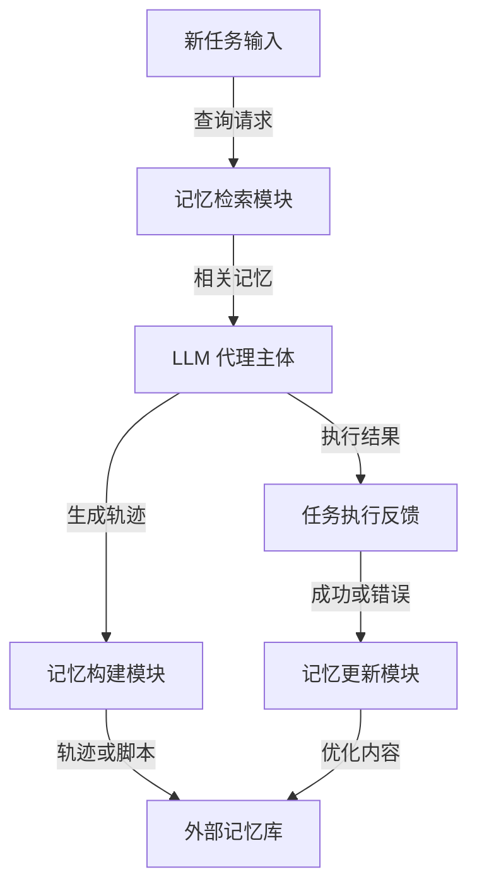

# Memp: 探索代理程序性记忆

## 一、论文基础元数据
- 原文标题：Memp: Exploring Agent Procedural Memory
- 中文译版：Memp: 探索代理程序性记忆
- 发表渠道：预印本（arXiv）
- 发表时间：2025 年
- 链接：arXiv: 2508.06433
- 作者及核心机构：Runnan Fang, Yuan Liang, Xiaobin Wang, Jialong Wu, Shuofei Qiao, Pengjun Xie, Fei Huang, Huajun Chen, Ningyu Zhang（[原文缺失]）
- 研究领域（一级领域 + 二级子领域）：人工智能 / 大语言模型代理
- 关联数据集（名称/规模/语言/标注）：TravelPlanner（复杂规划）、ALFWorld（家庭任务）/ [原文缺失] / 英文 / 环境反馈标注

## 二、论文综合评价
### 2.1 量化评分（1-5 分，5 分为最优）

**评分格式要求**：
- 前 7 个维度：评分列使用星星形式（⭐⭐⭐⭐⭐），备注列填写该维度的简短评价依据（10-20 字）
- 综合评分：评分列使用具体数字（如 4.3、4.7），备注列填写总体评价（10-30 字）

| 评价维度 | 评分 | 备注 |
| -------- | ---- | ---- |
| 📚 理论基础 | ⭐⭐⭐⭐ | 记忆分类清晰，程序性记忆定义明确 |
| 🎯 问题核心性 | ⭐⭐⭐⭐⭐ | 直击代理缺乏长期经验复用痛点 |
| 💡 方法创新性 | ⭐⭐⭐⭐ | 系统化构建检索更新闭环，机制新颖 |
| ⚙️ 技术壁垒 | ⭐⭐⭐ | 基于向量检索与提示工程，门槛适中 |
| 🧪 实验严谨性 | ⭐⭐⭐⭐ | 多模型多数据集验证，包含迁移实验 |
| 🔧 落地可行性 | ⭐⭐⭐⭐⭐ | 无需微调，仅需外部记忆库，易部署 |
| 🚀 应用前景 | ⭐⭐⭐⭐⭐ | 适用于长程任务与终身学习场景 |
| 📊 综合评分 | 4.3 | 框架完整实用，显著增强代理进化能力 |

### 2.2 定性综合评价（≤300 字）
> 核心概括：研究定位、核心价值、差异化优势、关键结论

本研究定位为任务无关的 LLM 代理框架，核心价值在于将程序性记忆作为核心优化目标，而非依赖参数微调。差异化优势在于系统化了记忆的构建、检索与更新策略，特别是引入了动态纠错更新机制。关键结论表明，该框架能显著提升代理在复杂任务中的准确率与效率，且具备跨模型知识迁移能力，强模型经验可有效蒸馏至弱模型，为代理实现自改进与终身学习提供了可行路径。

## 三、领域本体论映射
| 核心维度 | 具体内容 |
| -------- | -------- |
| 核心研究对象 | LLM 代理的程序性记忆（Procedural Memory） |
| 核心技术路径 | 记忆构建（轨迹/脚本）、检索（向量相似度）、更新（纠错） |
| 数据/载体形态 | 文本轨迹（Trajectory）、抽象脚本（Script）、向量数据库 |
| 核心功能目标 | 实现代理经验的复用、蒸馏与持续进化 |
| 验证核心指标 | 任务成功率、平均步骤数、Token 消耗量 |

## 四、核心问题与解决方案
### 4.1 待解决的核心问题
1. **领域级根本问题**：
   LLM 代理缺乏可学习、可更新且长期的程序性记忆，难以在跨轨迹任务中有效利用过往经验。
2. **现有方法痛点**：
   现有记忆系统多为静态或手动工程化，缺乏动态管理机制，导致经验复用率低且易受噪声干扰。
3. **工程落地卡点**：
   如何在无需微调模型参数的情况下，实现高效的经验蒸馏与迁移，同时避免上下文超载。

### 4.2 核心解决方案
- 理论框架：
  将程序性记忆视为可动态管理的知识库，涵盖构建、检索与更新全生命周期。
- 核心架构：
  Memp 框架，包含记忆构建模块、检索模块与更新模块。
- 关键技术：
  程序化构建（Proceduralization）、基于关键特征平均相似度的检索键、基于纠错的更新机制（Adjustment/Reflexion）。
- 创新机制：
  支持原始轨迹与高层抽象脚本的融合，引入动态纠错更新以提升记忆质量。

### 4.3 核心优势（量化 + 定性）
1. 性能优势：
   在 TravelPlanner 任务上完成率提升 5%，所有测试模型上成功率均优于基线。
2. 效率优势：
   平均步骤减少 1.6 步，案例显示可节省 685 tokens，缩短流程。
3. 工程优势：
   无需重新训练大模型，支持强模型记忆向弱模型迁移，低成本增强。

## 五、方法与技术架构
### 5.1 核心架构设计
> 文字描述 + 架构图（Mermaid/图片）

Memp 架构由代理主体与外部记忆库交互组成。代理执行任务生成轨迹，经构建模块处理后存入记忆库。执行新任务时，检索模块从记忆库提取相关经验辅助决策。任务完成后，更新模块根据执行结果（成功/失败/纠错）优化记忆库内容。

### 5.2 关键技术实现细节
| 技术模块 | 实现路径 | 工程注意事项 |
| -------- | -------- | ------------ |
| 记忆构建 | 支持原始轨迹与抽象脚本两种格式，优选结合形式 | 需平衡具体指导与泛化性，避免过度抽象 |
| 记忆检索 | 基于向量相似度，使用 Query 描述或 AveFact 作为键 | 控制检索数量，防止上下文超载与噪声干扰 |
| 记忆更新 | 采用 Adjustment/Reflexion 机制，基于错误修正 | 依赖显式奖励信号或自我评估判断任务成功 |
| 依赖组件 | 向量数据库、大语言模型接口 | 需确保向量嵌入模型与任务语义匹配 |

### 5.3 架构优缺点
- 优点：
  模块化设计清晰，支持动态更新与跨模型迁移，无需训练开销。
- 缺点：
  检索方式单一（仅向量），依赖外部奖励信号判断任务成功与否。

## 六、实验设计与结果分析
### 6.1 实验基础设置
| 维度 | 内容 |
| ---- | ---- |
| 数据集 | TravelPlanner（复杂规划）、ALFWorld（家庭任务） |
| 基线方法 | 无记忆基线、ReAct、Expel、AWM |
| 实验环境 | GPT-4o, Claude-3.5-sonnet, Qwen2.5-72b/14b-Instruct |
| 评价指标 | 任务成功率、平均步骤数、Token 消耗量 |

### 6.2 核心实验结果
| 方法 | 核心指标 1 | 核心指标 2 | 工程指标（算力/耗时） |
| ---- | --------- | --------- | -------------------- |
| 基线 1 (无记忆) | 基准成功率 | 基准步骤数 | 基准 Token 消耗 |
| 基线 2 (ReAct 等) | 低于本文方法 | 步骤较多 | 较高 |
| 本文方法 (Memp) | 成功率提升显著 | 步骤减少 1.6 步 | 节省 685 tokens (案例) |

### 6.3 消融实验/鲁棒性分析
| 实验变体 | 指标变化 | 核心结论 |
| -------- | -------- | -------- |
| 记忆构建策略 | 程序化结合最优 | 兼顾泛化性与具体指导性能最佳 |
| 检索键策略 | AveFact 优于随机 | 关键特征平均相似度显著提升准确率 |
| 记忆更新策略 | 纠错更新最优 | 能通过纠错机制显著提升后续成功率 |

### 6.4 实验结论（工程视角）
程序性记忆不仅优化单模型性能，更是轻量级知识迁移媒介。检索数量需平衡，过多会导致性能下降。强模型记忆可有效赋能弱模型，适合资源受限场景。

## 七、领域贡献与创新点
| 贡献层级 | 具体内容 |
| -------- | -------- |
| 理论贡献 | 系统性定义了代理程序性记忆的构建、检索与更新范式 |
| 方法/架构贡献 | 提出 Memp 框架，实现任务无关的记忆管理机制 |
| 数据/工具贡献 | 验证了跨模型记忆迁移的可行性与有效性 |
| 实验/验证贡献 | 在复杂规划与家庭任务场景下验证了性能增益 |
| 工程落地贡献 | 提供了无需微调即可增强弱模型能力的低成本方案 |

## 八、局限性与风险
| 维度 | 具体描述 | 应对思路 |
| ---- | -------- | -------- |
| 学术局限性 | 检索方式单一，未整合 BM25 等精确检索方法 | 未来开发多样化检索策略，混合检索 |
| 工程落地风险 | 依赖基准测试提供的显式奖励信号 | 引入 LLM as a Judge 进行自我评估 |
| 伦理/合规风险 | 记忆库可能存储敏感操作轨迹 | 增加记忆过滤与隐私保护机制 |

## 九、未来研究/落地方向
| 方向类型 | 具体内容 | 优先级 |
| -------- | -------- | ------ |
| 科研拓展 | 引入自我评估闭环，实现无监督场景下的记忆更新 | 高 |
| 工程优化 | 优化检索策略，整合关键词与向量混合检索 | 中 |
| 跨领域适配 | 适配更多长程任务场景，如代码生成、多轮对话 | 中 |

## 十、关键词与术语表
| 语言 | 关键词 |
| ---- | ------ |
| 中文 | 程序性记忆、代理、记忆构建、记忆检索、记忆更新、知识蒸馏 |
| 英文 | Procedural Memory, Agent, Memory Construction, Retrieval, Update, Knowledge Distillation |
| 领域专属术语 | （术语 + 定义） |
| 程序性记忆 | 代理在执行任务过程中积累的可复用操作经验与策略 |
| 程序化构建 | 结合具体轨迹与抽象脚本的记忆生成方式 |
| 纠错更新 | 基于任务执行错误反馈对记忆内容进行修正的机制 |

## 十一、参考文献与关联资源
- 核心参考文献：[原文缺失]（原文未详细列出具体引用文献列表）
- 补充阅读：ReAct, Expel, AWM 等相关代理记忆方法论文
- 开源代码/工具：[原文缺失]（原文未提及具体代码仓库链接）

## 十二、阅读者批注
1. **科研启发**：
   记忆不仅是存储，更是可编辑、可进化的知识体。跨模型记忆迁移为小模型应用提供了新思路。
2. **工程落地思考**：
   在实际系统中，需重点设计记忆更新触发机制，避免无效记忆污染库。检索数量需动态调整。
3. **待验证/存疑点**：
   在无显式奖励信号的开放域场景中，自我评估的准确性如何保证？需进一步验证。
4. **个人/团队应用场景**：
   可应用于客服代理、自动化运维脚本生成等需要长期经验积累的场景。

## 十三、阅读元信息
| 维度 | 内容 |
| ---- | ---- |
| 阅读日期 | 2026-04-08 15:59 |
| 阅读人 | xPaperReader AI |
| 文档编号 | arxiv-2508.06433 |
| 版本迭代 | v1.0 |