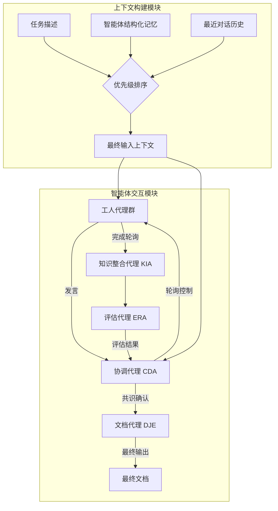

# 内在记忆智能体：通过结构化上下文记忆实现异构多智能体 LLM 系统

## 一、论文基础元数据
- 原文标题：Intrinsic Memory Agents: Heterogeneous Multi-Agent LLM Systems through Structured Contextual Memory
- 中文译版：内在记忆智能体：通过结构化上下文记忆实现异构多智能体 LLM 系统
- 发表渠道：arXiv 预印本
- 发表时间：2025 年
- 链接：arXiv:2508.08997
- 作者及核心机构：Sizhe Yuen, Francisco Gomez Medina, Ting Su, Yali Du, Adam J. Sobey（待补充具体机构）
- 研究领域：人工智能 / 多智能体系统与大语言模型
- 关联数据集：PDDL（规划）、FEVER（事实提取）、ALFWorld（任务执行）；规模/标注待补充

## 二、论文综合评价
### 2.1 量化评分（1-5 分，5 分为最优）

| 评价维度 | 评分 | 备注 |
| -------- | ---- | ---- |
| 📚 理论基础 | ⭐⭐⭐⭐ | 记忆机制理论扎实，异构性定义清晰 |
| 🎯 问题核心性 | ⭐⭐⭐⭐⭐ | 直击多智能体长上下文遗忘与同质化痛点 |
| 💡 方法创新性 | ⭐⭐⭐⭐ | 内在记忆更新与结构化模板结合新颖 |
| ⚙️ 技术壁垒 | ⭐⭐⭐⭐ | 上下文优先级算法与共识机制实现复杂 |
| 🧪 实验严谨性 | ⭐⭐⭐⭐⭐ | 多基准测试、消融实验及定性分析充分 |
| 🔧 落地可行性 | ⭐⭐⭐ | Token 消耗显著增加，成本权衡需优化 |
| 🚀 应用前景 | ⭐⭐⭐⭐ | 适用于复杂规划及多专业协作场景 |
| 📊 综合评分 | 4.1 | 稳定性卓越但成本较高，适合高价值任务 |

### 2.2 定性综合评价（≤300 字）
> 核心概括：研究定位、核心价值、差异化优势、关键结论

本研究定位于解决多智能体 LLM 系统在长对话中的信息遗忘与角色同质化问题。核心价值在于提出了“内在记忆智能体”框架，通过为每个智能体维护独立的异构专属记忆，确保记忆与角色目标对齐。差异化优势在于记忆更新源于智能体自身输出而非外部摘要，且采用结构化模板优先的上下文构建策略。关键结论表明，该方法在规划任务（PDDL）上性能最佳，在执行任务（ALFWorld）上稳定性最强（标准差最低），虽 Token 消耗增加 32%，但显著提升了解决方案的可靠性与具体性。

## 三、领域本体论映射
| 核心维度 | 具体内容 |
| -------- | -------- |
| 核心研究对象 | 异构多智能体 LLM 协作系统 |
| 核心技术路径 | 结构化上下文记忆与内在记忆更新机制 |
| 数据/载体形态 | 文本对话历史、结构化记忆模板、任务描述 |
| 核心功能目标 | 提升多智能体协作的一致性、规划能力与角色保持 |
| 验证核心指标 | 可靠性、成本效益、可扩展性、可用性、文档质量 |

## 四、核心问题与解决方案
### 4.1 待解决的核心问题
1. **领域级根本问题**：LLM 固定上下文窗口导致多智能体长对话中关键信息丢失及程序漂移。
2. **现有方法痛点**：现有记忆机制（如 RAG、通用摘要）多为同质化记忆，未考虑多智能体系统中不同角色的专业化视角。
3. **工程落地卡点**：单智能体记忆方案难以直接扩展至多智能体的高信息量场景，协作效率低。

### 4.2 核心解决方案
- 理论框架：内在记忆智能体（Intrinsic Memory Agents, IMA）。
- 核心架构：为每个智能体维护独立的、异构的专属记忆，记忆更新源于智能体自身的输出。
- 关键技术：结构化模板记忆存储、优先级上下文构建算法、改进的轮询交互机制。
- 创新机制：记忆更新公式 $M_{n,m} = f(M_{n,m-1}, O_{n,m})$，实现记忆与角色目标的动态对齐。

### 4.3 核心优势（量化 + 定性）
1. 性能优势：在 PDDL 规划任务上达到 SOTA，ALFWorld 任务标准差极低（如 0.00035）。
2. 效率优势：对话轮次无显著增加，共识驱动终止避免无效交互。
3. 工程优势：解决方案具体性显著提升，能提供具体工具建议及成本计算理由。

## 五、方法与技术架构
### 5.1 核心架构设计
> 文字描述 + 架构图（Mermaid/图片）

系统核心分为上下文构建与智能体交互两部分。上下文构建采用优先级策略（任务描述 > 智能体记忆 > 最近对话历史）。智能体交互采用改进的轮询机制，包含工人代理、协调代理、整合评估代理及文档代理，通过共识信号终止任务。

### 5.2 关键技术实现细节
| 技术模块 | 实现路径 | 工程注意事项 |
| -------- | -------- | ------------ |
| 记忆更新模块 | 基于智能体输出迭代演化，非外部摘要 | 需控制更新频率以防噪声累积 |
| 上下文构建模块 | 固定保留任务 + 记忆，动态填充历史 | 需精确计算 Token 限额避免截断 |
| 交互控制模块 | 改进轮询 + 共识终止信号 | 需防止死锁，确保终止信号触发 |
| 依赖组件 | LLM 推理引擎、向量存储（可选） | 模型需支持长上下文及指令遵循 |

### 5.3 架构优缺点
- 优点：角色一致性高，长程记忆保持好，输出稳定性强。
- 缺点：Token 消耗显著增加（平均 +32%），架构复杂度高于普通多智能体系统。

## 六、实验设计与结果分析
### 6.1 实验基础设置
| 维度 | 内容 |
| ---- | ---- |
| 数据集 | PDDL（规划）、FEVER（事实）、ALFWorld（执行） |
| 基线方法 | Voyager, Generative, MemoryBank, MetaGPT, ChatDev, Autogen |
| 实验环境 | 待补充（基于 LLM API） |
| 评价指标 | 平均奖励、标准差、五大质量维度（可靠性等） |

### 6.2 核心实验结果
| 方法 | 核心指标 1 (PDDL 奖励) | 核心指标 2 (ALFWorld 标准差) | 工程指标（算力/耗时） |
| ---- | --------- | --------- | -------------------- |
| Voyager | 待补充 | 高波动 | 低 Token 消耗 |
| Autogen | 待补充 | 待补充 | 基准消耗 |
| 本文方法 | 0.260 (Generic 模板) | 0.00035 (Intrinsic-LLM) | Token 消耗 +32% |

### 6.3 消融实验/鲁棒性分析
| 实验变体 | 指标变化 | 核心结论 |
| -------- | -------- | -------- |
| 通用模板 vs 手工模板 | 通用模板通常表现最佳 | 无需手工定制即可适用新问题 |
| Mistral-7b vs Gemma3-12b | 结论一致，消耗因模型而异 | 方法具备跨模型鲁棒性 |
| 不同记忆更新机制 | 内在更新优于外部摘要 | 角色对齐是关键 |

### 6.4 实验结论（工程视角）
内在记忆机制虽未在所有基准上获得最高平均奖励，但在降低方差（一致性）方面表现卓越。在需要明确规划和设计的任务中显著优于全局记忆方法。Token 消耗较高是换取设计质量提升的必要权衡。

## 七、领域贡献与创新点
| 贡献层级 | 具体内容 |
| -------- | -------- |
| 理论贡献 | 定义了多智能体系统中的记忆异构性与内在更新机制 |
| 方法/架构贡献 | 提出了优先级上下文构建算法与共识驱动交互流程 |
| 数据/工具贡献 | 验证了通用/动态记忆模板的有效性 |
| 实验/验证贡献 | 在多基准测试中证明了稳定性优势及质量提升 |
| 工程落地贡献 | 提供了适用于复杂规划及多专业协作的系统框架 |

## 八、局限性与风险
| 维度 | 具体描述 | 应对思路 |
| ---- | -------- | -------- |
| 学术局限性 | 需在更复杂任务场景及不同代理数量上进一步验证 | 扩展实验范围，增加压力测试 |
| 工程落地风险 | Token 用量显著增加，导致运行成本上升 | 优化更新机制，仅在必要时进行记忆更新 |
| 伦理/合规风险 | 待补充（通用 LLM 风险） | 遵循通用 AI 伦理规范，加强内容审核 |

## 九、未来研究/落地方向
| 方向类型 | 具体内容 | 优先级 |
| -------- | -------- | ------ |
| 科研拓展 | 深化异构性，微调代理专精能力及记忆个性化 | 高 |
| 工程优化 | 降低成本，优化记忆更新触发条件 | 高 |
| 跨领域适配 | 适配更多复杂领域（如法律、医疗协作） | 中 |

## 十、关键词与术语表
| 语言 | 关键词 |
| ---- | ------ |
| 中文 | 内在记忆、异构多智能体、结构化上下文、记忆更新、共识机制 |
| 英文 | Intrinsic Memory, Heterogeneous Multi-Agent, Structured Context, Memory Update, Consensus |
| 领域专属术语 | 内在记忆更新：基于智能体自身输出而非外部总结的记忆演化机制 |

## 十一、参考文献与关联资源
- 核心参考文献：待补充（原文未列出具体引用列表）
- 补充阅读：待补充
- 开源代码/工具：待补充（原文未提及代码仓库）

## 十二、阅读者批注
1. **科研启发**：记忆异构性是多智能体系统突破性能瓶颈的关键方向，值得深入探索记忆结构与角色定义的耦合关系。
2. **工程落地思考**：高 Token 消耗是主要阻碍，实际应用中需设计“记忆压缩”或“按需更新”策略以平衡成本与效果。
3. **待验证/存疑点**：在超大规模代理数量（>10）下的性能表现未验证，共识机制是否会导致延迟过高需测试。
4. **个人/团队应用场景**：适用于需要多角色协作的方案设计场景，如软件架构设计、复杂业务流程规划。

## 十三、阅读元信息
| 维度 | 内容 |
| ---- | ---- |
| 阅读日期 | 2026-04-08 16:18 |
| 阅读人 | xPaperReader AI |
| 文档编号 | arxiv-2508.08997 |
| 版本迭代 | v1.0 |