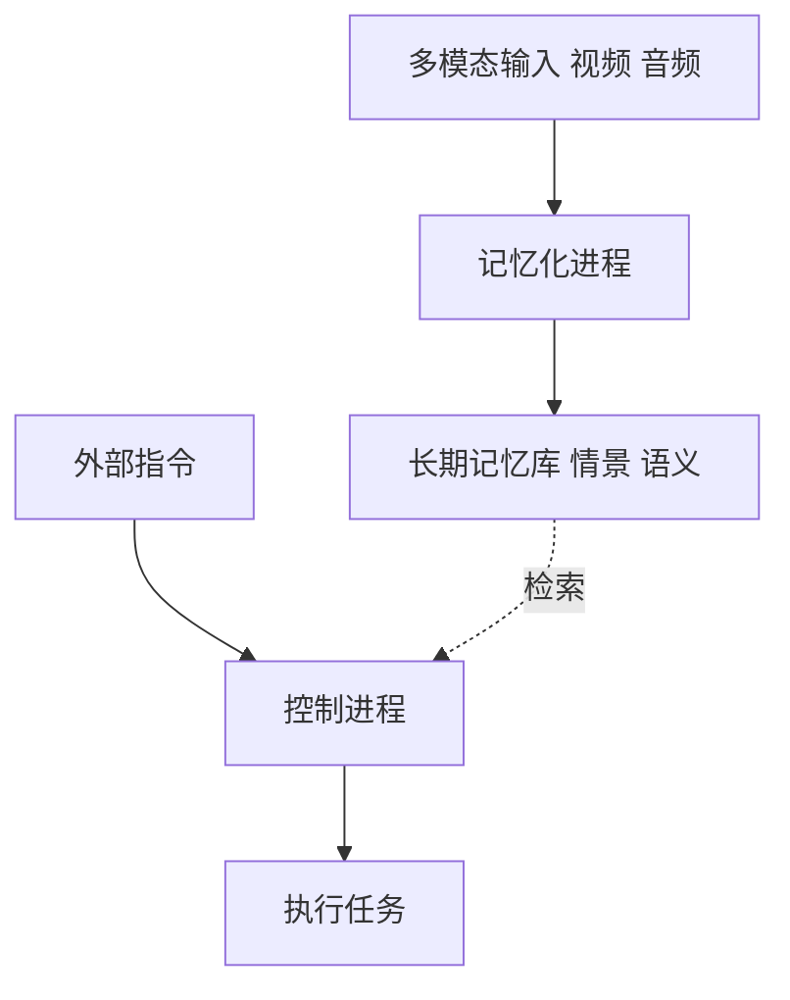

# 看、听、记、推理：一种具有长期记忆的多模态智能体

## 一、论文基础元数据
- 原文标题：Seeing, Listening, Remembering, and Reasoning: A Multimodal Agent with Long-Term Memory
- 中文译版：看、听、记、推理：一种具有长期记忆的多模态智能体
- 发表渠道：arXiv 预印本 (未标注具体等级)
- 发表时间：2025 年 10 月 10 日
- 链接：arXiv:2508.09736
- 作者及核心机构：Lin Long 等 (ByteDance Seed, 浙江大学，上海交通大学)
- 研究领域（一级领域 + 二级子领域）：人工智能 / 多模态智能体与长期记忆
- 关联数据集（名称/规模/语言/标注）：M3-Bench (100 个机器人视角视频 +920 个网络视频，含 QA 标注)

## 二、论文综合评价
### 2.1 量化评分（1-5 分，5 分为最优）

| 评价维度 | 评分 | 备注 |
| -------- | ---- | ---- |
| 📚 理论基础 | ⭐⭐⭐⭐ | 结合认知科学的记忆分类理论 |
| 🎯 问题核心性 | ⭐⭐⭐⭐⭐ | 解决智能体长期依赖与上下文限制 |
| 💡 方法创新性 | ⭐⭐⭐⭐ | 实体中心的多模态记忆架构 |
| ⚙️ 技术壁垒 | ⭐⭐⭐ | 原文细节缺失，难以评估实现难度 |
| 🧪 实验严谨性 | ⭐⭐⭐⭐ | 自建基准测试，对比主流模型 |
| 🔧 落地可行性 | ⭐⭐⭐⭐ | 开源代码与数据，具工程潜力 |
| 🚀 应用前景 | ⭐⭐⭐⭐⭐ | 家庭机器人等长期交互场景广阔 |
| 📊 综合评分 | 4.1 | 概念先进，但原文细节缺失影响评估 |

### 2.2 定性综合评价（≤300 字）
> 核心概括：研究定位、核心价值、差异化优势、关键结论
本文定位为具备长期记忆能力的多模态智能体框架（M3-Agent）。核心价值在于模拟人类认知，通过情景记忆与语义记忆持续积累世界知识，突破传统上下文窗口限制。差异化优势在于采用实体中心（entity-centric）的记忆组织方式，支持多轮推理与记忆检索。关键结论显示，经强化学习训练的 M3-Agent 在长视频问答任务上优于 Gemini-1.5-pro 与 GPT-4o 的提示工程基线，证明了长期记忆机制的有效性。

## 三、领域本体论映射
| 核心维度 | 具体内容 |
| -------- | -------- |
| 核心研究对象 | 具有长期记忆的多模态智能体 (M3-Agent) |
| 核心技术路径 | 记忆化 (Memorization) 与控制 (Control) 双进程并行 |
| 数据/载体形态 | 实时视频流、音频输入、实体中心的多模态记忆库 |
| 核心功能目标 | 持续感知环境、存储组织经验、基于记忆推理行动 |
| 验证核心指标 | 长视频问答准确率 (Accuracy) |

## 四、核心问题与解决方案
### 4.1 待解决的核心问题
1. **领域级根本问题**：多模态智能体缺乏类似人类的长期记忆，难以通过日常经验积累世界知识。
2. **现有方法痛点**：传统方法依赖有限上下文窗口，无法处理长期依赖与跨时段信息关联。
3. **工程落地卡点**：如何高效组织海量多模态数据以便检索与推理（原文未详细展开具体卡点）。

### 4.2 核心解决方案
- 理论框架：类比人类认知系统，构建情景记忆与语义记忆。
- 核心架构：双进程架构（记忆化进程 + 控制进程）。
- 关键技术：实体中心的多模态记忆组织、强化学习训练。
- 创新机制：实时输入转化为细粒度与高层抽象两种记忆类型。

### 4.3 核心优势（量化 + 定性）
1. 性能优势：在 M3-Bench-robot 上准确率提升 6.7%，M3-Bench-web 提升 7.7%。
2. 效率优势：支持自主多轮推理与相关记忆检索（具体耗时原文未提及）。
3. 工程优势：提供开源模型、代码与数据，便于复现与二次开发。

## 五、方法与技术架构
### 5.1 核心架构设计
> 文字描述 + 架构图（Mermaid/图片）
架构包含两个并行进程：记忆化进程负责感知输入并更新长期记忆；控制进程负责解释指令、检索记忆并执行任务。

### 5.2 关键技术实现细节
| 技术模块 | 实现路径 | 工程注意事项 |
| -------- | -------- | ------------ |
| 记忆化模块 | 处理视频流，生成细粒度与高层抽象记忆 | 需平衡存储成本与信息密度 |
| 控制模块 | 解释指令，检索记忆，多轮推理 | 检索准确性直接影响任务完成 |
| 依赖组件 | 强化学习训练框架，多模态编码器 | 原文未提及具体模型骨干细节 |

### 5.3 架构优缺点
- 优点：模拟人类认知，支持长期知识积累，实体中心结构利于一致性理解。
- 缺点：原文截断，无法评估记忆更新冲突处理及检索延迟问题。

## 六、实验设计与结果分析
### 6.1 实验基础设置
| 维度 | 内容 |
| ---- | ---- |
| 数据集 | M3-Bench (Robot 100 视频，Web 920 视频) |
| 基线方法 | Gemini-1.5-pro 提示代理，GPT-4o 提示代理 |
| 实验环境 | 原文未提及具体硬件配置 |
| 评价指标 | 准确率 (Accuracy) |

### 6.2 核心实验结果
| 方法 | 核心指标 1 (Robot) | 核心指标 2 (Web) | 工程指标（算力/耗时） |
| ---- | --------- | --------- | -------------------- |
| 基线 1 (Gemini) | 原文未提及具体数值 | 原文未提及具体数值 | 原文未提及 |
| 基线 2 (GPT-4o) | 原文未提及具体数值 | 原文未提及具体数值 | 原文未提及 |
| 本文方法 | +6.7% (相对提升) | +7.7% (相对提升) | 原文未提及 |

### 6.3 消融实验/鲁棒性分析
| 实验变体 | 指标变化 | 核心结论 |
| -------- | -------- | -------- |
| 原文未提及 | 原文未提及 | 原文未提及 |

### 6.4 实验结论（工程视角）
强化学习训练的记忆机制在长视频理解任务上显著优于纯提示工程方法，证明长期记忆模块的必要性。

## 七、领域贡献与创新点
| 贡献层级 | 具体内容 |
| -------- | -------- |
| 理论贡献 | 提出多模态智能体长期记忆的认知框架 |
| 方法/架构贡献 | 设计记忆化与控制双并行进程架构 |
| 数据/工具贡献 | 发布 M3-Bench 基准测试集与开源代码 |
| 实验/验证贡献 | 验证了记忆基于推理在长视频问答中的有效性 |
| 工程落地贡献 | 提供了可复现的家庭机器人场景解决方案原型 |

## 八、局限性与风险
| 维度 | 具体描述 | 应对思路 |
| ---- | -------- | -------- |
| 学术局限性 | 原文截断，缺乏对记忆遗忘机制的讨论 | 需阅读完整论文确认 |
| 工程落地风险 | 长期记忆存储膨胀可能导致检索效率下降 | 引入记忆压缩或分层检索 |
| 伦理/合规风险 | 机器人记录家庭隐私数据存在泄露风险 | 数据本地化加密存储 |

## 九、未来研究/落地方向
| 方向类型 | 具体内容 | 优先级 |
| -------- | -------- | ------ |
| 科研拓展 | 研究记忆冲突解决与遗忘机制 | 高 |
| 工程优化 | 优化记忆检索延迟与存储成本 | 高 |
| 跨领域适配 | 适配工业巡检或医疗陪护场景 | 中 |

## 十、关键词与术语表
| 语言 | 关键词 |
| ---- | ------ |
| 中文 | 多模态智能体，长期记忆，情景记忆，语义记忆，强化学习 |
| 英文 | Multimodal Agent, Long-Term Memory, Episodic Memory, Semantic Memory, Reinforcement Learning |
| 领域专属术语 | 实体中心记忆 (Entity-centric Memory)：以实体为核心组织多模态信息 |

## 十一、参考文献与关联资源
- 核心参考文献：原文截断，仅可见引用标记 [44, 45] 涉及人类认知系统
- 补充阅读：项目主页 https://m3-agent.github.io
- 开源代码/工具：https://github.com/bytedance-seed/m3-agent

## 十二、阅读者批注
1. **科研启发**：将人类记忆分类（情景/语义）引入 Agent 架构是解决长上下文问题的有效路径。
2. **工程落地思考**：实体中心的记忆结构可能比单纯向量检索更适合需要逻辑一致性的任务。
3. **待验证/存疑点**：记忆更新的具体算法及冲突处理机制在节选文本中未体现，需查阅全文。
4. **个人/团队应用场景**：适用于需要长期用户偏好学习的个人助理或家庭服务机器人开发。

## 十三、阅读元信息
| 维度 | 内容 |
| ---- | ---- |
| 阅读日期 | 2026-04-08 16:30 |
| 阅读人 | xPaperReader AI |
| 文档编号 | arxiv-2508.09736 |
| 版本迭代 | v1.0 |