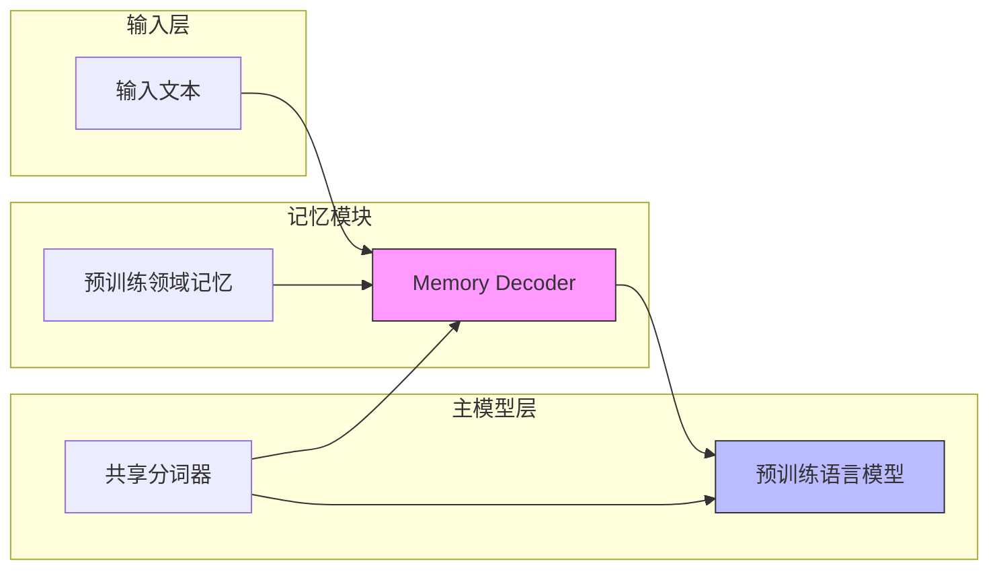

# Memory Decoder：一种用于大型语言模型的预训练即插即用记忆模块

## 一、论文基础元数据
- 原文标题：Memory Decoder: A Pretrained, Plug-and-Play Memory for Large Language Models
- 中文译版：Memory Decoder：一种用于大型语言模型的预训练即插即用记忆模块
- 发表渠道：arXiv 预印本 (cs.CL)
- 发表时间：2025 年 10 月 23 日 (v2)
- 链接：arXiv:2508.09874
- 作者及核心机构：Jiaqi Cao 等 (上海交通大学 LUMIA Lab, 上海人工智能实验室，清华大学)
- 研究领域（一级领域 + 二级子领域）：人工智能 / 大语言模型领域自适应
- 关联数据集（名称/规模/语言/标注）：生物医学、金融、法律领域语料 (具体规模原文未提及)

## 二、论文综合评价
### 2.1 量化评分（1-5 分，5 分为最优）

| 评价维度 | 评分 | 备注 |
| -------- | ---- | ---- |
| 理论基础 | 4.0 | 基于 Transformer 解码器模仿检索行为，理论扎实 |
| 问题核心性 | 5.0 | 直击领域自适应成本高与推理延迟大的痛点 |
| 方法创新性 | 4.0 | 提出预训练记忆组件即插即用新范式 |
| 技术壁垒 | 3.0 | 依赖分词器一致性，架构相对轻量 |
| 实验严谨性 | 3.0 | 摘要提及多模型验证，细节原文未提及 |
| 落地可行性 | 4.0 | 无需修改原模型参数，集成便捷 |
| 应用前景 | 4.0 | 适用于医疗、金融、法律等垂直领域 |
| 综合评分 | 3.9 | 创新范式明确，但全文细节待完整验证 |

### 2.2 定性综合评价（≤300 字）
> 核心概括：研究定位、核心价值、差异化优势、关键结论

本研究定位为大型语言模型（LLM）的领域自适应解决方案。核心价值在于提出了一种名为"Memory Decoder"的预训练即插即用记忆模块，旨在解决传统领域自适应预训练（DAPT）成本高且易遗忘，以及检索增强生成（RAG）推理延迟大的问题。差异化优势在于该模块无需修改原模型参数，且可跨不同尺寸模型复用。关键结论显示，该方法在生物医学、金融和法律三个领域能有效降低困惑度，平均降低 6.17 点 (注：原文未明确具体实验条件)，提供了一种高效的领域适配新范式。

## 三、领域本体论映射
| 核心维度 | 具体内容 |
| -------- | -------- |
| 核心研究对象 | 大型语言模型（LLM）的领域自适应能力 |
| 核心技术路径 | 小型 Transformer 解码器模仿外部非参数检索器行为 |
| 数据/载体形态 | 领域特定语料（生物医学、金融、法律） |
| 核心功能目标 | 在不修改原模型参数前提下提升领域性能 |
| 验证核心指标 | 困惑度（Perplexity） |

## 四、核心问题与解决方案
### 4.1 待解决的核心问题
1. **领域级根本问题**：通用大模型在特定专业领域（如医疗、法律）表现不足，需要领域知识注入。
2. **现有方法痛点**：DAPT 需要全参数训练，成本高且导致灾难性遗忘；RAG 引入昂贵的近邻搜索和长上下文，导致推理延迟高。
3. **工程落地卡点**：现有方案难以在保证性能的同时兼顾计算成本与推理速度，且模型特定修改难以复用。

### 4.2 核心解决方案
- 理论框架：预训练即插即用记忆范式（Pretrained Plug-and-Play Memory Paradigm）。
- 核心架构：独立的小型 Transformer 解码器作为记忆模块。
- 关键技术：模仿外部非参数检索器行为（Imitate external non-parametric retriever）。
- 创新机制：记忆组件与预训练语言模型插值集成，无需模型特定修改。

### 4.3 核心优势（量化 + 定性）
1. 性能优势：在多个领域平均降低困惑度 6.17 点 (注：原文未明确具体实验条件)。
2. 效率优势：避免了推理时的外部数据存储检索开销。
3. 工程优势：单一预训练记忆组件可适用于不同尺寸的模型（如 Qwen, Llama）。

## 五、方法与技术架构
### 5.1 核心架构设计
> 文字描述 + 架构图（Mermaid/图片）

Memory Decoder 作为一个独立的小型 Transformer 解码器，位于输入与主 LLM 之间。它学习模拟检索器的行为，将领域知识编码后注入到主模型中，无需修改主模型参数。

### 5.2 关键技术实现细节
| 技术模块 | 实现路径 | 工程注意事项 |
| -------- | -------- | ------------ |
| 记忆解码器 | 小型 Transformer 解码器结构 | 需与主模型共享分词器 |
| 知识注入 | 模仿非参数检索器行为 | 无需外部数据存储检索 |
| 模型集成 | 插值方式集成 | 无需修改原模型参数 |
| 依赖组件 | 共享分词器（Tokenizer） | 必须与目标 LLM 分词器一致 |

### 5.3 架构优缺点
- 优点：即插即用，无需微调主模型，推理无额外检索延迟，组件可复用。
- 缺点：依赖分词器一致性，限制了跨架构的通用性；小型解码器容量可能受限。

## 六、实验设计与结果分析
### 6.1 实验基础设置
| 维度 | 内容 |
| ---- | ---- |
| 数据集 | 生物医学、金融、法律领域数据 |
| 基线方法 | DAPT, RAG, LoRA (图 2 提及) |
| 实验环境 | 原文未提及 |
| 评价指标 | 困惑度（Perplexity） |

### 6.2 核心实验结果
| 方法 | 核心指标 1 | 核心指标 2 | 工程指标（算力/耗时） |
| ---- | --------- | --------- | -------------------- |
| DAPT | 原文未提及 | 原文未提及 | 高训练成本 |
| RAG | 原文未提及 | 原文未提及 | 高推理延迟 |
| 本文方法 | 困惑度平均降低 6.17 点 (注：原文未明确具体实验条件) | 原文未提及 | 无检索开销 |

### 6.3 消融实验/鲁棒性分析
| 实验变体 | 指标变化 | 核心结论 |
| -------- | -------- | -------- |
| 不同模型尺寸 | 性能一致提升 | 记忆组件具有跨尺寸通用性 |
| 不同领域 | 三领域均有效 | 方法具有领域泛化能力 |

### 6.4 实验结论（工程视角）
该方法在保持推理效率的同时显著提升了领域适应性，适合需要快速部署到多个垂直场景的工程需求，但需确保分词器兼容。

## 七、领域贡献与创新点
| 贡献层级 | 具体内容 |
| -------- | -------- |
| 理论贡献 | 提出以预训练记忆组件为中心的领域自适应新范式 |
| 方法/架构贡献 | 设计模仿检索器行为的 Transformer 解码器记忆模块 |
| 数据/工具贡献 | 开源代码及 HuggingFace 模型集合 |
| 实验/验证贡献 | 验证了在 Qwen 和 Llama 系列模型上的有效性 |
| 工程落地贡献 | 实现了无需修改原参数的即插即用集成方案 |

## 八、局限性与风险
| 维度 | 具体描述 | 应对思路 |
| ---- | -------- | -------- |
| 学术局限性 | 仅验证了困惑度指标，生成质量评估原文未提及 | 补充人类评估或任务特定指标 |
| 工程落地风险 | 依赖分词器一致性，跨分词器模型无法直接使用 | 开发分词器映射层或重新训练记忆模块 |
| 伦理/合规风险 | 领域数据可能包含敏感信息 | 加强数据脱敏与合规审查 |

## 九、未来研究/落地方向
| 方向类型 | 具体内容 | 优先级 |
| -------- | -------- | ------ |
| 科研拓展 | 探索跨分词器的记忆模块迁移能力 | 高 |
| 工程优化 | 优化记忆解码器的推理速度与显存占用 | 中 |
| 跨领域适配 | 扩展至更多垂直领域（如代码、科学） | 中 |

## 十、关键词与术语表
| 语言 | 关键词 |
| ---- | ------ |
| 中文 | 记忆解码器，领域自适应，即插即用，大型语言模型，困惑度 |
| 英文 | Memory Decoder, Domain Adaptation, Plug-and-Play, LLM, Perplexity |
| 领域专属术语 | DAPT（领域自适应预训练）, RAG（检索增强生成）, Tokenizer（分词器） |

## 十一、参考文献与关联资源
- 核心参考文献：
    - Gururangan et al., 2020 (DAPT)
    - Grattafiori et al., 2024 (Llama)
    - Chen et al., 2023 (Domain Adaptation)
- 补充阅读：原文未提及
- 开源代码/工具：https://github.com/LUMIA-Group/MemoryDecoder

## 十二、阅读者批注
1. **学术价值**：论文提出将检索能力内化为一个小模块而非外部数据库，是一个有趣的折中方案，平衡了参数效率与知识注入。
2. **工程应用价值**：分词器依赖是最大落地障碍，企业内部若统一分词器标准，此方案极具价值。
3. **原文提及的局限性**：记忆模块的具体参数量占比未详细说明，是否真的轻量需验证。
4. **推荐应用场景**：适用于拥有统一基座模型但需快速适配多个垂直业务线的场景。