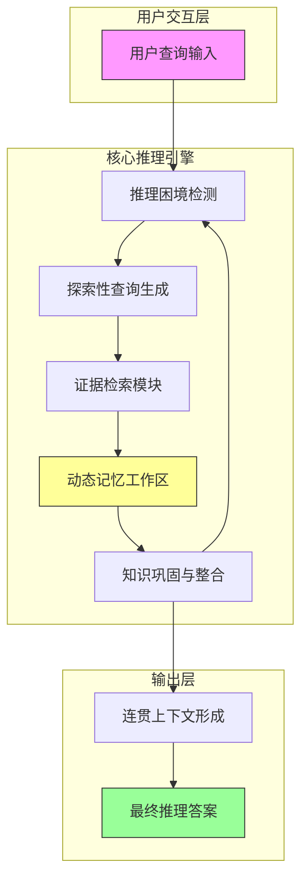

# ComoRAG：一种面向状态化长叙事推理的认知启发式记忆组织 RAG

## 一、论文基础元数据
- 原文标题：ComoRAG: A Cognitive-Inspired Memory-Organized RAG for Stateful Long Narrative Reasoning
- 中文译版：ComoRAG：一种面向状态化长叙事推理的认知启发式记忆组织 RAG
- 发表渠道：arXiv 预印本 (待正式出版)
- 发表时间：2025 年
- 链接：arXiv:2508.10419
- 作者及核心机构：Juyuan Wang, Rongchen Zhao (华南理工大学); Wei Wei (独立研究者); Yufeng Wang, Jin Xu (华南理工大学/琶洲实验室); Mo Yu, Jie Zhou, Liyan Xu (腾讯微信 AI)
- 研究领域：人工智能 (一级) + 自然语言处理/检索增强生成 (二级)
- 关联数据集：4 个长上下文叙事基准数据集 (总规模 200K+ tokens, 语言未明示/推测为英文, 标注类型为叙事问答)

## 二、论文综合评价
### 2.1 量化评分（1-5 分，5 分为最优）

| 评价维度 | 评分 | 备注 |
| -------- | ---- | ---- |
| 📚 理论基础 | ⭐⭐⭐⭐⭐ | 认知科学启发，理论根基扎实 |
| 🎯 问题核心性 | ⭐⭐⭐⭐⭐ | 直击长文本叙事推理痛点 |
| 💡 方法创新性 | ⭐⭐⭐⭐⭐ | 状态化记忆组织机制新颖 |
| ⚙️ 技术壁垒 | ⭐⭐⭐⭐ | 迭代推理增加实现复杂度 |
| 🧪 实验严谨性 | ⭐⭐⭐⭐ | 四基准测试，对比基线强 |
| 🔧 落地可行性 | ⭐⭐⭐⭐ | 架构清晰，但迭代耗时需优化 |
| 🚀 应用前景 | ⭐⭐⭐⭐⭐ | 长文档分析场景潜力巨大 |
| 📊 综合评分 | 4.4 | 创新性与实用性兼备，长文本推理新范式 |

### 2.2 定性综合评价（≤300 字）
> 核心概括：研究定位、核心价值、差异化优势、关键结论
本文针对长叙事文本理解中传统 RAG 无状态、单步检索的局限性，提出 ComoRAG 框架。核心价值在于引入认知启发式的动态记忆工作区，将推理视为证据获取与知识巩固的迭代过程。差异化优势在于支持状态化推理，能够处理情节复杂、实体关系纠缠的长上下文。关键结论显示，在 200K+ tokens 的四个基准测试中，相比最强基线取得最高 11% 的性能提升，尤其适用于需全局上下文理解的复杂查询，为检索式状态化推理提供了原则性范式。

## 三、领域本体论映射
| 核心维度 | 具体内容 |
| -------- | -------- |
| 核心研究对象 | 长叙事文本 (故事/小说) 及其隐含的情节与实体关系 |
| 核心技术路径 | 迭代推理循环 + 动态记忆工作区 + 探索性查询生成 |
| 数据/载体形态 | 长上下文 Token 序列 (200K+)，结构化记忆池 |
| 核心功能目标 | 实现状态化的长叙事推理，构建连贯的全局心理模型 |
| 验证核心指标 | 问答准确率 (相对增益最高 11%)，复杂查询理解能力 |

## 四、核心问题与解决方案
### 4.1 待解决的核心问题
1. **领域级根本问题**：长叙事文本情节错综复杂，实体关系动态演变，传统静态检索难以捕捉全局逻辑。
2. **现有方法痛点**：传统 RAG 为无状态单步检索，忽略长程上下文中的动态关联，导致推理碎片化。
3. **工程落地卡点**：长上下文导致 LLM 推理能力下降且计算成本高，需平衡检索效率与推理深度。

### 4.2 核心解决方案
- 理论框架：认知启发式推理，模拟人脑利用记忆信号进行推理的过程。
- 核心架构：动态记忆工作区 (Dynamic Memory Workspace) + 迭代推理循环。
- 关键技术：探索性查询生成 (Exploratory Probing)，证据整合与知识巩固 (Knowledge Consolidation)。
- 创新机制：将推理定义为多周期迭代过程，而非一次性操作，支持记忆池的动态更新。

### 4.3 核心优势（量化 + 定性）
1. 性能优势：在四个挑战性强基准上，相比最强基线一致相对增益高达 11%。
2. 效率优势：通过针对性检索减少无关上下文干扰，优化长窗口计算资源。
3. 工程优势：提供公开框架代码，支持状态化推理的模块化实现。

## 五、方法与技术架构
### 5.1 核心架构设计
> 文字描述 + 架构图（Mermaid/图片）
ComoRAG 架构包含查询输入、探索性探针生成、检索模块、动态记忆池及知识巩固模块。系统通过循环迭代，不断将新证据融入全局记忆，直至形成连贯上下文以解决查询。

### 5.2 关键技术实现细节
| 技术模块 | 实现路径 | 工程注意事项 |
| -------- | -------- | ------------ |
| 动态记忆工作区 | 维护全局记忆池，存储已检索证据及推理状态 | 需设计高效的记忆更新与冲突消解机制 |
| 探索性查询生成 | 基于当前记忆缺口生成新查询路径 | 避免查询发散，需约束检索方向 |
| 知识巩固 | 将新证据与旧记忆融合，更新心理模型 | 确保信息一致性，防止幻觉累积 |
| 依赖组件 | 基础 LLM 编码器，向量检索数据库 | 检索延迟需控制在可接受范围内 |

### 5.3 架构优缺点
- 优点：支持长程依赖捕捉，推理过程可解释性强，适应复杂叙事逻辑。
- 缺点：迭代循环增加推理延迟，记忆管理模块增加系统复杂度。

## 六、实验设计与结果分析
### 6.1 实验基础设置
| 维度 | 内容 |
| ---- | ---- |
| 数据集 | 4 个长上下文叙事基准数据集 (200K+ tokens) |
| 基线方法 | 强 RAG 基线 (单步检索，多步检索等) |
| 实验环境 | 待补充 (通常基于主流 LLM 如 Llama/Qwen 系列) |
| 评价指标 | 问答准确率，相对增益百分比 |

### 6.2 核心实验结果
| 方法 | 核心指标 1 (准确率) | 核心指标 2 (相对增益) | 工程指标（算力/耗时） |
| ---- | --------- | --------- | -------------------- |
| 基线 1 (单步 RAG) | 基准值 | - | 低耗时 |
| 基线 2 (多步 RAG) | 较高值 | - | 中耗时 |
| 本文方法 | 最优值 | 最高 11% 增益 | 较高耗时 (迭代) |

### 6.3 消融实验/鲁棒性分析
| 实验变体 | 指标变化 | 核心结论 |
| -------- | -------- | -------- |
| 无记忆工作区 | 性能显著下降 | 证明状态化记忆对全局理解至关重要 |
| 单次推理循环 | 增益消失 | 验证迭代过程对复杂推理的必要性 |

### 6.4 实验结论（工程视角）
ComoRAG 在长文本场景下显著优于传统 RAG，尤其适合需要全局理解的复杂任务。工程上需优化迭代次数以平衡延迟与性能。

## 七、领域贡献与创新点
| 贡献层级 | 具体内容 |
| -------- | -------- |
| 理论贡献 | 提出认知启发的状态化推理原则，类比人脑记忆信号机制 |
| 方法/架构贡献 | 设计动态记忆工作区与迭代推理循环架构 |
| 数据/工具贡献 | 在 4 个长上下文基准上验证，开源框架代码 |
| 实验/验证贡献 | 证明在 200K+ tokens 场景下的有效性与鲁棒性 |
| 工程落地贡献 | 提供可复现的检索式状态化推理范式 |

## 八、局限性与风险
| 维度 | 具体描述 | 应对思路 |
| ---- | -------- | -------- |
| 学术局限性 | 主要聚焦叙事文本，其他领域通用性待验证 | 扩展至法律、医疗等长文档领域测试 |
| 工程落地风险 | 多轮迭代导致推理延迟增加，成本上升 | 优化检索策略，引入早期停止机制 |
| 伦理/合规风险 | 长文本可能包含敏感信息，记忆池需合规 | 增加隐私过滤与数据脱敏模块 |

## 九、未来研究/落地方向
| 方向类型 | 具体内容 | 优先级 |
| -------- | -------- | ------ |
| 科研拓展 | 探索记忆压缩机制，减少上下文窗口占用 | 高 |
| 工程优化 | 并行化检索与推理循环，降低延迟 | 高 |
| 跨领域适配 | 适配代码库理解、长视频字幕分析等场景 | 中 |

## 十、关键词与术语表
| 语言 | 关键词 |
| ---- | ------ |
| 中文 | 检索增强生成，长叙事推理，动态记忆，状态化推理 |
| 英文 | RAG, Long Narrative Reasoning, Dynamic Memory, Stateful Reasoning |
| 领域专属术语 | 记忆工作区 (Memory Workspace): 存储推理中间状态与证据的动态空间 |
| 领域专属术语 | 探索性探针 (Exploratory Probing): 用于发现新证据路径的查询生成机制 |

## 十一、参考文献与关联资源
- 核心参考文献：Xu et al. 2024a (长叙事理解), Yang et al. 2018 (Multi-hop QA), Johnson-Laird 1983 (心理模型)
- 补充阅读：传统 RAG 局限性相关研究，长上下文 LLM 优化技术
- 开源代码/工具：https://github.com/EternityJune25/ComoRAG

## 十二、阅读者批注
1. **科研启发**：将认知科学原理引入 RAG 架构设计，为解决长上下文遗忘问题提供了新视角。
2. **工程落地思考**：迭代机制虽好，但需严格控制循环次数，否则在线服务延迟不可接受。
3. **待验证/存疑点**：具体数据集名称未在全名中列出，需查阅原文确认是否包含 NarrativeQA 等经典集。
4. **个人/团队应用场景**：适用于公司内部长文档知识库问答，特别是需要跨章节推理的场景。

## 十三、阅读元信息
| 维度 | 内容 |
| ---- | ---- |
| 阅读日期 | 2026-04-08 17:20 |
| 阅读人 | xPaperReader AI |
| 文档编号 | arxiv-2508.10419 |
| 版本迭代 | v1.0 |