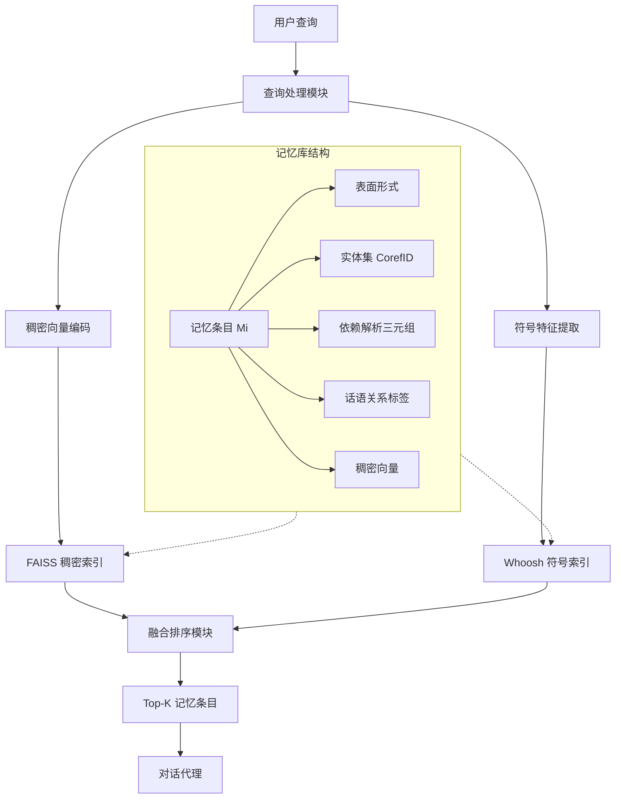

# 代理记忆中的语义锚定：利用语言结构实现持久对话上下文

## 一、论文基础元数据
- 原文标题：Semantic Anchoring in Agentic Memory: Leveraging Linguistic Structures for Persistent Conversational Context
- 中文译版：代理记忆中的语义锚定：利用语言结构实现持久对话上下文
- 发表渠道：预印本（arXiv）
- 发表时间：2025 年
- 链接：arXiv:2508.12630
- 作者及核心机构：Maitreyi Chatterjee, Devansh Agarwal（机构待补充）
- 研究领域：人工智能（自然语言处理 + 对话系统/代理记忆）
- 关联数据集：MultiWOZ-Long（改编，多会话）、DialogRE-L（改编，跨会话关系）

## 二、论文综合评价
### 2.1 量化评分（1-5 分，5 分为最优）

| 评价维度 | 评分 | 备注 |
| -------- | ---- | ---- |
| 📚 理论基础 | ⭐⭐⭐⭐ | 神经符号混合理论成熟，应用扎实 |
| 🎯 问题核心性 | ⭐⭐⭐⭐⭐ | 直击长程对话上下文丢失痛点 |
| 💡 方法创新性 | ⭐⭐⭐⭐⭐ | 语言结构锚点混合检索机制新颖 |
| ⚙️ 技术壁垒 | ⭐⭐⭐⭐ | 依赖多 NLP 工具链集成，复杂度中等 |
| 🧪 实验严谨性 | ⭐⭐⭐⭐⭐ | 多数据集验证，含消融与人工评估 |
| 🔧 落地可行性 | ⭐⭐⭐⭐ | 延迟 175ms 可接受，但依赖外部工具 |
| 🚀 应用前景 | ⭐⭐⭐⭐⭐ | 对智能体长期记忆构建具有指导意义 |
| 📊 综合评分 | 4.6 | 混合架构显著提升长程记忆一致性，工程落地性强 |

### 2.2 定性综合评价（≤300 字）
> 核心概括：研究定位、核心价值、差异化优势、关键结论

本研究定位为增强型代理记忆系统，旨在解决纯向量 RAG 在长程对话中丢失句法与指代结构的问题。核心价值在于提出“语义锚定”框架，将稠密向量与显式语言结构（依赖解析、共指、话语关系）结合。差异化优势在于混合索引机制，既保留语义相似度，又通过符号锚点确保实体与逻辑一致性。关键结论表明，该方法在事实召回率上比传统 Vector RAG 提升 11.9%，显著改善了跨会话的用户连续性满意度，证明了显式语言结构在持久记忆中的必要性。

## 三、领域本体论映射
| 核心维度 | 具体内容 |
| -------- | -------- |
| 核心研究对象 | 长程对话中的代理记忆（Agentic Memory） |
| 核心技术路径 | 神经 - 符号混合检索（Neuro-Symbolic Hybrid Retrieval） |
| 数据/载体形态 | 结构化记忆条目（向量 + 句法三元组 + 共指链 + 话语标签） |
| 核心功能目标 | 实现跨会话的上下文持久化与指代消解 |
| 验证核心指标 | 事实召回率 (FR)、话语连贯性 (DC)、用户连续性满意度 (UCS) |

## 四、核心问题与解决方案
### 4.1 待解决的核心问题
1. **领域级根本问题**：长程对话中上下文信息随时间衰减，导致代理无法维持连贯的个人化记忆。
2. **现有方法痛点**：纯 Dense Vector (RAG) 缺乏对句法、指代和话语结构的理解，易导致跨会话指代消解失败。
3. **工程落地卡点**：如何在保证检索速度（低延迟）的前提下，融合多模态语言特征而不显著增加系统复杂度。

### 4.2 核心解决方案
- 理论框架：语义锚定（Semantic Anchoring），将记忆显式 grounded 于语言结构。
- 核心架构：混合索引架构（稠密 FAISS + 符号 Whoosh 倒排索引）。
- 关键技术：依赖解析三元组存储、共指链标准化、话语关系分类、加权融合排序。
- 创新机制：检索评分公式融合语义相似度、实体匹配度与话语匹配度。

### 4.3 核心优势（量化 + 定性）
1. 性能优势：事实召回率 (FR) 达 83.5%，较 Vector RAG 提升 11.9%。
2. 效率优势：平均查询延迟 175ms，满足实时对话交互需求。
3. 工程优势：模块化设计，支持独立优化符号特征提取器与向量编码器。

## 五、方法与技术架构
### 5.1 核心架构设计
系统采用双路召回机制，查询端与记忆端均进行向量化与符号化编码，最终通过融合排序输出结果。

### 5.2 关键技术实现细节
| 技术模块 | 实现路径 | 工程注意事项 |
| -------- | -------- | ------------ |
| 句法分析 | spaCy v3 Biaffine parser，存储 (head, dep, child) 三元组 | 需处理口吃/修正带来的噪声三元组 |
| 共指消解 | AllenNLP End-to-end resolver，实体标准化为 (name, CorefID, type) | 警惕不同会话中同名实体错误合并 |
| 混合检索 | FAISS HNSW (Dense) + Whoosh (Symbolic)，加权评分融合 | 权重需通过验证集网格搜索优化 |
| 依赖组件 | Sentence-BERT, spaCy, AllenNLP, FAISS, Whoosh | 需维护多个模型版本兼容性 |

### 5.3 架构优缺点
- 优点：可解释性强（符号锚点可追溯），长程依赖捕捉能力显著优于纯向量方法。
- 缺点：依赖外部 NLP 工具链，预处理耗时；对语用现象（如讽刺）识别能力弱。

## 六、实验设计与结果分析
### 6.1 实验基础设置
| 维度 | 内容 |
| ---- | ---- |
| 数据集 | MultiWOZ-Long（多会话改造）、DialogRE-L（跨会话关系） |
| 基线方法 | Stateless LLM、Vector RAG、Entity-RAG |
| 实验环境 | 2× NVIDIA A100, 512GB RAM |
| 评价指标 | Factual Recall (FR), Discourse Coherence (DC), User Continuity Satisfaction (UCS) |

### 6.2 核心实验结果
| 方法 | 核心指标 1 (FR%) | 核心指标 2 (DC%) | 工程指标（算力/耗时） |
| ---- | --------- | --------- | -------------------- |
| Vector RAG | 71.6 | 66.4 | 待补充 |
| Entity-RAG | 72.1 | 68.3 | 待补充 |
| 本文方法 | 83.5 | 80.8 | 175ms/查询 |

### 6.3 消融实验/鲁棒性分析
| 实验变体 | 指标变化 | 核心结论 |
| -------- | -------- | -------- |
| 移除话语标记 (Discourse) | FR 下降 4.7% | 话语关系对事实召回有显著贡献 |
| 移除共指消解 (Coreference) | DC 下降 6.2% | 共指链是连贯性的关键支撑 |
| 移除所有符号特征 | 性能回退至 Vector RAG 水平 | 符号特征不可被纯向量替代 |

### 6.4 实验结论（工程视角）
混合检索架构在可接受的延迟增加下（175ms），换取了显著的记忆一致性提升。共指消解模块是误差主要来源（占失败案例 27%），是后续工程优化的重点瓶颈。

## 七、领域贡献与创新点
| 贡献层级 | 具体内容 |
| -------- | -------- |
| 理论贡献 | 验证了显式语言结构在神经记忆系统中的锚定作用 |
| 方法/架构贡献 | 提出 Semantic Anchoring 混合检索架构与评分公式 |
| 数据/工具贡献 | 构建 MultiWOZ-Long 与 DialogRE-L 基准数据集 |
| 实验/验证贡献 | 提供了跨会话记忆任务的系统性评估指标与盲测结果 |
| 工程落地贡献 | 开源了包含预处理、索引超参及 Prompt 模板的完整流水线 |

## 八、局限性与风险
| 维度 | 具体描述 | 应对思路 |
| ---- | -------- | -------- |
| 学术局限性 | 对语用现象（讽刺、隐含意图）识别能力不足 | 引入语用对比训练或多模态韵律特征 |
| 工程落地风险 | 共指过合并导致实体追踪错误（如两个"Alex"） | 增加说话人角色感知或时间戳约束 |
| 伦理/合规风险 | 记忆数据可能包含敏感个人信息 (PII) | 预处理阶段需严格执行 PII 移除与加密 |

## 九、未来研究/落地方向
| 方向类型 | 具体内容 | 优先级 |
| -------- | -------- | ------ |
| 科研拓展 | 引入韵律/口吃感知解析，研究语用现象对比训练 | 高 |
| 工程优化 | 集成增量解析以减少预处理延迟，支持用户可编辑记忆 | 中 |
| 跨领域适配 | 扩展至多语言上下文，适配非英语对话场景 | 中 |

## 十、关键词与术语表
| 语言 | 关键词 |
| ---- | ------ |
| 中文 | 语义锚定、代理记忆、混合检索、共指消解、话语关系 |
| 英文 | Semantic Anchoring, Agentic Memory, Hybrid Retrieval, Coreference Resolution, Discourse Relations |
| 领域专属术语 | Semantic Anchoring（语义锚定）：将记忆显式绑定于语言结构的机制；MultiWOZ-Long：改编后的多会话对话数据集 |

## 十一、参考文献与关联资源
- 核心参考文献：待补充（文中提及基于现有 NLP 工具，未列具体引用文献）
- 补充阅读：spaCy Documentation, AllenNLP Coreference Resolution, FAISS Library
- 开源代码/工具：待补充（文中提及复现细节公开，但未提供具体 URL）

## 十二、阅读者批注
1. **科研启发**：纯向量检索的天花板在于缺乏结构约束，神经符号结合是长程记忆的有效突破口。
2. **工程落地思考**：175ms 的延迟在实时对话中处于临界点，需优化符号特征提取的并行度。
3. **待验证/存疑点**：共指消解在噪声数据（口吃、修正）下的鲁棒性需进一步验证。
4. **个人/团队应用场景**：可应用于个人助理类的长期记忆模块，增强用户偏好与历史事件的追踪能力。

## 十三、阅读元信息
| 维度 | 内容 |
| ---- | ---- |
| 阅读日期 | 2026-04-08 17:38 |
| 阅读人 | xPaperReader AI |
| 文档编号 | arxiv-2508.12630 |
| 版本迭代 | v1.0 |