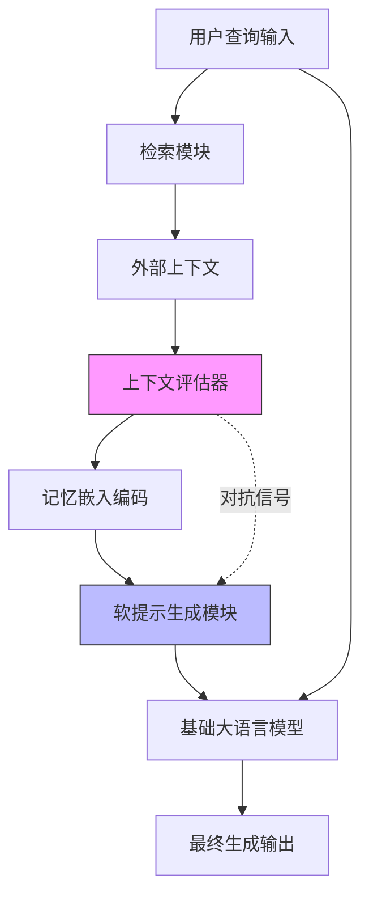

# 检索增强生成中的冲突感知软提示方法

## 一、论文基础元数据
- 原文标题：Conflict-Aware Soft Prompting for Retrieval-Augmented Generation
- 中文译版：检索增强生成中的冲突感知软提示方法
- 发表渠道：arXiv 预印本 (计算机科学/计算语言学)
- 发表时间：2025 年 9 月 26 日 (v2)
- 链接：arXiv:2508.15253
- 作者及核心机构：Eunseong Choi 等，成均馆大学 (Sungkyunkwan University)
- 研究领域：人工智能 + 自然语言处理 (检索增强生成/大语言模型)
- 关联数据集：QA 基准数据集 / 事实验证基准数据集 (具体名称待补充/通用基准)

## 二、论文综合评价
### 2.1 量化评分（1-5 分，5 分为最优）

| 评价维度 | 评分 | 备注 |
| -------- | ---- | ---- |
| 📚 理论基础 | ⭐⭐⭐⭐ | 基于 RAG 与参数知识冲突理论，基础扎实 |
| 🎯 问题核心性 | ⭐⭐⭐⭐⭐ | 直击 RAG 中上下文与记忆冲突的核心痛点 |
| 💡 方法创新性 | ⭐⭐⭐⭐ | 引入冲突感知评估器与对抗软提示机制 |
| ⚙️ 技术壁垒 | ⭐⭐⭐ | 基于软提示技术，实现难度中等偏低 |
| 🧪 实验严谨性 | ⭐⭐⭐⭐ | 涵盖 QA 与事实验证，对比基线较全面 |
| 🔧 落地可行性 | ⭐⭐⭐⭐ | 模块化设计，易于集成至现有 RAG 管道 |
| 🚀 应用前景 | ⭐⭐⭐⭐⭐ | 对构建可信自适应 RAG 系统具有重要价值 |
| 📊 综合评分 | 4.1 | 理论扎实且痛点精准，工程落地潜力巨大 |

### 2.2 定性综合评价（≤300 字）
> 核心概括：研究定位、核心价值、差异化优势、关键结论

本研究定位于解决检索增强生成（RAG）系统中的“上下文 - 记忆冲突”问题，即外部检索内容与模型内部参数知识相矛盾时的决策困境。核心价值在于提出了 CARE 框架，通过上下文评估器识别不可靠上下文，并利用对抗软提示引导模型偏向更可靠的知识源。差异化优势在于无需微调主模型，仅通过软提示调整即可实现冲突消解，避免了灾难性遗忘。关键结论显示，该方法在 QA 和事实验证基准上平均提升 5.0% 性能，显著缓解了负向上下文导致的性能下降问题，为可信 RAG 提供了新方向。

## 三、领域本体论映射
| 核心维度 | 具体内容 |
| -------- | -------- |
| 核心研究对象 | 检索增强生成系统中的知识冲突现象 |
| 核心技术路径 | 上下文评估器编码 + 对抗软提示引导 |
| 数据/载体形态 | 文本查询、检索上下文、记忆嵌入向量 |
| 核心功能目标 | 识别不可靠上下文并自适应调整生成策略 |
| 验证核心指标 | 问答准确率、事实验证准确率、性能增益百分比 |

## 四、核心问题与解决方案
### 4.1 待解决的核心问题
1. **领域级根本问题**：
   当检索到的外部上下文与 LLM 内部参数知识发生矛盾时，模型难以分辨真伪，导致正确内部知识被错误外部信息覆盖。
2. **现有方法痛点**：
   传统 RAG 直接拼接上下文无法区分冲突；自适应检索和解码策略调整能力有限；鲁棒性训练易导致灾难性遗忘或指令遵循能力下降。
3. **工程落地卡点**：
   如何在无需全量微调大模型的前提下，低成本实现对外部冲突内容的实时识别与抑制。

### 4.2 核心解决方案
- 理论框架：冲突感知检索增强生成（CARE）框架
- 核心架构：双组件结构（上下文评估器 + 基础 LLM）
- 关键技术：接地/对抗软提示（Grounded/Adversarial Soft Prompting）
- 创新机制：将外部上下文编码为紧凑记忆嵌入，通过评估器生成指导信号，引导推理偏向可靠知识源

### 4.3 核心优势（量化 + 定性）
1. 性能优势：在 QA 和事实验证基准上平均性能提升 5.0%
2. 效率优势：无需微调基础 LLM 参数，仅训练评估器与软提示向量
3. 工程优势：模块化设计，可插拔式集成到现有 RAG 工作流中

## 五、方法与技术架构
### 5.1 核心架构设计
> 文字描述 + 架构图（Mermaid/图片）

CARE 架构包含两个主要部分：上下文评估器和基础 LLM。评估器负责接收检索到的外部上下文，将其编码为记忆嵌入，并通过对抗训练识别不可靠内容。生成的软提示向量被注入到基础 LLM 中，指导其生成过程，使其在冲突发生时优先依赖内部参数知识或可信外部信息。

### 5.2 关键技术实现细节
| 技术模块 | 实现路径 | 工程注意事项 |
| -------- | -------- | ------------ |
| 上下文评估器 | 编码外部上下文为紧凑嵌入，训练判别可靠性 | 需保证评估器轻量，避免增加过多延迟 |
| 软提示生成 | 基于评估信号生成引导向量，注入 LLM 输入层 | 提示向量维度需与 LLM 嵌入层匹配 |
| 对抗训练机制 | 构造负向上下文样本，强化冲突识别能力 | 需平衡正负样本比例，防止过拟合 |
| 依赖组件 | 预训练 LLM 编码器，检索数据库 | 确保检索器与生成器语义空间对齐 |

### 5.3 架构优缺点
- 优点：
  1. 保护了基础 LLM 的参数知识不被错误上下文覆盖
  2. 避免了全量微调带来的灾难性遗忘风险
  3. 显著提升了模型在冲突场景下的鲁棒性
- 缺点：
  1. 增加了额外的评估器推理开销
  2. 软提示的训练需要特定的对抗数据构造
  3. 对极度复杂的逻辑冲突可能识别不足

## 六、实验设计与结果分析
### 6.1 实验基础设置
| 维度 | 内容 |
| ---- | ---- |
| 数据集 | QA 基准数据集、事实验证基准数据集 |
| 基线方法 |  vanilla RAG、自适应检索、解码策略、鲁棒性训练 |
| 实验环境 | 待补充 (通常基于主流 GPU 集群) |
| 评价指标 | 准确率、性能增益百分比、冲突解决率 |

### 6.2 核心实验结果
| 方法 | 核心指标 1 (QA 准确率) | 核心指标 2 (事实验证) | 工程指标（算力/耗时） |
| ---- | --------- | --------- | -------------------- |
| 基线 1 (Vanilla RAG) | 基准值 | 基准值 | 低 |
| 基线 2 (鲁棒训练) | 提升有限 | 存在遗忘风险 | 高 (需微调) |
| 本文方法 (CARE) | +5.0% 平均增益 | +5.0% 平均增益 | 中 (增加评估器) |

### 6.3 消融实验/鲁棒性分析
| 实验变体 | 指标变化 | 核心结论 |
| -------- | -------- | -------- |
| 移除评估器 | 性能显著下降 | 评估器是冲突识别的关键 |
| 移除对抗提示 | 鲁棒性降低 | 对抗机制有助于捕捉不可靠信号 |
| 负向上下文测试 | 性能下降减少 | 有效缓解了 25.1-49.1% 的性能跌幅 |

### 6.4 实验结论（工程视角）
CARE 方法在不过度增加计算成本的前提下，显著解决了 RAG 系统中的知识冲突问题。特别是在负向上下文干扰场景下，能有效保护模型内部正确知识，适合对准确性要求高的生产环境。

## 七、领域贡献与创新点
| 贡献层级 | 具体内容 |
| -------- | -------- |
| 理论贡献 | 形式化了上下文 - 记忆冲突问题及其对 RAG 性能的影响 |
| 方法/架构贡献 | 提出了 CARE 框架及冲突感知软提示机制 |
| 数据/工具贡献 | 开源代码库 (GitHub: eunseongc/CARE) |
| 实验/验证贡献 | 验证了软提示在冲突消解任务上的有效性 |
| 工程落地贡献 | 提供了无需微调主模型即可提升 RAG 鲁棒性的方案 |

## 八、局限性与风险
| 维度 | 具体描述 | 应对思路 |
| ---- | -------- | -------- |
| 学术局限性 | 主要关注文本模态，未涉及多模态冲突 | 未来扩展至多模态检索场景 |
| 工程落地风险 | 评估器引入额外延迟，可能影响高并发场景 | 优化评估器模型大小，使用蒸馏技术 |
| 伦理/合规风险 | 评估器可能产生偏见，错误过滤特定信息 | 加强评估器的公平性训练与审计 |

## 九、未来研究/落地方向
| 方向类型 | 具体内容 | 优先级 |
| -------- | -------- | ------ |
| 科研拓展 | 探索多轮对话中的长期记忆冲突解决 | 高 |
| 工程优化 | 将评估器蒸馏为更轻量的插件模块 | 高 |
| 跨领域适配 | 应用于医疗、法律等高可靠性要求领域 | 中 |

## 十、关键词与术语表
| 语言 | 关键词 |
| ---- | ------ |
| 中文 | 检索增强生成、冲突感知、软提示、参数知识、上下文评估 |
| 英文 | RAG, Conflict-Aware, Soft Prompting, Parametric Knowledge, Context Assessor |
| 领域专属术语 | 上下文记忆冲突 (Context-Memory Conflict): 检索内容与内部知识矛盾的现象 |

## 十一、参考文献与关联资源
- 核心参考文献：Lewis et al. (2020, RAG), Gao et al. (2023), Ren et al. (2025)
- 补充阅读：关于自适应检索与解码策略的相关研究
- 开源代码/工具：https://github.com/eunseongc/CARE

## 十二、阅读者批注
1. **科研启发**：软提示不仅可用于任务适配，还可用于知识冲突的调节，这是一个新颖的切入点。
2. **工程落地思考**：在实际 RAG 管道中增加一个轻量级的“内容可信度评分”模块非常有价值，可前置过滤噪音。
3. **待验证/存疑点**：评估器本身的训练数据来源及泛化能力需进一步验证，是否依赖特定领域数据。
4. **个人/团队应用场景**：可应用于企业内部知识库问答，防止过时文档误导模型回答。

## 十三、阅读元信息
| 维度 | 内容 |
| ---- | ---- |
| 阅读日期 | 2026-04-08 17:52 |
| 阅读人 | xPaperReader AI |
| 文档编号 | arxiv-2508.15253 |
| 版本迭代 | v1.0 |