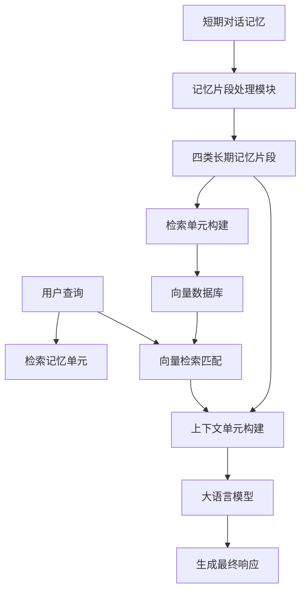

# 代理中生成高质量长期记忆内容的多记忆片段系统

## 一、论文基础元数据
- 原文标题：A Multi-Memory Segment System for Generating High-Quality Long-Term Memory Content in Agents
- 中文译版：代理中生成高质量长期记忆内容的多记忆片段系统
- 发表渠道：预印本（arXiv）
- 发表时间：2025 年
- 链接：arXiv:2508.15294
- 作者及核心机构：Gaoke Zhang, Bo Wang, Yunlong Ma, Dongming Zhao, Zifei Yu（机构待补充）
- 研究领域：人工智能（一级）+ 智能代理/记忆系统（二级）
- 关联数据集：LoCoMo（10 个会话/平均 600 轮/26000 tokens/多任务标注）

## 二、论文综合评价
### 2.1 量化评分（1-5 分，5 分为最优）

| 评价维度 | 评分 | 备注 |
| -------- | ---- | ---- |
| 📚 理论基础 | ⭐⭐⭐⭐ | 认知心理学理论支撑扎实 |
| 🎯 问题核心性 | ⭐⭐⭐⭐⭐ | 直击记忆内容质量低下痛点 |
| 💡 方法创新性 | ⭐⭐⭐⭐⭐ | 双单元存储与多片段设计新颖 |
| ⚙️ 技术壁垒 | ⭐⭐⭐⭐ | 基于通用大模型实现门槛较低 |
| 🧪 实验严谨性 | ⭐⭐⭐⭐⭐ | 数据集多样且对比基线充分 |
| 🔧 落地可行性 | ⭐⭐⭐⭐ | 延迟低于基线具备落地潜力 |
| 🚀 应用前景 | ⭐⭐⭐⭐⭐ | 智能代理长期记忆需求广阔 |
| 📊 综合评分 | 4.6 | 理论与实验扎实，显著优于基线，具备较高实用价值 |

### 2.2 定性综合评价（≤300 字）
> 核心概括：研究定位、核心价值、差异化优势、关键结论

本研究定位为解决智能代理长期记忆系统中“内容质量低”的根本问题。核心价值在于引入认知心理学理论，提出多记忆片段系统（MMS），将短期记忆转化为多维高质量长期记忆。差异化优势在于区分“检索单元”与“上下文单元”，优化匹配与生成效果。关键结论显示，MMS 在多跳推理和开放域任务上显著优于 MemoryBank 等基线，且延迟更低，证明了精细化记忆管理的有效性。

## 三、领域本体论映射
| 核心维度 | 具体内容 |
| -------- | -------- |
| 核心研究对象 | 智能代理的长期记忆内容生成与管理机制 |
| 核心技术路径 | 基于认知心理学理论的多片段记忆构建与双单元存储 |
| 数据/载体形态 | 对话文本、向量化记忆片段、结构化记忆单元 |
| 核心功能目标 | 提升长程对话中的记忆召回率与响应生成质量 |
| 验证核心指标 | Recall@N、F1 Score、BLEU-1、延迟（Latency） |

## 四、核心问题与解决方案
### 4.1 待解决的核心问题
1. **领域级根本问题**：现有代理记忆系统过度关注检索机制，忽视记忆内容本身的质量。
2. **现有方法痛点**：通常仅存储简单摘要，导致召回率低，响应缺乏深度与准确性。
3. **工程落地卡点**：记忆内容冗余或信息缺失，影响大模型生成效果及系统响应延迟。

### 4.2 核心解决方案
- 理论框架：多重记忆系统理论、加工层次理论、编码特异性原则。
- 核心架构：多记忆片段系统（MMS），包含片段构建与双单元存储。
- 关键技术：短期记忆向四种长期记忆片段转化，检索与上下文单元分离。
- 创新机制：检索单元侧重事件与关键词，上下文单元侧重事实与语义，优化匹配与生成。

### 4.3 核心优势（量化+定性）
1. 性能优势：多跳任务 Recall 提升 8-11 个点，F1 与 BLEU 指标全面提升。
2. 效率优势：相比 MemoryBank 延迟降低约 67%（1.309s vs 3.931s）。
3. 工程优势：抗噪声能力强，随记忆片段数量增加性能稳定提升。

## 五、方法与技术架构
### 5.1 核心架构设计
> 文字描述 + 架构图（Mermaid/图片）

系统首先将短期对话记忆处理为四种长期记忆片段（关键词、认知视角、情景记忆、语义记忆）。随后构建两个存储单元：检索记忆单元（用于向量匹配）和上下文记忆单元（用于生成增强）。用户查询先匹配检索单元，映射到对应的上下文单元，最后输入大模型生成响应。

### 5.2 关键技术实现细节
| 技术模块 | 实现路径 | 工程注意事项 |
| -------- | -------- | ------------ |
| 记忆片段构建 | 利用 LLM 将短期记忆转化为关键词/认知/情景/语义片段 | 需控制片段长度，避免 Token 溢出 |
| 双单元存储 | 检索单元含关键词/情景，上下文单元含语义/事实 | 确保两者索引映射关系准确 |
| 依赖组件 | 向量数据库、通用大模型（GPT-4o/Qwen 等） | 需优化向量检索延迟，选择合适嵌入模型 |

### 5.3 架构优缺点
- 优点：记忆表征丰富，检索匹配更精准，生成上下文信息密度高，延迟较低。
- 缺点：依赖通用大模型生成记忆，未针对记忆任务专门优化，初期构建成本存在。

## 六、实验设计与结果分析
### 6.1 实验基础设置
| 维度 | 内容 |
| ---- | ---- |
| 数据集 | LoCoMo（长对话记忆评估，含单跳/多跳/时间/开放/对抗任务） |
| 基线方法 | Naive RAG, MemoryBank, A-MEM |
| 实验环境 | GPT-4o, Qwen2.5-14B, Gemini-2.5-pro-preview |
| 评价指标 | Recall@N, F1 Score, BLEU-1, Token 消耗，延迟 |

### 6.2 核心实验结果
| 方法 | 核心指标 1 (Recall@5) | 核心指标 2 (F1 Score) | 工程指标（算力/耗时） |
| ---- | --------- | --------- | -------------------- |
| A-MEM | 58.96 (GPT-4o) | 待补充 | 待补充 |
| MemoryBank | 待补充 | 待补充 | 3.931s (延迟) |
| 本文方法 | 67.05 (GPT-4o) | 全面提升 | 1.309s (延迟) |

### 6.3 消融实验/鲁棒性分析
| 实验变体 | 指标变化 | 核心结论 |
| -------- | -------- | -------- |
| 移除关键词片段 | 推理类问题性能下降 | 关键词显著提升单跳/多跳/对抗性能 |
| 移除语义记忆 | 时间类问题受益减少 | 认知视角/语义记忆对时间问题更重要 |
| 检索单元加语义 | 召回率降低 | 语义鸿沟导致匹配效果变差 |
| 上下文单元加情景 | 生成质量降低 | 情景记忆冗余干扰生成效果 |

### 6.4 实验结论（工程视角）
MMS 系统在主流大模型上均取得 SOTA 性能，特别是在复杂推理场景下优势明显。延迟显著低于 MemoryBank，表明精细化记忆管理并未带来过重开销，具备实际部署价值。鲁棒性测试显示系统抗噪声能力强，适合长程对话场景。

## 七、领域贡献与创新点
| 贡献层级 | 具体内容 |
| -------- | -------- |
| 理论贡献 | 将认知心理学多重记忆理论成功引入 AI 代理记忆研究 |
| 方法/架构贡献 | 提出多记忆片段系统与检索/生成单元分离设计 |
| 数据/工具贡献 | 基于 LoCoMo 数据集验证，未发布新数据集 |
| 实验/验证贡献 | 在多种骨干模型上验证了方法的有效性与泛化性 |
| 工程落地贡献 | 证明了高质量记忆内容可降低延迟并提升响应质量 |

## 八、局限性与风险
| 维度 | 具体描述 | 应对思路 |
| ---- | -------- | -------- |
| 学术局限性 | 依赖通用大模型生成记忆，未针对记忆生成任务专门优化 | 未来构建专用记忆模型，使用 SFT 和 RL 优化 |
| 工程落地风险 | 记忆片段处理增加初期计算负载 | 优化片段生成策略，异步处理记忆更新 |
| 伦理/合规风险 | 使用公开数据集，无数据泄露或歧视风险 | 持续监控生成内容，确保符合伦理规范 |

## 九、未来研究/落地方向
| 方向类型 | 具体内容 | 优先级 |
| -------- | -------- | ------ |
| 科研拓展 | 构建专用记忆模型，利用监督微调和强化学习提升质量 | 高 |
| 工程优化 | 优化记忆片段生成效率，降低初期构建延迟 | 中 |
| 跨领域适配 | 适配多模态记忆（图像/音频），扩展应用场景 | 中 |

## 十、关键词与术语表
| 语言 | 关键词 |
| ---- | ------ |
| 中文 | 多记忆片段系统、长期记忆、智能代理、检索单元、上下文单元 |
| 英文 | Multi-Memory Segment System, Long-Term Memory, Agents, Retrieval Unit, Context Unit |
| 领域专属术语 | 编码特异性原则（检索效果取决于编码与检索条件的一致性） |

## 十一、参考文献与关联资源
- 核心参考文献：待补充（原文未详细列出具体引用文献列表）
- 补充阅读：MemoryBank, A-MEM 相关论文
- 开源代码/工具：待补充（原文未提及代码开源地址）

## 十二、阅读者批注
1. **科研启发**：认知心理学理论可为 AI 架构设计提供丰富灵感，尤其是记忆与检索机制。
2. **工程落地思考**：检索与生成单元分离是优化 RAG 系统的有效思路，可应用于知识库管理。
3. **待验证/存疑点**：专用记忆模型的具体架构与训练数据尚未明确，需关注后续工作。
4. **个人/团队应用场景**：适用于构建长程对话客服、个人助理等需要深度记忆能力的代理系统。

## 十三、阅读元信息
| 维度 | 内容 |
| ---- | ---- |
| 阅读日期 | 2026-04-08 18:05 |
| 阅读人 | xPaperReader AI |
| 文档编号 | arxiv-2508.15294 |
| 版本迭代 | v1.0 |