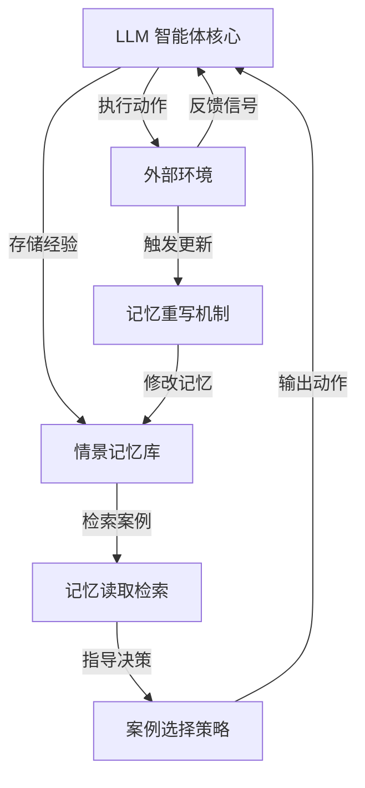

# Memento：无需微调底层大模型即可实现智能体自适应学习

## 一、论文基础元数据
- 原文标题：Memento: Fine-tuning LLM Agents without Fine-tuning LLMs
- 中文译版：Memento：无需微调底层大模型即可实现智能体自适应学习
- 发表渠道：arXiv 预印本 (计算机科学 - 机器学习)
- 发表时间：2025 年 8 月 25 日 (v2)
- 链接：https://arxiv.org/abs/2508.16153
- 作者及核心机构：Huichi Zhou (UCL), Yihang Chen (Huawei Noah's Ark Lab), Jun Wang (UCL) 等
- 研究领域：人工智能 + 大语言模型智能体/强化学习
- 关联数据集：GAIA (验证/测试), DeepResearcher, Musique, Bamboogle, PopQA

## 二、论文综合评价
### 2.1 量化评分（1-5 分，5 分为最优）

| 评价维度 | 评分 | 备注 |
| -------- | ---- | ---- |
| 📚 理论基础 | ⭐⭐⭐⭐⭐ | 提出记忆增强马尔可夫决策过程形式化 |
| 🎯 问题核心性 | ⭐⭐⭐⭐⭐ | 解决智能体微调成本高与静态工作流僵化问题 |
| 💡 方法创新性 | ⭐⭐⭐⭐⭐ | 基于记忆的在线强化学习替代梯度更新 |
| ⚙️ 技术壁垒 | ⭐⭐⭐⭐ | 记忆检索与重写机制设计具有较高复杂度 |
| 🧪 实验严谨性 | ⭐⭐⭐⭐⭐ | 多基准测试且包含消融与泛化性验证 |
| 🔧 落地可行性 | ⭐⭐⭐⭐ | 无需梯度更新降低部署算力门槛 |
| 🚀 应用前景 | ⭐⭐⭐⭐⭐ | 适用于开放域技能获取与深度研究场景 |
| 📊 综合评分 | 4.7 | 理论创新与实验效果兼备，极具落地潜力 |

### 2.2 定性综合评价（≤300 字）
> 核心概括：研究定位、核心价值、差异化优势、关键结论
本研究定位为自适应大语言模型智能体的新型学习范式。核心价值在于消除了对底层大模型进行梯度微调的需求，通过基于记忆的在线强化学习实现低成本持续适应。差异化优势在于形式化了记忆增强马尔可夫决策过程（M-MDP），结合神经案例选择策略与记忆重写机制。关键结论显示，该方法在 GAIA 验证集达到 87.88% (Pass@3)，测试集 79.40%，且在分布外任务上显著提升 4.7% 至 9.6%，证明了无需微调参数即可实现持续学习与泛化能力的可行性。

## 三、领域本体论映射
| 核心维度 | 具体内容 |
| -------- | -------- |
| 核心研究对象 | 自适应大语言模型智能体 (Adaptive LLM Agents) |
| 核心技术路径 | 基于记忆的在线强化学习 (Memory-based Online RL) |
| 数据/载体形态 | 情景记忆 (Episodic Memory)，可微或非标量 |
| 核心功能目标 | 无需梯度更新的持续技能获取与实时学习 |
| 验证核心指标 | GAIA 准确率，DeepResearcher F1/PM，OOD 提升幅度 |

## 四、核心问题与解决方案
### 4.1 待解决的核心问题
1. **领域级根本问题**：大模型智能体如何在不更新底层参数的情況下实现持续适应与新技能获取。
2. **现有方法痛点**：现有方法要么依赖静态手工反射工作流导致僵化，要么需要计算密集型的模型参数梯度更新。
3. **工程落地卡点**：高频微调带来的高昂算力成本与延迟，限制了智能体在实时环境中的部署。

### 4.2 核心解决方案
- 理论框架：记忆增强马尔可夫决策过程 (M-MDP)。
- 核心架构：包含神经案例选择策略、情景记忆库、记忆重写与读取机制。
- 关键技术：基于环境反馈的记忆重写，基于高效检索的策略改进。
- 创新机制：利用记忆检索替代梯度反向传播，实现策略的在线更新。

### 4.3 核心优势（量化 + 定性）
1. 性能优势：GAIA 验证集 87.88% (Pass@3)，超越现有基于训练的最优方法。
2. 效率优势：无需梯度更新，显著降低计算开销与适应时间。
3. 工程优势：支持分布外任务泛化，案例记忆带来 4.7% 至 9.6% 的绝对提升。

## 五、方法与技术架构
### 5.1 核心架构设计
> 文字描述 + 架构图（Mermaid/图片）
系统由智能体核心、环境交互模块、情景记忆库及策略控制模块组成。智能体与环境交互产生经验，存入记忆库。策略网络通过读取记忆库中的案例来指导动作决策，记忆库根据环境反馈进行重写更新，形成闭环。

### 5.2 关键技术实现细节
| 技术模块 | 实现路径 | 工程注意事项 |
| -------- | -------- | ------------ |
| 记忆存储 | 支持可微或非标量情景记忆 | 需平衡存储容量与检索速度 |
| 策略网络 | 神经案例选择策略指导动作 | 防止检索噪声干扰决策 |
| 记忆更新 | 基于环境反馈的重写机制 | 确保旧知识不被灾难性遗忘 |
| 依赖组件 | 底层大语言模型 (冻结参数) | 需确保基座模型具备基础推理能力 |

### 5.3 架构优缺点
- 优点：无需反向传播，计算效率高，支持持续学习，泛化能力强。
- 缺点：记忆库规模膨胀可能影响检索延迟，依赖检索质量。

## 六、实验设计与结果分析
### 6.1 实验基础设置
| 维度 | 内容 |
| ---- | ---- |
| 数据集 | GAIA, DeepResearcher, Musique, Bamboogle, PopQA |
| 基线方法 | Manus.ai, Aworld, OpenAI DR, OWL++, Offline Executor |
| 实验环境 | 深度研究设置 (Deep Research Setting) |
| 评价指标 | Accuracy, Pass@3, F1, PM (Performance Metric) |

### 6.2 核心实验结果
| 方法 | 核心指标 1 (GAIA Val) | 核心指标 2 (DeepResearcher) | 工程指标（算力/耗时） |
| ---- | --------- | --------- | -------------------- |
| 基线 1 (OpenAI DR) | 待补充 | 待补充 | 高 (需微调) |
| 基线 2 (OWL++) | 待补充 | 待补充 | 中 |
| 本文方法 | 87.88% (Pass@3) | 66.6% F1 / 80.4% PM | 低 (无梯度更新) |

### 6.3 消融实验/鲁棒性分析
| 实验变体 | 指标变化 | 核心结论 |
| -------- | -------- | -------- |
| 无案例记忆 (w/o CBR) | 性能下降 | 记忆机制对性能至关重要 |
| 非标量记忆设计 | 持续学习曲线平稳 | 不同记忆设计均有效 |
| 分布外任务 (OOD) | 提升 4.7% 至 9.6% | 显著增强泛化能力 |

### 6.4 实验结论（工程视角）
该方法在多个基准测试中达到最先进水平，特别是在无需微调的情况下实现了优异的泛化性能。消融实验证明记忆机制是性能提升的关键来源，适合资源受限但需高适应性的工程场景。

## 七、领域贡献与创新点
| 贡献层级 | 具体内容 |
| -------- | -------- |
| 理论贡献 | 形式化记忆增强马尔可夫决策过程 (M-MDP) |
| 方法/架构贡献 | 提出无需微调参数的基于记忆在线强化学习框架 |
| 数据/工具贡献 | 开源代码库，支持深度研究场景验证 |
| 实验/验证贡献 | 在 GAIA 及多个 OOD 数据集上验证了有效性 |
| 工程落地贡献 | 提供了低成本持续适应的智能体开发路径 |

## 八、局限性与风险
| 维度 | 具体描述 | 应对思路 |
| ---- | -------- | -------- |
| 学术局限性 | 记忆库长期存储的遗忘问题未深入探讨 | 引入记忆压缩或分层存储机制 |
| 工程落地风险 | 大规模记忆库检索延迟可能影响实时性 | 优化索引结构或使用向量数据库 |
| 伦理/合规风险 | 记忆库可能存储敏感用户数据 | 实施数据加密与访问控制策略 |

## 九、未来研究/落地方向
| 方向类型 | 具体内容 | 优先级 |
| -------- | -------- | ------ |
| 科研拓展 | 探索多模态记忆存储与跨任务迁移 | 高 |
| 工程优化 | 优化检索算法以降低长序列记忆延迟 | 高 |
| 跨领域适配 | 适配代码生成、多轮对话等其他智能体场景 | 中 |

## 十、关键词与术语表
| 语言 | 关键词 |
| ---- | ------ |
| 中文 | 大语言模型智能体，记忆增强，在线强化学习，无需微调 |
| 英文 | LLM Agents, Memory-augmented, Online RL, Fine-tuning Free |
| 领域专属术语 | M-MDP (记忆增强马尔可夫决策过程), CBR (案例推理), Pass@3 (通过率指标) |

## 十一、参考文献与关联资源
- 核心参考文献：Christianos et al., 2023; Yang et al., 2025; Yao et al., 2023
- 补充阅读：OpenAI Deep Research, Google Agent Reports
- 开源代码/工具：https://github.com/Agent-on-the-Fly/Memento

## 十二、阅读者批注
1. **科研启发**：记忆机制可替代梯度更新作为知识载体，为持续学习提供新视角。
2. **工程落地思考**：适合私有化部署场景，避免频繁微调大模型带来的显存压力。
3. **待验证/存疑点**：记忆库规模达到何种量级时检索性能会显著下降。
4. **个人/团队应用场景**：客服智能体个性化适应，科研助手长期任务记忆。

## 十三、阅读元信息
| 维度 | 内容 |
| ---- | ---- |
| 阅读日期 | 2026-04-08 18:17 |
| 阅读人 | xPaperReader AI |
| 文档编号 | arxiv-2508.16153 |
| 版本迭代 | v1.0 |