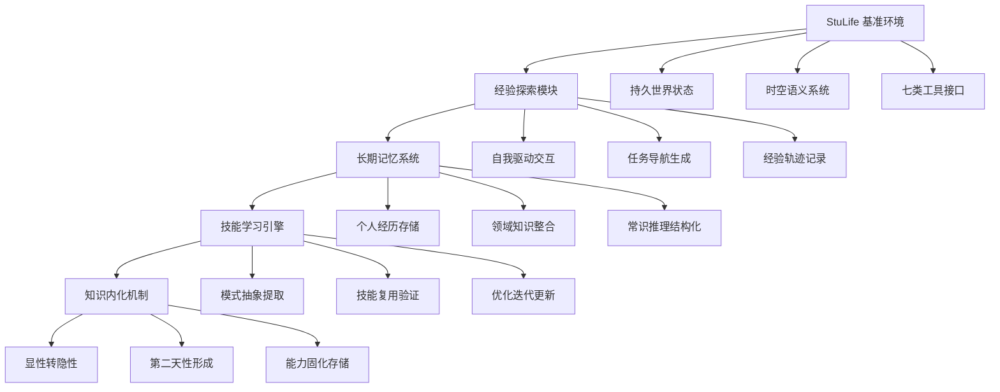

# 通过经验驱动的终身学习构建自演进代理：框架与基准

## 一、论文基础元数据
- 原文标题：Building Self-Evolving Agents via Experience-Driven Lifelong Learning: A Framework and Benchmark
- 中文译版：通过经验驱动的终身学习构建自演进代理：框架与基准
- 发表渠道：预印本（arXiv）
- 发表时间：2025 年 8 月
- 链接（arXiv/DOI）：arXiv:2508.19005
- 作者及核心机构：Yuxuan Cai, Yipeng Hao, Jie Zhou 等 17 位作者（机构待补充）
- 研究领域（一级领域 + 二级子领域）：人工智能 + 智能代理/终身学习
- 关联数据集（名称/规模/语言/标注）：StuLife 基准，1284 个任务，554 个需长期记忆，628 个需自我动机，英文，自动化标注

## 二、论文综合评价
### 2.1 量化评分（1-5 分，5 分为最优）

| 评价维度 | 评分 | 备注 |
| -------- | ---- | ---- |
| 📚 理论基础 | ⭐⭐⭐⭐⭐ | 基于人类认知发展理论，框架设计扎实 |
| 🎯 问题核心性 | ⭐⭐⭐⭐⭐ | 直击 AGI 核心挑战：长期记忆与自主演进 |
| 💡 方法创新性 | ⭐⭐⭐⭐⭐ | 提出 ELL 框架与 StuLife 基准，原创性强 |
| ⚙️ 技术壁垒 | ⭐⭐⭐⭐ | 多模块协同，但依赖现有 LLM 能力 |
| 🧪 实验严谨性 | ⭐⭐⭐⭐⭐ | 10 款模型评估，完美上下文验证设计精妙 |
| 🔧 落地可行性 | ⭐⭐⭐ | 模拟环境复杂，真实场景迁移需验证 |
| 🚀 应用前景 | ⭐⭐⭐⭐⭐ | 为 AGI 研究指明方向，应用潜力巨大 |
| 📊 综合评分 | 4.4 | 框架与基准设计卓越，揭示当前代理根本缺陷 |

### 2.2 定性综合评价（≤300 字）
> 核心概括：研究定位、核心价值、差异化优势、关键结论

本研究定位为 AGI 演进路径的里程碑式工作，核心价值在于首次系统性构建了经验驱动终身学习框架（ELL）及配套高保真基准（StuLife）。差异化优势体现在：1）模拟真实长期依赖环境而非孤立任务；2）提出多维度终身学习评估指标超越传统完成率；3）通过完美上下文实验精确定位瓶颈为记忆管理而非理解能力。关键结论揭示当前 SOTA 模型（包括 GPT-5）在长期记忆、自主动机、规划分解方面存在根本性缺陷，距真正自演进代理仍有巨大差距，上下文工程与模型改进同等重要。

## 三、领域本体论映射
| 核心维度 | 具体内容 |
| -------- | -------- |
| 核心研究对象 | 自演进智能代理（Self-Evolving Agents） |
| 核心技术路径 | 经验探索→长期记忆→技能学习→知识内化 |
| 数据/载体形态 | 结构化任务序列、持久化世界状态、多工具交互日志 |
| 核心功能目标 | 实现代理在动态环境中的自主终身成长与能力演进 |
| 验证核心指标 | 遗忘度量 (FGT)、前后向迁移 (BWT/FWT)、记忆利用分数、技能获取率、StuGPA |

## 四、核心问题与解决方案
### 4.1 待解决的核心问题
1. **领域级根本问题**：当前 AI 代理缺乏长期记忆、自主演进和主动学习能力，无法实现从静态任务执行向自主终身成长的范式转变
2. **现有方法痛点**：代理无法跨长时间跨度检索关键信息、缺乏自我驱动力、难以处理递归多阶段约束、策略性记忆缺失
3. **工程落地卡点**：稀疏奖励环境下缺乏即时反馈、技能内化机制不明确、跨上下文记忆链接能力不足、上下文工程设计复杂

### 4.2 核心解决方案
- 理论框架：经验驱动的终身学习（ELL）框架，基于四大核心原则构建自演进代理
- 核心架构：经验探索模块 + 长期记忆系统 + 技能学习引擎 + 知识内化机制
- 关键技术：多阶段 LLM 生成管道、确定性算法确保逻辑严密、多维度评估指标体系
- 创新机制：持久化世界状态设计、时空语义系统、记忆距离加权评分、技能获取率统计

### 4.3 核心优势（量化 + 定性）
1. 性能优势：完美上下文下 SOTA 模型成功率达 98.18%，验证任务可解性；全基准测试揭示真实差距（GPT-5 仅 17.9/100）
2. 效率优势：1284 个任务规模化评估，7 类工具系统测试规划能力，样本效率与 Token 消耗可量化
3. 工程优势：确定性子系统确保实验可复现，多阶段生成管道保证数据质量，模块化框架支持跨领域迁移

## 五、方法与技术架构
### 5.1 核心架构设计

ELL 框架采用四层递进架构，从经验获取到知识内化形成完整闭环：

### 5.2 关键技术实现细节

| 技术模块 | 实现路径 | 工程注意事项 |
| -------- | -------- | ------------ |
| 经验探索模块 | 自我驱动交互导航相互依赖任务，生成经验轨迹 | 需确保任务间纵向依赖性，避免孤立任务 |
| 长期记忆系统 | 结构化存储个人经历、领域知识、常识推理 | 记忆检索需支持时间步加权，防止灾难性遗忘 |
| 技能学习引擎 | 从经验中抽象可复用模式，新任务验证优化 | 技能库需版本管理，支持增量更新 |
| 知识内化机制 | 显性经验转化为隐性能力，形成第二天性 | 内化时机需策略性选择，避免过早固化 |
| 依赖组件 | 多阶段 LLM 生成管道、确定性算法、7 类工具接口 | 工具可用性需按场景限制，测试规划能力 |

### 5.3 架构优缺点
- 优点：
  1. 四层递进设计符合人类认知发展规律
  2. 持久化世界状态支持长期依赖任务
  3. 多维度评估指标全面捕捉终身学习能力
  4. 确定性子系统确保实验可复现性

- 缺点：
  1. 模拟环境与真实场景存在差距
  2. 技能内化时机选择机制尚不明确
  3. 跨模态记忆链接能力支持不足
  4. 稀疏奖励环境下内在动机设计复杂

## 六、实验设计与结果分析
### 6.1 实验基础设置

| 维度 | 内容 |
| ---- | ---- |
| 数据集 | StuLife 基准，1284 个任务，3 大核心场景，10 个子场景 |
| 基线方法 | 10 款前沿模型：GPT-5、Gemini 2.5 Pro、Grok-4、Qwen3 系列、Llama-3.1-8B、Deepseek-V3 等 |
| 实验环境 | 持久化校园模拟环境，含日历、地图、预约、邮件、选课、数据检索 7 类工具 |
| 评价指标 | FGT 遗忘度量、BWT/FWT 迁移指标、AIP 平均增量性能、记忆利用分数、技能获取率、StuGPA |

### 6.2 核心实验结果

| 方法 | 核心指标 1 (综合得分) | 核心指标 2 (完美上下文) | 工程指标（算力/耗时） |
| ---- | --------- | --------- | -------------------- |
| GPT-5 | 17.9/100 | 98.18% | 待补充 |
| Gemini 2.5 Pro | 待补充 | 待补充 | 待补充 |
| Qwen3-235B | 待补充 | 待补充 | 待补充 |
| 人类基准 | 待补充 | 86.64% | 待补充 |
| 本文方法 (框架) | 框架非模型，待补充 | 待补充 | 待补充 |

### 6.3 消融实验/鲁棒性分析

| 实验变体 | 指标变化 | 核心结论 |
| -------- | -------- | -------- |
| 完美上下文 vs 全基准 | 成功率从 7.78%-16.88% 提升至 98.18% | 瓶颈在记忆管理而非理解能力 |
| 不同模型规模对比 | 8B 至 235B 跨度评估 | 规模提升不直接解决长期记忆问题 |
| 工具限制场景 | 特定场景限制可用工具 | 有效测试代理规划与资源管理能力 |

### 6.4 实验结论（工程视角）

1. **瓶颈定位明确**：当前 LLM 代理的核心瓶颈是长期记忆的自主查找、管理与检索，而非任务理解能力
2. **上下文工程关键**：优化引导模型的方式（系统提示词设计）与改进模型本身同等重要
3. **评估维度需扩展**：传统任务完成率不足以评估终身学习能力，需引入遗忘度量、迁移指标等
4. **真实差距巨大**：即使最强模型（GPT-5）在完整基准下得分仅 17.9/100，距真正自演进代理仍有长路

## 七、领域贡献与创新点

| 贡献层级 | 具体内容 |
| -------- | -------- |
| 理论贡献 | 提出经验驱动终身学习 (ELL) 框架，定义自演进代理四大核心原则 |
| 方法/架构贡献 | 设计四层递进架构：经验探索→长期记忆→技能学习→知识内化 |
| 数据/工具贡献 | 发布 StuLife 基准，1284 个任务，7 类工具接口，持久化世界状态 |
| 实验/验证贡献 | 10 款 SOTA 模型系统评估，完美上下文实验精确定位瓶颈 |
| 工程落地贡献 | 提出上下文工程与模型改进同等重要，为 AGI 实现指明路径 |

## 八、局限性与风险

| 维度 | 具体描述 | 应对思路 |
| ---- | -------- | -------- |
| 学术局限性 | 模拟环境与真实场景存在差距；技能内化机制尚不明确 | 扩展至职场、医疗等真实领域；研究内化时机选择策略 |
| 工程落地风险 | 稀疏奖励环境缺乏即时反馈；跨模态记忆链接能力不足 | 引入内在动机机制（好奇心、预测误差）；增强多模态支持 |
| 伦理/合规风险 | 代理自主演进可能产生不可预测行为；数据隐私问题 | 建立行为监控机制；设计隐私保护记忆存储方案 |

## 九、未来研究/落地方向

| 方向类型 | 具体内容 | 优先级 |
| -------- | -------- | ------ |
| 科研拓展 | 研究技能内化机制、关联回忆跨上下文链接、内在动机设计 | 高 |
| 工程优化 | 引入代码解释器、数据库等复杂工具；优化上下文工程设计 | 高 |
| 跨领域适配 | 将 StuLife 范式迁移至职场、医疗、金融等领域 | 中 |
| 防作弊设计 | 增加任务复杂度、部分可观察、随机结果抵抗提示词记忆 | 中 |
| 规则演化 | 支持运行时规则更新，防止过拟合静态环境 | 低 |

## 十、关键词与术语表

| 语言 | 关键词 |
| ---- | ------ |
| 中文 | 自演进代理、经验驱动、终身学习、长期记忆、技能内化、上下文工程 |
| 英文 | Self-Evolving Agents, Experience-Driven, Lifelong Learning, Long-term Memory, Knowledge Internalization, Context Engineering |
| 领域专属术语 | ELL：经验驱动终身学习框架；StuLife：大学生涯模拟基准；FGT：遗忘度量指标；BWT/FWT：前后向迁移指标；StuGPA：综合评估指标；完美上下文：提供地面真值信息的实验设置 |

## 十一、参考文献与关联资源
- 核心参考文献：待补充（论文中引用的终身学习、智能代理相关基础文献）
- 补充阅读：人类认知发展理论、持续学习综述、智能代理架构设计相关文献
- 开源代码/工具：待补充（论文发布后可能开源的 ELL 框架实现与 StuLife 基准）

## 十二、阅读者批注
1. **科研启发**：该工作揭示了当前 LLM 代理研究的根本性盲点——过度关注单任务性能而忽视长期演进能力。完美上下文实验设计精妙，为定位代理瓶颈提供了方法论参考。
2. **工程落地思考**：上下文工程的重要性被低估，实际系统中提示词设计与模型选择同等关键。长期记忆系统需支持时间步加权检索，防止关键信息被淹没。
3. **待验证/存疑点**：部分模型具体得分数据待补充；技能内化机制的具体实现路径尚不明确；模拟环境到真实场景的迁移效果需进一步验证。
4. **个人/团队应用场景**：可参考该框架设计企业级智能助手，支持跨会话记忆与技能积累；适用于需要长期用户交互的客服、教育、健康管理等场景。

## 十三、阅读元信息

| 维度 | 内容 |
| ---- | ---- |
| 阅读日期 | 2026-04-08 18:30 |
| 阅读人 | xPaperReader AI |
| 文档编号 | arxiv-2508.19005 |
| 版本迭代 | v1.0 |