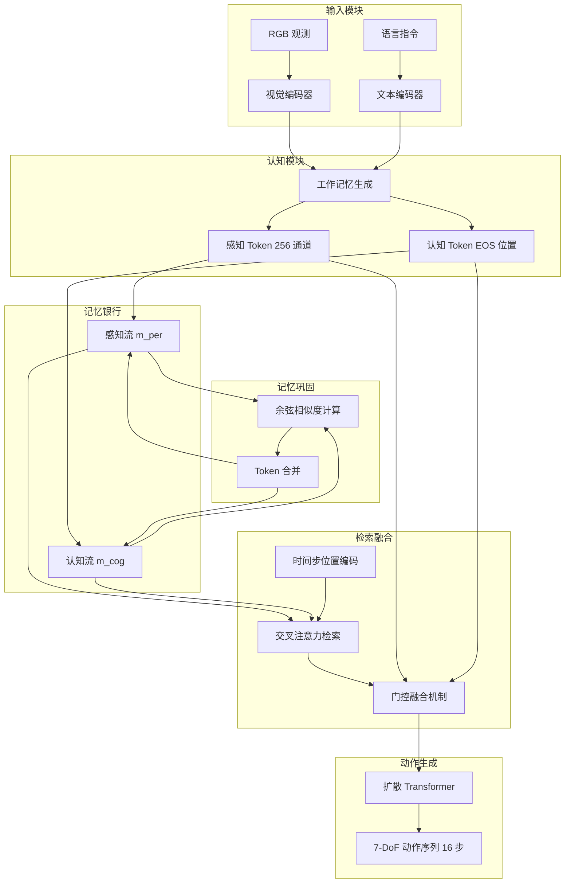

# MemoryVLA：机器人操作视觉 - 语言 - 动作模型中的感知 - 认知记忆

## 一、论文基础元数据
- 原文标题：MemoryVLA: Perceptual-Cognitive Memory in Vision-Language-Action Models for Robotic Manipulation
- 中文译版：MemoryVLA：机器人操作视觉 - 语言 - 动作模型中的感知 - 认知记忆
- 发表渠道：预印本（arXiv）
- 发表时间：2025 年
- 链接：arXiv:2508.19236
- 作者及核心机构：Hao Shi, Bin Xie, Yingfei Liu, Lin Sun, Fengrong Liu, Tiancai Wang, Erjin Zhou, Haoqiang Fan, Xiangyu Zhang, Gao Huang（待补充具体机构）
- 研究领域：机器人学 + 具身智能/视觉 - 语言 - 动作模型
- 关联数据集：SimplerEnv-Bridge、SimplerEnv-Fractal、LIBERO（5 套件/130 任务）、Mikasa-Robo、真实世界数据集（Franka/WidowX 机器人）

## 二、论文综合评价
### 2.1 量化评分（1-5 分，5 分为最优）

| 评价维度 | 评分 | 备注 |
| -------- | ---- | ---- |
| 📚 理论基础 | ⭐⭐⭐⭐⭐ | 认知科学启发，记忆机制设计扎实 |
| 🎯 问题核心性 | ⭐⭐⭐⭐⭐ | 直击 VLA 时序建模缺失痛点 |
| 💡 方法创新性 | ⭐⭐⭐⭐⭐ | 双流连忆机制，动态巩固策略 |
| ⚙️ 技术壁垒 | ⭐⭐⭐⭐ | 门控融合与记忆检索需精细调优 |
| 🧪 实验严谨性 | ⭐⭐⭐⭐⭐ | 6 基准 3 机器人 150+ 任务全覆盖 |
| 🔧 落地可行性 | ⭐⭐⭐⭐⭐ | 推理延迟仅增 3.6%，显存增加少 |
| 🚀 应用前景 | ⭐⭐⭐⭐⭐ | 长程操作任务泛化能力强 |
| 📊 综合评分 | 4.9 | 时序建模突破，效率效果双优 |

### 2.2 定性综合评价（≤300 字）
> 核心概括：研究定位、核心价值、差异化优势、关键结论

MemoryVLA 定位于解决视觉 - 语言 - 动作模型在长程机器人操作任务中时序建模缺失的根本问题。其核心价值在于受人类记忆机制（工作记忆 + 海马体长期记忆）启发，提出感知 - 认知记忆银行（PCMB），同时存储细粒度感知细节与高层语义认知。差异化优势体现在：仅需单一第三人称 RGB 输入即可超越多模态基线，推理开销极低（延迟 +3.6%）。关键结论：在 6 个基准、3 种机器人、150+ 任务上达到 SOTA，长程任务成功率提升 26%，证明了记忆机制对复杂时序依赖任务的有效性。

## 三、领域本体论映射
| 核心维度 | 具体内容 |
| -------- | -------- |
| 核心研究对象 | 视觉 - 语言 - 动作（VLA）模型的时序记忆机制 |
| 核心技术路径 | 感知 - 认知双流连忆银行 + 门控融合 + 记忆巩固 |
| 数据/载体形态 | 单帧 224×224 第三人称 RGB 图像 + 语言指令 |
| 核心功能目标 | 提升长视野机器人操作任务的成功率与鲁棒性 |
| 验证核心指标 | 任务成功率、推理延迟、显存占用、OOD 泛化能力 |

## 四、核心问题与解决方案
### 4.1 待解决的核心问题
1. **领域级根本问题**：主流 VLA 模型缺乏显式的时间建模能力，导致在非马尔可夫性的长程机器人操作任务中表现不佳。
2. **现有方法痛点**：交错格式实现复杂成本高；潜在 Token+LSTM 表示粗糙丢弃感知细节；轨迹绘制丢弃语义细节；Prompt 注入未有效利用历史信息。
3. **工程落地卡点**：时序建模需在效果与效率间平衡，记忆膨胀问题需解决，推理延迟需控制在可接受范围。

### 4.2 核心解决方案
- 理论框架：受人类记忆机制（工作记忆 + 海马体长期记忆）启发的认知 - 记忆 - 动作闭环框架
- 核心架构：视觉 - 语言认知模块 + 感知 - 认知记忆银行（PCMB）+ 记忆检索 + 门控融合 + 记忆巩固 + 记忆条件动作专家
- 关键技术：双流连忆存储、交叉注意力检索、时间步位置编码、可学习门控机制、Token 合并巩固策略
- 创新机制：感知流与认知流分离存储、动态记忆巩固防止膨胀、自适应门控融合当前与历史记忆

### 4.3 核心优势（量化 + 定性）
1. 性能优势：SimplerEnv-Bridge 成功率 71.9%（+14.6%），真实世界长时序任务成功率 83%（+26%）
2. 效率优势：RTX 4090 上延迟仅增加 3.6%（0.187s→0.194s），显存增加 0.8GB
3. 工程优势：仅需单一 RGB 输入，无需腕部相机或本体感知状态，部署门槛低

## 五、方法与技术架构
### 5.1 核心架构设计
> 文字描述 + 架构图（Mermaid/图片）

MemoryVLA 采用端到端的"认知 - 记忆 - 动作"框架。首先通过视觉 - 语言认知模块将当前 RGB 观测和指令编码为工作记忆（感知 Token+ 认知 Token）。然后通过交叉注意力机制从感知 - 认知记忆银行检索历史相关信息，经门控融合后输入记忆条件扩散动作专家，预测未来 16 步的 7-DoF 动作序列。记忆库容量满时执行 Token 合并巩固策略。

### 5.2 关键技术实现细节
| 技术模块 | 实现路径 | 工程注意事项 |
| -------- | -------- | ------------ |
| 视觉 - 语言认知模块 | 基于 7B Prismatic VLM，编码为感知 Token(256 通道) 和认知 Token(EOS 位置) | 需保持与预训练 VLM 的兼容性 |
| 感知 - 认知记忆银行 | 双流连式存储，感知流存细节，认知流存语义摘要 | 需控制记忆库容量防止膨胀 |
| 记忆检索 | 当前工作记忆作 Query，交叉注意力检索，引入时间步位置编码 | 注意力计算需优化以保证延迟 |
| 门控融合 | 可学习门控机制，公式：x_tilde=g^x⊙H^x+(1-g^x)⊙x | 门控参数需稳定训练避免梯度问题 |
| 记忆巩固 | 容量满时计算相邻条目余弦相似度，合并最相似一对 | 合并策略需保证信息不丢失 |
| 记忆条件动作专家 | 基于扩散 Transformer，预测未来 16 步 7-DoF 动作序列 | DDIM 采样 10 步，CFG scale 1.5 |

### 5.3 架构优缺点
- 优点：
  1. 双流连忆机制同时保留感知细节与语义认知，信息完整性高
  2. 动态记忆巩固有效解决长程任务中的记忆膨胀问题
  3. 推理开销极低，延迟仅增加 3.6%，适合实时部署
  4. 仅需单一 RGB 输入，传感器依赖少，部署门槛低

- 缺点：
  1. 对未见相机视角变化敏感，仿真 OOD 测试中性能下降明显
  2. 记忆长度需根据任务类型调整（通用 16，长程 256），需人工配置
  3. 门控融合机制需精细调优，训练稳定性需关注

## 六、实验设计与结果分析
### 6.1 实验基础设置
| 维度 | 内容 |
| ---- | ---- |
| 数据集 | SimplerEnv-Bridge、SimplerEnv-Fractal、LIBERO(5 套件/130 任务)、Mikasa-Robo、真实世界数据集 |
| 基线方法 | CogACT、π0、OpenVLA、Octo、RT-1/2-X、CronusVLA、RoboFlamingo 等 |
| 实验环境 | 仿真 (SimplerEnv/LIBERO/Mikasa-Robo)+ 真机 (Franka/WidowX 机器人，Intel RealSense D435 相机) |
| 评价指标 | 任务成功率、推理延迟、显存占用、OOD 泛化能力 |

### 6.2 核心实验结果
| 方法 | 核心指标 1 | 核心指标 2 | 工程指标（算力/耗时） |
| ---- | --------- | --------- | -------------------- |
| CogACT-Large | SimplerEnv-Bridge 57.3% | 真实世界长时序 57% | 待补充 |
| CronusVLA | Mikasa-Robo 18.0% | 待补充 | 待补充 |
| π0-FAST | LIBERO 85.0% | 需腕部相机 + 本体感知 | 待补充 |
| 本文方法 | SimplerEnv-Bridge 71.9% | LIBERO 96.5% | 延迟 0.194s(+3.6%)，显存 +0.8GB |

### 6.3 消融实验/鲁棒性分析
| 实验变体 | 指标变化 | 核心结论 |
| -------- | -------- | -------- |
| 仅感知记忆 | 71.9%→约 64% | 双流连忆优于单一类型 |
| 仅认知记忆 | 71.9%→约 64% | 感知与认知需互补保留 |
| 记忆长度 4 | 71.9%→67.7% | 过短无法捕捉长程依赖 |
| 记忆长度 64 | 71.9%→67.7% | 过长引入噪声，最佳 16 |
| 简单相加融合 | 71.9%→67.7% | 门控融合优于简单相加 |
| FIFO 巩固 | 71.9%→66.7% | Token 合并优于先进先出 |
| 无时间步 PE | -2.1% | 时间步位置编码必要 |

### 6.4 实验结论（工程视角）
1. **记忆模块轻量高效**：延迟仅增加 3.6%，显存增加 0.8GB，适合实时机器人控制场景
2. **长程任务增益显著**：真实世界长时序任务成功率提升 26%，验证记忆机制对时序依赖任务的有效性
3. **传感器依赖降低**：仅 RGB 输入即可超越多模态基线，降低硬件部署成本
4. **OOD 泛化需注意**：对未见相机视角敏感，实际部署需考虑视角变化鲁棒性

## 七、领域贡献与创新点
| 贡献层级 | 具体内容 |
| -------- | -------- |
| 理论贡献 | 提出受人类记忆机制启发的感知 - 认知双流连忆理论框架 |
| 方法/架构贡献 | 设计 PCMB 记忆银行、门控融合机制、动态记忆巩固策略 |
| 数据/工具贡献 | 在 6 个基准、3 种机器人、150+ 任务上完成全面验证 |
| 实验/验证贡献 | 覆盖仿真到真机、短程到长程、通用到记忆依赖的全方位评估 |
| 工程落地贡献 | 证明记忆模块可在极低开销下显著提升长程任务性能 |

## 八、局限性与风险
| 维度 | 具体描述 | 应对思路 |
| ---- | -------- | -------- |
| 学术局限性 | 记忆长度需人工配置，未见相机视角下性能下降明显 | 探索自适应记忆长度机制，增强视角不变性 |
| 工程落地风险 | 门控融合机制需精细调优，训练稳定性需关注 | 建立标准化调参流程，增加训练监控 |
| 伦理/合规风险 | 机器人操作安全需保障，长程任务失败可能造成伤害 | 引入安全约束层，设置任务执行边界 |

## 九、未来研究/落地方向
| 方向类型 | 具体内容 | 优先级 |
| -------- | -------- | ------ |
| 科研拓展 | 记忆反思：将长时记忆对齐至 LLM 输入空间，实现嵌入空间思维链推理 | 高 |
| 工程优化 | 终身记忆：通过生物启发巩固机制，将高频经验蒸馏为永久表示 | 高 |
| 跨领域适配 | 扩展至多机器人协作场景，支持跨场景、任务及具身的可扩展泛化 | 中 |

## 十、关键词与术语表
| 语言 | 关键词 |
| ---- | ------ |
| 中文 | 视觉 - 语言 - 动作模型、感知 - 认知记忆、机器人操作、时序建模、长程任务、记忆巩固、门控融合 |
| 英文 | VLA、Perceptual-Cognitive Memory、Robotic Manipulation、Temporal Modeling、Long-horizon Tasks、Memory Consolidation、Gate Fusion |
| 领域专属术语 | PCMB（感知 - 认知记忆银行）：模拟海马体，存储长期感知细节和语义摘要的双流记忆结构；工作记忆：当前 RGB 观测和指令编码的短期记忆表示；记忆巩固：容量满时合并相似相邻条目防止记忆膨胀的策略 |

## 十一、参考文献与关联资源
- 核心参考文献：CogACT、π0、OpenVLA、Octo、RT-1/2-X、CronusVLA、RoboFlamingo、TraceVLA、UniVLA、Interleave-VLA
- 补充阅读：认知科学中人类记忆机制相关研究、扩散 Transformer 动作生成相关文献
- 开源代码/工具：待补充（论文发布后预计开源）

## 十二、阅读者批注
1. **科研启发**：双流连忆机制为具身智能的时序建模提供了新范式，可探索将类似机制应用于其他需要长程依赖的任务场景
2. **工程落地思考**：推理延迟仅增加 3.6% 证明记忆模块可实际部署，但需注意视角变化鲁棒性问题，实际部署前需充分测试
3. **待验证/存疑点**：记忆长度自适应机制未探索，不同任务类型是否需不同配置需进一步验证；未见相机视角性能下降原因需深入分析
4. **个人/团队应用场景**：适用于需要长程操作规划的机器人场景，如仓储分拣、家庭服务、工业装配等；可借鉴记忆机制改进现有 VLA 系统

## 十三、阅读元信息
| 维度 | 内容 |
| ---- | ---- |
| 阅读日期 | 2026-04-08 18:42 |
| 阅读人 | xPaperReader AI |
| 文档编号 | arxiv-2508.19236 |
| 版本迭代 | v1.0 |