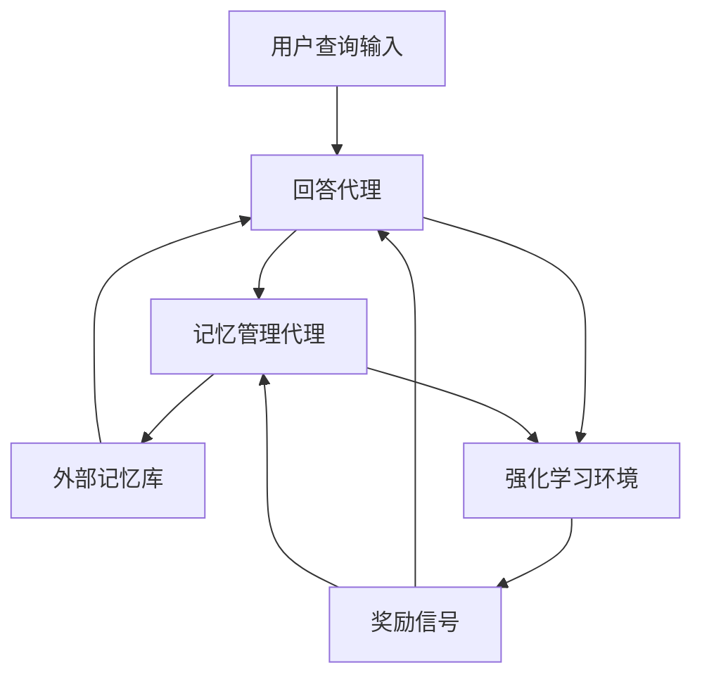

# Memory-R1: 通过强化学习增强大语言模型代理管理与利用记忆的能力

## 一、论文基础元数据
- 原文标题：Memory-R1: Enhancing Large Language Model Agents to Manage and Utilize Memories via Reinforcement Learning
- 中文译版：Memory-R1: 通过强化学习增强大语言模型代理管理与利用记忆的能力
- 发表渠道：arXiv 预印本 (待正式发表)
- 发表时间：2025 年 (根据 arXiv ID 2508 推断)
- 链接：arXiv:2508.19828
- 作者及核心机构：Sikuan Yan 等 (LMU Munich, TUM, Cambridge, HKU 等)
- 研究领域：人工智能 (一级) + 大语言模型/强化学习/记忆增强 (二级)
- 关联数据集：LoCoMo, MSC, LongMemEval (基准测试集); 152 对训练 QA 数据

## 二、论文综合评价
### 2.1 量化评分（1-5 分，5 分为最优）

| 评价维度 | 评分 | 备注 |
| -------- | ---- | ---- |
| 📚 理论基础 | 5.0 | 结合 RL 与记忆管理，理论扎实 |
| 🎯 问题核心性 | 5.0 | 解决 LLM 无状态与上下文限制痛点 |
| 💡 方法创新性 | 5.0 | 双代理 RL 框架，操作符设计新颖 |
| ⚙️ 技术壁垒 | 4.0 | 需要 RL 调优，有一定实现难度 |
| 🧪 实验严谨性 | 4.0 | 多基准测试，但训练数据极少 |
| 🔧 落地可行性 | 4.0 | 低数据依赖，易于集成现有架构 |
| 🚀 应用前景 | 5.0 | 长对话、复杂任务代理场景广阔 |
| 📊 综合评分 | 4.6 | 创新性强且数据效率高，极具潜力 |

### 2.2 定性综合评价（≤300 字）
> 核心概括：研究定位、核心价值、差异化优势、关键结论

本研究定位为解决大语言模型（LLM）因上下文窗口限制导致的长程推理能力不足问题。核心价值在于提出 Memory-R1 框架，利用强化学习（RL）赋予 LLM 主动管理外部记忆的能力，而非依赖静态启发式规则。差异化优势体现在双代理架构（记忆管理 + 回答代理）及极高的数据效率（仅需 152 对 QA 训练）。关键结论表明，该方法在多个基准测试（LoCoMo 等）及不同模型规模（3B-14B）上均优于强基线，证明了学习型记忆管理的优越性与泛化能力。

## 三、领域本体论映射
| 核心维度 | 具体内容 |
| -------- | -------- |
| 核心研究对象 | 具有外部记忆增强能力的大语言模型代理 |
| 核心技术路径 | 强化学习 (PPO/GRPO) 微调双代理系统 |
| 数据/载体形态 | 结构化记忆条目 (ADD/UPDATE/DELETE/NOOP) |
| 核心功能目标 | 实现记忆的动态筛选、更新与长程推理利用 |
| 验证核心指标 | 基准测试准确率、记忆操作合理性、泛化性能 |

## 四、核心问题与解决方案
### 4.1 待解决的核心问题
1. **领域级根本问题**：LLM 本质无状态，有限上下文窗口阻碍长程推理与知识保持。
2. **现有方法痛点**：现有外部记忆管道多为静态或启发式驱动，缺乏学习机制来决定存储、更新或检索内容；检索内容常含噪声，干扰模型推理。
3. **工程落地卡点**：传统 RAG 检索过多无关信息，且缺乏对记忆生命周期的动态管理（如遗忘、修正）。

### 4.2 核心解决方案
- 理论框架：基于强化学习的记忆增强代理框架 (Memory-R1)。
- 核心架构：双代理系统（记忆管理代理 + 回答代理）。
- 关键技术：结果驱动的强化学习微调 (PPO 和 GRPO)。
- 创新机制：定义最小化且表达力强的记忆操作符集合 {ADD, UPDATE, DELETE, NOOP}。

### 4.3 核心优势（量化 + 定性）
1. 性能优势：在三个基准测试上超越强基线，支持 3B 至 14B 多种模型规模。
2. 效率优势：仅需 152 个训练 QA 对即可完成微调，数据效率极高。
3. 工程优势：自适应记忆管理，减少无关信息干扰，提升推理连贯性。

## 五、方法与技术架构
### 5.1 核心架构设计
> 文字描述 + 架构图（Mermaid/图片）

Memory-R1 架构包含两个核心代理：记忆管理代理负责执行结构化记忆操作，回答代理负责基于筛选后的记忆进行推理。两者通过强化学习协同优化，外部记忆库作为共享状态空间。

### 5.2 关键技术实现细节
| 技术模块 | 实现路径 | 工程注意事项 |
| -------- | -------- | ------------ |
| 记忆管理代理 | 学习执行 ADD/UPDATE/DELETE/NOOP 操作 | 需定义操作的具体触发条件与格式 |
| 回答代理 | 预选择相关记忆条目并进行推理 | 需防止检索噪声干扰最终生成 |
| 强化学习算法 | 使用 PPO 和 GRPO 进行结果驱动微调 | 奖励函数设计需平衡准确性与记忆效率 |
| 依赖组件 | 外部向量数据库或键值存储 | 需保证记忆检索的低延迟与一致性 |

### 5.3 架构优缺点
- 优点：动态管理记忆生命周期，显著降低无关信息噪声，数据需求极低。
- 缺点：引入 RL 训练增加了系统复杂度，双代理交互可能增加推理延迟。

## 六、实验设计与结果分析
### 6.1 实验基础设置
| 维度 | 内容 |
| ---- | ---- |
| 数据集 | LoCoMo, MSC, LongMemEval |
| 基线方法 | 静态启发式记忆管道，标准 RAG 方法 |
| 实验环境 | 多模型规模 (3B, 7B, 14B) |
| 评价指标 | 任务准确率，记忆操作有效性，泛化能力 |

### 6.2 核心实验结果
| 方法 | 训练数据量 | 核心指标 (准确率趋势) | 核心指标 (泛化性) | 工程指标（算力/耗时） |
| ---- | --------- | --------- | --------- | -------------------- |
| 基线 1 (静态) | 无训练 | 基准分数 (较低) | 跨任务差异大 | 低 |
| 基线 2 (启发式) | 无训练 | 基准分数 (中等) | 受噪声影响大 | 中 |
| 本文方法 | 152 对 QA | 显著优于基线 (SOTA) | 跨基准/模型稳定 | 中 (含 RL 训练) |

### 6.3 消融实验/鲁棒性分析
| 实验变体 | 指标变化 | 核心结论 |
| -------- | -------- | -------- |
| 无记忆管理代理 | 性能显著下降 | 证明主动管理记忆的必要性 |
| 无强化学习微调 | 性能显著下降 | 证明学习型策略优于静态规则 |
| 不同模型规模 | 性能稳定 (3B-14B) | 证明方法具有良好的规模泛化性 |

### 6.4 实验结论（工程视角）
该方法在极少训练数据 (152 对) 下即可实现显著性能提升，适合资源受限场景；多基准测试证明其在不同任务类型下的鲁棒性，具备实际部署价值。

## 七、领域贡献与创新点
| 贡献层级 | 具体内容 |
| -------- | -------- |
| 理论贡献 | 提出基于 RL 的动态记忆管理理论框架 |
| 方法/架构贡献 | 设计双代理协同架构及最小化记忆操作符集 |
| 数据/工具贡献 | 验证了极少样本 (152 对) 下的有效训练路径 |
| 实验/验证贡献 | 在三个主流长程记忆基准上取得 SOTA 效果 |
| 工程落地贡献 | 提供了低数据依赖的记忆增强解决方案 |

## 八、局限性与风险
| 维度 | 具体描述 | 应对思路 |
| ---- | -------- | -------- |
| 学术局限性 | 训练数据极少可能限制复杂场景覆盖 | 后续可探索多任务联合训练 |
| 工程落地风险 | RL 训练不稳定可能导致代理行为异常 | 引入约束策略或混合监督学习 |
| 伦理/合规风险 | 记忆库可能存储敏感用户信息 | 需实施记忆加密与访问控制机制 |

## 九、未来研究/落地方向
| 方向类型 | 具体内容 | 优先级 |
| -------- | -------- | ------ |
| 科研拓展 | 探索更复杂的记忆结构与层级化记忆 | 高 |
| 工程优化 | 优化双代理交互延迟，降低推理成本 | 高 |
| 跨领域适配 | 应用于代码生成、多模态记忆管理场景 | 中 |

## 十、关键词与术语表
| 语言 | 关键词 |
| ---- | ------ |
| 中文 | 记忆增强，强化学习，大语言模型代理，动态记忆管理 |
| 英文 | Memory Augmentation, Reinforcement Learning, LLM Agents, Dynamic Memory Management |
| 领域专属术语 | Memory-R1 (基于 RL 的记忆框架), PPO/GRPO (强化学习算法), CRUD (记忆操作类型) |

## 十一、参考文献与关联资源
- 核心参考文献：Tensor Brain (Tresp et al., 2023), Mem0 (Chhikara et al., 2025), RAG 相关研究
- 补充阅读：长程推理相关文献 (Yu et al., 2025; Wang et al., 2024)
- 开源代码/工具：待补充 (通常随 arXiv 发布)

## 十二、阅读者批注
1. **科研启发**：极少样本强化学习微调代理是未来高效适配的重要方向。
2. **工程落地思考**：双代理架构需考虑并发与一致性，记忆库版本控制是关键。
3. **待验证/存疑点**：152 对数据的具体分布及是否过拟合特定任务类型。
4. **个人/团队应用场景**：适用于构建长期陪伴型助手或复杂任务规划 Agent。

## 十三、阅读元信息
| 维度 | 内容 |
| ---- | ---- |
| 阅读日期 | 2026-04-08 18:53 |
| 阅读人 | xPaperReader AI |
| 文档编号 | arxiv-2508.19828 |
| 版本迭代 | v1.0 |