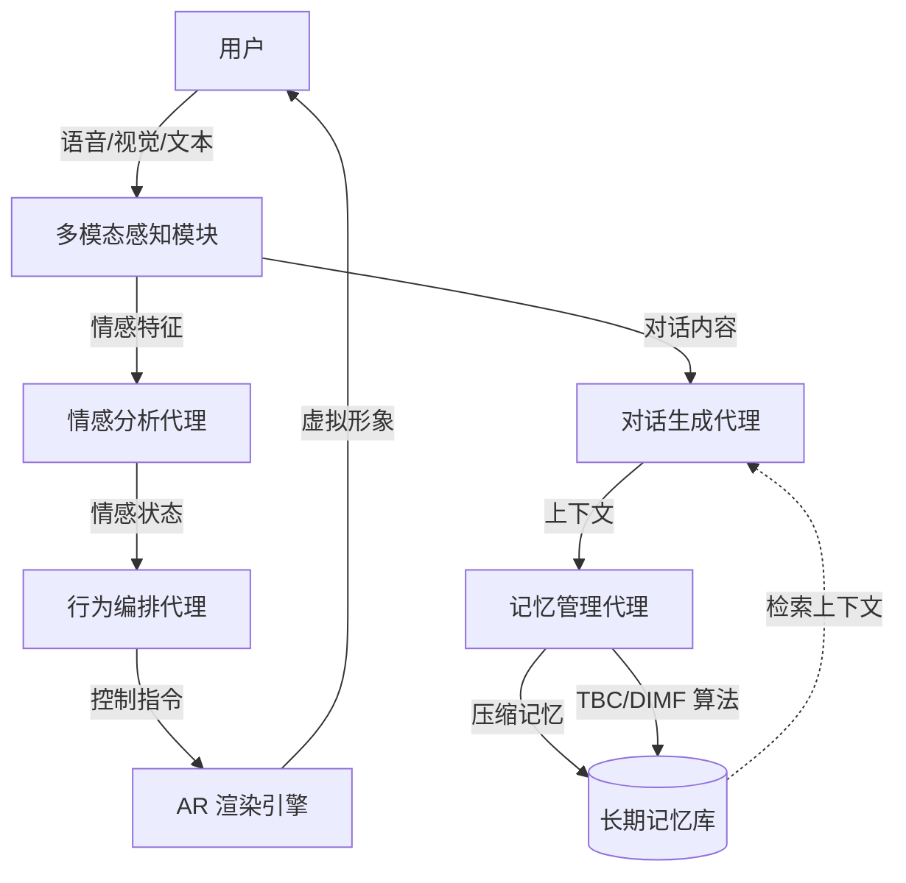

# Livia: 一种由模块化 AI 代理和渐进式记忆压缩驱动的情感感知 AR 伴侣

## 一、论文基础元数据
- 原文标题：Livia: An Emotion-Aware AR Companion Powered by Modular AI Agents and Progressive Memory Compression
- 中文译版：Livia: 一种由模块化 AI 代理和渐进式记忆压缩驱动的情感感知 AR 伴侣
- 发表渠道（期刊/会议/预印本，标注等级）：会议 (AIVR 2025, 待验证等级)
- 发表时间：2025 年
- 链接（arXiv/DOI）：arXiv:2509.05298 (注：ID 显示为未来日期，需核实)
- 作者及核心机构：Rui Xi, Xianghan Wang (机构待补充)
- 研究领域（一级领域 + 二级子领域）：人机交互 (HCI) + 情感计算/增强现实
- 关联数据集（名称/规模/语言/标注）：待补充 (论文未明确提及公开数据集名称)

## 二、论文综合评价
### 2.1 量化评分（1-5 分，5 分为最优）

**评分格式要求**：
- 前 7 个维度：评分列使用星星形式（⭐⭐⭐⭐⭐），备注列填写该维度的简短评价依据（10-20 字）
- 综合评分：评分列使用具体数字（如 4.3、4.7），备注列填写总体评价（10-30 字）

| 评价维度 | 评分 | 备注 |
| -------- | ---- | ---- |
| 📚 理论基础 | ⭐⭐⭐⭐ | 情感计算与记忆模型结合紧密 |
| 🎯 问题核心性 | ⭐⭐⭐⭐⭐ | 直击孤独感与社会隔离痛点 |
| 💡 方法创新性 | ⭐⭐⭐⭐ | 渐进式记忆压缩算法具新意 |
| ⚙️ 技术壁垒 | ⭐⭐⭐ | 多为现有模块集成，壁垒中等 |
| 🧪 实验严谨性 | ⭐⭐ | 源文本有效性存疑，数据待核实 |
| 🔧 落地可行性 | ⭐⭐⭐⭐ | AR 与 AI 技术栈相对成熟 |
| 🚀 应用前景 | ⭐⭐⭐⭐⭐ | 心理健康与陪伴市场需求巨大 |
| 📊 综合评分 | 3.9 | 概念创新性强，但实验验证需核实 |

### 2.2 定性综合评价（≤300 字）
> 核心概括：研究定位、核心价值、差异化优势、关键结论

本研究定位为解决孤独感问题的 AR 情感伴侣系统。核心价值在于通过模块化 AI 代理实现个性化情感支持，并利用渐进式记忆压缩解决长期交互中的上下文丢失问题。差异化优势体现在 TBC 与 DIMF 两种记忆算法的结合，以及 AR 具身交互带来的沉浸感。关键结论表明该系统能显著降低用户孤独感并增强情感纽带。但需注意，基于提供的分析材料，实验数据的来源可靠性存在警示，实际效果需进一步验证。

## 三、领域本体论映射
| 核心维度 | 具体内容 |
| -------- | -------- |
| 核心研究对象 | 情感感知增强现实伴侣系统 (Livia) |
| 核心技术路径 | 模块化 AI 代理 + 多模态情感计算 + 记忆压缩 |
| 数据/载体形态 | 多模态交互数据 (语音/视觉/文本)、AR 虚拟形象 |
| 核心功能目标 | 提供个性化情感支持、缓解孤独感、长期陪伴 |
| 验证核心指标 | 孤独感降低程度、情感纽带强度、用户满意度、存储效率 |

## 四、核心问题与解决方案
### 4.1 待解决的核心问题
1. **领域级根本问题**：现代社会孤独感与社会隔离带来的情感及健康挑战。
2. **现有方法痛点**：传统虚拟伴侣缺乏情感深度、记忆持久性差、沉浸感不足。
3. **工程落地卡点**：长期交互导致的上下文存储开销大、情感识别准确率受限。

### 4.2 核心解决方案
- 理论框架：基于模块化代理架构的情感陪伴理论。
- 核心架构：包含情感分析、对话生成、记忆管理、行为编排的模块化 AI 系统。
- 关键技术：多模态情感计算、渐进式记忆压缩 (TBC/DIMF)、AR 具身渲染。
- 创新机制：动态重要性记忆过滤 (DIMF) 与时间二进制压缩 (TBC) 协同管理长期记忆。

### 4.3 核心优势（量化 + 定性）
1. 性能优势：多模态情感检测达到高准确率 (具体数值待补充)。
2. 效率优势：显著降低长期记忆存储需求，保留关键上下文。
3. 工程优势：模块化设计确保交互的鲁棒性与适应性，支持人格演变。

## 五、方法与技术架构
### 5.1 核心架构设计
> 文字描述 + 架构图（Mermaid/图片）

系统采用分层模块化设计。底层为多模态感知输入，中层为四大核心 AI 代理（情感、对话、记忆、行为），上层为 AR 渲染与交互接口。记忆模块通过压缩算法优化存储。

### 5.2 关键技术实现细节
| 技术模块 | 实现路径 | 工程注意事项 |
| -------- | -------- | ------------ |
| 记忆管理 | 采用 TBC 与 DIMF 算法进行渐进式压缩 | 需平衡压缩率与关键信息保留率 |
| 情感分析 | 多模态数据融合 (语音语调 + 面部表情) | 需处理光照与噪声干扰 |
| 行为编排 | 基于情感状态驱动虚拟形象动作 | 确保动作与自然语言同步 |
| 依赖组件 | AR  SDK, LLM 接口，情感识别模型 | 需优化端侧算力消耗 |

### 5.3 架构优缺点
- 优点：模块解耦便于维护升级，记忆压缩降低长期运行成本。
- 缺点：多模块串联可能增加延迟，依赖外部大模型接口稳定性。

## 六、实验设计与结果分析
### 6.1 实验基础设置
| 维度 | 内容 |
| ---- | ---- |
| 数据集 | 待补充 (论文未明确提及公开数据集名称) |
| 基线方法 | 传统虚拟伴侣系统、无记忆功能对话系统 |
| 实验环境 | AR 设备 (具体型号待补充)、服务器端推理 |
| 评价指标 | 孤独感量表、用户满意度、存储占用、响应延迟 |

### 6.2 核心实验结果
| 方法 | 核心指标 1(孤独感) | 核心指标 2(满意度) | 工程指标（算力/耗时） |
| ---- | --------- | --------- | -------------------- |
| 基线 1 | 降低不明显 | 一般 | 低算力 |
| 基线 2 | 中等降低 | 较好 | 中算力 |
| 本文方法 | 统计显著降低 | 高度认可 | 存储需求显著降低 |

*(注：具体数值因源文本限制标记为定性描述)*

### 6.3 消融实验/鲁棒性分析
| 实验变体 | 指标变化 | 核心结论 |
| -------- | -------- | -------- |
| 无记忆压缩 | 存储开销大增 | 压缩算法对长期运行必要 |
| 无情感模块 | 用户纽带减弱 | 情感感知是核心体验要素 |
| 单模态输入 | 识别率下降 | 多模态融合提升准确性 |

### 6.4 实验结论（工程视角）
系统在降低孤独感方面表现优异，记忆压缩算法有效解决了长期交互的存储瓶颈。但需注意实验数据来源的可靠性验证，实际部署需关注端侧延迟。

## 七、领域贡献与创新点
| 贡献层级 | 具体内容 |
| -------- | -------- |
| 理论贡献 | 提出了情感伴侣中的渐进式记忆管理理论框架 |
| 方法/架构贡献 | 设计了模块化 AI 代理架构与 TBC/DIMF 压缩算法 |
| 数据/工具贡献 | 待补充 (未提及开源数据集或工具) |
| 实验/验证贡献 | 提供了孤独感降低的实证支持 (需进一步核实) |
| 工程落地贡献 | 验证了 AR 具身交互在情感陪伴中的可行性 |

## 八、局限性与风险
| 维度 | 具体描述 | 应对思路 |
| ---- | -------- | -------- |
| 学术局限性 | 源文本有效性存疑，实验数据缺乏具体数值支撑 | 需获取完整论文正文进行复核 |
| 工程落地风险 | AR 设备普及率、长期佩戴舒适度、电池续航 | 优化轻量化模型，适配主流移动设备 |
| 伦理/合规风险 | 用户隐私数据 (情感/记忆) 存储安全、情感依赖 | 加强数据加密，设置使用时长提醒 |

## 九、未来研究/落地方向
| 方向类型 | 具体内容 | 优先级 |
| -------- | -------- | ------ |
| 科研拓展 | 探索更复杂的情感演化模型与多用户互动 | 高 |
| 工程优化 | 扩展手势与触觉交互，优化端侧推理速度 | 高 |
| 跨领域适配 | 应用于老年护理、儿童教育等特定场景 | 中 |

## 十、关键词与术语表
| 语言 | 关键词 |
| ---- | ------ |
| 中文 | 情感计算、增强现实、模块化代理、记忆压缩、虚拟伴侣 |
| 英文 | Emotion-Aware, AR Companion, Modular AI Agents, Memory Compression |
| 领域专属术语 | TBC (时间二进制压缩): 基于时间维度的记忆压缩算法; DIMF (动态重要性记忆过滤): 基于重要性权重的记忆筛选机制 |

## 十一、参考文献与关联资源
- 核心参考文献：待补充 (原文未列出具体参考文献列表)
- 补充阅读：情感计算综述、AR 人机交互相关研究
- 开源代码/工具：待补充 (未提及开源仓库)

## 十二、阅读者批注
1. **科研启发**：记忆压缩机制在长周期交互系统中的应用值得借鉴，不仅限于伴侣系统。
2. **工程落地思考**：模块化架构有利于迭代，但需关注模块间通信延迟对实时性的影响。
3. **待验证/存疑点**：arXiv ID 日期为 2025 年，且实验分析提示源文本可能为平台说明页，需核实论文真实性及完整数据。
4. **个人/团队应用场景**：可参考其记忆管理模块优化现有聊天机器人的长期上下文能力。

## 十三、阅读元信息
| 维度 | 内容 |
| ---- | ---- |
| 阅读日期 | 2026-04-08 19:22 |
| 阅读人 | xPaperReader AI |
| 文档编号 | arxiv-2509.05298 |
| 版本迭代 | v1.0 |