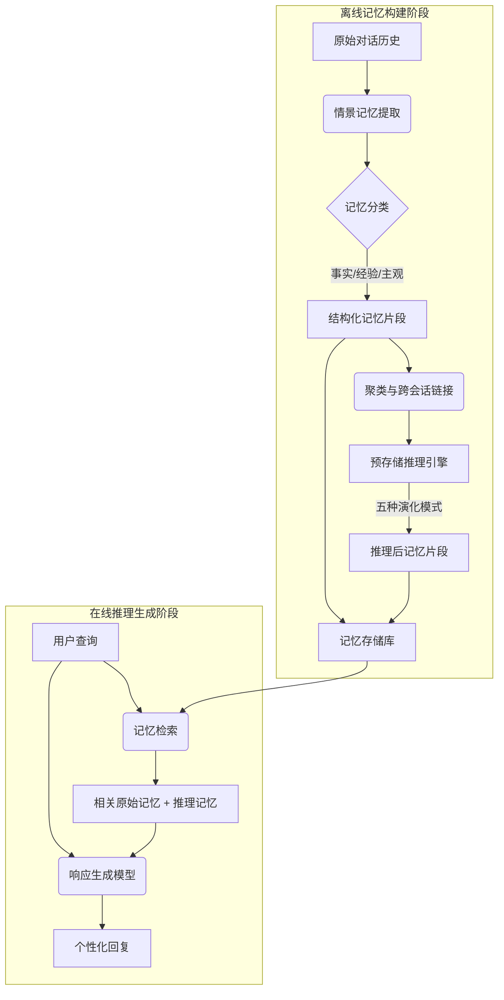

# 情景记忆的预存储推理：将推理负担转移至记忆以实现个性化对话

## 一、论文基础元数据
- 原文标题：Pre-Storage Reasoning for Episodic Memory: Shifting Inference Burden to Memory for Personalized Dialogue
- 中文译版：情景记忆的预存储推理：将推理负担转移至记忆以实现个性化对话
- 发表渠道：预印本（arXiv）
- 发表时间：2025 年
- 链接：arXiv:2509.10852
- 作者及核心机构：Sangyeop Kim, Yohan Lee, Sanghwa Kim, Hyunjong Kim, Sungzoon Cho（机构待补充）
- 研究领域：人工智能 -> 自然语言处理（对话系统/记忆机制）
- 关联数据集：LoCoMo（规模待补充/英文/对话标注）、LongMemEval（规模待补充/英文/记忆评估）

## 二、论文综合评价
### 2.1 量化评分（1-5 分，5 分为最优）

| 评价维度 | 评分 | 备注 |
| -------- | ---- | ---- |
| 📚 理论基础 | ⭐⭐⭐⭐ | 基于图式理论，记忆认知机制借鉴合理 |
| 🎯 问题核心性 | ⭐⭐⭐⭐⭐ | 直击长程记忆推理瓶颈，痛点明确 |
| 💡 方法创新性 | ⭐⭐⭐⭐⭐ | 推理负担前移范式，架构设计新颖 |
| ⚙️ 技术壁垒 | ⭐⭐⭐⭐ | 多阶段推理管线，实现复杂度中等 |
| 🧪 实验严谨性 | ⭐⭐⭐⭐⭐ | 多基准多模型对比，消融实验充分 |
| 🔧 落地可行性 | ⭐⭐⭐⭐ | 支持小模型部署，但预存储有成本 |
| 🚀 应用前景 | ⭐⭐⭐⭐⭐ | 个性化对话助手核心需求，潜力巨大 |
| 📊 综合评分 | 4.6 | 创新显著且实验扎实，小模型超越大模型基线 |

### 2.2 定性综合评价（≤300 字）
> 核心概括：研究定位、核心价值、差异化优势、关键结论

本研究定位为长程个性化对话系统中的记忆机制优化。核心价值在于提出 PREMem 框架，将复杂的推理负担从响应生成阶段转移至记忆构建阶段（预存储推理）。差异化优势在于通过结构化记忆和五种认知推理模式（扩展、积累等），使小模型能达到大模型效果，且在低 Token 预算下表现稳健。关键结论表明，预存储推理能显著提升多跳和时间推理任务性能，解耦了记忆质量与推理模型大小的强绑定关系，为资源受限场景提供了高效解决方案。

## 三、领域本体论映射
| 核心维度 | 具体内容 |
| -------- | -------- |
| 核心研究对象 | 长程个性化对话中的情景记忆（Episodic Memory） |
| 核心技术路径 | 预存储推理（Pre-Storage Reasoning）+ 结构化记忆检索 |
| 数据/载体形态 | 对话历史、结构化记忆片段、推理后的记忆图谱 |
| 核心功能目标 | 降低推理阶段计算负载，提升长程记忆检索与生成质量 |
| 验证核心指标 | LLM-as-a-judge 评分、ROUGE-1、多跳问答准确率 |

## 四、核心问题与解决方案
### 4.1 待解决的核心问题
1. **领域级根本问题**：长程对话中，模型难以有效整合跨会话的分散信息以进行复杂推理。
2. **现有方法痛点**：传统检索增强方法在推理阶段计算压力大，且随上下文减少性能下降显著；小模型难以处理复杂记忆推理。
3. **工程落地卡点**：大模型推理成本高，Token 预算受限，难以在资源受限设备上部署高性能个性化系统。

### 4.2 核心解决方案
- 理论框架：基于认知科学图式理论（Schema Theory），模拟人类记忆的同化与顺应机制。
- 核心架构：PREMem 框架，包含记忆提取、预存储推理、检索生成三个阶段。
- 关键技术：记忆分类（事实/经验/主观）、跨会话聚类、五种演化模式推理（扩展/积累/具体化/转化/连接）。
- 创新机制：将推理过程前置到记忆存储阶段，存储“原始记忆 + 推理记忆”，降低生成时负担。

### 4.3 核心优势（量化+定性）
1. 性能优势：小模型（如 14B）配合 PREMem 可超越大模型（如 72B）基线；多跳推理得分显著提升（如 79.6 vs 38.1）。
2. 效率优势：在低 Token 预算（1024 tokens）下表现稳健；支持使用小模型进行记忆构建（$PREMem_S$）。
3. 工程优势：解耦记忆质量与推理模型大小，适合资源受限环境；检索机制灵活（BM25 与向量检索竞争力相当）。

## 五、方法与技术架构
### 5.1 核心架构设计
> 文字描述 + 架构图（Mermaid/图片）

PREMem 架构分为离线记忆构建和在线推理生成两阶段。离线阶段提取对话记忆，进行聚类与预存储推理，生成增强记忆库。在线阶段检索相关记忆（原始 + 推理），结合用户查询生成回复。

### 5.2 关键技术实现细节
| 技术模块 | 实现路径 | 工程注意事项 |
| -------- | -------- | ------------ |
| 记忆提取 | 利用 LLM 将对话转化为三类结构化信息，处理相对时间表达 | 需确保时间戳标准化，避免相对时间歧义 |
| 预存储推理 | 基于嵌入相似度聚类，应用五种图式演化模式生成新记忆 | 推理提示词需精心设计，防止幻觉连接 |
| 检索生成 | 混合检索原始与推理记忆，结合用户查询输入生成模型 | 需控制检索数量以适配 Token 预算 |
| 依赖组件 | 嵌入模型（用于聚类）、LLM（用于推理与生成）、向量数据库 | 确保嵌入模型与推理模型语义空间一致 |

### 5.3 架构优缺点
- 优点：显著降低生成阶段推理压力；提升小模型复杂任务能力；记忆表示丰富，支持多跳推理。
- 缺点：预存储阶段计算成本增加；单跳简单问题效率可能低于直接检索；缺乏记忆遗忘机制，长期存储可能膨胀。

## 六、实验设计与结果分析
### 6.1 实验基础设置
| 维度 | 内容 |
| ---- | ---- |
| 数据集 | LoCoMo, LongMemEval |
| 基线方法 | SeCom, A-Mem, HippoRAG-2, Turn, Session |
| 实验环境 | 多模型对比（Qwen2.5, Gemma-3, GPT-4.1-mini） |
| 评价指标 | LLM-as-a-judge, ROUGE-1, BLEU-1, BERTScore, 准确率 |

### 6.2 核心实验结果
| 方法 | 核心指标 1 (LLM 评分) | 核心指标 2 (多跳推理) | 工程指标（算力/耗时） |
| ---- | --------- | --------- | -------------------- |
| 基线 (Qwen-72B) | ~45 | 38.1 (A-Mem) | 高算力需求 |
| 基线 (Qwen-14B) | <40 | 待补充 | 中算力需求 |
| 本文方法 (Qwen-14B) | ~67+ | 79.6 | 预存储成本高，生成成本低 |

### 6.3 消融实验/鲁棒性分析
| 实验变体 | 指标变化 | 核心结论 |
| -------- | -------- | -------- |
| 移除 Step 1(提取) | 性能急剧下降 (30%~67%) | 记忆提取与分类是系统最关键部分 |
| 移除 Step 2(推理) | 性能下降较小 (<10%) | 预存储推理进一步优化特定场景 |
| 移除时间推理 | 波动较小 | 时间处理主要用于优化特定任务 |
| 低 Token 预算 (1024) | 表现稳健 | 优于其他随上下文减少性能下降的方法 |

### 6.4 实验结论（工程视角）
预存储推理机制能有效解决长程记忆中的复杂推理瓶颈。在资源受限场景下，使用小模型配合 PREMem 是性价比极高的方案。虽然构建阶段有开销，但分摊到多次交互中，整体推理效率优于每次都用大模型检索生成。

## 七、领域贡献与创新点
| 贡献层级 | 具体内容 |
| -------- | -------- |
| 理论贡献 | 将认知科学图式理论应用于对话记忆演化，提出五种推理模式 |
| 方法/架构贡献 | 提出 PREMem 框架，确立“预存储推理”新范式，转移推理负担 |
| 数据/工具贡献 | 验证了结构化记忆表示在长程对话中的有效性 |
| 实验/验证贡献 | 证明小模型 + 新方法可超越大模型 + 旧基线，提供跨模型泛化证据 |
| 工程落地贡献 | 提供低 Token 预算下的高性能解决方案，支持轻量级部署 |

## 八、局限性与风险
| 维度 | 具体描述 | 应对思路 |
| ---- | -------- | -------- |
| 学术局限性 | 主要是实证改进，未提出全新的记忆认知理论 | 后续可结合更多认知心理学实验验证 |
| 工程落地风险 | 预存储阶段计算成本高；缺乏记忆衰退/遗忘机制 | 引入重要性衰减机制；优化预存储模型大小 |
| 伦理/合规风险 | 可能在不同对话间建立错误的推断连接，导致隐私泄露或偏差 | 开发置信度指标；提供用户修正与透明化查看机制 |

## 九、未来研究/落地方向
| 方向类型 | 具体内容 | 优先级 |
| -------- | -------- | ------ |
| 科研拓展 | 引入人类记忆遗忘机制，研究记忆大小限制与重要性衰减 | 高 |
| 工程优化 | 进一步降低预存储成本，优化$PREMem_S$小模型构建流程 | 高 |
| 跨领域适配 | 适配多模态记忆（图像/语音），扩展至个人助理以外的领域 | 中 |

## 十、关键词与术语表
| 语言 | 关键词 |
| ---- | ------ |
| 中文 | 预存储推理、情景记忆、个性化对话、图式理论、记忆演化 |
| 英文 | Pre-Storage Reasoning, Episodic Memory, Personalized Dialogue, Schema Theory, Memory Evolution |
| 领域专属术语 | （预存储推理：在记忆存储阶段完成逻辑处理）、（图式演化：记忆片段的扩展/积累/转化等模式） |

## 十一、参考文献与关联资源
- 核心参考文献：SeCom, A-Mem, HippoRAG-2 相关论文
- 补充阅读：认知科学图式理论（Schema Theory）相关文献
- 开源代码/工具：待补充（论文发布后通常会在 GitHub 开源）

## 十二、阅读者批注
1. **科研启发**：推理负担转移的思路可推广至其他检索增强生成（RAG）场景，不仅限于对话记忆。
2. **工程落地思考**：需权衡预存储成本与查询频率，对于高频用户价值最大，低频用户可能成本过高。
3. **待验证/存疑点**：长期运行后记忆库膨胀的具体管理策略未详细说明，需验证遗忘机制的实际效果。
4. **个人/团队应用场景**：适用于构建个人化 AI 助手、客服记忆系统、长期陪伴型聊天机器人。

## 十三、阅读元信息
| 维度 | 内容 |
| ---- | ---- |
| 阅读日期 | 2026-04-08 19:41 |
| 阅读人 | xPaperReader AI |
| 文档编号 | arxiv-2509.10852 |
| 版本迭代 | v1.0 |