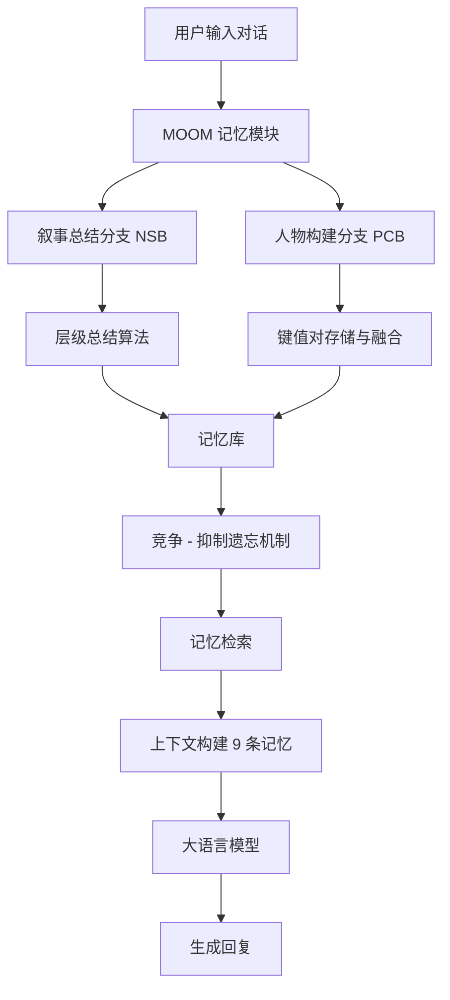

# MOOM：超长角色扮演对话中的记忆维护、组织与优化

## 一、论文基础元数据
- 原文标题：MOOM: Maintenance, Organization and Optimization of Memory in Ultra-Long Role-Playing Dialogues
- 中文译版：MOOM：超长角色扮演对话中的记忆维护、组织与优化
- 发表渠道：预印本（arXiv）
- 发表时间：2025 年
- 链接：arXiv:2509.11860
- 作者及核心机构：Weishu Chen 等（待补充具体机构）
- 研究领域：人工智能 + 自然语言处理（长文本记忆管理）
- 关联数据集：ZH-4O（28 个 session/平均 600 轮/中文/人工标注记忆）

## 二、论文综合评价
### 2.1 量化评分（1-5 分，5 分为最优）

| 评价维度 | 评分 | 备注 |
| -------- | ---- | ---- |
| 📚 理论基础 | ⭐⭐⭐⭐ | 基于文学理论与认知科学，基础扎实 |
| 🎯 问题核心性 | ⭐⭐⭐⭐⭐ | 直击超长对话记忆丢失核心痛点 |
| 💡 方法创新性 | ⭐⭐⭐⭐⭐ | 双分支加遗忘机制，设计新颖 |
| ⚙️ 技术壁垒 | ⭐⭐⭐⭐ | 流程复杂，需微调与检索协同 |
| 🧪 实验严谨性 | ⭐⭐⭐⭐⭐ | 自建数据集，指标全面且严谨 |
| 🔧 落地可行性 | ⭐⭐⭐⭐ | 显存占用低，适合资源受限环境 |
| 🚀 应用前景 | ⭐⭐⭐⭐⭐ | 情感陪伴与角色扮演应用广阔 |
| 📊 综合评分 | 4.6 | 理论与实验扎实，工程效率高，具落地潜力 |

### 2.2 定性综合评价（≤300 字）
> 核心概括：研究定位、核心价值、差异化优势、关键结论

本研究定位为解决大模型在超长角色扮演对话中的记忆维护难题。核心价值在于提出了 MOOM 框架，通过叙事总结与人物构建双分支，结合竞争 - 抑制遗忘机制，有效控制了内存增长并提升了记忆准确性。差异化优势在于引入了文学理论指导记忆提取，并构建了高质量的 ZH-4O 中文超长对话数据集。关键结论表明，该方法在记忆提取准确率及问答精度上均优于 SOTA，且在低显存环境下具有显著工程优势，为长期记忆 AI 提供了新路径。

## 三、领域本体论映射
| 核心维度 | 具体内容 |
| -------- | -------- |
| 核心研究对象 | 超长角色扮演对话中的长期记忆管理 |
| 核心技术路径 | 双分支记忆提取 + 竞争抑制遗忘 + 检索增强生成 |
| 数据/载体形态 | 文本对话流、键值对记忆库、层级化故事线 |
| 核心功能目标 | 维持记忆一致性、控制内存容量、提升回复质量 |
| 验证核心指标 | BERTScore、ROUGE-L、MemScore、QA Precision |

## 四、核心问题与解决方案
### 4.1 待解决的核心问题
1. **领域级根本问题**：大模型上下文窗口限制导致超长对话中关键历史信息遗忘。
2. **现有方法痛点**：现有记忆方法存在内存无控增长缺陷，且缺乏对情节与人物的区分处理。
3. **工程落地卡点**：长上下文处理显存占用高，推理延迟大，难以在资源受限环境部署。

### 4.2 核心解决方案
- 理论框架：基于文学理论（情节 + 人物）与认知科学（竞争 - 抑制）构建记忆模型。
- 核心架构：双分支记忆提取（叙事总结 NSB + 人物构建 PCB）+ 遗忘机制。
- 关键技术：层级总结算法、键值对融合策略（规则/嵌入/LLM）、时间衰减与检索强化。
- 创新机制：竞争 - 抑制遗忘机制，通过参数调节（β=0.9, α=0.1）优化记忆保留。

### 4.3 核心优势（量化 + 定性）
1. 性能优势：QA 精度达 0.840，显著高于次优方法（0.693）；记忆提取指标 SOTA。
2. 效率优势：显存占用约 16GB，仅为全量拼接方法（32GB）的一半；推理耗时比例 1:2.5。
3. 工程优势：支持小模型微调（7B）媲美大模型框架，适合资源受限环境部署。

## 五、方法与技术架构
### 5.1 核心架构设计
MOOM 框架通过双分支处理对话信息，经遗忘机制筛选后存入记忆库，检索时仅整合少量关键记忆构建上下文，避免全量输入。

### 5.2 关键技术实现细节
| 技术模块 | 实现路径 | 工程注意事项 |
| -------- | -------- | ------------ |
| 叙事总结分支 | 原始对话封装为一级单元，迭代总结为高层故事线 | 需保留关键叙事元素，避免过度抽象 |
| 人物构建分支 | 基于键值对，采用规则、嵌入、LLM 三种融合策略 | 处理矛盾信息时需基于相似度删除旧值 |
| 遗忘机制 | 结合时间衰减与检索强化，设定保留阈值 k=9 | 检索强化权重需远高于时间衰减 |
| 依赖组件 | Qwen2-7B（微调）、Qwen2.5-72B（推理）、向量数据库 | 微调数据需人工审查确保一致性 |

### 5.3 架构优缺点
- 优点：有效控制记忆容量，显著提升长对话记忆召回率，资源消耗低。
- 缺点：流程较复杂，涉及多个模块协同，微调数据构建成本较高。

## 六、实验设计与结果分析
### 6.1 实验基础设置
| 维度 | 内容 |
| ---- | ---- |
| 数据集 | ZH-4O（中文，28 sessions，平均 600 轮）、LoCoMo（英文） |
| 基线方法 | Mem0、MemoChat、MemoryBank、InfLLM、Vanilla Qwen |
| 实验环境 | 8x NVIDIA H800 GPUs（72B 模型）、单卡 H800（7B 模型） |
| 评价指标 | BERTScore、ROUGE-L、MemScore、QA Precision、显存占用 |

### 6.2 核心实验结果
| 方法 | 核心指标 1 (BERTScore) | 核心指标 2 (QA Precision) | 工程指标（算力/耗时） |
| ---- | --------- | --------- | -------------------- |
| 基线 1 (MemoChat-72B) | 待补充 | 0.693 | 待补充 |
| 基线 2 (Mem0) | 待补充 | 待补充 | 耗时比例 2.5 |
| 本文方法 (MOOM-72B) | 0.8071 | 0.840 | 耗时比例 1.0 |
| 本文方法 (MOOM-7B) | 优于未微调 72B | 待补充 | 显存约 16GB |

### 6.3 消融实验/鲁棒性分析
| 实验变体 | 指标变化 | 核心结论 |
| -------- | -------- | -------- |
| NSB Only | MemScore 较高 | 擅长情节连贯性记忆 |
| PCB Only | QA Precision 较高 | 擅长具体信息检索 |
| 完整 MOOM | 各项指标最佳 | 双分支结合效果最优 |
| 无限记忆设置 | 精度低于 6k 容量 | 有限容量配合遗忘机制更优 |

### 6.4 实验结论（工程视角）
MOOM 在低显存（16GB）下即可运行，显著优于全量拼接方法。小模型微调后性能强劲，适合实际部署。竞争 - 抑制机制有效抑制了噪声，提升了检索相关性。

## 七、领域贡献与创新点
| 贡献层级 | 具体内容 |
| -------- | -------- |
| 理论贡献 | 首次基于文学理论构建双分支记忆提取框架，引入竞争 - 抑制遗忘理论 |
| 方法/架构贡献 | 提出 MOOM 框架，包含层级总结、键值融合及遗忘机制 |
| 数据/工具贡献 | 构建 ZH-4O 超长对话数据集，填补中文领域空白 |
| 实验/验证贡献 | 在多种模型规模及跨语言数据集上验证了方法的有效性 |
| 工程落地贡献 | 实现了低显存占用下的高性能长对话记忆管理 |

## 八、局限性与风险
| 维度 | 具体描述 | 应对思路 |
| ---- | -------- | -------- |
| 学术局限性 | 标注者均为受过高等教育的中国人，存在人口统计学偏差 | 扩展标注者多样性，引入多文化背景数据 |
| 工程落地风险 | 7B 模型微调基于 GPT-4 生成数据，可能引入特定偏差 | 增加人工审查比例，使用多样化教师模型 |
| 伦理/合规风险 | 角色扮演可能涉及敏感话题或情感依赖 | 建立内容安全过滤机制，设置交互边界 |

## 九、未来研究/落地方向
| 方向类型 | 具体内容 | 优先级 |
| -------- | -------- | ------ |
| 科研拓展 | 引入多模态（图像/音频）及多智能体场景记忆管理 | 高 |
| 工程优化 | 进一步优化检索延迟，支持更高并发场景 | 中 |
| 跨领域适配 | 扩展至多语言支持，适配非中文语境角色扮演 | 高 |

## 十、关键词与术语表
| 语言 | 关键词 |
| ---- | ------ |
| 中文 | 超长对话、记忆管理、角色扮演、遗忘机制、层级总结 |
| 英文 | Ultra-Long Dialogues, Memory Management, Role-Playing, Forgetting Mechanism, Hierarchical Summarization |
| 领域专属术语 | 竞争 - 抑制遗忘（基于认知科学的记忆保留策略）、叙事总结分支（提取情节发展）、人物构建分支（更新用户画像） |

## 十一、参考文献与关联资源
- 核心参考文献：Mem0, MemoChat, MemoryBank, InfLLM, LoCoMo Dataset
- 补充阅读：认知科学中的竞争 - 抑制理论、文学叙事理论相关文献
- 开源代码/工具：待补充（通常随 arXiv 发布或后续公开）

## 十二、阅读者批注
1. **科研启发**：将文学理论引入 AI 记忆构建是一个新颖的交叉点，值得在其他叙事生成任务中借鉴。
2. **工程落地思考**：16GB 显存即可运行超长对话记忆管理，这对消费级显卡部署情感陪伴应用是重大利好。
3. **待验证/存疑点**：7B 模型微调数据完全依赖 GPT-4 生成，实际人工占比及质量需进一步确认。
4. **个人/团队应用场景**：可应用于构建长期记忆的游戏 NPC、个性化情感陪伴助手及客服对话系统。

## 十三、阅读元信息
| 维度 | 内容 |
| ---- | ---- |
| 阅读日期 | 2026-04-08 19:59 |
| 阅读人 | xPaperReader AI |
| 文档编号 | arxiv-2509.11860 |
| 版本迭代 | v1.0 |