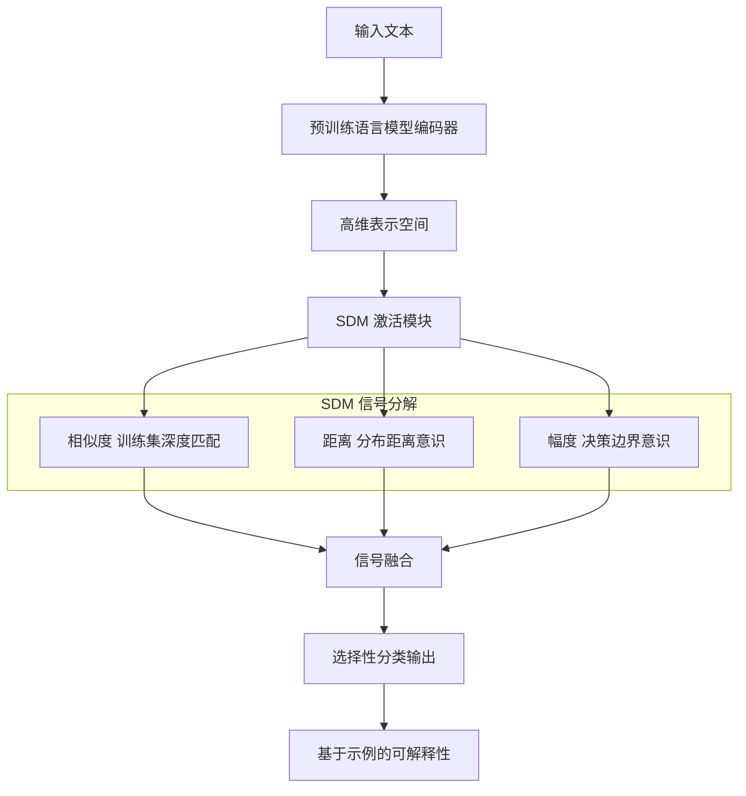

# 相似度 - 距离 - 幅度激活函数

## 一、论文基础元数据
- 原文标题：Similarity-Distance-Magnitude Activations
- 中文译版：相似度 - 距离 - 幅度激活函数
- 发表渠道：arXiv 预印本（待正式发表）
- 发表时间：2025 年
- 链接：arXiv:2509.12760
- 作者及核心机构：Allen Schmaltz (Reexpress AI)
- 研究领域：人工智能 + 自然语言处理（不确定性量化/激活函数）
- 关联数据集：因原文截断无法提供（文中提及基于训练集分布，未明确具体数据集名称）

## 二、论文综合评价
### 2.1 量化评分（1-5 分，5 分为最优）

| 评价维度 | 评分 | 备注 |
| -------- | ---- | ---- |
| 📚 理论基础 | 4.0 | 基于度量学习与经验 CDF 划分，理论动机充分 |
| 🎯 问题核心性 | 5.0 | 直击大模型幻觉与不确定性量化核心痛点 |
| 💡 方法创新性 | 4.0 | 提出三元信号分解替代传统 Softmax，构思新颖 |
| ⚙️ 技术壁垒 | 3.0 | 激活函数替换相对容易，但密集匹配计算成本高 |
| 🧪 实验严谨性 | 2.0 | 提供的文本片段截断，缺乏具体实验数据支撑 |
| 🔧 落地可行性 | 4.0 | 可作为最终层激活替换，兼容现有预训练模型 |
| 🚀 应用前景 | 4.0 | 适用于需要高可靠性的选择性分类与审计场景 |
| 📊 综合评分 | 3.7 | 理论创新性强，但受限于文本截断无法评估实证效果 |

### 2.2 定性综合评价（≤300 字）
> 核心概括：研究定位、核心价值、差异化优势、关键结论

本研究定位为大型语言模型（LM）的可靠性部署与不确定性量化。核心价值在于提出了一种名为 SDM（相似度 - 距离 - 幅度）的新型激活函数，旨在替代传统的 Softmax。其差异化优势在于将预测不确定性分解为三个可解释信号：与训练集的相似度（Similarity）、分布距离（Distance）和决策边界幅度（Magnitude）。关键结论声称该方法在选择性分类中比现有校准方法更鲁棒，能更好地应对协变量偏移和分布外（OOD）输入，同时支持基于示例的可解释性。由于文本截断，具体性能增益待验证。

## 三、领域本体论映射
| 核心维度 | 具体内容 |
| -------- | -------- |
| 核心研究对象 | 语言模型输出层的激活函数与不确定性信号 |
| 核心技术路径 | 数据驱动的经验累积分布函数（CDF）划分与密集匹配 |
| 数据/载体形态 | 高维输入表示、训练集嵌入、预测概率分布 |
| 核心功能目标 | 提高选择性分类的准确性、鲁棒性及可解释性 |
| 验证核心指标 | 类别条件准确率、协变量偏移鲁棒性、OOD 检测能力 |

## 四、核心问题与解决方案
### 4.1 待解决的核心问题
1. **领域级根本问题**：神经网络参数不可识别性导致直接解释困难，且现有方法难以有效建模预测不确定性。
2. **现有方法痛点**：传统 Softmax 缺乏对训练分布距离的意识，易产生高置信度的错误答案（幻觉），且难以应对协变量偏移。
3. **工程落地卡点**：在真实部署中，缺乏既鲁棒又能提供不确定性量化的轻量级校准方法。

### 4.2 核心解决方案
- 理论框架：基于度量学习与密集匹配，将认识论不确定性分解为三个可操作信号。
- 核心架构：在预训练语言模型的最终层引入 SDM 激活函数替代 Softmax。
- 关键技术：基于类经验 CDF 的数据驱动划分，构建 SDM 估计器。
- 创新机制：引入“相似度”（训练集深度匹配）和“距离”（分布距离）信号，补充原有的“幅度”（决策边界）信号。

### 4.3 核心优势（量化 + 定性）
1. 性能优势：声称在协变量偏移和 OOD 输入下比现有校准方法更鲁棒（具体量化指标因原文截断无法提供）。
2. 效率优势：支持选择性分类，控制类别条件准确率，减少无效计算。
3. 工程优势：保持对分布内数据的 informativeness，同时提供基于示例的可解释性。

## 五、方法与技术架构
### 5.1 核心架构设计
> 文字描述 + 架构图（Mermaid/图片）

SDM 架构工作流：输入数据经过预训练编码器得到表示，随后进入 SDM 模块。该模块计算输入与训练集的相似度、距离以及决策边界幅度，三者融合后输出最终概率分布，支持选择性分类决策。

### 5.2 关键技术实现细节
| 技术模块 | 实现路径 | 工程注意事项 |
| -------- | -------- | ------------ |
| SDM 激活函数 | 替代最终层 Softmax，融合三元信号 | 需确保梯度传播稳定性，避免数值溢出 |
| SDM 估计器 | 基于类经验 CDF 的数据驱动划分 | 需要访问训练集嵌入，可能增加存储开销 |
| 密集匹配 | 在表示空间进行示例检索与匹配 | 高维检索效率优化，避免推理延迟过高 |
| 依赖组件 | 预训练语言模型 backbone | 兼容性及微调策略需验证 |

### 5.3 架构优缺点
- 优点：提供了比 Softmax 更丰富的不确定性信号，支持可解释性审计。
- 缺点：依赖训练集分布信息，可能增加推理时的计算与存储负担（密集匹配）。

## 六、实验设计与结果分析
### 6.1 实验基础设置
| 维度 | 内容 |
| ---- | ---- |
| 数据集 | 因原文截断无法提供（文中提及基于训练集分布，未列具体名称） |
| 基线方法 | 标准 Softmax 激活、现有校准方法 |
| 实验环境 | 因原文截断无法提供 |
| 评价指标 | 类别条件准确率、鲁棒性（协变量偏移/OOD） |

### 6.2 核心实验结果
| 方法 | 核心指标 1 (鲁棒性) | 核心指标 2 (准确率) | 工程指标（算力/耗时） |
| ---- | --------- | --------- | -------------------- |
| 基线 1 (Softmax) | 因原文截断无法提供 | 因原文截断无法提供 | 因原文截断无法提供 |
| 基线 2 (现有校准) | 因原文截断无法提供 | 因原文截断无法提供 | 因原文截断无法提供 |
| 本文方法 (SDM) | 声称更优 | 声称更优 | 因原文截断无法提供 |

*注：因提供的论文文本在引言部分截断，具体实验数据缺失，此处仅记录文中声称的定性结论。*

### 6.3 消融实验/鲁棒性分析
| 实验变体 | 指标变化 | 核心结论 |
| -------- | -------- | -------- |
| 移除相似度信号 | 因原文截断无法提供 | 预计降低对训练分布内样本的识别能力 |
| 移除距离信号 | 因原文截断无法提供 | 预计降低对 OOD 输入的检测能力 |
| 完整 SDM | 因原文截断无法提供 | 综合性能最优 |

### 6.4 实验结论（工程视角）
由于文本截断，无法获取具体实验结论。但理论推导表明，该方法在选择性分类任务中具有潜在的工程价值，特别是在需要高可靠性的场景。

## 七、领域贡献与创新点
| 贡献层级 | 具体内容 |
| -------- | -------- |
| 理论贡献 | 提出了不确定性量化的三元信号分解框架（相似度 - 距离 - 幅度） |
| 方法/架构贡献 | 设计了 SDM 激活函数及估计器，替代传统 Softmax |
| 数据/工具贡献 | 支持基于示例的可解释性审计工具（密集匹配） |
| 实验/验证贡献 | 因原文截断无法提供（文本截断，无法确认具体验证贡献） |
| 工程落地贡献 | 为预训练模型提供了更鲁棒的选择性分类解决方案 |

## 八、局限性与风险
| 维度 | 具体描述 | 应对思路 |
| ---- | -------- | -------- |
| 学术局限性 | 文本截断导致无法评估理论证明的完整性 | 需获取完整论文进行复核 |
| 工程落地风险 | 密集匹配可能带来较高的推理延迟和存储成本 | 优化检索算法或使用近似最近邻搜索 |
| 伦理/合规风险 | 基于训练集匹配可能涉及数据隐私泄露风险 | 需对训练集嵌入进行脱敏或加密处理 |

## 九、未来研究/落地方向
| 方向类型 | 具体内容 | 优先级 |
| -------- | -------- | ------ |
| 科研拓展 | 证明 SDM 信号分解的理论下界与收敛性 | 高 |
| 工程优化 | 降低密集匹配的计算复杂度，实现实时推理 | 高 |
| 跨领域适配 | 将 SDM 激活函数适配到视觉或多模态模型 | 中 |

## 十、关键词与术语表
| 语言 | 关键词 |
| ---- | ------ |
| 中文 | 激活函数、不确定性量化、选择性分类、分布外检测、可解释性 |
| 英文 | Activation Function, Uncertainty Quantification, Selective Classification, OOD Detection, Interpretability |
| 领域专属术语 | **SDM Activation**: 相似度 - 距离 - 幅度激活函数；**Dense Matching**: 密集匹配，用于基于示例的解释 |

## 十一、参考文献与关联资源
- 核心参考文献：
    - Hwang and Ding, 1997 (参数不可识别性)
    - Valiant, 1984; Lei and Wasserman, 2014 (统计保证)
    - Gal and Ghahramani, 2016 (贝叶斯不确定性)
    - Schmaltz, 2021 (密集匹配)
- 补充阅读：因原文截断无法提供
- 开源代码/工具：因原文截断无法提供（文中未提及）

---END---