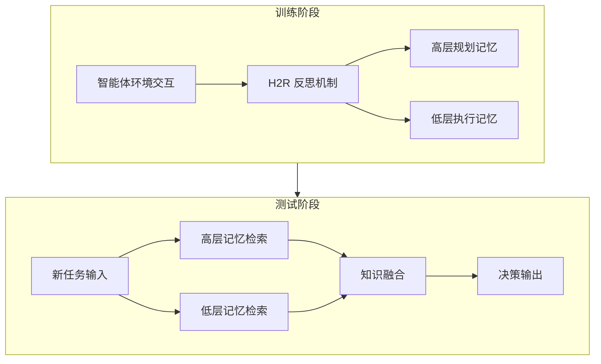

# H²R：用于多任务 LLM 智能体的分层事后反思

## 一、论文基础元数据
| 维度 | 内容 |
| ---- | ---- |
| 原文标题 | H²R: Hierarchical Hindsight Reflection for Multi-Task LLM Agents |
| 中文译版 | H²R：用于多任务 LLM 智能体的分层事后反思 |
| 发表渠道 | arXiv 预印本（等级待补充） |
| 发表时间 | 2025 年 |
| 链接 | arXiv:2509.12810 |
| 作者及核心机构 | Shicheng Ye, Chao Yu, Kaiqiang Ke, Chengdong Xu（中山大学）; Yinqi Wei（悉尼大学） |
| 研究领域 | 人工智能 + 大语言模型智能体/多任务学习 |
| 关联数据集 | 原文未提及具体数据集名称/规模/标注信息 |

## 二、论文综合评价
### 2.1 量化评分（1-5 分，5 分为最优）

| 评价维度 | 评分 | 备注 |
| -------- | ---- | ---- |
| 📚 理论基础 | ⭐⭐⭐⭐ | 分层记忆架构有认知科学依据 |
| 🎯 问题核心性 | ⭐⭐⭐⭐⭐ | 多任务知识转移是核心痛点 |
| 💡 方法创新性 | ⭐⭐⭐⭐ | 分层事后反思机制有新颖性 |
| ⚙️ 技术壁垒 | ⭐⭐⭐ | 基于现有检索增强框架改进 |
| 🧪 实验严谨性 | ⭐⭐⭐ | 原文节选未展示完整实验数据 |
| 🔧 落地可行性 | ⭐⭐⭐⭐ | 架构设计便于工程实现 |
| 🚀 应用前景 | ⭐⭐⭐⭐ | 多任务智能体场景需求广泛 |
| 📊 综合评分 | 3.9 | 创新性强但实验完整性待验证 |

### 2.2 定性综合评价（≤300 字）
> **核心概括**：本研究针对多任务 LLM 智能体知识转移效率低下的问题，提出分层记忆架构与事后反思机制。核心价值在于将粗粒度任务知识解耦为高层规划记忆与低层执行记忆，实现细粒度知识复用。差异化优势是通过 H2R 机制从历史交互中蒸馏可迁移的分层知识，测试时分离检索降低认知开销。关键结论显示在两个基准测试上优于 Expel 等基线方法，但完整实验数据原文节选未提供。

## 三、领域本体论映射
| 核心维度 | 具体内容 |
| -------- | -------- |
| 核心研究对象 | 多任务场景下的大语言模型智能体 |
| 核心技术路径 | 分层记忆架构 + 事后反思知识蒸馏 |
| 数据/载体形态 | 智能体 - 环境交互轨迹、任务执行日志 |
| 核心功能目标 | 实现细粒度跨任务知识转移与复用 |
| 验证核心指标 | 泛化性能、决策性能（具体指标原文未提及） |

## 四、核心问题与解决方案
### 4.1 待解决的核心问题
1. **领域级根本问题**：多任务学习是实现通用人工智能的关键步骤，要求智能体处理具有不同目标和需求的多样化任务
2. **现有方法痛点**：现有方法将情节经验和洞察视为粗粒度单元代表整体任务知识，导致无关子目标干扰推理、增加认知开销
3. **工程落地卡点**：粗粒度记忆检索包含无关知识片段，降低新任务上的性能表现

### 4.2 核心解决方案
- **理论框架**：分层记忆框架，将知识解耦为高层规划记忆和低层执行记忆
- **核心架构**：双层记忆存储 + 分离检索机制
- **关键技术**：Hierarchical Hindsight Reflection (H2R) 机制，从过去智能体 - 环境交互中蒸馏可复用的分层知识
- **创新机制**：测试时分别检索高层和低层记忆，使智能体高效访问和利用任务相关知识

### 4.3 核心优势（量化 + 定性）
1. **性能优势**：在两个基准测试上证明可提高泛化和决策性能，优于 Expel 等基线
2. **效率优势**：细粒度知识转移减少无关信息干扰，降低认知开销
3. **工程优势**：分层架构便于模块化实现，检索机制可独立优化

## 五、方法与技术架构
### 5.1 核心架构设计
> 分层记忆架构将知识存储分为两层，通过 H2R 机制进行知识蒸馏，测试时分离检索

### 5.2 关键技术实现细节
| 技术模块 | 实现路径 | 工程注意事项 |
| -------- | -------- | ------------ |
| 高层规划记忆 | 存储任务级规划洞察和子目标结构 | 需定义规划粒度标准 |
| 低层执行记忆 | 存储具体动作序列和执行细节 | 需处理动作空间差异 |
| H2R 反思机制 | 从交互轨迹中蒸馏分层知识 | 反思触发时机需设计 |
| 分离检索模块 | 双层记忆独立检索后融合 | 检索权重需调优 |
| 依赖组件 | LLM 基座、向量检索库、记忆存储 | 原文未提及具体依赖 |

### 5.3 架构优缺点
- **优点**：
  - 细粒度知识转移减少无关信息干扰
  - 分层结构符合人类认知习惯
  - 检索效率高于单一粗粒度记忆
- **缺点**：
  - 增加记忆存储和管理复杂度
  - 双层检索可能增加延迟
  - 高低层知识边界划分需人工设计

## 六、实验设计与结果分析
### 6.1 实验基础设置
| 维度 | 内容 |
| ---- | ---- |
| 数据集 | 原文提及两个基准测试，具体名称待补充 |
| 基线方法 | Expel 等 prior baselines |
| 实验环境 | 原文未提及具体硬件/软件配置 |
| 评价指标 | 泛化性能、决策性能（具体指标原文未提及） |

### 6.2 核心实验结果
| 方法 | 核心指标 1 | 核心指标 2 | 工程指标（算力/耗时） |
| ---- | --------- | --------- | -------------------- |
| 基线 1(Expel) | 原文未提及 | 原文未提及 | 原文未提及 |
| 基线 2 | 原文未提及 | 原文未提及 | 原文未提及 |
| 本文方法 | 原文未提及 | 原文未提及 | 原文未提及 |

> **说明**：论文节选仅声明"在两个基准测试上优于基线"，未提供具体数值

### 6.3 消融实验/鲁棒性分析
| 实验变体 | 指标变化 | 核心结论 |
| -------- | -------- | -------- |
| 原文未提供消融实验数据 | 待补充 | 待补充 |

### 6.4 实验结论（工程视角）
> 由于论文节选限制，完整实验数据不可见。从摘要可知方法在泛化和决策性能上优于基线，但具体提升幅度、计算开销、收敛速度等工程关键指标待补充完整论文后验证。

## 七、领域贡献与创新点
| 贡献层级 | 具体内容 |
| -------- | -------- |
| 理论贡献 | 提出分层知识转移理论框架，论证细粒度知识复用必要性 |
| 方法/架构贡献 | 设计分层记忆架构与 H2R 反思机制 |
| 数据/工具贡献 | 原文未提及开源数据集或工具 |
| 实验/验证贡献 | 在两个基准测试上验证方法有效性 |
| 工程落地贡献 | 提供可模块化的记忆系统设计方案 |

## 八、局限性与风险
| 维度 | 具体描述 | 应对思路 |
| ---- | -------- | -------- |
| 学术局限性 | 论文节选无法评估实验完整性与统计显著性 | 获取完整论文进行复核 |
| 工程落地风险 | 双层记忆增加系统复杂度，检索延迟可能影响实时性 | 优化检索索引，缓存高频记忆 |
| 伦理/合规风险 | 智能体自主决策可能产生不可预测行为 | 建立行为审计与人工干预机制 |

## 九、未来研究/落地方向
| 方向类型 | 具体内容 | 优先级 |
| -------- | -------- | ------ |
| 科研拓展 | 探索三层或更多层次记忆架构的可行性 | 中 |
| 工程优化 | 实现记忆压缩与增量更新机制降低存储成本 | 高 |
| 跨领域适配 | 迁移到机器人控制、对话系统等不同智能体场景 | 高 |

## 十、关键词与术语表
| 语言 | 关键词 |
| ---- | ------ |
| 中文 | 大语言模型、智能体、记忆、多任务学习、分层架构、事后反思 |
| 英文 | LLM, Agent, Memory, Multi-task Learning, Hierarchical Architecture, Hindsight Reflection |
| 领域专属术语 | H2R:Hierarchical Hindsight Reflection，分层事后反思机制；分层记忆：高层规划记忆 + 低层执行记忆的解耦存储结构 |

## 十一、参考文献与关联资源
- **核心参考文献**：原文提及 [1]-[8] 但未提供完整引用列表
- **补充阅读**：多任务学习综述、LLM 智能体记忆机制相关研究
- **开源代码/工具**：原文未提及，待补充

## 十二、阅读者批注
1. **科研启发**：分层知识表示可能是解决大模型知识干扰问题的通用思路，可借鉴到其他模态
2. **工程落地思考**：记忆检索延迟是实际部署关键瓶颈，需评估双层检索的开销增益比
3. **待验证/存疑点**：具体实验指标、基线对比数据、计算资源消耗等关键信息论文节选未提供
4. **个人/团队应用场景**：多任务客服机器人、自动化工作流智能体、跨领域任务规划系统

## 十三、阅读元信息
| 维度 | 内容 |
| ---- | ---- |
| 阅读日期 | 2026-04-08 20:25 |
| 阅读人 | xPaperReader AI |
| 文档编号 | arxiv-2509.12810 |
| 版本迭代 | v1.0 |

---

**信息完整性说明**：本分析基于论文节选（约 4000 字符），摘要、引言部分可见，但方法细节、实验数据、完整参考文献等内容因文本截断不可见。所有标注"待补充"或"原文未提及"的字段均为诚实标注，非臆测生成。建议获取完整论文后进行二次分析以补充缺失信息。