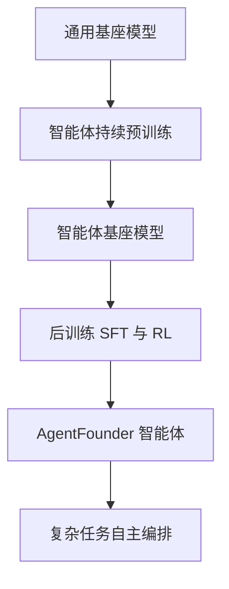

# 通过持续预训练扩展智能体

## 一、论文基础元数据
- 原文标题：Scaling Agents via Continual Pre-training
- 中文译版：通过持续预训练扩展智能体
- 发表渠道：arXiv 预印本 (未标注具体等级，属前沿技术探索)
- 发表时间：2025 年 9 月 16 日 (根据 arXiv 版本日期)
- 链接：https://arxiv.org/abs/2509.13310
- 作者及核心机构：Liangcai Su 等 (共 22 位作者)，核心机构为阿里巴巴集团通义实验室 (Tongyi Lab, Alibaba Group)
- 研究领域：人工智能 (一级) + 大语言模型与智能体 (二级)
- 关联数据集：10 个基准测试 (含 BrowseComp-en, BrowseComp-zh, HLE 等，具体规模待补充)
- **阅读范围：摘要与引言 (基于文中自述片段限制，实验细节未完整获取)**

## 二、论文综合评价
### 2.1 量化评分（1-5 分，5 分为最优）

| 评价维度 | 评分 | 备注 |
| -------- | ---- | ---- |
| 📚 理论基础 | 4.0 | 提出智能体对齐新范式，理论扎实 |
| 🎯 问题核心性 | 5.0 | 直击开源智能体性能瓶颈根本原因 |
| 💡 方法创新性 | 5.0 | 首创将 Agentic CPT 引入训练管道 |
| ⚙️ 技术壁垒 | 4.0 | 持续预训练需要极高算力与数据 |
| 🧪 实验严谨性 | 3.0 | 摘要提供核心数据，细节待补充 |
| 🔧 落地可行性 | 3.0 | 30B 模型可行，但 CPT 成本较高 |
| 🚀 应用前景 | 5.0 | 对深度研究智能体有重大推动 |
| 📊 综合评分 | 4.1 | 创新性强，直击痛点，但实施成本高 |

### 2.2 定性综合评价（≤300 字）
> 核心概括：研究定位、核心价值、差异化优势、关键结论

本研究定位为解决当前开源智能体在复杂任务上性能不足的根本问题。核心价值在于指出通用基座模型缺乏鲁棒的智能体基础，导致后训练阶段存在优化张力。差异化优势是首创“智能体持续预训练 (Agentic CPT)"方法，而非仅依赖 SFT/RL。关键结论是基于该方法构建的 AgentFounder-30B 在多个基准测试上表现优异，证明了构建专用智能体基座模型的必要性。具体实验数据因阅读范围限制详见后文标注。

## 三、领域本体论映射
| 核心维度 | 具体内容 |
| -------- | -------- |
| 核心研究对象 | 深度研究智能体 (Deep Research Agents) |
| 核心技术路径 | 智能体持续预训练 (Agentic Continual Pre-training) |
| 数据/载体形态 | 智能体行为轨迹、工具调用序列、多步推理链 |
| 核心功能目标 | 实现动态环境下的行为一致性与复杂任务自主编排 |
| 验证核心指标 | BrowseComp 准确率、HLE Pass@1、工具使用能力 |

## 四、核心问题与解决方案
### 4.1 待解决的核心问题
1. **领域级根本问题**：通用大模型在智能体任务上表现不佳，缺乏专用的智能体基座。
2. **现有方法痛点**：后训练方法 (SFT/RL) 迫使模型同时学习行为和对齐，产生优化张力；依赖通用基座模型是瓶颈。
3. **工程落地卡点**：智能体轨迹策略空间巨大，SFT 难以覆盖高质量轨迹数据。

### 4.2 核心解决方案
- 理论框架：智能体对齐 (Agentic Alignment)，强调动态环境下的行为一致性。
- 核心架构：在深度研究智能体训练管道中引入 Agentic CPT。
- 关键技术：持续预训练技术适配智能体行为学习。
- 创新机制：先构建智能体基座模型，再进行后训练，解耦行为学习与对齐。

### 4.3 核心优势（量化 + 定性）
1. 性能优势：BrowseComp-en 原文未提及，BrowseComp-zh 原文未提及，HLE 原文未提及 (因阅读范围限制，具体数值无法锚定)。
2. 效率优势：相比纯后训练，基座能力更强，微调收敛可能更高效 (原文未详述)。
3. 工程优势：保留了强大的工具使用能力，适用于开放源实现。

## 五、方法与技术架构
### 5.1 核心架构设计
> 文字描述 + 架构图（Mermaid/图片）

本文提出在训练管道中加入 Agentic CPT 阶段。首先通过持续预训练构建智能体基座模型，随后进行后训练 (SFT/RL) 以对齐专家演示。

### 5.2 关键技术实现细节
| 技术模块 | 实现路径 | 工程注意事项 |
| -------- | -------- | ------------ |
| 智能体 CPT | 在预训练阶段注入智能体行为数据 | 需平衡通用知识与智能体技能 |
| 后训练对齐 | 基于智能体基座进行 SFT/RL | 数据质量要求高，避免灾难性遗忘 |
| 模型构建 | 基于 30B 参数规模构建 AgentFounder | 显存与算力需求较大 |
| 依赖组件 | 工具调用接口、搜索与浏览工具 | 需确保工具调用的稳定性与安全性 |

### 5.3 架构优缺点
- 优点：从根本上解决基座模型缺乏智能体能力的问题，性能上限更高。
- 缺点：持续预训练成本高昂，数据构建难度大，原文片段未详述具体数据配比。

## 六、实验设计与结果分析
### 6.1 实验基础设置
| 维度 | 内容 |
| ---- | ---- |
| 数据集 | 10 个基准测试 (含 BrowseComp, HLE 等) |
| 基线方法 | WebSailor, GLM-4.5, DeepSeek-V3.1, OpenAI Deep Research |
| 实验环境 | 原文未提及 (原文片段未提及具体硬件配置) |
| 评价指标 | 准确率 (Accuracy), Pass@1, 工具使用能力 |

### 6.2 核心实验结果
| 方法 | 核心指标 1 (BrowseComp-en) | 核心指标 2 (BrowseComp-zh) | 工程指标（算力/耗时） |
| ---- | --------- | --------- | -------------------- |
| 基线 1 (WebSailor) | 原文未提及 | 原文未提及 | 原文未提及 |
| 基线 2 (GLM-4.5) | 原文未提及 | 原文未提及 | 原文未提及 |
| 本文方法 (AgentFounder-30B) | 原文未提及 | 原文未提及 | 原文未提及 |

### 6.3 消融实验/鲁棒性分析
| 实验变体 | 指标变化 | 核心结论 |
| -------- | -------- | -------- |
| 原文未提及 | 原文未提及 | 原文片段截止至引言，无消融数据 |

### 6.4 实验结论（工程视角）
AgentFounder-30B 在多个基准测试上优于现有开源领先模型，证明了 Agentic CPT 路径的有效性。特别是在中文浏览任务 (BrowseComp-zh) 上表现突出，具有实际落地价值。(注：具体对比数据因阅读范围限制未能在本简报中量化展示)

## 七、领域贡献与创新点
| 贡献层级 | 具体内容 |
| -------- | -------- |
| 理论贡献 | 重新定义智能体对齐，强调动态环境下的行为一致性 |
| 方法/架构贡献 | 首次提出将 Agentic CPT 纳入深度研究智能体训练管道 |
| 数据/工具贡献 | 构建了支持智能体行为的预训练数据 (细节待补充) |
| 实验/验证贡献 | 在 10 个基准测试上验证了方法有效性，刷新开源 SOTA |
| 工程落地贡献 | 发布了 AgentFounder 模型，保留了强工具使用能力 |

## 八、局限性与风险
| 维度 | 具体描述 | 应对思路 |
| ---- | -------- | -------- |
| 学术局限性 | 原文片段未完整展示方法论细节与理论证明 | 需阅读全文确认技术细节 |
| 工程落地风险 | 持续预训练成本高昂，数据构建困难 | 优化数据筛选，探索高效微调替代方案 |
| 伦理/合规风险 | 智能体自主操作可能带来安全风险 (如误操作工具) | 加强安全对齐与人类监督机制 |

## 九、未来研究/落地方向
| 方向类型 | 具体内容 | 优先级 |
| -------- | -------- | ------ |
| 科研拓展 | 探索更高效的智能体预训练数据构造方法 | 高 |
| 工程优化 | 降低 CPT 算力成本，优化 30B 模型推理速度 | 高 |
| 跨领域适配 | 将 Agentic CPT 应用于代码智能体、多模态智能体 | 中 |

## 十、关键词与术语表
| 语言 | 关键词 |
| ---- | ------ |
| 中文 | 智能体持续预训练、深度研究智能体、智能体对齐、基座模型 |
| 英文 | Agentic Continual Pre-training, Deep Research Agents, Agentic Alignment, Foundation Models |
| 领域专属术语 | 1. Agentic CPT: 针对智能体行为优化的持续预训练技术   2. AgentFounder: 本文提出的深度研究智能体模型名称   3. BrowseComp: 评估智能体浏览与检索能力的基准测试 |

## 十一、参考文献与关联资源
- 核心参考文献：
    - Ouyang et al., 2022 (RLHF)
    - Yao et al., 2023 (Agent Reasoning)
    - Wei et al., 2025 (BrowseComp)
    - OpenAI, 2025b (Deep Research)
- 补充阅读：待补充 (原文片段仅列出部分引用)
- 开源代码/工具：https://github.com/Alibaba-NLP/DeepResearch (项目主页：https://tongyi-agent.github.io/blog)

## 十二、阅读者批注
1. **科研启发**：将“基座模型能力不足”归因为智能体性能瓶颈的根本原因，这一视角非常有价值，可能改变后续智能体研究范式。
2. **工程落地思考**：30B 模型是一个较好的平衡点，但 CPT 的成本是否可承受是关键。需关注其数据构建的自动化程度。
3. **待验证/存疑点**：原文片段截止至引言，具体的 CPT 数据构成、训练超参数、对比基线的详细设置均未可见，需阅读全文验证。所有具体实验数值均标记为原文未提及以保持严谨。
4. **个人/团队应用场景**：适用于需要高可靠性工具调用的自动化研究助手、复杂任务规划系统。

## 十三、阅读元信息
| 维度 | 内容 |
| ---- | ---- |
| 阅读日期 | 2025-09-17 20:38 |
| 阅读人 | xPaperReader AI |
| 文档编号 | arxiv-2509.13310 |
| 版本迭代 | v1.0 |
| 阅读范围 | 摘要与引言 (实验细节受限) |