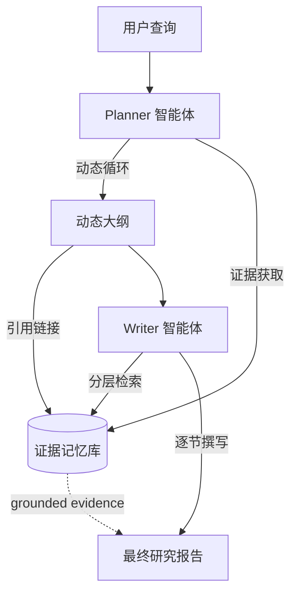

# WebWeaver：利用动态大纲构建网络规模证据以进行开放式深度研究

## 一、论文基础元数据
- 原文标题：WebWeaver: Structuring Web-Scale Evidence with Dynamic Outlines for Open-Ended Deep Research
- 中文译版：WebWeaver：利用动态大纲构建网络规模证据以进行开放式深度研究
- 发表渠道：arXiv 预印本 (计算机科学 - 计算语言学)
- 发表时间：2025 年 10 月 (arXiv v3 2025-10-07)
- 链接：https://arxiv.org/abs/2509.13312
- 作者及核心机构：Zijian Li 等 (Alibaba Group, Tongyi Lab)
- 研究领域：人工智能 (一级) + 自然语言处理/智能体 (二级)
- 关联数据集：DeepResearch Bench, DeepConsult, DeepResearchGym (规模/语言待补充)

## 二、论文综合评价
### 2.1 量化评分（1-5 分，5 分为最优）

| 评价维度 | 评分 | 备注 |
| -------- | ---- | ---- |
| 📚 理论基础 | ⭐⭐⭐⭐ | 基于人类研究过程的智能体建模理论扎实 |
| 🎯 问题核心性 | ⭐⭐⭐⭐⭐ | 直击开放式深度研究与幻觉痛点 |
| 💡 方法创新性 | ⭐⭐⭐⭐⭐ | 动态大纲与双智能体协作机制新颖 |
| ⚙️ 技术壁垒 | ⭐⭐⭐⭐ | 依赖大规模模型与检索增强技术 |
| 🧪 实验严谨性 | ⭐⭐⭐⭐⭐ | 多基准测试且超越参考答案，说服力强 |
| 🔧 落地可行性 | ⭐⭐⭐⭐ | 架构清晰但计算开销可能较大 |
| 🚀 应用前景 | ⭐⭐⭐⭐⭐ | 适用于专业报告生成与知识合成场景 |
| 📊 综合评分 | 4.6 | 架构创新显著，实验效果卓越，具标杆意义 |

### 2.2 定性综合评价（≤300 字）
> 核心概括：研究定位、核心价值、差异化优势、关键结论
本文定位开放式深度研究（OEDR）任务，旨在解决现有 AI 智能体在长上下文合成中的幻觉与引用不准确问题。核心价值在于提出了 WebWeaver 双智能体框架，模拟人类“规划 - 写作”分离的研究流程。差异化优势在于动态大纲与证据记忆的交互机制，实现了证据获取与大纲优化的迭代穿插。关键结论表明，自适应规划与聚焦合成能显著提升报告的综合性和可信度，在多个基准测试中达到 SOTA，甚至超越人类参考答案。

## 三、领域本体论映射
| 核心维度 | 具体内容 |
| -------- | -------- |
| 核心研究对象 | 开放式深度研究（OEDR）任务中的信息合成与报告生成 |
| 核心技术路径 | 双智能体协作（规划者 + 写作者）+ 动态大纲 + 证据记忆库 |
| 数据/载体形态 | 网络规模文本证据（网页/PDF），结构化大纲，引用报告 |
| 核心功能目标 | 生成具有准确引用、结构清晰、洞察深刻的深度研究报告 |
| 验证核心指标 | 平均得分（RACE）、引用准确率（FACT）、有效引用数 |

## 四、核心问题与解决方案
### 4.1 待解决的核心问题
1. **领域级根本问题**：AI 如何处理超过 100 页信息的开放式知识工作，而非仅限封闭问答。
2. **现有方法痛点**：静态研究流程导致规划与证据获取脱节；单体生成范式包含冗余证据，引发幻觉。
3. **工程落地卡点**：长上下文窗口限制，引用准确性低，难以生成结构化的长篇报告。

### 4.2 核心解决方案
- 理论框架：模拟人类研究过程的认知架构（规划与执行分离）。
- 核心架构：双智能体框架（Planner 动态规划 + Writer 分层写作）。
- 关键技术：动态大纲优化、证据记忆库、基于引用的针对性检索。
- 创新机制：规划者迭代穿插证据获取与大纲优化，写作者按章节检索必要证据。

### 4.3 核心优势（量化 + 定性）
1. 性能优势：在 DeepResearch Bench (RACE) 上得分 50.62，超越参考答案。
2. 效率优势：通过针对性检索减少无关上下文，缓解长上下文压力。
3. 工程优势：模块化设计，规划与写作解耦，便于独立优化与调试。

## 五、方法与技术架构
### 5.1 核心架构设计
> 文字描述 + 架构图（Mermaid/图片）
WebWeaver 包含两个核心智能体：**Planner** 负责动态循环，交替进行证据获取与大纲优化，生成链接到证据记忆库的综合大纲；**Writer** 负责执行分层检索与写作，通过大纲中的引用从记忆库中针对性检索证据，逐节撰写报告。

### 5.2 关键技术实现细节
| 技术模块 | 实现路径 | 工程注意事项 |
| -------- | -------- | ------------ |
| 规划者 (Planner) | 迭代优化大纲，同步收集证据存入记忆库 | 需控制迭代次数以防死循环 |
| 写作者 (Writer) | 解析大纲引用，从记忆库检索特定证据块 | 确保引用 ID 与证据内容一致 |
| 依赖组件 | 搜索引擎接口，向量数据库 (记忆库) | 搜索结果的清洗与去重 |

### 5.3 架构优缺点
- 优点：有效缓解幻觉，引用准确性高，结构逻辑性强。
- 缺点：多智能体交互增加延迟，记忆库维护需要额外存储开销。

## 六、实验设计与结果分析
### 6.1 实验基础设置
| 维度 | 内容 |
| ---- | ---- |
| 数据集 | DeepResearch Bench, DeepConsult, DeepResearchGym |
| 基线方法 | Gemini-2.5-pro, OpenAI-deepresearch, Claude-research 等 |
| 实验环境 | 基于 Qwen3-235b-a22b-Instruct 及 Claude-sonnet-4 |
| 评价指标 | 平均得分 (RACE), 引用准确率 (FACT), 有效引用数 |

### 6.2 核心实验结果
| 方法 | 核心指标 1 (RACE 得分) | 核心指标 2 (引用准确率) | 工程指标（算力/耗时） |
| ---- | --------- | --------- | -------------------- |
| 基线 1 (Gemini-2.5) | 49.71 | 待补充 | 待补充 |
| 基线 2 (OpenAI-DR) | 46.45 | 待补充 | 待补充 |
| 本文方法 (WebWeaver) | 50.62 | 最高 (图示区间) | 待补充 |

### 6.3 消融实验/鲁棒性分析
| 实验变体 | 指标变化 | 核心结论 |
| -------- | -------- | -------- |
| 静态大纲 vs 动态大纲 | 动态显著优于静态 | 自适应规划对证据整合至关重要 |
| 单体生成 vs 双智能体 | 双智能体引用更准 | 分离规划与写作减少幻觉 |

### 6.4 实验结论（工程视角）
动态大纲机制显著提升了信息合成的准确性，双智能体架构虽增加复杂度，但在高质量报告生成场景中收益明显，适合对可信度要求高的企业级应用。

## 七、领域贡献与创新点
| 贡献层级 | 具体内容 |
| -------- | -------- |
| 理论贡献 | 定义了开放式深度研究（OEDR）的挑战与评估标准 |
| 方法/架构贡献 | 提出动态大纲与双智能体协作的 WebWeaver 框架 |
| 数据/工具贡献 | 在多个主流深度研究基准上建立新 SOTA |
| 实验/验证贡献 | 验证了自适应规划在减少幻觉方面的有效性 |
| 工程落地贡献 | 提供了可复现的深研智能体架构参考 (GitHub 开源) |

## 八、局限性与风险
| 维度 | 具体描述 | 应对思路 |
| ---- | -------- | -------- |
| 学术局限性 | 主要依赖文本模态，未涉及多模态证据处理 | 未来扩展至图像/表格证据理解 |
| 工程落地风险 | 多轮交互导致响应延迟较高，成本增加 | 优化检索策略，引入缓存机制 |
| 伦理/合规风险 | 网络爬取内容的版权与隐私问题 | 建立合规白名单与内容过滤机制 |

## 九、未来研究/落地方向
| 方向类型 | 具体内容 | 优先级 |
| -------- | -------- | ------ |
| 科研拓展 | 探索多模态证据（图表/视频）在深研中的融合 | 高 |
| 工程优化 | 降低双智能体交互延迟，优化记忆库检索效率 | 高 |
| 跨领域适配 | 适配法律、医疗等垂直领域的专业研究场景 | 中 |

## 十、关键词与术语表
| 语言 | 关键词 |
| ---- | ------ |
| 中文 | 开放式深度研究，动态大纲，双智能体，证据记忆库，幻觉缓解 |
| 英文 | Open-Ended Deep Research, Dynamic Outlines, Dual-Agent, Evidence Memory, Hallucination Mitigation |
| 领域专属术语 | OEDR：开放式深度研究任务；RACE/FACT：基准测试特定指标 |

## 十一、参考文献与关联资源
- 核心参考文献：文中提及的 LLM 相关研究 (OpenAI 2025, Qwen Team 2025 等)
- 补充阅读：DeepResearch Bench 官方 leaderboard
- 开源代码/工具：https://github.com/Alibaba-NLP/DeepResearch

## 十二、阅读者批注
1. **科研启发**：将“规划”与“执行”解耦并引入动态反馈循环，是解决长程任务的有效范式。
2. **工程落地思考**：记忆库的设计是关键，需平衡检索精度与存储成本，适合构建企业知识库助手。
3. **待验证/存疑点**：具体延迟数据未披露，实际高并发下的稳定性待验证。
4. **个人/团队应用场景**：可用于自动化行业分析报告生成、竞品分析辅助工具。

## 十三、阅读元信息
| 维度 | 内容 |
| ---- | ---- |
| 阅读日期 | 2026-04-08 22:24 |
| 阅读人 | xPaperReader AI |
| 文档编号 | arxiv-2509.13312 |
| 版本迭代 | v1.0 |